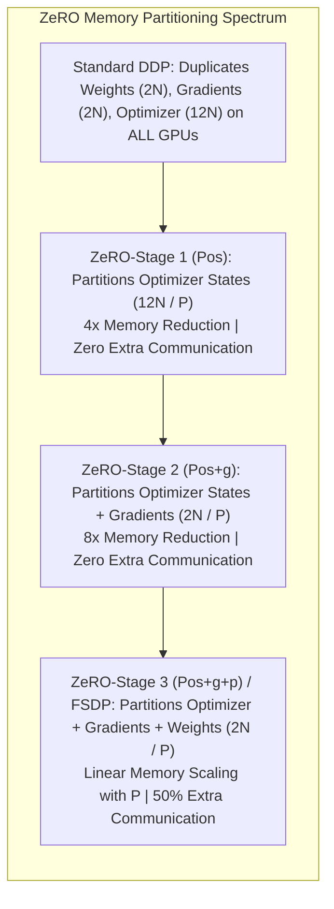
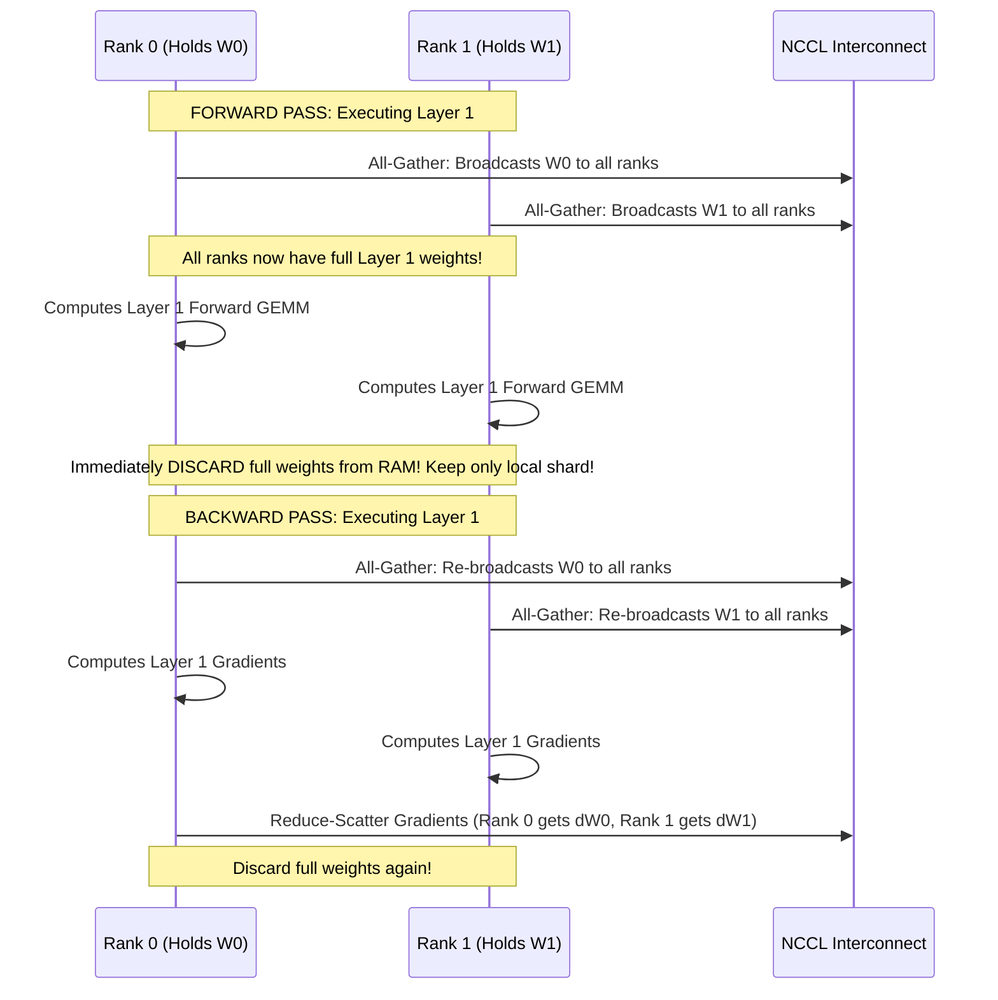

# 06. Data Parallelism - DDP, ZeRO-1, ZeRO-2 & ZeRO-3 (FSDP)

> **References & Influential Literature:**
> - *ZeRO: Memory Optimizations Toward Training Trillion Parameter Models* — Samyam Rajbhandari et al. (Microsoft DeepSpeed, SC 2020)
> - *PyTorch FSDP: Experiences on Scaling Fully Sharded Data Parallel* — Yanli Zhao et al. (Meta AI, 2023)
> - *PyTorch Distributed: Experiences on Accelerating Data Parallel Training* — Shen Li et al. (VLDB 2020)

---

## 1. Classical Distributed Data Parallel (DDP)

In classical **Distributed Data Parallel (DDP)**, every GPU holds an identical, full copy of the model weights, gradients, and optimizer states. The global batch is divided into micro-batches distributed across $P$ GPUs.

```
       Global Training Batch (Size: B)
         /           |           \
Batch 0 (B/P)   Batch 1 (B/P)   Batch P-1 (B/P)
      |               |               |
      v               v               v
  [ GPU 0 ]       [ GPU 1 ]       [ GPU P-1 ]
Full Weights     Full Weights     Full Weights
Full Optimizer   Full Optimizer   Full Optimizer
      \               |               /
       +--------------+--------------+
                      |
        All-Reduce Gradients (2N Bytes)
                      |
                      v
      All GPUs Update Parameters Locally
```

### 1.1 Gradient Bucketing & Compute-Communication Overlap
Naive DDP waits until the entire backward pass finishes before initiating communication. Modern PyTorch DDP uses **Gradient Bucketing**:
- Parameters are grouped into contiguous memory buckets (typically $25\text{ MB}$ each).
- As backpropagation proceeds from layer $L$ down to layer 0, whenever a bucket's gradients finish computing, DDP immediately fires an **asynchronous non-blocking All-Reduce collective** on that bucket in a background CUDA stream.
- **Communication Overlapping**: Gradients from layer $L$ are transmitted across the network while layer $L-1$ is actively executing GEMM math on the Tensor Cores!

```
Backward Pass: [ Layer L ] ---> [ Layer L-1 ] ---> [ Layer L-2 ] ---> [ Layer 0 ]
                     |               |
All-Reduce:          +--> [ All-Reduce Bucket 1 ]
                                     +--> [ All-Reduce Bucket 2 ] (Overlapped!)
```

### 1.2 The Fatal Memory Wall of Classical DDP
Because DDP duplicates all static parameters ($16N\text{ bytes}$) across every worker, the largest model a single $80\text{ GB}$ GPU can train under pure DDP is approximately **$2.5\text{ to }3\text{ Billion parameters}$**. Training larger models requires eliminating redundancy.

---

## 2. The ZeRO (Zero Redundancy Optimizer) Architecture

Microsoft DeepSpeed's **ZeRO** framework eliminates the memory redundancies of DDP while preserving identical computational semantics.



---

### 2.1 ZeRO-Stage 1: Optimizer State Partitioning ($P_{\text{os}}$)
- **Concept**: The massive 12-byte Adam optimizer state ($m_t, v_t$, FP32 master weights) is partitioned equally across all $N_d$ data-parallel ranks.
- **Execution**:
  1. Each GPU computes its local forward and backward passes.
  2. All GPUs execute a standard All-Reduce on gradients ($2N\text{ bytes}$).
  3. GPU $i$ updates **only its assigned $1 / N_d$ slice** of the model weights.
  4. An **All-Gather** distributes the updated weights back to all ranks.
- **Memory Footprint per GPU**:
  $$\text{Memory}_{\text{ZeRO-1}} = 2N \text{ (Weights)} + 2N \text{ (Gradients)} + \frac{12N}{N_d} \text{ (Optimizer)}$$
- **Communication Volume**: Exactly $2N$ bytes transferred (Identical to standard DDP!).

---

### 2.2 ZeRO-Stage 2: Gradient Partitioning ($P_{\text{g}}$)
- **Concept**: Since each rank only updates $1 / N_d$ of the parameters, it only needs gradients for that specific partition.
- **Execution**:
  1. As gradients finish computing during the backward pass, they are aggregated using **Reduce-Scatter** instead of All-Reduce.
  2. GPU $i$ receives the reduced sum of only its assigned gradient chunk and immediately deletes all other gradients from memory.
- **Memory Footprint per GPU**:
  $$\text{Memory}_{\text{ZeRO-2}} = 2N \text{ (Weights)} + \frac{2N}{N_d} \text{ (Gradients)} + \frac{12N}{N_d} \text{ (Optimizer)}$$
- **Communication Volume**: Exactly $2N$ bytes transferred ($1N$ in Reduce-Scatter $+ 1N$ in All-Gather). **Zero communication penalty** compared to DDP!

---

### 2.3 ZeRO-Stage 3 / PyTorch FSDP: Parameter Partitioning ($P_{\text{p}}$)
- **Concept**: No GPU holds a full copy of the model weights! Model parameters $W$ are sharded across all $N_d$ ranks.

```
Rank 0 holds: W[0..N/4]     Rank 1 holds: W[N/4..N/2]
Rank 2 holds: W[N/2..3N/4]   Rank 3 holds: W[3N/4..N]
```



- **Memory Footprint per GPU**:
  $$\text{Memory}_{\text{ZeRO-3}} = \frac{2N}{N_d} \text{ (Weights)} + \frac{2N}{N_d} \text{ (Gradients)} + \frac{12N}{N_d} \text{ (Optimizer)} = \mathbf{\frac{16N}{N_d}\text{ Bytes}}$$
- **Communication Volume**:
  - Forward Pass All-Gather: $1N$ bytes
  - Backward Pass All-Gather: $1N$ bytes
  - Backward Pass Reduce-Scatter: $1N$ bytes
  - **Total Communication = $3N$ Bytes** ($50\%$ higher than standard DDP).

---

## 3. PyTorch Fully Sharded Data Parallel (FSDP) Implementation

PyTorch native FSDP provides production-grade ZeRO-3 parameter sharding with custom sharding strategies:

```python
import torch
import torch.nn as nn
from torch.distributed.fsdp import (
    FullyShardedDataParallel as FSDP,
    ShardingStrategy,
    BackwardPrefetch,
    MixedPrecision,
    CPUOffload
)
from torch.distributed.fsdp.wrap import size_based_auto_wrap_policy

# 1. Configure FP16/BF16 Mixed Precision
bf16_policy = MixedPrecision(
    param_dtype=torch.bfloat16,      # Weights cast to BF16 during compute
    reduce_dtype=torch.bfloat16,     # Gradients reduced in BF16
    buffer_dtype=torch.bfloat16
)

# 2. Configure Sharding Strategy
# Options: FULL_SHARD (ZeRO-3), SHARD_GRAD_OP (ZeRO-2), HYBRID_SHARD (ZeRO-3 Intra-node, DDP Inter-node)
strategy = ShardingStrategy.FULL_SHARD

# 3. Auto-Wrap Policy: Automatically shard sub-layers exceeding 10M parameters
auto_wrap = functools.partial(size_based_auto_wrap_policy, min_num_params=10_000_000)

# 4. Instantiate Sharded Model
model = TransformerBackbone(...)
fsdp_model = FSDP(
    model,
    auto_wrap_policy=auto_wrap,
    sharding_strategy=strategy,
    mixed_precision=bf16_policy,
    backward_prefetch=BackwardPrefetch.BACKWARD_PRE, # Overlaps next All-Gather with current backward GEMM
    cpu_offload=CPUOffload(offload_params=False),    # Set True if RAM < Model Size
    device_id=torch.cuda.current_device()
)

# Standard training loop: Execution semantics remain identical to standard PyTorch!
optimizer = torch.optim.AdamW(fsdp_model.parameters(), lr=1e-4)
outputs = fsdp_model(inputs)
loss = criterion(outputs, targets)
loss.backward()
optimizer.step()
```

### 3.1 Hybrid Sharded Data Parallel (HSDP)
At extreme cluster scale ($> 1,000\text{ GPUs}$), performing ZeRO-3 All-Gathers across cross-datacenter switches causes network saturation.
**Hybrid Sharding (HSDP)** solves this by:
- Applying **`FULL_SHARD` (ZeRO-3) intra-node across the 8 GPUs** via high-speed NVLink ($900\text{ GB/s}$).
- Applying standard **DDP across nodes** over InfiniBand ($50\text{ GB/s}$).
- Eliminates $66\%$ of inter-node communication traffic!
