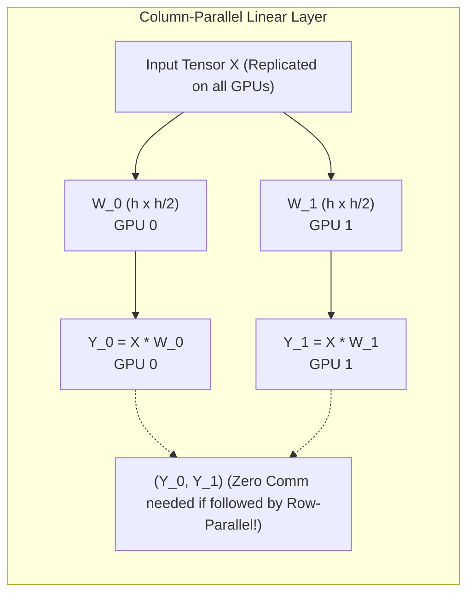
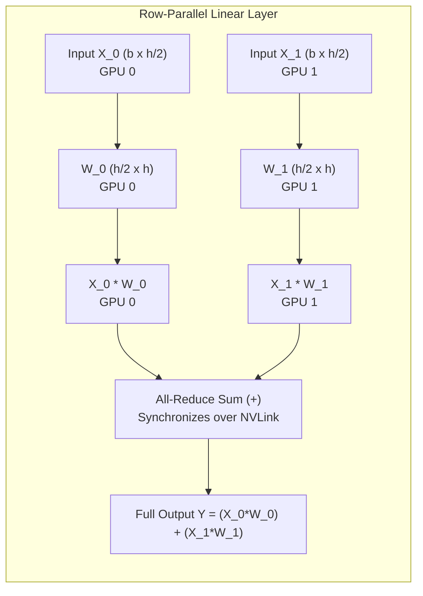
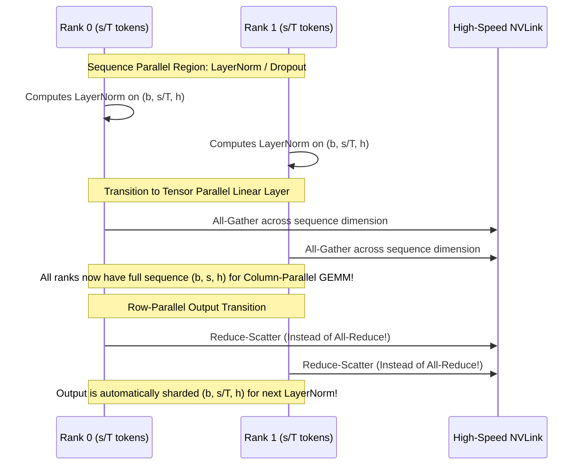

# 07. Model Parallelism - Tensor Parallelism & Sequence Parallelism

> **References & Influential Literature:**
> - *Megatron-LM: Training Multi-Billion Parameter Language Models Using Model Parallelism* — Mohammad Shoeybi et al. (NVIDIA, 2019)
> - *Reducing Activation Recomputation in Large Transformer Models* — Vijay Korthikanti et al. (NVIDIA, 2022)
> - *Efficient Large-Scale Language Model Training on GPU Clusters Using Megatron-LM* — Deepak Narayanan et al. (SC 2021)

---

## 1. The Need for Tensor Parallelism

When a single model layer exceeds the memory capacity of a single GPU, or when data parallelism alone cannot scale due to batch size limits, we must split individual weight matrices **within each layer** across multiple GPUs.

NVIDIA's **Megatron-LM** introduced **Tensor Parallelism (TP)**, which shards linear layers across $T$ GPUs while minimizing inter-GPU communication.

> [!WARNING]
> **The Bandwidth Constraint of Tensor Parallelism**:
> Tensor Parallelism requires synchronization **twice per Transformer layer in the forward pass and twice in the backward pass**. Because these communications occur synchronously in the critical path of computation, **Tensor Parallelism must strictly run over ultra-high-speed NVLink ($900\text{ GB/s}$)**. Running TP over InfiniBand or Ethernet causes severe network latency stalls!

---

## 2. Megatron-LM Matrix Decomposition: Column-Parallel & Row-Parallel

A linear transformation computes $Y = X \cdot W$, where $X \in \mathbb{R}^{b \times h_{\text{in}}}$ and $W \in \mathbb{R}^{h_{\text{in}} \times h_{\text{out}}}$.



### 2.1 Column-Parallel Linear Layer
The weight matrix $W$ is split vertically along its columns across $T$ GPUs:

$$W = \begin{bmatrix} W_1 & W_2 & \dots & W_T \end{bmatrix}, \quad W_i \in \mathbb{R}^{h_{\text{in}} \times \frac{h_{\text{out}}}{T}}$$

$$Y_i = X \cdot W_i, \quad Y = \begin{bmatrix} Y_1 & Y_2 & \dots & Y_T \end{bmatrix}$$

- **Forward Communication**: **ZERO communication** required! Each GPU computes its local column slice $Y_i$.
- **Backward Communication**: To compute $\frac{\partial L}{\partial X} = \sum_{i=1}^T \frac{\partial L}{\partial Y_i} \cdot W_i^T$, an **All-Reduce** is required in the backward pass.

---

### 2.2 Row-Parallel Linear Layer
The weight matrix $W$ is split horizontally along its rows across $T$ GPUs:

$$W = \begin{bmatrix} W_1 \\ W_2 \\ \vdots \\ W_T \end{bmatrix}, \quad W_i \in \mathbb{R}^{\frac{h_{\text{in}}}{T} \times h_{\text{out}}}$$



The input tensor $X$ must be split along its column dimension ($X = [X_1, X_2, \dots, X_T]$):

$$Y = X \cdot W = \sum_{i=1}^T X_i \cdot W_i$$

- **Forward Communication**: Each GPU computes partial product $X_i \cdot W_i$. An **All-Reduce Sum** is executed to accumulate the global output $Y$.
- **Backward Communication**: **ZERO communication** required in the backward pass!

---

## 3. Composing the Full Transformer Layer under Tensor Parallelism

By pairing Column-Parallel and Row-Parallel layers back-to-back, Megatron-LM **cancels out intermediate communications**:

```
+-------------------------------------------------------------------------------+
| MULTI-HEAD ATTENTION (MHA) BLOCK:                                             |
|   1. Query, Key, Value Projections: COLUMN-PARALLEL                           |
|      - Heads are partitioned across GPUs (e.g. 32 heads / 4 GPUs = 8 heads/GPU)|
|      - Output: Q_i, K_i, V_i on GPU i (Zero Communication!)                   |
|   2. Self-Attention GEMM + Softmax: Executed locally on GPU i                |
|      - Output: Attention Context Matrix Z_i                                   |
|   3. Attention Output Projection W_o: ROW-PARALLEL                            |
|      - Multiplies Z_i by W_o,i                                                |
|      - Executes 1x ALL-REDUCE to produce final attention output!              |
+-------------------------------------------------------------------------------+
| FEED-FORWARD NETWORK (MLP / SwiGLU) BLOCK:                                    |
|   1. Gate and Up Projections: COLUMN-PARALLEL                                 |
|      - Computes local intermediate hidden activations                         |
|   2. GeLU / Swish Activation: Executed locally element-wise (Zero Comm!)      |
|   3. Down Projection W_down: ROW-PARALLEL                                     |
|      - Multiplies local activation by W_down,i                                |
|      - Executes 1x ALL-REDUCE to produce final MLP output!                    |
+-------------------------------------------------------------------------------+
```

$$\mathbf{\text{Total Communication per Layer: Exactly 2 All-Reduces in Forward, 2 All-Reduces in Backward!}}$$

---

## 4. Sequence Parallelism (SP): Eliminating Activation Redundancy

In standard Tensor Parallelism, while the linear layers are partitioned, the **LayerNorm**, **RMSNorm**, and **Dropout** operations are replicated across all TP ranks.
Consequently, their activations must be stored redundantly on every GPU.

```
Standard Tensor Parallelism Memory Waste:
GPU 0: [ Full Activation X (b, s, h) ] ---> LayerNorm ---> [ Column Parallel ]
GPU 1: [ Full Activation X (b, s, h) ] ---> LayerNorm ---> [ Column Parallel ]
```

Korthikanti et al. (2022) introduced **Sequence Parallelism (SP)**:
- The sequence dimension $s$ is partitioned along the non-tensor-parallel regions: each GPU holds only $s / T$ tokens!
- Transforms the communication boundaries:



### 4.1 The Zero Communication Penalty Proof
Notice the mathematical equivalence:
$$\text{All-Reduce} \equiv \text{Reduce-Scatter} + \text{All-Gather}$$
- Standard TP performs: **1 All-Reduce** ($2 \times \frac{T-1}{T} \times S$ bytes).
- Sequence Parallelism performs: **1 Reduce-Scatter + 1 All-Gather** ($\frac{T-1}{T} \times S + \frac{T-1}{T} \times S = 2 \times \frac{T-1}{T} \times S$ bytes).
- **Communication volume is identical**, but **activation memory for LayerNorm/Dropout is slashed by $T\times$**!
