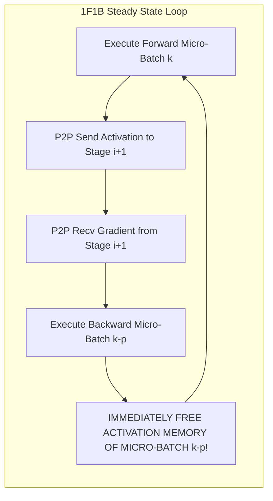

# 08. Pipeline Parallelism & Hybrid Bubble Schedules

> **References & Influential Literature:**
> - *GPipe: Efficient Training of Giant Neural Networks using Pipeline Parallelism* — Yanping Huang et al. (Google Brain, NeurIPS 2019)
> - *Efficient Large-Scale Language Model Training on GPU Clusters Using Megatron-LM* — Deepak Narayanan et al. (SC 2021)
> - *Zero Bubble Pipeline Parallelism* — Penghui Qi et al. (ICLR 2024)

---

## 1. Pipeline Parallelism (PP) Foundations

When training a model with 80+ Transformer layers, the model's depth can be partitioned sequentially across $p$ **Pipeline Stages**:

```
+-------------------------------------------------------------------------------+
| STAGE 0 (GPU 0): Embedding Table + Layers 0 to 19                             |
|       | Point-to-Point Send/Recv Activations                                  |
| STAGE 1 (GPU 1): Layers 20 to 39                                              |
|       | Point-to-Point Send/Recv Activations                                  |
| STAGE 2 (GPU 2): Layers 40 to 59                                              |
|       | Point-to-Point Send/Recv Activations                                  |
| STAGE 3 (GPU 3): Layers 60 to 79 + Language Model Unembedding Head           |
+-------------------------------------------------------------------------------+
```

### 1.1 Why Pipeline Parallelism Scales Across Datacenters
Unlike Tensor Parallelism (which requires four All-Reduces per layer over $900\text{ GB/s}$ NVLink), Pipeline Parallelism communicates **only at the boundaries between stages**:
- In the forward pass: Stage $i$ sends its boundary activation tensor $(b, s, h)$ to Stage $i+1$.
- In the backward pass: Stage $i+1$ sends its boundary gradient tensor $(b, s, h)$ back to Stage $i$.
- **Bandwidth Requirement**: Small enough to easily traverse standard $400\text{ Gbps}$ InfiniBand links across server racks!

---

## 2. The Pipeline Bubble Problem

If a batch is processed as a single monolithic block, GPU 1 sits completely idle while GPU 0 executes, and GPU 0 sits idle during the backward pass:

```
GPU 3:               [ F3 ][ B3 ]
GPU 2:          [ F2 ]          [ B2 ]
GPU 1:     [ F1 ]                    [ B1 ]
GPU 0: [ F0 ]                              [ B0 ]
       <----------------- TIME ----------------->
       Idle Time (Wasted Compute Bubble) = 75%!
```

To reduce idle time, the training batch is divided into $m$ smaller **micro-batches** ($m \gg p$).

---

## 3. Pipeline Scheduling Paradigms

### 3.1 The GPipe Schedule (Google, 2019)
All $m$ forward micro-batches are launched sequentially, followed immediately by all $m$ backward micro-batches:

```mermaid
gantt
    title GPipe Schedule (p = 4 stages, m = 8 micro-batches)
    dateFormat X
    axisFormat %s

    section Stage 3
    F0: 3, 4
    F1: 4, 5
    F2: 5, 6
    F3: 6, 7
    B0: 7, 8
    B1: 8, 9
    B2: 9, 10
    B3: 10, 11

    section Stage 2
    F0: 2, 3
    F1: 3, 4
    F2: 4, 5
    F3: 5, 6
    B0: 8, 9
    B1: 9, 10
    B2: 10, 11
    B3: 11, 12

    section Stage 1
    F0: 1, 2
    F1: 2, 3
    F2: 3, 4
    F3: 4, 5
    B0: 9, 10
    B1: 10, 11
    B2: 11, 12
    B3: 12, 13

    section Stage 0
    F0: 0, 1
    F1: 1, 2
    F2: 2, 3
    F3: 3, 4
    B0: 10, 11
    B1: 11, 12
    B2: 12, 13
    B3: 13, 14
```



#### The Exact Pipeline Bubble Equation:
Total execution time is $(m + p - 1)$ time units. The ideal execution time without bubbles is $m$ units.

$$\text{Bubble Fraction } F_{\text{bubble}} = \frac{(m + p - 1) - m}{m + p - 1} = \frac{p - 1}{m + p - 1}$$

If $p = 8$ and $m = 8$:
$$F_{\text{bubble}} = \frac{7}{15} \approx \mathbf{46.6\%\text{ Wasted Silicon Compute!}}$$
To push bubble fraction below $10\%$, one must set $m \ge 8p$, which inflates the required global batch size.

#### GPipe's Fatal Memory Flaw:
Stage 0 must hold the activation tensors for **all $m$ micro-batches in memory simultaneously** until the backward pass begins, creating catastrophic memory pressure ($O(m)$ memory).

---

### 3.2 The 1F1B Schedule (One Forward, One Backward - Megatron-LM)
In **1F1B**, once the pipeline pipeline fills during a warmup phase, every stage **alternates between executing one forward micro-batch and one backward micro-batch**:



#### Memory Advantage of 1F1B:
Because backward passes occur early and continuously, activations are released as soon as their backward step finishes.
- **Maximum Stored Micro-Batches**: Bounded strictly at **$p$ micro-batches** ($O(p)$ instead of $O(m)$)!
- Allows training models with arbitrarily large $m$ without running out of GPU memory.

---

### 3.3 Interleaved 1F1B (Virtual Pipeline Stages)
Narayanan et al. (SC 2021) introduced **Virtual Stages**:
- Instead of GPU 0 holding the entire first contiguous chunk of layers, each physical GPU hosts **$v$ non-contiguous virtual stages**:
  - Example ($p = 4, v = 2$, 8 stages total):
    - GPU 0 holds Stage 0 (Layers 0-9) and Stage 4 (Layers 40-49)
    - GPU 1 holds Stage 1 (Layers 10-19) and Stage 5 (Layers 50-59)
    - GPU 2 holds Stage 2 (Layers 20-29) and Stage 6 (Layers 60-69)
    - GPU 3 holds Stage 3 (Layers 30-39) and Stage 7 (Layers 70-79)

$$\text{Interleaved Bubble Fraction } F_{\text{bubble}} \approx \frac{p - 1}{v \cdot m}$$

Setting $v = 2$ or $v = 4$ **cuts the pipeline bubble in half or quarters**, at the cost of $v\times$ more P2P network transactions.

---

### 3.4 Zero-Bubble Pipeline Parallelism (2024)
Recent research (Qi et al., ICLR 2024) decouples the backward pass into two separate operations:
1. **$B_A$ (Backward for Activations)**: Computes $\frac{\partial L}{\partial X}$, required to pass gradients to the upstream stage. **Must execute on critical path**.
2. **$B_W$ (Backward for Weights)**: Computes $\frac{\partial L}{\partial W}$. **Can be delayed indefinitely without stalling upstream stages**!

```
Normal Backward: [ B_A + B_W together ] (Blocks next forward)
Zero-Bubble:     [ B_A ] ---> Unblocks Upstream Stage Immediately!
                 [ B_W ] ---> Scheduled into empty pipeline bubble slots!
```

By postponing $B_W$ into what was previously the idle bubble, Zero-Bubble pipeline schedules achieve **near $0\%$ bubble overhead** with the same activation memory budget as 1F1B.
