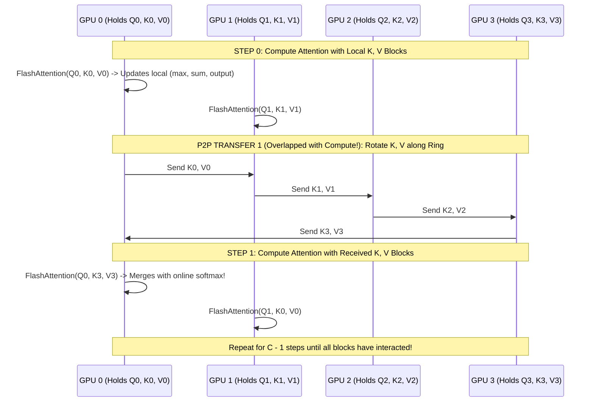
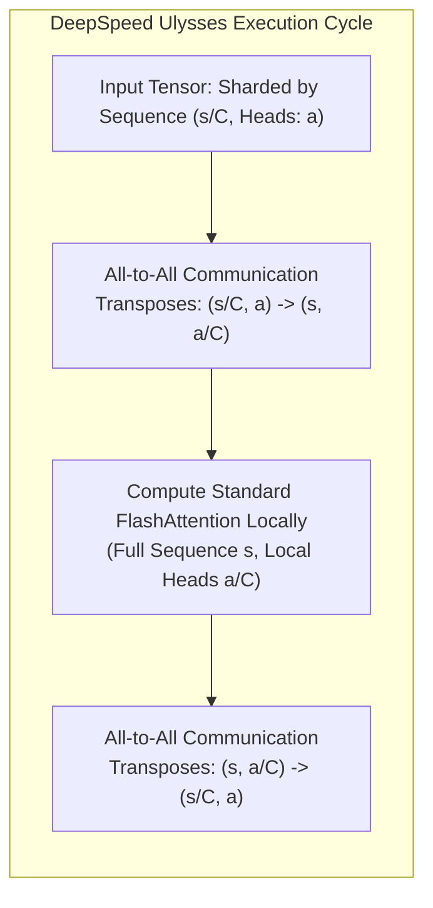

# 09. Context Parallelism, Ring Attention & Long-Context Scaling

> **References & Influential Literature:**
> - *RingAttention with Blockwise Transformers for Near-Infinite Context* — Hao Liu, Matei Zaharia, Pieter Abbeel (UC Berkeley, 2023)
> - *DeepSpeed Ulysses: System Optimizations for Enabling Training of Extreme Long Sequences* — Samyam Rajbhandari et al. (Microsoft, 2023)
> - *FlashAttention: Fast and Memory-Efficient Exact Attention with IO-Awareness* — Tri Dao et al. (NeurIPS 2022)

---

## 1. The Long-Context Memory Wall

Modern frontier foundation models require context windows of $32,768$, $131,072$, to over $1,000,000$ tokens to ingest entire code repositories, financial books, and multi-hour video streams.

However, standard self-attention exhibits **quadratic computational and memory complexity**:

$$\text{Attention FLOPs} = 4 \cdot b \cdot s^2 \cdot h$$

$$\text{Attention Score Matrix Size} = b \cdot a \cdot s^2 \cdot 2\text{ Bytes}$$

#### The Quadratic Memory Explosion ($b=1, a=32, \text{FP16}$):
- At $s = 4,096$ tokens: Matrix $= 1 \times 32 \times 4096^2 \times 2\text{ bytes} \approx \mathbf{1.07\text{ GB}}$
- At $s = 32,768$ tokens: Matrix $= 1 \times 32 \times 32768^2 \times 2\text{ bytes} \approx \mathbf{68.7\text{ GB}}$
- At $s = 131,072$ tokens: Matrix $= 1 \times 32 \times 131072^2 \times 2\text{ bytes} \approx \mathbf{1,099.5\text{ GB!}}$

Even with FlashAttention (which computes attention without materializing the full $s \times s$ matrix in HBM), storing intermediate LayerNorm and residual activations for $128\text{k}$ tokens instantly crashes an $80\text{ GB}$ GPU.
**Context Parallelism (CP)** shards the sequence dimension $s$ across multiple GPUs during attention computation.

---

## 2. The Ring Attention Algorithm

Introduced by Hao Liu et al. (UC Berkeley, 2023), **Ring Attention** partitions the input sequence of length $s$ equally across $C$ GPUs in a logical ring. Each GPU holds a chunk of tokens of size:

$$s_{\text{local}} = \frac{s}{C}$$

```
Input Sequence: [ Tokens 0 .. s/4 ]  [ Tokens s/4 .. s/2 ]  [ Tokens s/2 .. 3s/4 ]  [ Tokens 3s/4 .. s ]
                     |                     |                     |                     |
                  [ GPU 0 ]             [ GPU 1 ]             [ GPU 2 ]             [ GPU 3 ]
                  Holds Q0, K0, V0      Holds Q1, K1, V1      Holds Q2, K2, V2      Holds Q3, K3, V3
```



### 2.1 The Online Softmax Rescaling Formula
Because Softmax requires computing $\sum_{j=1}^s \exp(S_{i,j})$, computing attention across scattered blocks requires dynamically rescaling partial attention accumulators using **Milakov & Gimelshein's Online Softmax formula**:

For a current running maximum $m_{\text{old}}$, running sum $l_{\text{old}}$, and running output vector $O_{\text{old}}$, upon receiving a new block with local max $m_{\text{new}}$ and local sum $l_{\text{new}}$:

$$m_{\text{merged}} = \max(m_{\text{old}}, m_{\text{new}})$$

$$\alpha = \exp(m_{\text{old}} - m_{\text{merged}}), \quad \beta = \exp(m_{\text{new}} - m_{\text{merged}})$$

$$l_{\text{merged}} = \alpha \cdot l_{\text{old}} + \beta \cdot l_{\text{new}}$$

$$O_{\text{merged}} = \frac{\alpha \cdot l_{\text{old}} \cdot O_{\text{old}} + \beta \cdot l_{\text{new}} \cdot O_{\text{new}}}{l_{\text{merged}}}$$

### 2.2 Complete Overlap of Compute and Communication
A critical mathematical property of Ring Attention:
- Computing FlashAttention on a $(s/C) \times (s/C)$ block takes time proportional to $O\left(\left(\frac{s}{C}\right)^2 \cdot h\right)$.
- Transferring $K$ and $V$ blocks over NVLink takes time proportional to $O\left(\frac{s}{C} \cdot h\right)$.
- When $s/C \ge 1024$, **computation time strictly exceeds communication time**!
- The P2P network transfers run in a background CUDA stream completely hidden behind the Tensor Core GEMM, achieving **near-zero communication overhead**!

---

## 3. Causal Masking in Ring Attention

In autoregressive decoder language models, token $i$ cannot attend to future tokens $j > i$. When the sequence is distributed across a ring of $C$ GPUs, blocks exhibit three distinct geometric masking states:

```
        Block 0     Block 1     Block 2     Block 3
        (Tokens)    (Tokens)    (Tokens)    (Tokens)
Block 0   [ CAUSAL ]    [ EMPTY ]    [ EMPTY ]    [ EMPTY ]
Block 1   [ FULL   ]    [ CAUSAL ]    [ EMPTY ]    [ EMPTY ]
Block 2   [ FULL   ]    [ FULL   ]    [ CAUSAL ]    [ EMPTY ]
Block 3   [ FULL   ]    [ FULL   ]    [ FULL   ]    [ CAUSAL ]
```

1. **Upper Triangular Blocks ($j > i$)**: Future tokens. **Zero Computation**! The block is skipped immediately without launching a CUDA kernel.
2. **Strict Lower Blocks ($j < i$)**: All tokens in the incoming $K, V$ block precede local queries. **Full Dense Attention** (No causal mask needed).
3. **Diagonal Blocks ($j == i$)**: Contains the causal boundary. **Local Triangular Causal Mask applied**.

> [!TIP]
> **Load Imbalance Mitigation**: Notice that GPU 0 only computes 1 block (Block 0,0), while GPU 3 computes all 4 blocks! To balance compute load across the ring, modern implementations interleave sequence chunks so that each rank holds a mixture of early and late sequence tokens.

---

## 4. DeepSpeed Ulysses: All-to-All Context Parallelism

While Ring Attention passes $K$ and $V$ sequentially along a ring, **DeepSpeed Ulysses** takes an alternative approach using **All-to-All collective operations**:



### 4.1 Comparing Ring Attention vs. DeepSpeed Ulysses

| Feature | Ring Attention | DeepSpeed Ulysses |
| :--- | :--- | :--- |
| **Communication Primitive** | Asynchronous P2P Send/Recv in a Ring | Two Global All-to-All Collectives |
| **Network Traffic Pattern** | Nearest-neighbor (Ideal for 1D/2D Torus) | Global Bisection Transpose (Demands crossbar fabric) |
| **Attention Head Constraint**| **Zero Constraint** (Works even if Heads < CP size) | **$a \pmod C == 0$** (Heads MUST divide by CP size) |
| **Compatibility with GQA** | Seamless | Problematic with Grouped-Query Attention (KV heads $\approx 8$) |
| **Implementation Complexity**| Requires custom online-softmax kernel | Uses off-the-shelf FlashAttention unmodified |
