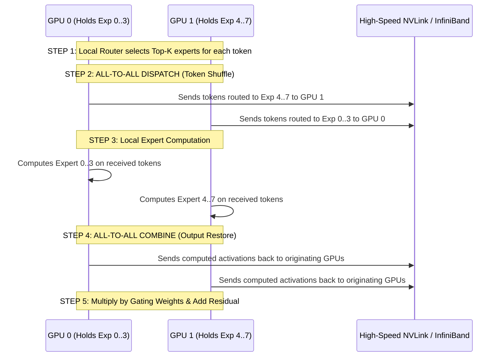

# 10. Mixture-of-Experts (MoE) & Expert Parallelism (EP)

> **References & Influential Literature:**
> - *Outrageously Large Neural Networks: The Sparsely-Gated Mixture-of-Experts Layer* — Noam Shazeer et al. (Google Brain, ICLR 2017)
> - *Switch Transformers: Scaling to Trillion Parameter Models with Simple and Efficient Sparsity* — William Fedus et al. (JMLR 2022)
> - *MegaBlocks: Efficient Sparse Training with Mixture-of-Experts* — Trevor Gale et al. (Stanford / Databricks, MLSys 2023)
> - *DeepSeek-V2 & DeepSeek-V3 Technical Reports* — DeepSeek AI (2024)

---

## 1. The Sparse Mixture-of-Experts (MoE) Architecture

As models scale past hundreds of billions of parameters, dense architectures become compute-prohibitive: evaluating every parameter for every single token costs too many FLOPs.

**Mixture-of-Experts (MoE)** replaces the dense Feed-Forward Network (FFN) with a collection of $E$ independent "expert" networks. A lightweight **Gating / Router Network** dynamically routes each token to only a sparse subset of $K$ experts ($K \ll E$, typically $K=2$ out of $E=8$ or $K=8$ out of $E=256$ in DeepSeek-V3).

```
Dense Transformer Layer:
Token X ---> Self-Attention ---> [ Dense FFN (100% Parameters Active) ] ---> Output

Sparse MoE Transformer Layer:
Token X ---> Self-Attention ---> [ Router Network ]
                                     /       \
                        (Weights 0.85)       (Weights 0.15)
                                   v           v
                             [ Expert 2 ]  [ Expert 7 ]  ... [ Expert E (Idle) ]
                                   \           /
                                    +---------+
                                         |
                                      Output
```

### 1.1 Mathematical Formulation of MoE Forward Pass
For a token vector $x \in \mathbb{R}^h$:
1. The router computes a gating score vector over all $E$ experts using a linear projection $W_g \in \mathbb{R}^{h \times E}$:
   $$H(x) = x \cdot W_g$$
2. The router selects the top $K$ values:
   $$\text{TopKIndices}(x) = \text{argpartition}(H(x), -K)_{-K:}$$
3. Softmax is applied over the top $K$ selected expert logits:
   $$G(x)_i = \frac{\exp(H(x)_i)}{\sum_{j \in \text{TopK}} \exp(H(x)_j)}$$
4. The final layer output is the weighted sum of outputs from the selected active experts:
   $$y = \sum_{i \in \text{TopK}} G(x)_i \cdot \text{Expert}_i(x)$$

---

## 2. The Expert Parallelism (EP) Execution Pipeline

In large MoE models (e.g., $E = 64\text{ to }256$ experts), all experts cannot fit in the memory of a single GPU. Under **Expert Parallelism (EP)**, the $E$ experts are partitioned across $P_{\text{ep}}$ GPUs:

```
GPU 0: Experts [ 0, 1, 2, 3 ]      GPU 1: Experts [ 4, 5, 6, 7 ]
GPU 2: Experts [ 8, 9, 10, 11 ]    GPU 3: Experts [ 12, 13, 14, 15 ]
```

Because tokens on GPU 0 may choose an expert located on GPU 3, distributed execution requires a two-stage **All-to-All communication shuffle**:



---

## 3. Load Balancing & Router Regularization Losses

If left unregularized, gating networks suffer from a **winner-take-all collapse**: the router quickly routes all tokens to 1 or 2 favored experts whose weights update fastest, leaving the remaining $E - 2$ experts completely untrained and starving their assigned GPUs of work!

To enforce uniform token distribution across all experts, pre-training objectives introduce **Auxiliary Losses**:

### 3.1 Auxiliary Load Balancing Loss ($L_{\text{aux}}$)
For a batch of $T$ tokens across $E$ experts:
- Define $f_i$ as the fraction of tokens routed to expert $i$:
  $$f_i = \frac{1}{T} \sum_{t=1}^T \mathbb{I}(\text{Expert } i \in \text{TopK}(x_t))$$
- Define $P_i$ as the average probability allocated to expert $i$ across the batch:
  $$P_i = \frac{1}{T} \sum_{t=1}^T G(x_t)_i$$
- The auxiliary loss is the scaled dot-product:
  $$L_{\text{aux}} = \alpha \cdot E \sum_{i=1}^E f_i \cdot P_i$$
  Minimizing $L_{\text{aux}}$ mathematically forces both $f_i$ and $P_i$ to approach the uniform distribution $\frac{1}{E}$.

### 3.2 Router Z-Loss ($L_z$)
In low-precision FP8/BF16 training, extreme router logits $H(x)_i$ cause exponential overflow in Softmax:
$$L_z = \beta \cdot \frac{1}{T} \sum_{t=1}^T \left(\ln \sum_{i=1}^E \exp(H(x_t)_i)\right)^2$$
Penalizing large logits stabilizes numerical routing in long pre-training runs.

---

## 4. Dropless Training vs. Capacity Factors (MegaBlocks)

In early MoE systems (Switch Transformer, GShard), distributed tensor buffers required static shapes. Engineers enforced a **Capacity Factor (CF)**:

$$\text{Expert Capacity} = \left\lceil \frac{\text{Total Tokens} \times K}{E} \times \text{CF} \right\rceil$$

- If more tokens than the capacity limit were routed to an expert, the excess tokens were **DROPPED** (unprocessed by the FFN, routed solely through the residual connection), causing significant degradation in reasoning capability.
- Setting $\text{CF} > 1.0$ prevented dropping but padded buffers with zeros, wasting $30\%\text{ to }50\%$ of GPU compute cycles on empty padding math!

### 4.1 MegaBlocks: Block-Sparse GPU Kernels for Dropless MoE
Trevor Gale et al. (Stanford / Databricks, MLSys 2023) introduced **MegaBlocks**:
- Formulates the unbalanced multi-expert computation as a single **Block-Sparse Matrix Multiplication (dMoE)** kernel in Triton/CUDA.
- Dynamically allocates variable-sized memory segments directly matching the exact number of tokens received by each expert.
- **Zero tokens dropped** and **zero wasted compute on zero-padding**, enabling modern high-performance MoE pre-training (adopted by Mixtral, Grok-1, and DeepSeek).
