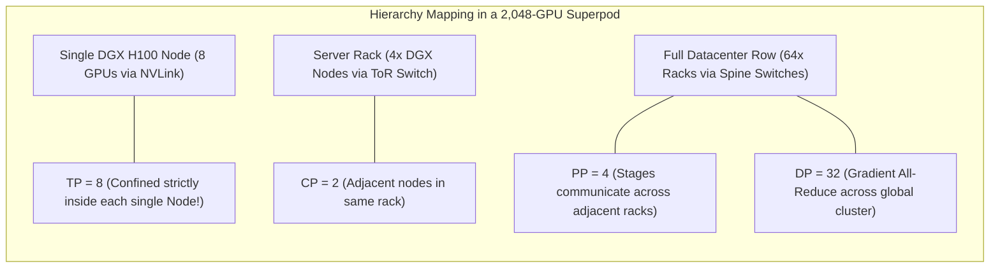

# 11. 3D-5D Parallelism Composition & Orchestration

> **References & Influential Literature:**
> - *Efficient Large-Scale Language Model Training on GPU Clusters Using Megatron-LM* — Deepak Narayanan et al. (NVIDIA, SC 2021)
> - *Megatron-Core Architectural Blueprint & User Guide* — NVIDIA Developer Documentation
> - *DeepSeek-V3 Technical Report: Architecture & Infrastructure Scaling* — DeepSeek AI (2024)
> - *The Llama 3 Herd of Models* — Meta AI Research (2024)

---

## 1. The 5D Parallelism Composition Identity

Frontier models exceeding $70\text{B}$ to $1\text{T}+$ parameters cannot be trained using a single parallelism paradigm. Production training engines (**Megatron-LM**, **DeepSpeed**, **Megatron-Core**) compose five distinct axes of parallelism:

```
1. Tensor Parallelism  (TP): Shards linear layers within a Transformer block.
2. Sequence Parallelism(SP): Shards LayerNorm and Dropout activations.
3. Context Parallelism (CP): Shards sequence length across attention blocks.
4. Pipeline Parallelism(PP): Shards Transformer layers across depth.
5. Expert Parallelism  (EP): Shards sparse MoE experts across GPUs.
6. Data Parallelism    (DP): Replicates the model across distributed batches.
```

### 1.1 The Mathematical Cluster Constraint
The product of all parallelism dimensions must equal the exact physical GPU count $N_{\text{world}}$:

$$N_{\text{world}} = DP \times TP \times PP \times CP \times EP$$

$$\text{Global Training Batch Size (Tokens)} = \text{Micro-Batch Size } (b) \times \text{Sequence Length } (s) \times \text{Gradient Accumulation Steps } (g) \times DP$$

---

## 2. Mapping Parallelism to Physical Datacenter Topology

The golden rule of distributed training is **matching communication intensity to physical interconnect bandwidth**:

```
+-------------------------------------------------------------------------------+
| INTERCONNECT HIERARCHY             | BANDWIDTH       | ASSIGNED PARALLELISM   |
+-------------------------------------------------------------------------------+
| Intra-Node NVLink 4/5 Crossbar     | 900 - 1800 GB/s | TENSOR PARALLELISM (TP)|
|                                    |                 | & CONTEXT PARALLEL (CP)|
+------------------------------------+-----------------+------------------------+
| Intra-Rack NVLink / Leaf Switch    | 400 - 900 GB/s  | EXPERT PARALLEL (EP)   |
+------------------------------------+-----------------+------------------------+
| Inter-Rack InfiniBand (Spine Tier) | 50 - 100 GB/s   | PIPELINE PARALLEL (PP) |
+------------------------------------+-----------------+------------------------+
| Cluster-Wide Rail-Optimized Fabric | 50 - 100 GB/s   | DATA PARALLEL (DP/FSDP)|
+------------------------------------+-----------------+------------------------+
```



### Why This Topology Mapping is Invariant:
1. **Tensor Parallelism ($TP$)**: Executes 4 All-Reduces per layer. If $TP$ crosses an InfiniBand cable instead of NVLink, communication latency increases by $30\times$, collapsing training efficiency. **$TP$ must never exceed 8 GPUs on DGX or 72 GPUs on NVL72 racks!**
2. **Pipeline Parallelism ($PP$)**: Communicates only activations at the boundary between stages. The data volume is tiny compared to TP, making it the ideal paradigm to cross inter-rack network rows.
3. **Data Parallelism ($DP$)**: Communicates once per training step during backpropagation. Overlapped asynchronously using gradient bucketing.

---

## 3. Real-World Frontier Configuration Case Studies

### 3.1 Meta Llama-3 70B Pre-Training Topology
- **Total Physical GPUs**: $N_{\text{world}} = 2,048\text{ NVIDIA H100 SXM5}$
- **Sequence Length ($s$)**: $8,192\text{ tokens}$
- **Parallelism Strategy**:
  - $TP = 8$ (Inside each 8-GPU DGX server over $900\text{ GB/s}$ NVLink 4)
  - $PP = 4$ (4 nodes deep across the network)
  - $CP = 1$
  - $DP = 64$ (With ZeRO-1 optimizer partitioning)
  - Verification: $8 \times 4 \times 1 \times 64 = \mathbf{2,048\text{ GPUs}}$.
- **Achieved MFU**: $\approx \mathbf{52\%}$.

---

### 3.2 DeepSeek-V3 671B Sparse MoE Configuration
- **Total Physical GPUs**: $N_{\text{world}} = 2,048\text{ to }16,384\text{ GPUs}$
- **Architecture**: 256 routed experts + 1 shared expert (Top-8 active).
- **Parallelism Strategy**:
  - $TP = 4$ (Low TP to minimize All-Reduce overhead)
  - $PP = 8$ (8 stages deep)
  - $EP = 64$ (64-way Expert Parallelism across high-speed InfiniBand leaf switches)
  - $DP = 8$
  - Verification ($N=16,384$): $4 \times 8 \times 64 \times 8 = \mathbf{16,384\text{ GPUs}}$.

---

## 4. Production Megatron-LM Launch Script

Below is a production Bash launch script configuring a 5D parallel training job via `torchrun` and `megatron-core`:

```bash
#!/usr/bin/env bash
# File: train_llama_70b_distributed.sh

export CUDA_DEVICE_MAX_CONNECTIONS=1
export NCCL_NET_GDR_LEVEL=5               # Enable GPUDirect RDMA over InfiniBand
export NCCL_BUFFSIZE=16777216             # 16 MB NCCL ring buffer
export NCCL_CROSS_NIC=1

# Cluster Nodes Configuration
NNODES=256                               # 256 nodes * 8 GPUs = 2048 GPUs
GPUS_PER_NODE=8
WORLD_SIZE=$((NNODES * GPUS_PER_NODE))

# Parallelism Dimensions (TP=8, PP=4, CP=2, DP=32)
TENSOR_PARALLEL_SIZE=8
PIPELINE_PARALLEL_SIZE=4
CONTEXT_PARALLEL_SIZE=2
VIRTUAL_PIPELINE_STAGES=2                 # Interleaved 1F1B schedule

torchrun \
    --nnodes=$NNODES \
    --nproc_per_node=$GPUS_PER_NODE \
    --rdzv_id=llama3_70b_pretrain \
    --rdzv_backend=c10d \
    --rdzv_endpoint=$MASTER_ADDR:$MASTER_PORT \
    pretrain_gpt.py \
    --tensor-model-parallel-size $TENSOR_PARALLEL_SIZE \
    --pipeline-model-parallel-size $PIPELINE_PARALLEL_SIZE \
    --context-parallel-size $CONTEXT_PARALLEL_SIZE \
    --num-virtual-pipeline-stages $VIRTUAL_PIPELINE_STAGES \
    --sequence-parallel \
    --use-distributed-optimizer \
    --micro-batch-size 1 \
    --global-batch-size 2048 \
    --seq-length 8192 \
    --max-position-embeddings 8192 \
    --num-layers 80 \
    --hidden-size 8192 \
    --ffn-hidden-size 28672 \
    --num-attention-heads 64 \
    --group-query-attention \
    --num-query-groups 8 \
    --normalization RMSNorm \
    --swiglu \
    --use-flash-attn \
    --fp8-format 'hybrid' \
    --fp8-margin 0 \
    --fp8-interval 1 \
    --lr 1.5e-4 \
    --min-lr 1.5e-5 \
    --lr-decay-style cosine \
    --weight-decay 0.1 \
    --clip-grad 1.0 \
    --save /mnt/nvme_checkpoints/llama70b \
    --load /mnt/nvme_checkpoints/llama70b \
    --save-interval 1000
```
