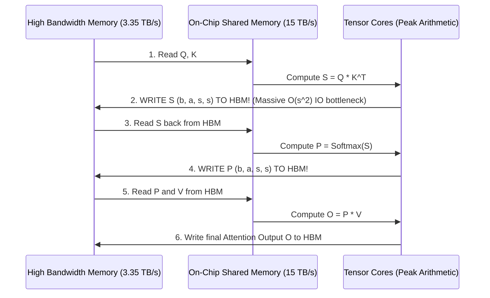

# 12. Kernel Optimization, FlashAttention & Low-Precision Training

> **References & Influential Literature:**
> - *FlashAttention: Fast and Memory-Efficient Exact Attention with IO-Awareness* — Tri Dao et al. (NeurIPS 2022)
> - *FlashAttention-2: Faster Attention with Better Parallelism and Work Partitioning* — Tri Dao (2023)
> - *FlashAttention-3: Fast and Accurate Attention with Asynchrony and Low-Precision on Hopper GPUs* — Tri Dao et al. (2024)
> - *FP8 Formats for Deep Learning* — Paulius Micikevicius et al. (NVIDIA / Intel / Arm, 2022)
> - *Triton: An Intermediate Language and Compiler for Tiled Neural Network Computations* — Philippe Tillet et al. (OpenAI, MAPL 2019)

---

## 1. The GPU Memory Wall in Attention Computation

Standard Self-Attention computes:

$$\text{Attention}(Q, K, V) = \text{Softmax}\left(\frac{Q K^T}{\sqrt{d_k}}\right) V$$

In standard PyTorch, this is evaluated as discrete kernel launches:



**The Bottleneck**: Reading and writing the intermediate $s \times s$ matrices ($S$ and $P$) across the slow HBM bus wastes **$90\%$ of total GPU execution time** waiting on memory bandwidth, leaving Tensor Cores idle!

---

## 2. FlashAttention: Algorithmic Tiling & Online Softmax

Tri Dao et al. (2022) solved this memory wall with **FlashAttention**:
- **IO-Aware Tiling**: $Q, K, V$ are partitioned into blocks that fit entirely within fast on-chip **Shared Memory / SRAM** ($B_r, B_c \approx 64\text{ to }128\text{ tokens}$).
- **Online Softmax**: Computes partial softmax scores and maintains a running normalizer, updating the output accumulator incrementally without ever writing the $s \times s$ matrix to HBM!

```
HBM (Global Memory):
Q: [ Block 0 | Block 1 | Block 2 | ... ]
K: [ Block 0 | Block 1 | Block 2 | ... ]
V: [ Block 0 | Block 1 | Block 2 | ... ]
       |
       v (Streamed once into SRAM via TMA)
SRAM (Fast On-Chip Cache):
Compute: Blockwise GEMM -> Online Softmax Rescale -> Output Accumulation
       |
       v
HBM: Write Final Output O ONCE! (Zero intermediate writes!)
```

### 2.1 Evolution: FlashAttention-1 $\to$ 2 $\to$ 3
1. **FlashAttention-1 (2022)**: Reduced HBM memory accesses from $O(s^2)$ to $O(s)$, achieving $2\times$ to $4\times$ speedup.
2. **FlashAttention-2 (2023)**:
   - Inverted the outer loop to iterate over $Q$ blocks instead of $K, V$ blocks, eliminating inter-thread synchronization overhead.
   - Partitioned work across warps along the sequence dimension, increasing Tensor Core utilization from $35\%\to 73\%$ of peak theoretical FLOPS.
3. **FlashAttention-3 (Hopper Architecture: 2024)**:
   - **Hardware Asynchrony via TMA**: Hardware Tensor Memory Accelerator streams tiles directly from HBM to SRAM with zero register overhead.
   - **Warp-Specialization**: Producer warps issue asynchronous memory loads while Consumer warps execute continuous Tensor Core MMA instructions.
   - **FP8 Support**: Native FP8 gemm evaluation with specialized numerical scaling.

---

## 3. FP8 Mixed-Precision Pre-Training

Transitioning from 16-bit precision (BF16) to 8-bit precision (FP8) doubles arithmetic compute throughput ($989\text{ TFLOPS} \to 1,979\text{ TFLOPS}$ on H100) and halves memory bandwidth consumption.

```
FP16:  [ Sign: 1 ][ Exponent: 5 ][ Mantissa: 10 ] -> Range: 10^5, High Precision
BF16:  [ Sign: 1 ][ Exponent: 8 ][ Mantissa: 7  ] -> Range: 10^38, Standard Range
FP8 E4M3: [ Sign: 1 ][ Exponent: 4 ][ Mantissa: 3 ] -> Range: [-448, 448], High Precision
FP8 E5M2: [ Sign: 1 ][ Exponent: 5 ][ Mantissa: 2 ] -> Range: [-57344, 57344], Wide Range
```

### 3.1 The Hybrid FP8 Recipe
Because neural network components exhibit different dynamic ranges during training, standard practice utilizes a **Hybrid FP8 format**:
1. **Forward Pass (Activations & Weights)**: Uses **E4M3** (3 mantissa bits). Requires high precision to preserve fine-grained representations; activation distributions have relatively narrow bounds.
2. **Backward Pass (Gradients)**: Uses **E5M2** (5 exponent bits). Gradients vary over multiple orders of magnitude across layers and require wide dynamic range to prevent catastrophic underflow to zero.

### 3.2 Delayed Dynamic Scaling Factors
Because FP8 has limited range, tensors must be multiplied by a scaling factor $S$ before casting to FP8:

$$X_{\text{fp8}} = \text{clip}\left(\text{round}(X \times S), -\text{FP8\_MAX}, \text{FP8\_MAX}\right)$$

$$S = \frac{\text{FP8\_MAX}}{\max(|X|)}$$

To prevent stalling the GPU pipeline to compute $\max(|X|)$ before every single GEMM, **Delayed Scaling** uses the maximum absolute value observed over a sliding window of the previous $N$ iterations:

```python
# Delayed Scaling Logic (Transformer Engine)
class DelayedScaleFactor:
    def __init__(self, history_len=16):
        self.amax_history = torch.zeros(history_len)
        self.scale = 1.0

    def update_scale(self, current_amax):
        # Shift history window
        self.amax_history[1:] = self.amax_history[:-1]
        self.amax_history[0] = current_amax
        
        # Determine max across window
        rolling_amax = torch.max(self.amax_history)
        if rolling_amax > 0:
            self.scale = FP8_MAX / rolling_amax
```

---

## 4. Custom Kernel Programming with OpenAI Triton

Writing custom CUDA C++ kernels requires managing warp-level primitives, shared memory allocation, and bank conflict padding. **OpenAI Triton** allows developers to write high-performance GPU kernels directly in Python with compiler-enforced memory coalescing.

### 4.1 Production Triton Kernel: Fused GeLU LayerNorm

```python
import triton
import triton.language as tl
import torch

@triton.jit
def fused_layernorm_gelu_kernel(
    X_ptr,          # Pointer to input tensor (B, S, H)
    Y_ptr,          # Pointer to output tensor
    W_ptr,          # Pointer to LayerNorm weights
    B_ptr,          # Pointer to LayerNorm biases
    stride_row,     # Stride between rows
    H: tl.constexpr,# Hidden dimension
    BLOCK_SIZE: tl.constexpr # Tile size (e.g. 1024)
):
    # Get current row index
    row_idx = tl.program_id(0)
    row_start_ptr = X_ptr + row_idx * stride_row
    
    # 1. Load full row into registers with coalesced offsets
    cols = tl.arange(0, BLOCK_SIZE)
    mask = cols < H
    x = tl.load(row_start_ptr + cols, mask=mask, other=0.0)
    w = tl.load(W_ptr + cols, mask=mask, other=1.0)
    b = tl.load(B_ptr + cols, mask=mask, other=0.0)

    # 2. Compute LayerNorm: Mean and Variance
    mean = tl.sum(x, axis=0) / H
    var = tl.sum((x - mean) * (x - mean), axis=0) / H
    rsqrt = 1.0 / tl.sqrt(var + 1e-5)
    x_norm = (x - mean) * rsqrt * w + b

    # 3. Compute Fused GeLU Activation: 0.5 * x * (1 + tanh(sqrt(2/pi) * (x + 0.044715 * x^3)))
    sqrt_2_over_pi = 0.7978845608028654
    inner = sqrt_2_over_pi * (x_norm + 0.044715 * x_norm * x_norm * x_norm)
    gelu_out = 0.5 * x_norm * (1.0 + tl.sin(inner)) # Approximate tanh

    # 4. Write result back to Global Memory (Single HBM transaction!)
    y_start_ptr = Y_ptr + row_idx * stride_row
    tl.store(y_start_ptr + cols, gelu_out, mask=mask)
```
