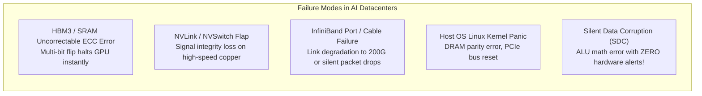
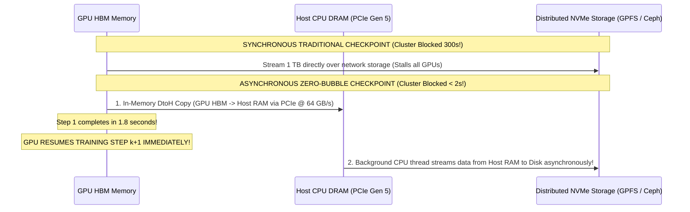
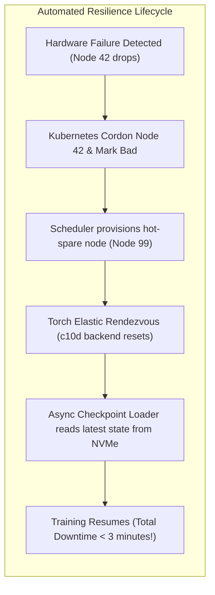

# 13. Large-Scale Cluster Resilience, Checkpointing & Fault Recovery

> **References & Influential Literature:**
> - *The Llama 3 Herd of Models (Infrastructure & Resilience Section)* — Meta AI Research (2024)
> - *Silent Data Corruption at Scale* — Caroline Trippel et al. (Meta / Google, IEEE Micro 2022)
> - *Megatron-LM Asynchronous Checkpointing System* — NVIDIA Developer Architecture
> - *PyTorch Distributed Elastic (TorchElastic) Design Document* — Meta PyTorch Team

---

## 1. The Physics & Statistics of Hardware Failure at Scale

When pre-training frontier models across $16,384$ to $32,768$ GPUs for months continuously, hardware failures cease to be rare anomalies—they become **the steady-state operating condition of the datacenter**.

### 1.1 The Cluster Mean Time Between Failures (MTBF) Formula
If an individual GPU server (including HBM, PCIe switches, NVLink transceivers, power supplies, and fans) exhibits an independent MTBF of **3 years ($26,280\text{ hours}$)**:

$$\text{Cluster MTBF} = \frac{\text{Component MTBF}}{\text{Total Components } N}$$

For a cluster of $N = 16,384\text{ GPUs}$ across $2,048$ servers:

$$\text{Cluster MTBF} = \frac{26,280\text{ hours}}{16,384} \approx \mathbf{1.6\text{ Hours!}}$$

> In a 16,000-GPU datacenter, an unrecoverable hardware failure occurs **every 90 to 100 minutes**. Without automated fault isolation and sub-minute recovery, the training job spends $100\%$ of its time crashing, restarting, and loading checkpoints, achieving **$0\%$ effective training progress**!

---

## 2. Taxonomy of Large-Scale Cluster Failures



### 2.1 Silent Data Corruption (SDC)
The most insidious failure mode in hyperscale clusters is **Silent Data Corruption (SDC)**:
- A marginal transistor inside an ALU or Tensor Core suffers a transient bit-flip due to sub-nanometer voltage droop or cosmic ray radiation.
- **The hardware does NOT crash, and ECC does NOT trigger**.
- The GPU computes $(2.0 \times 2.0 = 5.0)$ silently!
- When backpropagation encounters this corrupted value, gradients explode or collapse into `NaN` (Not a Number), propagating across all data-parallel ranks and permanently corrupting model weights!

#### SDC Detection Strategies:
1. **Periodic Deterministic Canary Kernels**: During warmup and checkpointing, every GPU executes an identical, pre-compiled mathematical GEMM block with known reference outputs. If a GPU's result deviates by even one bit, it is immediately cordoned off.
2. **Loss Anomaly Detectors**: Background monitoring threads track gradient $L_2$ norms and loss trajectories. If loss spikes by $> 3\sigma$ within a single iteration, the step is rejected and rolled back.

---

## 3. Asynchronous Zero-Bubble Checkpointing

Standard synchronous checkpointing saves hundreds of gigabytes across the network to distributed storage (GPFS, Lustre, Ceph):
- Saving a $70\text{B}$ model ($140\text{ GB}$ weights $+ 840\text{ GB}$ optimizer states $\approx \mathbf{1\text{ Terabyte}}$) every 1,000 steps over network storage stalls all 16,000 GPUs for **$3\text{ to }5\text{ minutes}$**, destroying MFU.



### 3.1 Implementation Architecture
1. **Device-to-Host (DtoH) Burst Transfer**: The GPU issues an asynchronous non-blocking memory copy (`cudaMemcpyAsync`) of optimizer shards from HBM into pinned host CPU system memory across PCIe Gen 5 ($64\text{ GB/s}$ throughput). This completes in **under 2 seconds**.
2. **Immediate Training Resumption**: The GPU stream signals completion, and training iteration $k+1$ begins immediately.
3. **Background Storage Offload**: A separate host CPU worker thread slowly streams the buffered checkpoint from host RAM over secondary storage networks to NVMe-oF arrays in the background.

---

## 4. Automated Elastic Recovery with Torchrun

When a GPU or node fails, the cluster management scheduler (Slurm or Kubernetes) must automatically detect, cordon, replace, and resume:



### 4.1 Production Torchrun Resiliency Configuration

```bash
# Automated Resilient Elastic Launch
torchrun \
    --nnodes=256:256 \
    --nproc_per_node=8 \
    --max_restarts=10 \
    --rdzv_id=frontier_pretrain_run \
    --rdzv_backend=c10d \
    --rdzv_endpoint=etcd-cluster.internal:2379 \
    pretrain_llm.py \
    --async-save-checkpoint \
    --auto-recover \
    --checkpoint-dir=/mnt/nvme_tier/checkpoints
```

- **`--max_restarts=10`**: Instructs the launcher to absorb up to 10 node dropouts per job allocation without terminating the Slurm batch script.
- **`--rdzv_backend=c10d`**: Uses a distributed etcd/c10d key-value store to establish dynamic rendezvous, allowing the remaining 255 nodes to pause, integrate the replacement node, rebuild NCCL communication rings, and resume computation within **$< 3\text{ minutes}$**.
