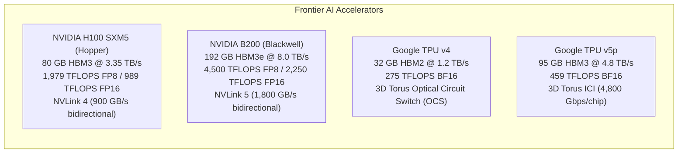

# GPU, TPU Architecture & Distributed LLM Training Infrastructure

A definitive, production-grade reference manual covering modern accelerator hardware architectures (**NVIDIA GPUs & Google TPUs**), datacenter scale-out interconnects, and distributed training paradigms for frontier Large Language Models (LLMs).

---

## 📚 Foundational Literature & Research Papers

This knowledge base synthesizes architectural specifications, mathematical formulations, and engineering designs from seminal industry research:

1. **GPU Architecture & Compute**:
   - *NVIDIA Hopper Architecture In-Depth* & *NVIDIA Blackwell Architecture Technical Whitepaper* (NVIDIA Corporation)
   - *CUDA Programming Guide & PTX ISA Manual* (NVIDIA)
   - *FlashAttention: Fast and Memory-Efficient Exact Attention with IO-Awareness* — Tri Dao et al. (NeurIPS 2022) & *FlashAttention-2 / FlashAttention-3* (2023, 2024)
2. **TPU Architecture & Systolic Compute**:
   - *In-Datacenter Performance Analysis of a Tensor Processing Unit* — Norman P. Jouppi et al. (Google, ISCA 2017)
   - *TPU v4: An Optically Reconfigurable Supercomputer for Machine Learning with Hardware Support for Embeddings* — Jouppi et al. (ISCA 2023)
3. **Distributed LLM Training Paradigms**:
   - *Megatron-LM: Training Multi-Billion Parameter Language Models Using Model Parallelism* — Mohammad Shoeybi et al. (NVIDIA, 2019)
   - *Efficient Large-Scale Language Model Training on GPU Clusters Using Megatron-LM* — Deepak Narayanan et al. (NVIDIA, SC 2021)
   - *ZeRO: Memory Optimizations Toward Training Trillion Parameter Models* — Samyam Rajbhandari et al. (Microsoft DeepSpeed, SC 2020)
   - *RingAttention with Blockwise Transformers for Near-Infinite Context* — Hao Liu et al. (UC Berkeley, 2023)
   - *DeepSeek-V2 & DeepSeek-V3 Technical Reports* (DeepSeek AI, 2024)
   - *GPipe: Efficient Training of Giant Neural Networks using Pipeline Parallelism* — Yanping Huang et al. (Google Brain, NeurIPS 2019)

---

## 🗺️ Frontier Accelerator Comparison: GPUs vs. TPUs

| Parameter | NVIDIA H100 SXM5 | NVIDIA H200 SXM5 | NVIDIA B200 | Google TPU v4 | Google TPU v5p |
| :--- | :--- | :--- | :--- | :--- | :--- |
| **Silicon Fabrication** | TSMC 4N ($814\text{ mm}^2$) | TSMC 4N ($814\text{ mm}^2$) | TSMC 4NP ($2\times \text{dies}$, $208\text{B transistors}$) | TSMC 7nm | TSMC 4N |
| **Memory Capacity** | $80\text{ GB}$ HBM3 | $141\text{ GB}$ HBM3e | $192\text{ GB}$ HBM3e | $32\text{ GB}$ HBM2 | $95\text{ GB}$ HBM3 |
| **Memory Bandwidth** | $3.35\text{ TB/s}$ | $4.8\text{ TB/s}$ | $8.0\text{ TB/s}$ | $1.2\text{ TB/s}$ | $4.8\text{ TB/s}$ |
| **FP8 Tensor FLOPS** | $1,979\text{ TFLOPS}$ | $1,979\text{ TFLOPS}$ | $4,500\text{ TFLOPS}$ | N/A | N/A |
| **BF16 / FP16 FLOPS**| $989\text{ TFLOPS}$ | $989\text{ TFLOPS}$ | $2,250\text{ TFLOPS}$ | $275\text{ TFLOPS}$ | $459\text{ TFLOPS}$ |
| **Interconnect Type**| NVLink 4 ($900\text{ GB/s}$) | NVLink 4 ($900\text{ GB/s}$) | NVLink 5 ($1.8\text{ TB/s}$) | Inter-Core Interconnect (ICI) | Inter-Core Interconnect (ICI) |
| **Cluster Topology** | Fat-Tree InfiniBand/RoCE| Fat-Tree InfiniBand/RoCE| NVL72 Rack / Fat-Tree IB | 3D Torus via Optical Switch | 3D Torus with 8,960 Pods |
| **Execution Engine** | SIMT (Warp-based, Dynamic)| SIMT (Warp-based, Dynamic)| SIMT + Decompression Engine | Spatial Systolic Array (MXU) | Spatial Systolic Array (MXU) |
| **Compiler Stack** | CUDA / TensorRT / Triton | CUDA / TensorRT / Triton | CUDA / TensorRT / Triton | XLA (Accelerated Linear Algebra)| XLA (Accelerated Linear Algebra)|

---

## 📑 Complete Chapter Roadmap

### Part 1: Silicon & Accelerator Microarchitecture
- **[01. GPU Architecture & Microarchitectural Internals](file:///Users/kunalkumar/desktop/knowledge-base/Projects/gpu-tpu-architecture-and-distributed-llm-training/01.%20GPU%20Architecture%20&%20Microarchitectural%20Internals.md)**: Streaming Multiprocessors (SM), Warp schedulers, register allocation, Tensor Cores (FP8/FP16/BF16/TF32 MMA), Shared Memory/L1 cache, L2 cache partition crossbars, HBM3/3e stacks, memory coalescing, bank conflict elimination.
- **[02. TPU Architecture & Systolic Array Deep Dive](file:///Users/kunalkumar/desktop/knowledge-base/Projects/gpu-tpu-architecture-and-distributed-llm-training/02.%20TPU%20Architecture%20&%20Systolic%20Array%20Deep%20Dive.md)**: Google TPU v1 through v5p/v6e, Matrix Multiply Unit (MXU) 2D systolic array compute vs SIMT, Vector Processing Units (VPU), Inter-Core Interconnect (ICI) 3D/4D Torus, Optical Circuit Switches (OCS), XLA compiler compilation pipeline.

### Part 2: Datacenter Interconnects & High-Performance Communications
- **[03. Datacenter Hardware & High-Speed Interconnects](file:///Users/kunalkumar/desktop/knowledge-base/Projects/gpu-tpu-architecture-and-distributed-llm-training/03.%20Datacenter%20Hardware%20&%20High-Speed%20Interconnects.md)**: NVLink 4/5, NVSwitch ASIC crossbars, PCIe Gen 5/6, InfiniBand Quantum-2 (NDR 400G / XDR 800G) with SHARP in-network aggregation, RoCEv2 (PFC, ECN, DCQCN), Rail-Optimized Non-Blocking Fat-Tree Topologies, Liquid-cooled DGX H100 vs NVL72 rack designs.
- **[04. Collective Communication Primitives & Algorithms](file:///Users/kunalkumar/desktop/knowledge-base/Projects/gpu-tpu-architecture-and-distributed-llm-training/04.%20Collective%20Communication%20Primitives%20&%20Algorithms.md)**: Ring All-Reduce, Tree All-Reduce, Reduce-Scatter, All-Gather, All-to-All, Broadcast, NCCL algorithm tuning, bus bandwidth equation ($\text{BusBw} = \text{AlgBw} \times \frac{2(N-1)}{N}$), channel multiplexing.

### Part 3: Distributed LLM Training Mathematics & Scaling Paradigms
- **[05. LLM Pre-Training Math, Memory Anatomy & FLOPs](file:///Users/kunalkumar/desktop/knowledge-base/Projects/gpu-tpu-architecture-and-distributed-llm-training/05.%20LLM%20Pre-Training%20Math,%20Memory%20Anatomy%20&%20FLOPs.md)**: Model parameter calculation, the $6N$ compute rule ($2N$ forward, $4N$ backward) and $8N$ with activation recomputation, Model FLOPs Utilization (MFU), static vs dynamic memory breakdown (Model weights, Gradients, Adam 16-byte states, Activation footprint).
- **[06. Data Parallelism - DDP, ZeRO-1, ZeRO-2 & ZeRO-3 (FSDP)](file:///Users/kunalkumar/desktop/knowledge-base/Projects/gpu-tpu-architecture-and-distributed-llm-training/06.%20Data%20Parallelism%20-%20DDP,%20ZeRO-1,%20ZeRO-2%20&%20ZeRO-3%20%28FSDP%29.md)**: Classical Distributed Data Parallel (DDP) gradient bucketing, ZeRO-1 optimizer partitioning, ZeRO-2 gradient partitioning, ZeRO-3 parameter sharding / PyTorch FSDP forward/backward all-gather communication lifecycles.
- **[07. Model Parallelism - Tensor Parallelism & Sequence Parallelism](file:///Users/kunalkumar/desktop/knowledge-base/Projects/gpu-tpu-architecture-and-distributed-llm-training/07.%20Model%20Parallelism%20-%20Tensor%20Parallelism%20&%20Sequence%20Parallelism.md)**: Megatron-LM Column-Parallel and Row-Parallel linear layers, communication boundary proofs, Sequence Parallelism (SP) sharding LayerNorm/Dropout activations, Megatron-Core codebase integration.
- **[08. Pipeline Parallelism & Hybrid Bubble Schedules](file:///Users/kunalkumar/desktop/knowledge-base/Projects/gpu-tpu-architecture-and-distributed-llm-training/08.%20Pipeline%20Parallelism%20&%20Hybrid%20Bubble%20Schedules.md)**: GPipe vs 1F1B (One Forward One Backward) schedules, Interleaved 1F1B, exact bubble fraction derivation ($F_{\text{bubble}} = \frac{p-1}{m+p-1}$), Zero-Bubble pipeline scheduling algorithms.
- **[09. Context Parallelism, Ring Attention & Long-Context Scaling](file:///Users/kunalkumar/desktop/knowledge-base/Projects/gpu-tpu-architecture-and-distributed-llm-training/09.%20Context%20Parallelism,%20Ring%20Attention%20&%20Long-Context%20Scaling.md)**: Overcoming the $O(L^2)$ attention memory barrier, Ring Attention algorithm (overlapping blockwise attention with key/value ring passing), DeepSpeed Ulysses (All-to-All sequence sharding), hybrid Ring-Ulysses for $1\text{M}+$ tokens.
- **[10. Mixture-of-Experts (MoE) & Expert Parallelism (EP)](file:///Users/kunalkumar/desktop/knowledge-base/Projects/gpu-tpu-architecture-and-distributed-llm-training/10.%20Mixture-of-Experts%20%28MoE%29%20&%20Expert%20Parallelism%20%28EP%29.md)**: Sparse MoE routing (Top-K gating, auxiliary load-balancing loss, router z-loss), Expert Parallelism (EP), All-to-All token dispatch and combine communication bottlenecks, MegaBlocks block-sparse GPU kernels.
- **[11. 3D-5D Parallelism Composition & Orchestration](file:///Users/kunalkumar/desktop/knowledge-base/Projects/gpu-tpu-architecture-and-distributed-llm-training/11.%203D-5D%20Parallelism%20Composition%20&%20Orchestration.md)**: Composing DP + TP + PP + CP + EP across physical hardware hierarchies, placing TP inside NVLink domains, CP across local pods, PP across inter-switch rows, and DP/FSDP across the global cluster.

### Part 4: High-Performance Execution, Low Precision & Resilience
- **[12. Kernel Optimization, FlashAttention & Low-Precision Training](file:///Users/kunalkumar/desktop/knowledge-base/Projects/gpu-tpu-architecture-and-distributed-llm-training/12.%20Kernel%20Optimization,%20FlashAttention%20&%20Low-Precision%20Training.md)**: FlashAttention v1/v2/v3 mathematical derivations (online softmax tiling), FP8 mixed precision (E4M3 vs E5M2, delayed scaling, underflow handling), Transformer Engine, custom Triton GPU kernels.
- **[13. Large-Scale Cluster Resilience, Checkpointing & Fault Recovery](file:///Users/kunalkumar/desktop/knowledge-base/Projects/gpu-tpu-architecture-and-distributed-llm-training/13.%20Large-Scale%20Cluster%20Resilience,%20Checkpointing%20&%20Fault%20Recovery.md)**: Mean Time Between Failures (MTBF) at 16,000+ GPU scale, Silent Data Corruption (SDC), fast zero-bubble asynchronous checkpointing (NVMe-oF / GPFS), Torch Elastic (`torchrun`) dynamic auto-recovery.
