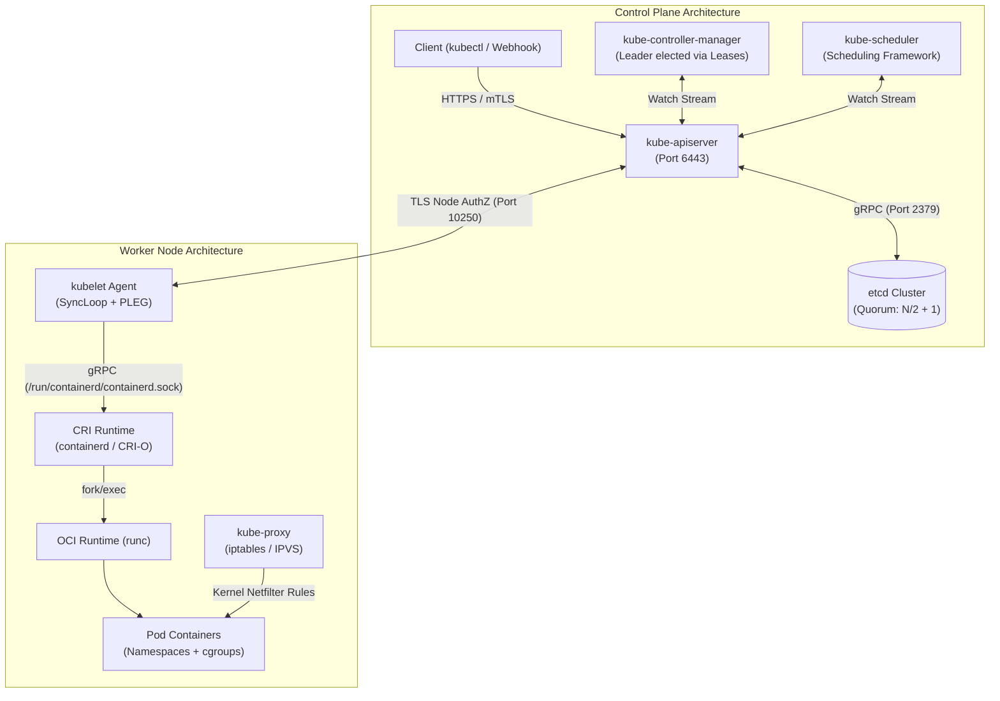
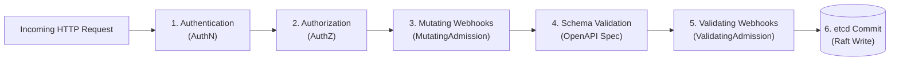
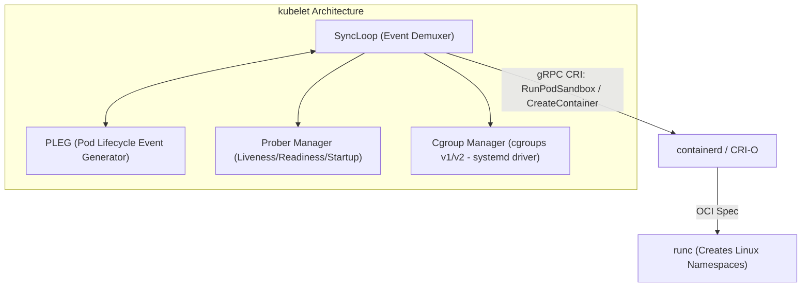

# 01. Control Plane & Node Architecture Internals

> **Certification & Academic References:**
> - *Certified Kubernetes Administrator (CKA) Study Guide* (Chapter 1: Cluster Architecture & Installation) — Benjamin Muschko (O'Reilly)
> - *Kubernetes: Up and Running (3rd Edition)* (Chapter 2: Creating and Starting a Cluster) — Brendan Burns, Joe Beda, Kelsey Hightower
> - *Programming Kubernetes* (Chapter 1: Understanding Kubernetes Basics) — Michael Hausenblas & Stefan Schimanski
> - *Production Kubernetes: Building Successful Application Platforms* — Josh Rosso et al.

---

## 1. Executive Summary & Control Plane Topology

Kubernetes is architecturally structured as a decoupled, asynchronous, distributed state machine. It consists of an immutable distributed consensus store (`etcd`), an extensible stateless REST API gateway (`kube-apiserver`), declarative state reconciliation loops (`kube-controller-manager`), an intelligent multi-stage workload placement engine (`kube-scheduler`), and local node agents (`kubelet`, `kube-proxy`, and an OCI-compliant container runtime).



---

## 2. `kube-apiserver` Request Lifecycle

The `kube-apiserver` is the single point of entry for all cluster interactions. It is stateless and acts as the sole gatekeeper to `etcd`. Every request undergoes an invariant 6-stage pipeline:



### 2.1 The 6 Stages of the API Pipeline
1. **Authentication (AuthN)**:
   - Evaluates client identity using configured authenticator plugins in priority order.
   - Methods: **X.509 Client Certificates** (validated against cluster CA), **OpenID Connect (OIDC)** bearer tokens, **Webhook Tokens**, and **ServiceAccount JWTs** (validated via projected public keys).
   - Once authenticated, assigns the request a username, user UID, and groups (e.g., `system:authenticated`, `system:masters`).
2. **Authorization (AuthZ)**:
   - Evaluates permissions for the authenticated subject against requested `(apiGroup, resource, verb, namespace)`.
   - Primary Authorizer: **RBAC (Role-Based Access Control)**.
   - Specialized Authorizer: **Node Authorizer** (restricts `kubelet` to modifying only its own Node object, Pods scheduled on its node, and secrets bound to those pods).
3. **Mutating Admission Controllers**:
   - Plugins that can alter or inject defaults into the submitted resource specification.
   - Built-in mutators: `DefaultStorageClass`, `MutatingAdmissionWebhook`.
   - Examples: Istio/Linkerd sidecar injection, injecting environment variables or security contexts.
4. **Object Schema Validation**:
   - Verifies the resource against its formal OpenAPI v3 structural schema.
   - Checks required fields, immutable fields, data type constraints, and valid YAML/JSON formatting.
5. **Validating Admission Controllers**:
   - Evaluates whether the resource satisfies cluster governance rules.
   - Cannot mutate the object; can only allow or reject (`HTTP 403 Forbidden`).
   - Built-in validators: `LimitRanger`, `ResourceQuota`, `PodSecurity`.
   - External policy engines: OPA Gatekeeper, Kyverno, or native Kubernetes `ValidatingAdmissionPolicy` (CEL-based).
6. **etcd Serialization & Commit**:
   - Serializes the object into Protocol Buffers (`protobuf`).
   - Writes to `etcd` key path: `/registry/<resource>/<namespace>/<name>`.
   - Increments global `etcd` revision and broadcasts a `WatchEvent` via HTTP/2 server-sent events to all active watchers.

### 2.2 Optimistic Concurrency Control (OCC)
Kubernetes avoids distributed locking on updates by leveraging **Optimistic Concurrency Control** via `metadata.resourceVersion`:
- When a client reads a resource, the API server returns its current `resourceVersion` (corresponding to the `etcd` commit revision).
- When submitting a `PUT` or `PATCH`, the client includes `resourceVersion`.
- If another process updated the resource in `etcd` in the interim, the API server rejects the update with an **`HTTP 409 Conflict`**:
  $$\text{Reject if } \text{Request}.\text{resourceVersion} \neq \text{etcd}.\text{currentRevision}$$
- The client must re-fetch the latest object, re-apply its mutations, and retry.

---

## 3. `etcd v3` Distributed Storage Internals

`etcd` is an open-source, strongly consistent distributed key-value store implementing the **Raft consensus algorithm** (Ongaro & Ousterhout, 2014).

### 3.1 Data Model: MVCC & BoltDB
- **Multi-Version Concurrency Control (MVCC)**: `etcd` does not overwrite keys in place. Every mutation increments a global 64-bit monotonically increasing integer called the **Revision**.
- **In-Memory B-Tree Index**: Maintains an index in RAM mapping each user key to its revision history.
- **Disk Backend (bbolt / BoltDB)**: A memory-mapped B+Tree file on disk (`member/snap/db`). Keys inside BoltDB are revisions; values are serialized protobuf payloads:
  ```
  In-Memory B-Tree:  /registry/pods/default/nginx-pod -> [rev 104, rev 250, rev 380]
  BoltDB on Disk:    Revision 380 -> { Pod YAML Protobuf Payload }
  ```
- **Compaction & Defragmentation**:
  - Over time, old revisions accumulate, consuming disk space.
  - `etcd` automatically runs compaction to purge revisions older than a retention window.
  - After compaction, empty pages inside BoltDB must be reclaimed using `etcdctl defrag` to shrink physical file size on disk.

### 3.2 Quorum Arithmetic & Failure Domains
To commit a transaction, Raft requires an affirmative vote from a strict majority (**Quorum**):

$$\text{Quorum} = \left\lfloor \frac{N}{2} \right\rfloor + 1$$

| Cluster Size ($N$) | Quorum Needed | Tolerable Failures | Architectural Recommendation |
| :--- | :--- | :--- | :--- |
| **1** | 1 | 0 | Development / Lab only (No HA) |
| **3** | 2 | 1 | Standard Production HA |
| **5** | 3 | 2 | High-Resilience Hyperscale Production |
| **7** | 4 | 3 | High fault tolerance, but increased Raft RPC overhead |
| **Even (4, 6)** | 3, 4 | 1, 2 | **ANTI-PATTERN**: Provides zero additional failure tolerance over $N-1$, while adding network latency! |

---

## 4. `kube-controller-manager` Architecture

The Controller Manager bundles dozens of independent control loops into a single multi-threaded binary:
- **Node Lifecycle Controller**: Monitors node heartbeats; evicts pods if node becomes `NotReady` after `pod-eviction-timeout` (default 5 min).
- **Deployment Controller**: Reconciles Deployments by creating/updating underlying ReplicaSets.
- **ReplicaSet Controller**: Ensures the exact number of desired pod replicas match running pods.
- **StatefulSet Controller**: Manages ordered, graceful creation and deletion of stateful pods and PVCs.
- **EndpointSlice Controller**: Tracks pod IP changes and updates network routing records.

### 4.1 Leader Election via Leases
To ensure high availability across multiple control plane nodes without split-brain conflicts, `kube-controller-manager` uses **Leader Election**:
- Instances compete to acquire a `Lease` object in the `kube-system` namespace (`coordination.k8s.io/v1`).
- The leader regularly renews its lease (`renewDeadline: 10s`). If the active leader fails to renew before `leaseDuration: 15s`, backup instances elect a new leader.

---

## 5. `kube-scheduler` Scheduling Framework

When a pod is created without a `spec.nodeName`, `kube-scheduler` detects the pod via a watch stream and selects the optimal compute node.


### 5.1 The Two Primary Scheduling Phases
1. **Filtering (Predicates)**:
   - Eliminates nodes incapable of running the pod.
   - Evaluates:
     - `NodeResourcesFit`: Verifies sufficient CPU, Memory, and Storage against pod `requests`.
     - `NodeName` & `NodeSelector`: Hard node label matching.
     - `NodeAffinity`: Hard requirements (`requiredDuringSchedulingIgnoredDuringExecution`).
     - `Tolerations`: Verifies if the pod can tolerate node `Taints`.
     - `PodTopologySpread`: Ensures balanced distribution across failure zones.
2. **Scoring (Priorities)**:
   - Ranks all surviving nodes on a scale of $0$ to $100$.
   - Evaluates:
     - `NodeResourcesBalancedAllocation`: Balances CPU and Memory resource utilization to prevent stranded capacity.
     - `ImageLocality`: Favors nodes that already have container images cached locally.
     - `NodeAffinity`: Soft preferences (`preferredDuringSchedulingIgnoredDuringExecution`).
     - `PodAffinity` / `PodAntiAffinity`: Spreads or collocates pods.
   - Total score is a weighted sum:
     $$\text{FinalScore}(\text{Node}) = \sum_{i=1}^M (\text{Score}_i(\text{Node}) \times \text{Weight}_i)$$
   - The node with the highest score is chosen. If tied, a random node among winners is selected.
3. **Binding**:
   - The scheduler issues a `POST /api/v1/namespaces/{ns}/pods/{name}/binding` writing `spec.nodeName = chosen-node`.

---

## 6. Node Architecture: `kubelet` & Container Runtime Interface (CRI)

The `kubelet` is the primary agent running on every node. It reports node status to the API server and ensures that containers described in assigned PodSpecs are running and healthy.



### 6.1 The Kubelet SyncLoop & PLEG
- **SyncLoop**: The core event loop of the kubelet driven by three event channels:
  1. **File Source**: Static Pod manifests (`/etc/kubernetes/manifests/*.yaml`).
  2. **API Server Source**: Pods assigned to this node by the scheduler.
  3. **HTTP Server Source**: Debug endpoints.
- **PLEG (Pod Lifecycle Event Generator)**: Periodically inspects the local container runtime (`containerd`) to detect state changes (container stopped, exited, OOM-killed). It compares observed container states against desired PodSpecs and generates internal events to trigger reconciliation.
- **The "PLEG is not healthy" Alert**: Occurs when the container runtime freezes, disk I/O stalls, or kernel locks prevent `kubelet` from listing containers within the deadline (default 3 min).

### 6.2 Cgroup Driver Alignment (`systemd` vs `cgroupfs`)
Linux uses Control Groups (**cgroups**) to enforce CPU, Memory, and I/O resource limits:
- On Linux distributions using `systemd` as the init system, `systemd` is the single root cgroup manager.
- If the container runtime uses `cgroupfs` while `systemd` manages host processes, **two competing cgroup managers exist**, causing resource accounting race conditions and node crashes.
- **Production Standard**: Both `kubelet` (`cgroupDriver: systemd`) and `containerd` (`SystemdCgroup = true`) must be configured to use the **`systemd` cgroup driver**.

---

## 7. `kube-proxy` Packet Routing: iptables vs. IPVS vs. eBPF

`kube-proxy` is a network proxy running on each node that implements the **Service Virtual IP (VIP)** abstraction.

```
Incoming Packet -> [ Destination: Service VIP (10.96.0.10:80) ]
       |
       v
[ kube-proxy Packet Filter Engine ]
       |
       v NAT Translation (DNAT)
Forwarded Packet -> [ Destination: Pod IP (10.244.1.45:8080) ]
```

### 7.1 `iptables` Mode
- For every Service and Endpoint, `kube-proxy` generates a graph of `iptables` chains inside the Linux `netfilter` framework:
  `PREROUTING` $\to$ `KUBE-SERVICES` $\to$ `KUBE-SVC-XXX` $\to$ `KUBE-SEP-XXX` (Endpoint).
- Load balancing is achieved through the `statistic` module with random probability:
  - 1st endpoint chosen with probability $1/N$.
  - 2nd endpoint chosen with probability $1/(N-1)$, etc.
- **Scale Limitation**: `iptables` evaluates rules sequentially ($\mathcal{O}(N)$). In clusters with $5,000+$ services and $50,000+$ endpoints, kernel rule traversal causes severe latency, and rule updates take seconds to flush!

### 7.2 `IPVS` Mode
- Uses the Linux kernel's **IP Virtual Server (IPVS)** transport-layer load balancer.
- Stores routes in kernel **Hash Tables** ($\mathcal{O}(1)$ lookup complexity).
- Supports advanced load-balancing algorithms: **Round-Robin (rr)**, **Least Connection (lc)**, **Source Hashing (sh)**, and **Locality Based (lblc)**.
- Handles tens of thousands of services with zero latency degradation.

### 7.3 Cilium eBPF (Kube-Proxy Replacement)
Modern high-performance clusters completely remove `kube-proxy` in favor of **Cilium eBPF**:
- Hooks directly into the Linux kernel network datapath at the **Socket Layer (`sock_ops`)** and **Traffic Control (`tc`)**.
- Performs Service VIP translation directly when the client application issues `connect()` or `sendmsg()`, bypassing the entire TCP/IP netfilter stack and achieving near-native wire speed.

---

## 8. CKA / CKS Hands-On Operations & Troubleshooting

### 8.1 Control Plane PKI & Certificate Verification
All control plane components communicate via mutual TLS. Certificates are stored in `/etc/kubernetes/pki`:

```bash
# Check certificate expiration across all control plane components
kubeadm certs check-expiration

# Manually renew all control plane certificates
kubeadm certs renew all

# Inspect certificate details using OpenSSL
openssl x509 -in /etc/kubernetes/pki/apiserver.crt -text -noout | grep -A 2 "Validity"
```

### 8.2 Production `etcd` Backup and Restoration (CKA Exam Essential)

```bash
# 1. Take Snapshot of etcd database
ETCDCTL_API=3 etcdctl \
  --endpoints=https://127.0.0.1:2379 \
  --cacert=/etc/kubernetes/pki/etcd/ca.crt \
  --cert=/etc/kubernetes/pki/etcd/server.crt \
  --key=/etc/kubernetes/pki/etcd/server.key \
  snapshot save /var/lib/etcd-snapshot.db

# 2. Verify Snapshot Integrity
ETCDCTL_API=3 etcdctl --write-out=table snapshot status /var/lib/etcd-snapshot.db

# 3. Restore Snapshot to a new data directory
ETCDCTL_API=3 etcdctl \
  --data-dir=/var/lib/etcd-restored \
  snapshot restore /var/lib/etcd-snapshot.db

# 4. Update Static Pod Manifest (/etc/kubernetes/manifests/etcd.yaml)
# Change hostPath for etcd data volume to /var/lib/etcd-restored
```

### 8.3 Triage: Unresponsive Control Plane
When `kubectl` commands return `The connection to the server <ip>:6443 was refused`:
1. Check `kubelet` status on the control plane node:
   ```bash
   systemctl status kubelet
   journalctl -u kubelet -n 100 --no-pager
   ```
2. Inspect running control plane static pod containers via CRI CLI:
   ```bash
   crictl ps -a | grep apiserver
   crictl logs <apiserver-container-id>
   ```
3. Inspect `etcd` logs: If `etcd` is out of disk space or quorum is lost, `kube-apiserver` cannot start.
