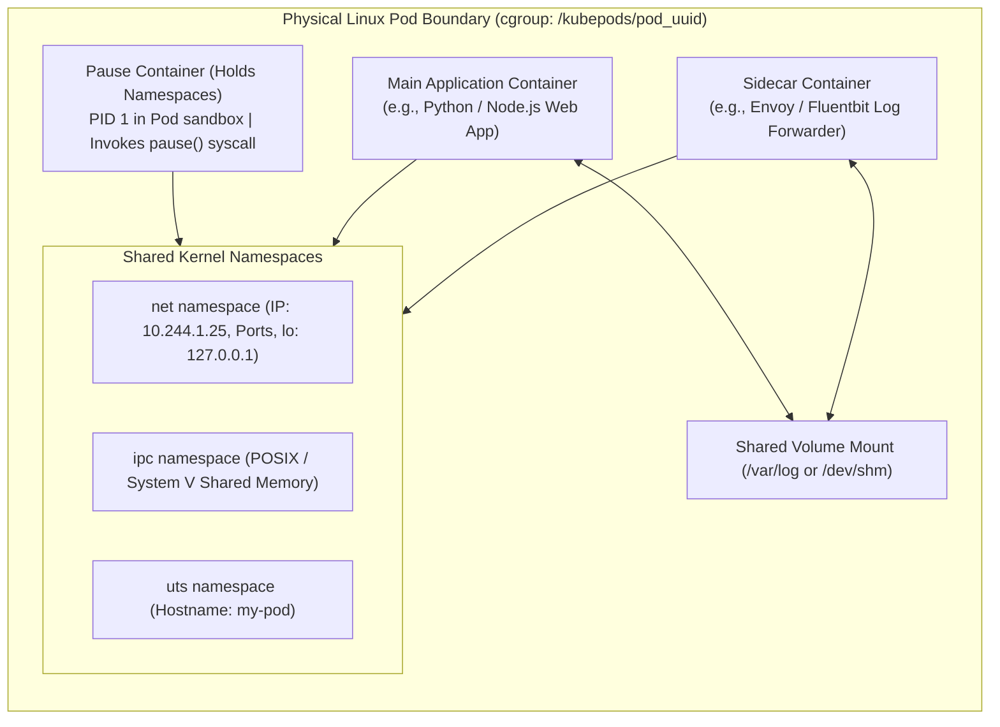
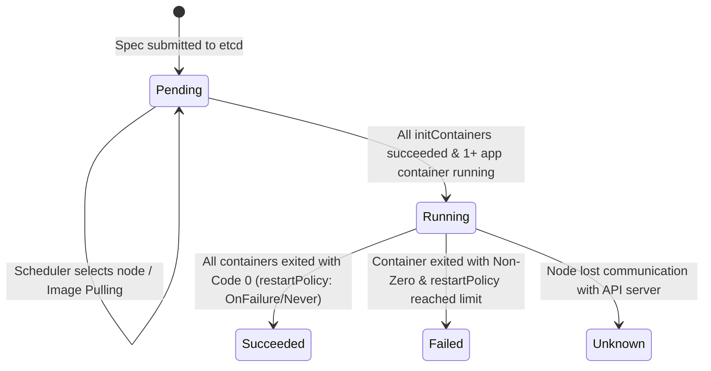
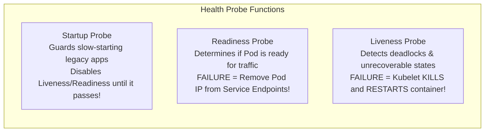
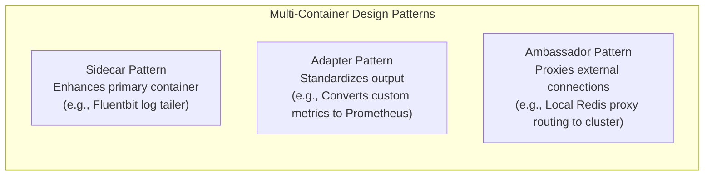

# 02. Pod Anatomy, Lifecycle & Container Runtime Interface (CRI)

> **Certification & Academic References:**
> - *Certified Kubernetes Application Developer (CKAD) Study Guide* (Chapter 2: Multi-Container Pods, Chapter 3: Pod Design) — Benjamin Muschko
> - *Certified Kubernetes Administrator (CKA) Study Guide* (Chapter 2: Workloads & Scheduling) — Benjamin Muschko
> - *Kubernetes in Action (2nd Edition)* (Chapter 3: Pods: Running Containers in Kubernetes) — Marko Lukša
> - *Container Security* (Chapter 2: Linux System Calls, Namespaces, and Control Groups) — Liz Rice (O'Reilly)

---

## 1. What is a Pod? The Linux Kernel Reality

In Kubernetes, the smallest deployable atomic unit of computing is not a Docker container—it is a **Pod**. A Pod is an abstraction wrapping one or more tightly coupled containers that share:
1. A single **Network Namespace** (identical IP address, loopback `127.0.0.1`, and port space).
2. A single **IPC Namespace** (POSIX shared memory, semaphores, message queues).
3. A single **UTS Namespace** (shared hostname).
4. Shared **Storage Volumes** mounted into container filesystems.



### 1.1 The Role of the `pause` Container (Pod Sandbox)
Every Pod running on a worker node has an invisible, ultra-lightweight infrastructure container running inside it: the **`pause` container** (compiled from a few lines of C code running `k8s.gcr.io/pause`):
- When the `kubelet` receives instructions to create a Pod, it calls the Container Runtime Interface (CRI) `RunPodSandbox` RPC.
- The runtime spins up the `pause` container first. The `pause` container calls the Linux `clone()` system call with namespace flags:
  ```c
  clone(..., CLONE_NEWNET | CLONE_NEWIPC | CLONE_NEWUTS | CLONE_NEWPID, ...);
  ```
- The `pause` process then executes `pause()`, putting itself to sleep permanently.
- All subsequent application containers in the Pod are launched joining the existing namespaces of this `pause` process (`setns()` syscall).
- **The Lifecycle Guarantee**: If the main application container crashes, dies, or restarts, **the network namespace and Pod IP do NOT die**! The IP address remains pinned to the running `pause` container, preventing connection resets on unaffected sidecars.

---

## 2. Pod Phase & Transition State Machine



### 2.1 Formal Pod Phases:
1. **`Pending`**: The Pod has been accepted by the API server, but one or more containers have not been created. This includes time spent waiting for the scheduler to assign a node, as well as time spent downloading container images over the network.
2. **`Running`**: The Pod has been bound to a node, all containers have been created, and at least one container is currently running or is in the process of starting or restarting.
3. **`Succeeded`**: All containers in the Pod have terminated successfully (exit code $0$) and will not be restarted. (Standard state for completed batch `Jobs`).
4. **`Failed`**: All containers in the Pod have terminated, and at least one container has terminated with a non-zero exit code or was stopped by the system.
5. **`Unknown`**: The state of the Pod cannot be obtained, typically due to communication failure between the `kubelet` and the API server.

---

## 3. Container Lifecycle Hooks & Termination Sequence

Kubernetes provides hooks to execute custom logic immediately after a container starts or immediately before it terminates:

```mermaid
sequenceDiagram
    participant Kubelet as kubelet Agent
    participant Cont as Container Process (PID 1)
    participant Hook as preStop Hook Script
    participant Endpoints as EndpointSlice Controller

    Note over Kubelet,Endpoints: Pod Deletion Initiated (kubectl delete pod)
    Kubelet->>Endpoints: 1. Pod marked Terminating; removed from Service endpoints
    Kubelet->>Hook: 2. Executes preStop hook (Blocking execution)
    Note over Hook: e.g., sleeps 10s, completes in-flight HTTP requests
    Hook->>Kubelet: preStop completes
    Kubelet->>Cont: 3. Sends SIGTERM signal (Signal 15)
    Note over Cont: Graceful shutdown (flush DB buffers, close sockets)
    Note over Kubelet: 4. Waits for terminationGracePeriodSeconds (default 30s)
    Kubelet->>Cont: 5. If still alive after grace period: Sends SIGKILL (Signal 9)!
    Cont->>Kubelet: Process destroyed
```

### 3.1 Production Zero-Downtime `preStop` Pattern
When a pod is deleted, there is a race condition between `kube-proxy` updating iptables rules and the application receiving `SIGTERM`. If the application shuts down immediately, incoming traffic routed during that $1\text{ to }3\text{ second}$ window receives `Connection Refused`!

```yaml
apiVersion: v1
kind: Pod
metadata:
  name: resilient-web
spec:
  terminationGracePeriodSeconds: 45
  containers:
  - name: web-app
    image: nginx:1.25
    lifecycle:
      preStop:
        exec:
          # Sleep gives kube-proxy / Ingress time to remove this pod from routing tables!
          command: ["/bin/sh", "-c", "sleep 15"]
```

---

## 4. Health Probes: Startup, Liveness, and Readiness

Kubernetes monitors container health through three distinct, specialized probes:



### 4.1 Probe Specifications Matrix

| Probe Type | Purpose | Consequence of Failure | Typical Use Case |
| :--- | :--- | :--- | :--- |
| **Startup Probe** | Validates initial application bootstrap. | Container is killed and restarted according to `restartPolicy`. | Loading $5\text{ GB}$ ML models or deep legacy Java JVM boot sequences. |
| **Readiness Probe**| Validates if container can accept network traffic. | **Container is NOT killed**. Pod IP is instantly removed from Service `EndpointSlices`. | App warming up caches, database migrations in progress. |
| **Liveness Probe** | Validates if container is alive and functioning. | **Container is KILLED** via `SIGKILL` and restarted by the `kubelet`. | Catching thread deadlocks where process is running but unresponsive. |

### 4.2 Production Probe Implementation

```yaml
apiVersion: v1
kind: Pod
metadata:
  name: probe-demo
spec:
  containers:
  - name: api
    image: my-service:v2.1
    ports:
    - containerPort: 8080
    
    # 1. Startup Probe: Allows up to 30 * 5 = 150 seconds to boot
    startupProbe:
      httpGet:
        path: /healthz/startup
        port: 8080
      failureThreshold: 30
      periodSeconds: 5

    # 2. Readiness Probe: Checked every 5s after startup succeeds
    readinessProbe:
      httpGet:
        path: /healthz/ready
        port: 8080
      initialDelaySeconds: 2
      periodSeconds: 5
      failureThreshold: 2

    # 3. Liveness Probe: Kills container if it fails 3 times consecutively
    livenessProbe:
      httpGet:
        path: /healthz/liveness
        port: 8080
      periodSeconds: 10
      timeoutSeconds: 3
      failureThreshold: 3
```

---

## 5. Multi-Container Design Patterns (CKAD Exam Core)

Pods allow collocating multiple containers that share lifecycles and storage:



### 5.1 Native Sidecar Containers (Kubernetes 1.28+)
Historically, `initContainers` completed before application containers started. In Kubernetes 1.28+, setting `restartPolicy: Always` on an `initContainer` transforms it into a **Native Sidecar Container**:
- Starts **before** main application containers.
- Continues running for the entire lifetime of the Pod.
- Terminates **after** main application containers have shut down.

```yaml
apiVersion: v1
kind: Pod
metadata:
  name: native-sidecar-demo
spec:
  initContainers:
  - name: vault-agent-proxy
    image: hashicorp/vault:1.15
    restartPolicy: Always  # Designates this as a native sidecar!
    args: ["agent", "-config=/etc/vault/vault-agent-config.hcl"]
  containers:
  - name: business-app
    image: my-app:v1
```

### 5.2 Ephemeral Debug Containers (CKA Diagnostic Workflow)
When an application container runs on a distroless base image (no `bash`, `curl`, or `gdb`), developers can inject an **Ephemeral Container** without restarting the pod:

```bash
# Attach a debug container sharing the target container's process namespace
kubectl debug -it target-pod --image=nicolaka/netshoot --target=web-app
```

---

## 6. Container Exit Codes & Diagnostic Triage

When containers fail, the `kubelet` logs their exit status in `kubectl describe pod`:

| Exit Code | Signal / Meaning | Root Cause & Resolution |
| :--- | :--- | :--- |
| **`0`** | Normal Exit | Process completed successfully (expected for Jobs). |
| **`1`** | General Error | Application code unhandled exception, syntax error, missing file. |
| **`126`** | Command Invoked Cannot Execute | Permission denied on entrypoint binary (`chmod +x entrypoint.sh`). |
| **`127`** | File or Command Not Found | Executable specified in `command:` does not exist in container image `PATH`. |
| **`137`** | **SIGKILL ($128 + 9$)** | **OOMKilled!** Process exceeded its `resources.limits.memory` and was terminated by the Linux kernel Out-Of-Memory Killer. |
| **`139`** | **SIGSEGV ($128 + 11$)**| Segmentation fault; illegal memory access in native binary (C/C++, Rust, Go). |
| **`143`** | **SIGTERM ($128 + 15$)**| Graceful shutdown initiated by Kubernetes during eviction, scale-down, or node drain. |

---

## 7. Container Runtime Interface (CRI) Deep Dive

The **CRI** is a standardized gRPC interface decoupled from the `kubelet`, allowing pluggable container engines:

```
kubelet (gRPC Client)
      |
      | Unix Domain Socket (/run/containerd/containerd.sock)
      v
containerd (CRI Plugin Daemon)
      |
      +---> RuntimeService RPCs: RunPodSandbox, CreateContainer, StartContainer
      +---> ImageService RPCs:   PullImage, ListImages, RemoveImage
      |
      v
containerd-shim (1 lightweight process per container)
      |
      v
runc (OCI Reference Implementation)
      |
      v (Linux clone() with namespaces and cgroup writes)
Application Container Process (PID 1)
```

- **`containerd-shim`**: Serves as the parent process to the container. It holds open standard I/O pipes (stdin/stdout/stderr) and exits codes even if the main `containerd` daemon is restarted or upgraded, preventing container restarts during host maintenance!
- **`crictl`**: The official CLI for debugging CRI runtimes directly on worker nodes when the `kubelet` fails:
  ```bash
  # List all running container sandboxes (Pods) on this node
  crictl pods

  # Inspect logs directly from container runtime
  crictl logs <container-id>

  # Execute interactive shell inside runtime container
  crictl exec -it <container-id> /bin/sh
  ```
