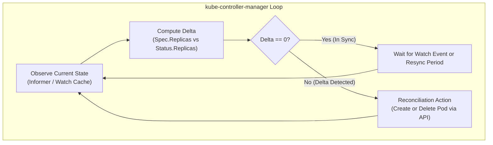
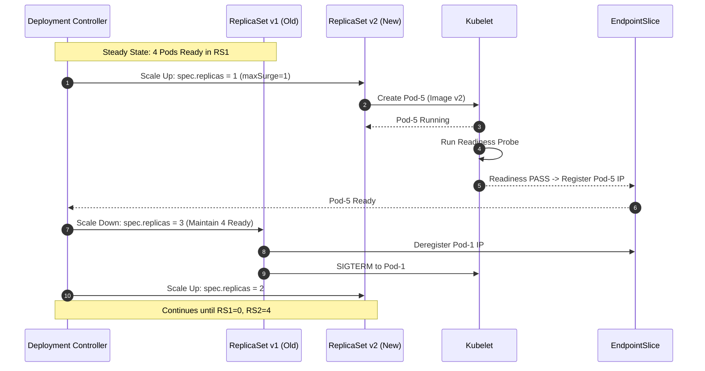

# Chapter 03: Workload Controllers — Deployments, StatefulSets, DaemonSets & Batch Jobs

> "Controllers are the core of Kubernetes. In Kubernetes, a controller is a control loop that watches the shared state of the cluster through the API server and makes changes attempting to move the current state towards the desired state."  
> — *Brendan Burns, Joe Beda, Kelsey Hightower, Lachlan Evenson, Kubernetes: Up and Running (3rd Ed)*
>
> "StatefulSets are valuable for applications that require one or more of the following: stable, unique network identifiers, stable, persistent storage, ordered, graceful deployment and scaling, and ordered, automated rolling updates."  
> — *Benjamin Muschko, Certified Kubernetes Administrator (CKA) Study Guide*

---

## 🧭 1. The Controller Pattern & Declarative Reconcilers

In Kubernetes, users and client systems never manage raw, naked Pods directly in production. If a bare Pod crashes, runs out of memory (OOMKilled), or its underlying node experiences hardware or network partition failure, the Pod dies permanently. The `kube-scheduler` will never rebind or restart an orphaned Pod.

To provide **self-healing, declarative scaling, rolling upgrades, and zero-downtime rollbacks**, Kubernetes implements the **Controller Pattern**.

```
===================================================================================================
                                  THE RECONCILIATION CONTROL LOOP
===================================================================================================

    +-----------------------------------------------------------------------------------------+
    |                                kube-controller-manager                                  |
    |                                                                                         |
    |      +---------------------+        +--------------------+        +------------------+  |
    |      |       OBSERVE       | -----> |     DIFFERENCE     | -----> |       ACT        |  |
    |      |  Read Current State |        | Compare Current vs |        | Execute Mutation |  |
    |      |     from etcd       |        |   Desired Spec     |        |   via API POST   |  |
    |      +---------------------+        +--------------------+        +------------------+  |
    |                 ^                                                           |           |
    +-----------------|-----------------------------------------------------------|-----------+
                      | Watch Event                                               | Mutate
                      v                                                           v
    +-----------------------------------------------------------------------------------------+
    |                                     kube-apiserver                                      |
    |                                                                                         |
    |             Current State: 2 Pods                    Desired State: 3 Replicas          |
    +-----------------------------------------------------------------------------------------+
```



### 1.1 Edge-Triggered vs. Level-Triggered Architecture
A foundational distributed systems design choice inside Kubernetes is being **Level-Triggered** rather than **Edge-Triggered**:
- **Edge-Triggered Systems:** React exclusively to state transitions or discrete event messages (e.g., *"Pod X terminated"*). If an edge event is dropped due to network partition or controller crash, the system remains in a broken state until another event fires.
- **Level-Triggered Systems (Kubernetes):** Continuously inspect the *current level* (actual state) against the *desired level* (target state). Even if network packets or API watch events are lost, the periodic resync loop (`syncLoop`) guarantees eventual consistency:
$$\Delta = \text{DesiredState} - \text{CurrentState}$$
If $\Delta > 0$, the controller provisions $\Delta$ new Pods. If $\Delta < 0$, it terminates $|\Delta|$ Pods based on deterministic eviction priority.

### 1.2 Object Ownership & Garbage Collection
Kubernetes controllers establish parental ownership using `metadata.ownerReferences`. Every ReplicaSet spawned by a Deployment contains an `ownerReference` pointing to that Deployment's UID:

```yaml
metadata:
  ownerReferences:
  - apiVersion: apps/v1
    kind: Deployment
    name: order-service
    uid: 5f9e83b4-1c2e-4b67-8e3d-0b7c4f52981a
    controller: true
    blockOwnerDeletion: true
```

#### Cascading Deletion Semantics:
When a parent workload is deleted (`kubectl delete deployment order-service`), the API server garbage collector enforces one of three cascading strategies (`--cascade`):
1. **`Background` (Default):** Deletes the owner immediately. The garbage collector searches for dependent objects with matching `ownerReferences` in the background and deletes them asynchronously.
2. **`Foreground`:** The owner object enters a `deletionTimestamp` state and receives the `foregroundDeletion` finalizer. It remains visible in etcd until all child Pods and ReplicaSets are completely terminated.
3. **`Orphan` (`--cascade=orphan`):** Strips the `ownerReferences` from child ReplicaSets/Pods and deletes only the parent object. Pods continue running untouched.

---

## 🚀 2. Deployments & RollingUpdate Mathematics

A **Deployment** is a declarative supervisor for stateless workloads. Deployments do not create or manage Pods directly; they manage **ReplicaSets**, which in turn manage Pods.

```
===================================================================================================
                                   DEPLOYMENT WORKLOAD HIERARCHY
===================================================================================================

                    +---------------------------------------------------+
                    |                    Deployment                     |
                    |     spec.replicas: 4 | spec.strategy: RollingUp   |
                    +-------------------------+-------------------------+
                                              |
                   +--------------------------+--------------------------+
                   | (Active Revision: v2)                               | (Old Revision: v1)
                   v                                                     v
    +------------------------------+                      +------------------------------+
    |       ReplicaSet (v2)        |                      |       ReplicaSet (v1)        |
    |     pod-template-hash=74f9d  |                      |     pod-template-hash=86b3a  |
    |     spec.replicas: 4         |                      |     spec.replicas: 0         |
    +--------------+---------------+                      +------------------------------+
                   |
       +-----------+-----------+-----------+
       |           |           |           |
       v           v           v           v
    +-----+     +-----+     +-----+     +-----+
    | Pod |     | Pod |     | Pod |     | Pod |
    +-----+     +-----+     +-----+     +-----+
```

### 2.1 Rolling Update Mathematical Invariants
A zero-downtime rolling update operates according to two constraints defined under `spec.strategy.rollingUpdate`:
1. **`maxSurge`:** The maximum number or percentage of Pods that can be provisioned *above* the desired replica count. (Rounded **UP** to nearest integer for percentages: $\lceil \text{replicas} \times \text{maxSurge} \rceil$).
2. **`maxUnavailable`:** The maximum number or percentage of Pods that can be unavailable during the update. (Rounded **DOWN** to nearest integer for percentages: $\lfloor \text{replicas} \times \text{maxUnavailable} \rfloor$).

#### Fundamental Production Invariants:
For any desired replica count $R$, at any given second $t$ of the rollout:
$$\text{Max Pods Alive}(t) = R + \text{maxSurge}$$
$$\text{Min Available Pods}(t) = R - \text{maxUnavailable}$$

#### Surge & Unavailable Permutation Analysis:

| Scenario | Replicas ($R$) | `maxSurge` | `maxUnavailable` | Max Pods During Rollout | Min Ready Pods Guaranteed | Use Case |
| :--- | :--- | :--- | :--- | :--- | :--- | :--- |
| **Strict Zero Downtime** | $4$ | $25\%$ ($1$) | $0$ ($0$) | $5$ | $4$ (100% capacity) | E-commerce checkout, payment gateways, low latency APIs |
| **Constrained Compute** | $4$ | $0$ ($0$) | $25\%$ ($1$) | $4$ | $3$ (75% capacity) | Bare-metal clusters with zero spare CPU/RAM headroom |
| **Aggressive Fast Rollout** | $10$ | $50\%$ ($5$) | $25\%$ ($2$) | $15$ | $8$ (80% capacity) | Massive microservices with stateless idempotent requests |
| **Recreate Strategy** | $N$ | N/A | N/A | $0$ during transition | $0$ (Total outage) | Incompatible DB schema migrations or legacy stateful singletons |

### 2.2 Rolling Update State Machine Execution
Consider a Deployment with $R=4$, `maxSurge=1`, `maxUnavailable=0`:

```
===================================================================================================
                       STEP-BY-STEP ROLLING UPDATE STATE MACHINE
===================================================================================================

  [T0: Steady State]
    RS-v1 (Replicas: 4, Ready: 4)  ===> [Pod-1: Ready] [Pod-2: Ready] [Pod-3: Ready] [Pod-4: Ready]
    RS-v2 (Replicas: 0, Ready: 0)

  [T1: Image Update Triggered -> Max Allowed = 4 + 1 = 5]
    RS-v1 (Replicas: 4, Ready: 4)  ===> [Pod-1] [Pod-2] [Pod-3] [Pod-4]
    RS-v2 (Replicas: 1, Ready: 0)  ===> [Pod-5: ContainerCreating]

  [T2: Pod-5 Passes Readiness Probe -> Available = 5]
    RS-v1 (Replicas: 4, Ready: 4)  ===> [Pod-1] [Pod-2] [Pod-3] [Pod-4]
    RS-v2 (Replicas: 1, Ready: 1)  ===> [Pod-5: READY] (Traffic routed via EndpointSlice)

  [T3: Controller Scales Down RS-v1 to 3 -> Available = 4]
    RS-v1 (Replicas: 3, Ready: 3)  ===> [Pod-1: Terminating] [Pod-2] [Pod-3] [Pod-4]
    RS-v2 (Replicas: 1, Ready: 1)  ===> [Pod-5: READY]

  [T4: Next Surge -> RS-v2 Scales to 2]
    RS-v1 (Replicas: 3, Ready: 3)  ===> [Pod-2] [Pod-3] [Pod-4]
    RS-v2 (Replicas: 2, Ready: 1)  ===> [Pod-5: READY] [Pod-6: ContainerCreating]

  ... Cycles repeat sequentially until RS-v1 = 0 and RS-v2 = 4 ...

  [T_Final: Steady State v2]
    RS-v1 (Replicas: 0, Ready: 0)  ===> Retained in history for instant rollback
    RS-v2 (Replicas: 4, Ready: 4)  ===> [Pod-5] [Pod-6] [Pod-7] [Pod-8]
===================================================================================================
```



### 2.3 The `pod-template-hash` Mechanism
How does the Deployment controller prevent collisions between Pods of different revisions?
When a Deployment creates a ReplicaSet, it computes a 32-bit FNV-1a hash of the entire `spec.template` object and appends it to:
1. The ReplicaSet name: `order-service-74f9d6c8b`
2. The Pod label: `pod-template-hash: "74f9d6c8b"`
3. The Pod selector: `matchLabels: {app: order-service, pod-template-hash: "74f9d6c8b"}`

> [!WARNING]
> Never manually edit or add the `pod-template-hash` label on a Pod. If you do, the Deployment controller will lose track of the Pod or trigger an endless reconcile loop.

### 2.4 Production Deployment Manifest
```yaml
apiVersion: apps/v1
kind: Deployment
metadata:
  name: order-service
  namespace: ecommerce
  labels:
    app.kubernetes.io/name: order-service
    app.kubernetes.io/part-of: checkout-platform
    app.kubernetes.io/version: "2.4.1"
spec:
  replicas: 4
  revisionHistoryLimit: 10 # Retain last 10 ReplicaSets for rollback
  minReadySeconds: 15     # Pod must stay Ready for 15s before treated as healthy
  progressDeadlineSeconds: 600 # Abort and mark Failed after 10m of stuck progress
  strategy:
    type: RollingUpdate
    rollingUpdate:
      maxSurge: 25%         # +1 Pod during rollout
      maxUnavailable: 0     # Strictly zero dropped requests
  selector:
    matchLabels:
      app: order-service
  template:
    metadata:
      labels:
        app: order-service
    spec:
      terminationGracePeriodSeconds: 60
      containers:
      - name: order-api
        image: internal-registry.enterprise.io/checkout/order-api:v2.4.1
        imagePullPolicy: IfNotPresent
        ports:
        - name: http
          containerPort: 8080
        lifecycle:
          preStop:
            exec:
              command: ["/bin/sh", "-c", "sleep 15"] # Drain inflight network packets
        readinessProbe:
          httpGet:
            path: /healthz/ready
            port: 8080
          initialDelaySeconds: 5
          periodSeconds: 5
          successThreshold: 1
          failureThreshold: 3
        livenessProbe:
          httpGet:
            path: /healthz/live
            port: 8080
          initialDelaySeconds: 15
          periodSeconds: 10
          failureThreshold: 3
        resources:
          requests:
            cpu: "500m"
            memory: "512Mi"
          limits:
            cpu: "2000m"
            memory: "1Gi"
```

### 2.5 Rollout Management & Rollback Internals
Deployments maintain a revision log using the `ReplicaSet` specs stored in etcd:

```bash
# 1. Check current rollout progression
kubectl rollout status deployment/order-service -n ecommerce

# 2. View revision history
kubectl rollout history deployment/order-service -n ecommerce

# 3. View details of a specific revision
kubectl rollout history deployment/order-service --revision=2 -n ecommerce

# 4. Emergency pause (freezes current rollout state)
kubectl rollout pause deployment/order-service -n ecommerce

# 5. Resume paused rollout
kubectl rollout resume deployment/order-service -n ecommerce

# 6. Instant rollback to immediate previous revision
kubectl rollout undo deployment/order-service -n ecommerce

# 7. Rollback to a specific target revision
kubectl rollout undo deployment/order-service --to-revision=1 -n ecommerce
```

---

## 🏛️ 3. StatefulSets: Identity, Ordinals & Storage Topologies

Stateless deployments treat Pods as anonymous cattle: Pods receive random alphanumeric hashes (`order-service-78f4b-abc12`), dynamic IPs that change on every restart, and share no sticky identity or dedicated disk.

However, distributed stateful clusters (**Apache Kafka, ZooKeeper, Elasticsearch, Cassandra, PostgreSQL Primary/Replica, CockroachDB**) require three hard guarantees:
1. **Stable Network Identity:** Each node must possess a persistent, predictable hostname that survives rescheduling across physical hosts.
2. **Dedicated Persistent Volume Binding:** Each replica requires dedicated storage that permanently follows that specific identity. If replica 1 crashes, its replacement must rebind to volume 1, never volume 0 or volume 2.
3. **Deterministic Ordering:** Nodes must initialize in ascending order ($0 \to 1 \to 2$) and terminate in descending order ($2 \to 1 \to 0$).

```
===================================================================================================
                                  STATEFULSET TOPOLOGY & STORAGE
===================================================================================================

    Headless Service: `clusterIP: None` (serviceName: "zk-hs")
    DNS Domain: zk-hs.datastore.svc.cluster.local
           │
           ├────► Pod [zk-0]  ====== binds to ======>  PVC [data-zk-0]  ──►  PV-0 (AWS EBS 50Gi)
           │      DNS: zk-0.zk-hs.datastore.svc.cluster.local
           │
           ├────► Pod [zk-1]  ====== binds to ======>  PVC [data-zk-1]  ──►  PV-1 (AWS EBS 50Gi)
           │      DNS: zk-1.zk-hs.datastore.svc.cluster.local
           │
           └────► Pod [zk-2]  ====== binds to ======>  PVC [data-zk-2]  ──►  PV-2 (AWS EBS 50Gi)
                  DNS: zk-2.zk-hs.datastore.svc.cluster.local
```

### 3.1 Headless Service & DNS Resolution
A StatefulSet **mandates** a companion **Headless Service** (`clusterIP: None`).
Because a Headless Service allocates no virtual ClusterIP, CoreDNS generates direct `A`/`AAAA` and `SRV` records pointing directly to the individual Pod IPs:

$$\text{Pod FQDN} = \langle \text{pod-name}\rangle.\langle \text{service-name}\rangle.\langle \text{namespace}\rangle\text{.svc.cluster.local}$$

Example:
- `kafka-0.kafka-headless.kafka.svc.cluster.local` $\longrightarrow$ `10.244.1.15`
- `kafka-1.kafka-headless.kafka.svc.cluster.local` $\longrightarrow$ `10.244.2.22`
- `kafka-2.kafka-headless.kafka.svc.cluster.local` $\longrightarrow$ `10.244.3.18`

Peers use these immutable DNS names in configuration files (e.g., `zookeeper.connect=zk-0.zk-hs:2181,zk-1.zk-hs:2181,zk-2.zk-hs:2181`).

### 3.2 Volume Claim Templates Dynamic Provisioning
Unlike Deployments which reference existing PersistentVolumeClaims, a StatefulSet uses `volumeClaimTemplates`.
The StatefulSet controller dynamically generates a dedicated PVC for each replica:
$$\text{PVC Name} = \langle \text{template-name}\rangle\text{-}\langle \text{pod-name}\rangle$$
If template name is `datadir` and the StatefulSet is `cassandra`, PVCs created are:
- `datadir-cassandra-0`
- `datadir-cassandra-1`
- `datadir-cassandra-2`

> [!CAUTION]
> **Storage Retention on Scale Down:** When a StatefulSet is scaled down from 3 to 1 replica, the Pods `cassandra-2` and `cassandra-1` are terminated, but **their PVCs and PVs are NEVER deleted automatically**. This prevents catastrophic data loss.
> In Kubernetes v1.27+, you can configure `spec.persistentVolumeClaimRetentionPolicy` (`whenDeleted: Retain`, `whenScaled: Delete`).

### 3.3 StatefulSet Update Strategies & Partitioning
StatefulSets support two update strategies under `spec.updateStrategy.type`:
1. **`OnDelete`:** The controller does not automatically update Pods when `spec.template` is modified. Users must manually delete individual Pods to trigger recreation on the new image.
2. **`RollingUpdate`:** Automatically updates Pods in reverse ordinal order ($(N-1) \to 0$), waiting for each Pod to become `Running` and `Ready` before updating the next.

#### The `partition` Canary Pattern:
StatefulSets provide a built-in canary deployment mechanism via `rollingUpdate.partition`:

```yaml
spec:
  updateStrategy:
    type: RollingUpdate
    rollingUpdate:
      partition: 2
```
- When `partition: 2` is set on a StatefulSet with 4 replicas ($0, 1, 2, 3$):
  - Pods with ordinal $\ge 2$ ($3$ and $2$) are updated to the new template.
  - Pods with ordinal $< 2$ ($0$ and $1$) remain on the previous version!
- If the canary passes verification, setting `partition: 0` completes the rollout across all ordinals.

### 3.4 Production StatefulSet Manifest (Clustered PostgreSQL)
```yaml
apiVersion: v1
kind: Service
metadata:
  name: postgres-headless
  namespace: database
  labels:
    app: postgres
spec:
  clusterIP: None
  ports:
  - port: 5432
    name: postgresql
  selector:
    app: postgres
---
apiVersion: apps/v1
kind: StatefulSet
metadata:
  name: postgres
  namespace: database
spec:
  serviceName: "postgres-headless"
  replicas: 3
  podManagementPolicy: OrderedReady # Enforces strict sequential initialization
  updateStrategy:
    type: RollingUpdate
    rollingUpdate:
      partition: 0
  selector:
    matchLabels:
      app: postgres
  template:
    metadata:
      labels:
        app: postgres
    spec:
      containers:
      - name: postgresql
        image: postgres:16.2-alpine
        env:
        - name: POD_NAME
          valueFrom:
            fieldRef:
              fieldPath: metadata.name
        - name: PGDATA
          value: /var/lib/postgresql/data/pgdata
        ports:
        - containerPort: 5432
          name: postgresql
        volumeMounts:
        - name: datadir
          mountPath: /var/lib/postgresql/data
  volumeClaimTemplates:
  - metadata:
      name: datadir
    spec:
      accessModes: [ "ReadWriteOnce" ]
      storageClassName: "gp3-encrypted"
      resources:
        requests:
          storage: 100Gi
```

---

## 🛡️ 4. DaemonSets: Node-Level Infrastructure Workloads

A **DaemonSet** guarantees that an exact single copy of a Pod runs on all (or a selected subset of) worker nodes in the cluster. As worker nodes are added or removed, the DaemonSet controller automatically scales Pods up or down.

```
===================================================================================================
                                       DAEMONSET TOPOLOGY
===================================================================================================

                            +-----------------------------------------+
                            |       DaemonSet: fluentbit-shipper      |
                            +--------------------+--------------------+
                                                 |
                         +-----------------------+-----------------------+
                         |                       |                       |
                         v                       v                       v
               +-------------------+   +-------------------+   +-------------------+
               |   Worker Node 1   |   |   Worker Node 2   |   |   Worker Node 3   |
               | +---------------+ |   | +---------------+ |   | +---------------+ |
               | | fluentbit-pod | |   | | fluentbit-pod | |   | | fluentbit-pod | |
               | +---------------+ |   | +---------------+ |   | +---------------+ |
               +-------------------+   +-------------------+   +-------------------+
```

### 4.1 DaemonSet Scheduling Internals
Historically, the DaemonSet controller directly populated `spec.nodeName` on Pod creation, bypassing the `kube-scheduler`.
In modern Kubernetes, the DaemonSet controller respects the standard scheduling pipeline:
1. The DaemonSet controller creates the Pod with a `spec.affinity.nodeAffinity` targeting the specific node:
   ```yaml
   nodeAffinity:
     requiredDuringSchedulingIgnoredDuringExecution:
       nodeSelectorTerms:
       - matchFields:
         - key: metadata.name
           operator: In
           values: ["worker-node-01"]
   ```
2. The standard `kube-scheduler` binds the Pod, ensuring that node resource availability, priority classes, and scheduler plugins are fully respected.

### 4.2 Control Plane Taints & Critical Infrastructure
By default, control-plane nodes have taints preventing regular application Pods from running:
`node-role.kubernetes.io/control-plane:NoSchedule`.
System DaemonSets (e.g., Calico/Cilium CNI, `kube-proxy`, Falco security agents) must specify explicit tolerations:

```yaml
tolerations:
- key: node-role.kubernetes.io/control-plane
  operator: Exists
  effect: NoSchedule
- key: node.kubernetes.io/not-ready
  operator: Exists
  effect: NoExecute
```

### 4.3 Production DaemonSet Manifest (Prometheus Node-Exporter)
```yaml
apiVersion: apps/v1
kind: DaemonSet
metadata:
  name: node-exporter
  namespace: monitoring
  labels:
    app.kubernetes.io/name: node-exporter
spec:
  selector:
    matchLabels:
      app: node-exporter
  updateStrategy:
    type: RollingUpdate
    rollingUpdate:
      maxUnavailable: 1 # At most 1 node without an active exporter during upgrade
  template:
    metadata:
      labels:
        app: node-exporter
    spec:
      hostNetwork: true
      hostPID: true
      tolerations:
      - operator: "Exists" # Tolerate all taints to run on EVERY node including control planes
      containers:
      - name: node-exporter
        image: prom/node-exporter:v1.7.0
        args:
        - "--path.procfs=/host/proc"
        - "--path.sysfs=/host/sys"
        - "--path.rootfs=/host/root"
        ports:
        - containerPort: 9100
          hostPort: 9100
          name: metrics
        volumeMounts:
        - name: proc
          mountPath: /host/proc
          readOnly: true
        - name: sys
          mountPath: /host/sys
          readOnly: true
        - name: root
          mountPath: /host/root
          readOnly: true
        resources:
          requests:
            cpu: "50m"
            memory: "64Mi"
          limits:
            cpu: "200m"
            memory: "128Mi"
      volumes:
      - name: proc
        hostPath:
          path: /proc
      - name: sys
        hostPath:
          path: /sys
      - name: root
        hostPath:
          path: /
```

---

## ⏱️ 5. Batch Workloads: Jobs & CronJobs (CKAD Core)

Not all cloud workloads run indefinitely as background services. Database schema migrations, daily reporting ETL pipelines, and distributed ML preprocessing jobs require **run-to-completion** guarantees.

### 5.1 The Job Controller
A **Job** creates one or more Pods and ensures that a specified number of them terminate with exit code `0` (Success). If a Pod fails (non-zero exit code), the controller creates a new replacement Pod until the desired success count is reached.

#### Job Execution Patterns:

| Pattern | `completions` | `parallelism` | Description |
| :--- | :--- | :--- | :--- |
| **One-shot Job** | `1` | `1` | A single Pod runs to completion (e.g., `alembic upgrade head`). |
| **Fixed Completion Count** | $N$ | $M$ | Total of $N$ Pods must succeed, with at most $M$ running concurrently. |
| **Work Queue Job** | `1` (or unset) | $M$ | Worker Pods pull tasks from RabbitMQ/SQS until queue is empty; coordinate among themselves. |
| **Indexed Job** | $N$ | $M$ | Each Pod receives a unique index ($0 \dots N-1$) in `JOB_COMPLETION_INDEX` (Distributed ML/data chunking). |

### 5.2 Job Specification & Production Parameters
- **`completions`:** Total number of successful Pod terminations required.
- **`parallelism`:** Maximum number of Pods allowed to run concurrently.
- **`backoffLimit`:** Maximum retry count before marking the entire Job as Failed (Default: 6). Retries use exponential backoff delay ($10\text{s}, 20\text{s}, 40\text{s} \dots$).
- **`activeDeadlineSeconds`:** Hard timeout cap for the entire Job lifespan. If exceeded, all running Pods are terminated immediately.
- **`ttlSecondsAfterFinished`:** Automatic cleanup TTL. Cleans up finished Jobs and their Pods from etcd after $N$ seconds.

```yaml
apiVersion: batch/v1
kind: Job
metadata:
  name: image-indexer
  namespace: processing
spec:
  completions: 6
  parallelism: 2
  backoffLimit: 4
  activeDeadlineSeconds: 1800 # 30-minute hard ceiling
  ttlSecondsAfterFinished: 300 # Purge job and pods 5 minutes after completion
  completionMode: Indexed     # Each pod gets 0, 1, 2, 3, 4, 5
  template:
    metadata:
      labels:
        job: image-indexer
    spec:
      restartPolicy: OnFailure # Job templates MUST use OnFailure or Never, NEVER Always!
      containers:
      - name: indexer
        image: python:3.11-slim
        command:
        - "python"
        - "-c"
        - "import os; print(f'Processing shard {os.environ[\"JOB_COMPLETION_INDEX\"]}')"
        resources:
          requests:
            cpu: "250m"
            memory: "256Mi"
```

> [!IMPORTANT]
> **`restartPolicy` Invariant:**
> Unlike Deployments and StatefulSets which mandate `restartPolicy: Always`, a Job Pod template **strictly prohibits** `Always`. You must set `restartPolicy: OnFailure` or `restartPolicy: Never`.
> - `OnFailure`: The kubelet restarts the failed container *in the same Pod* without creating a new Pod.
> - `Never`: The kubelet does not restart the container; the Job controller creates a brand-new Pod.

### 5.3 CronJobs: Distributed Periodic Scheduling
A **CronJob** manages the lifecycle of Jobs based on standard 5-field cron time expressions:

$$\text{Minute} \quad \text{Hour} \quad \text{Day-of-Month} \quad \text{Month} \quad \text{Day-of-Week}$$

#### Concurrency Policies:
- **`concurrencyPolicy: Allow` (Default):** The CronJob starts a new Job even if the previous execution is still running.
- **`concurrencyPolicy: Forbid`:** If a Job is still executing when the next interval arrives, the new run is **skipped**. Essential for financial settlements, database backups, and non-reentrant sync scripts!
- **`concurrencyPolicy: Replace`:** If a previous run is still active, the old Job is cancelled and replaced with the new one.

#### The `startingDeadlineSeconds` Safety Valve:
If the `kube-controller-manager` is down or uncoordinated during scheduled trigger times:
- If `startingDeadlineSeconds` is unset, and more than 100 missed schedule events have accumulated, the CronJob **permanently halts execution** and writes an error to the event log.
- Setting `startingDeadlineSeconds: 200` ensures that as long as the controller recovers within 200 seconds of the missed window, the missed run will still execute.

```yaml
apiVersion: batch/v1
kind: CronJob
metadata:
  name: database-backup
  namespace: storage
spec:
  schedule: "0 2 * * *" # Every day at 02:00 AM UTC
  timeZone: "Etc/UTC"   # Kubernetes 1.27+ native timezone support
  concurrencyPolicy: Forbid
  startingDeadlineSeconds: 300
  successfulJobsHistoryLimit: 3 # Retain last 3 successful jobs
  failedJobsHistoryLimit: 5     # Retain last 5 failed jobs for root cause analysis
  jobTemplate:
    spec:
      backoffLimit: 2
      template:
        spec:
          restartPolicy: OnFailure
          containers:
          - name: pg-dump
            image: internal/backup-tool:v1.2
            command: ["/bin/sh", "-c", "/scripts/backup.sh"]
            resources:
              requests:
                cpu: "500m"
                memory: "512Mi"
```

---

## 🎯 6. CKA & CKAD Hands-on Exam Speed Tactics

In both the CKA and CKAD exams, speed and accuracy in manipulating workload controllers are decisive. Never write full manifests by hand from memory. Use the imperative generator commands.

### 6.1 Fast Imperative Generation Cheat Sheet
```bash
# 1. Generate Deployment YAML template
kubectl create deployment web --image=nginx:1.25 --replicas=3 --dry-run=client -o yaml > deploy.yaml

# 2. Update Deployment image imperatively (Instant trigger)
kubectl set image deployment/web nginx=nginx:1.26 --record

# 3. Scale deployment
kubectl scale deployment web --replicas=5

# 4. Generate a one-shot Job template
kubectl create job my-job --image=busybox --dry-run=client -o yaml -- /bin/sh -c "echo Job Completed" > job.yaml

# 5. Generate CronJob template
kubectl create cronjob daily-report --image=busybox --schedule="0 0 * * *" --dry-run=client -o yaml -- date > cron.yaml

# 6. Autoscale Deployment with HPA imperatively
kubectl autoscale deployment web --min=2 --max=10 --cpu-percent=80
```

### 6.2 Common Workload Pitfalls & Diagnostic Guide

| Failure Scenario | Root Cause | Immediate Diagnostic Command | Remediating Action |
| :--- | :--- | :--- | :--- |
| **`ImagePullBackOff` during rollout** | Typo in image name, private registry auth failure, or missing secret. | `kubectl describe pod <pod-name>` | Fix image tag or configure `imagePullSecrets`. Use `kubectl rollout undo` to revert. |
| **Rollout hangs indefinitely** | `readinessProbe` failing or `maxUnavailable: 0` blocking teardown of old pods. | `kubectl rollout status deploy/<name>`<br/>`kubectl get pods -l app=<name>` | Check probe endpoints via `kubectl logs` and `describe`. Adjust probe thresholds or fix app config. |
| **Selector Immutability Error** | Attempting to edit `spec.selector.matchLabels` on an existing Deployment. | `kubectl apply -f deploy.yaml` returns `field is immutable`. | Selectors cannot be updated on existing Deployments. Must delete with `--cascade=orphan` and recreate. |
| **StatefulSet Pod stuck in `Terminating`** | Node network partition; controller enforces "at most one" semantic. | `kubectl get nodes`<br/>`kubectl describe pod <pod>` | Never force delete (`--force --grace-period=0`) unless you have confirmed the physical node is dead or fenced! |
| **CronJob stops scheduling** | Missed over 100 schedule intervals without `startingDeadlineSeconds`. | `kubectl describe cronjob <name>` | Recreate the CronJob and add `startingDeadlineSeconds: 300`. |
