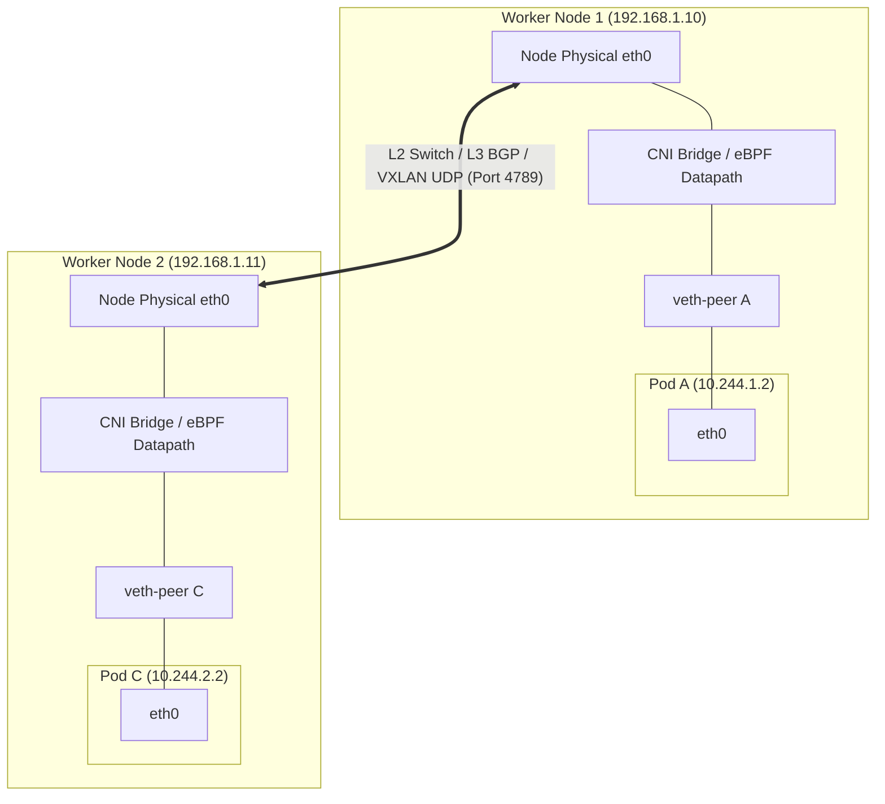
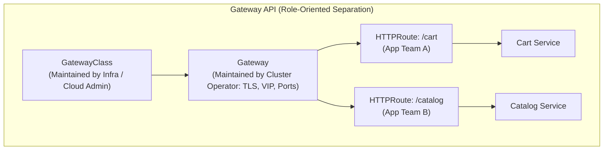

# Chapter 04: Networking Deep Dive — CNI, Services, kube-proxy & Ingress

> "The Kubernetes network model makes a fundamental assumption: every pod has its own unique IP address, and every pod can communicate with every other pod without Network Address Translation (NAT), regardless of which node they are scheduled on."  
> — *Marko Lukša, Kubernetes in Action (2nd Ed)*
>
> "Understanding packet flow in Kubernetes—how a packet leaves a container socket, traverses virtual interfaces, gets transformed by netfilter or eBPF, and reaches a peer across the physical fabric—is the dividing line between an operator and a true cluster architect."  
> — *Josh Rosso et al., Production Kubernetes*

---

## 🌐 1. The Fundamental Kubernetes Network Model

In traditional container runtimes (such as standard Docker bridge networks), containers acquire private, host-internal IP addresses (e.g., `172.17.0.x`). To communicate outside the host or receive incoming traffic, containers rely on **Port Address Translation (DNAT)** on the host interface. This introduces port allocation conflicts, obscures the original client IP, and severely complicates service discovery.

Kubernetes establishes **The Fundamental IP-per-Pod Invariants**:
1. **Universal Uniqueness:** Every Pod receives its own unique, routable IP address within the cluster's Pod CIDR.
2. **Direct Inter-Pod Routing:** Any Pod can communicate with any other Pod on any node without NAT.
3. **Node-to-Pod Transparency:** Node-level system agents (e.g., `kubelet`, systemd daemons) can communicate with all Pods hosted on that node.
4. **Address Self-Consistency:** The IP that a Pod observes as its own source address is the exact same IP that any remote Pod sees when receiving packets from it.

```
===================================================================================================
                                  KUBERNETES IP-PER-POD NETWORKING
===================================================================================================

                WORKER NODE 1 (192.168.1.10)                      WORKER NODE 2 (192.168.1.11)
            Pod CIDR: 10.244.1.0/24                           Pod CIDR: 10.244.2.0/24
    +------------------------------------------+      +------------------------------------------+
    |                                          |      |                                          |
    |  +----------------+  +----------------+  |      |  +----------------+  +----------------+  |
    |  | Pod A          |  | Pod B          |  |      |  | Pod C          |  | Pod D          |  |
    |  | IP: 10.244.1.2 |  | IP: 10.244.1.3 |  |      |  | IP: 10.244.2.2 |  | IP: 10.244.2.3 |  |
    |  | eth0           |  | eth0           |  |      |  | eth0           |  | eth0           |  |
    |  +-------+--------+  +-------+--------+  |      |  +-------+--------+  +-------+--------+  |
    |          |                   |           |      |          |                   |           |
    |       (vethA)             (vethB)        |      |       (vethC)             (vethD)        |
    |          |                   |           |      |          |                   |           |
    |     +----+-------------------+----+      |      |     +----+-------------------+----+      |
    |     | Bridge / CNI Virtual Switch |      |      |     | Bridge / CNI Virtual Switch |      |
    |     +--------------+--------------+      |      |     +--------------+--------------+      |
    |                    |                     |      |                    |                     |
    |                 Host eth0                |      |                 Host eth0                |
    +--------------------+---------------------+      +--------------------+---------------------+
                         |                                                 |
                         v                                                 v
    ===============================================================================================
                      Underlay Network / L2 Fabric / L3 BGP Mesh / VXLAN Overlay
    ===============================================================================================
```



---

## 🔌 2. Container Network Interface (CNI) Architecture

The **Container Network Interface (CNI)** is a Cloud Native Computing Foundation (CNCF) standard defining how network plugins attach network connectivity and allocate IP addresses to container network namespaces.

### 2.1 CNI Execution Protocol Lifecycle
When the `kubelet` receives a scheduling binding from the API Server:
1. `kubelet` invokes the container runtime (`containerd`, `CRI-O`) via CRI gRPC: `RunPodSandbox`.
2. The runtime invokes `unshare(CLONE_NEWNET)` to create an isolated network namespace at `/proc/$PID/ns/net` (or `/var/run/netns/<id>`).
3. The runtime inspects `/etc/cni/net.d/` in lexicographical order (e.g., `10-calico.conflist`, `10-cilium.conflist`).
4. The runtime executes the plugin binary in `/opt/cni/bin/` with environment variables:
   - `CNI_COMMAND`: `ADD` (on Pod startup), `DEL` (on Pod termination), or `CHECK`.
   - `CNI_CONTAINERID`: Container ID hash.
   - `CNI_NETNS`: Full path to Pod network namespace file.
   - `CNI_IFNAME`: Network interface name inside container (consistently `eth0`).
   - `CNI_PATH`: Search path for auxiliary CNI binaries (`/opt/cni/bin`).
5. The CNI JSON configuration is passed via `STDIN`.

```
+-------------------------------------------------------------------------------------------------+
|                                    CNI ADD EXECUTION FLOW                                       |
+-------------------------------------------------------------------------------------------------+

  kubelet ----(CRI: RunPodSandbox)----> containerd
                                             |
                                             v (Creates NetNS /var/run/netns/pod-xyz)
                                  Invokes CNI Plugin Binary
                                  (/opt/cni/bin/calico STDIN: 10-calico.conflist)
                                             |
                   +-------------------------+-------------------------+
                   |                                                   |
                   v                                                   v
        1. IPAM Plugin Execution                            2. Interface Construction
        - Invokes host-local or calico-ipam                 - Allocates veth pair on host
        - Leases IP: 10.244.1.15/24                         - Moves peer interface into Pod NetNS
        - Writes lease to local cache / etcd                - Renames to eth0, sets MAC & IP
                                                            - Sets default route: 169.254.1.1 dev eth0
```

### 2.2 Overlay Networks vs. Flat / Underlay Networks

```
[ Overlay Mode: VXLAN Encapsulation ]
+-------------------+--------------------+-----------------------+---------------------+
| Outer Eth/IP Header| Outer UDP (Port 4789) | VXLAN Header (8 Bytes)| Inner Pod IP Packet |
| Src: 192.168.1.10 | Dst: 192.168.1.11  | VNI ID: 4096          | 10.244.1.2 -> 10.244.2.2
+-------------------+--------------------+-----------------------+---------------------+
<----------------------------- 50 Bytes Header Overhead ------------------------------->
```

#### Comparison Matrix:

| Metric | Overlay (VXLAN / Geneve) | Flat / Routed (BGP Direct) | Cloud Native (VPC CNI) |
| :--- | :--- | :--- | :--- |
| **Encapsulation** | Outer UDP packet on port 4789. | None (Raw native IP packets). | None (Native cloud hypervisor routing). |
| **MTU Overhead** | **50 bytes** overhead (MTU drops from 1500 to 1450). | **0 bytes** overhead (Full 1500 MTU or 9000 Jumbo). | **0 bytes** overhead. |
| **Switch Prerequisites** | Zero. Runs across any arbitrary L2/L3 network. | Switches must support BGP peering (ToR). | Cloud provider specific (AWS ENI, Azure VNet). |
| **Throughput & CPU** | Moderate CPU cost for packet encap/decap. | Wire-speed line rate; zero CPU overhead. | Wire-speed line rate; zero CPU overhead. |
| **Pod IP Exhaustion** | Private overlay CIDR (up to $2^{24}$ IPs). | Limited by physical corporate IP allocations. | Limited by cloud VPC subnets and ENI density per VM. |
| **Leading Providers** | Flannel (VXLAN), Calico (VXLAN mode). | Calico (BGP/Bird mode), Cilium (Direct Routing). | AWS VPC CNI, Azure CNI, GCP GKE IP-Alias. |

---

## 🔀 3. Kubernetes Services & kube-proxy Data Plane

A **Service** is an abstract REST object representing an immutable Layer 4 virtual IP (`ClusterIP`) that proxies and load-balances across a dynamic, ephemeral pool of Pod endpoints.

### 3.1 Service Types

```
===================================================================================================
                                      SERVICE TYPES TOPOLOGY
===================================================================================================

  [ 1. ClusterIP ] (Default)
  Pod Client ──► ClusterIP (10.96.14.85:80) ──► Load Balances ──► [Pod 1] or [Pod 2]
  (Accessible strictly inside the cluster network)

  [ 2. NodePort ]
  External Client ──► <Any-Node-IP>:31500 ──► ClusterIP ──► Load Balances ──► [Pod 1] or [Pod 2]
  (Allocates a port in the range 30000-32767 across EVERY node)

  [ 3. LoadBalancer ]
  External Client ──► Cloud NLB (e.g. AWS NLB 52.14.8.99)
                            │
                            ├────► Node 1:31500 ──► [Pod 1]
                            └────► Node 2:31500 ──► [Pod 2]

  [ 4. ExternalName ]
  Pod Client ──► db.prod.svc.cluster.local ──(CoreDNS CNAME)──► my-db.rds.amazonaws.com
```

### 3.2 kube-proxy Modes: iptables vs. IPVS vs. eBPF

`kube-proxy` runs on every worker node, watching the API server for `Service` and `EndpointSlice` updates and programming the kernel packet forwarding paths.

```
===================================================================================================
                                kube-proxy PACKET PATH ARCHITECTURES
===================================================================================================

[ Mode 1: iptables ]
Packet destined to ClusterIP (10.96.0.10:80)
       │
       ▼
   PREROUTING ──► KUBE-SERVICES ──► KUBE-SVC-XXXX ──► KUBE-SEP-YYYY (DNAT to 10.244.1.5:8080)
                  (O(N) search)     (Random prob)     (Packet rewritten & routed)

[ Mode 2: IPVS ]
Packet destined to ClusterIP (10.96.0.10:80)
       │
       ▼
   Netfilter IPVS Hook ──► ipset Hash Lookup O(1) ──► IPVS Balancer (Round Robin / Least Conn)
                                                  ──► DNAT to Pod IP (10.244.1.5:8080)

[ Mode 3: Cilium eBPF (kube-proxy Replacement) ]
Packet generated by application socket: connect(10.96.0.10:80)
       │
       ▼
   eBPF sock_addr Hook (sock_ops)
   - Intercepts syscall inside kernel socket layer before packet is even created!
   - Translates destination directly to Pod IP 10.244.1.5:8080
   - Zero netfilter traversal, zero packet overhead, maximum possible throughput!
```

#### Detailed Comparison:

| Feature | iptables Mode | IPVS Mode | Cilium eBPF Mode |
| :--- | :--- | :--- | :--- |
| **Complexity** | $O(N)$ sequential rule evaluation. | $O(1)$ ipset hash table lookup. | $O(1)$ BPF hash map lookup. |
| **Scalability Limit** | $\sim 5,000$ Services / Endpoints before kernel packet latency spikes. | $> 50,000$ Services with zero rule-traversal latency. | $> 100,000$ Services with sub-microsecond translation. |
| **Load Balancing Algorithms** | Random probability ($1/N, 1/(N-1) \dots$) only. | Round-Robin (`rr`), Least-Connection (`lc`), Source-Hashing (`sh`), Destination-Hashing (`dh`). | Maglev consistent hashing, Random, Least Connections. |
| **Kernel Interception Point** | Netfilter `PREROUTING` and `OUTPUT` chains. | Netfilter `INPUT` / `OUTPUT` hook. | Socket Layer (`sock_ops`, `sock_addr`) & TC (Traffic Control) layers. |
| **Connection Tracking** | Saturates Linux `nf_conntrack` tables under high QPS. | Relies on `conntrack`, but with significantly lower memory footprint. | Custom eBPF Conntrack map or bypasses conntrack entirely. |

### 3.3 Traffic Policies: Cluster vs. Local
When external traffic reaches a node via `NodePort` or `LoadBalancer`, Kubernetes defaults to `externalTrafficPolicy: Cluster`.

```
===================================================================================================
                                     TRAFFIC POLICY COMPARISON
===================================================================================================

[ externalTrafficPolicy: Cluster ] (Default)
  Client (203.0.113.5) ──► Worker Node 1
                                │ (SNATs client IP to Node 1 IP: 192.168.1.10)
                                └──► Secondary Network Hop ──► Worker Node 2 ──► [Pod B]
  Result:
  - Even load balancing across all cluster pods.
  - Extra network latency hop across nodes.
  - Client IP is MASKED (Pod sees 192.168.1.10, breaking audit logs & rate limiters).

[ externalTrafficPolicy: Local ]
  Client (203.0.113.5) ──► Worker Node 1 ──► [Pod A] (Local execution only!)
  Result:
  - Zero extra node hops (Lowest latency).
  - Preserves original Client Source IP (Pod sees 203.0.113.5).
  - If a node has no local Pod replicas, traffic is DROPPED (Cloud LB health checks handle this).
```

### 3.4 EndpointSlices: Resolving the 5,000-Pod Bottleneck
In early Kubernetes releases, a single `Endpoints` resource contained all backing Pod IP addresses for a Service.
When a service scaled to 5,000 Pods:
- A single Pod restart caused the `kube-apiserver` to serialize and broadcast a **1.5MB+** `Endpoints` JSON payload to every node in the cluster.
- In a 1,000-node cluster, a single Pod restart triggered **1.5GB** of internal network broadcast traffic!

**The EndpointSlice Architecture:**
The **EndpointSlice** resource partitions large endpoint collections into discrete chunks:
- Default chunk size: **100 endpoints per slice**.
- When a Pod restarts, only **one** EndpointSlice (15KB) is updated and broadcast.
- Reduces control plane network bandwidth and serialization latency by **$>95\%$**.

```yaml
apiVersion: discovery.k8s.io/v1
kind: EndpointSlice
metadata:
  name: order-service-7f4kd
  labels:
    kubernetes.io/service-name: order-service
addressType: IPv4
ports:
  - name: http
    protocol: TCP
    port: 8080
endpoints:
  - addresses:
      - "10.244.1.14"
    conditions:
      ready: true
      serving: true
      terminating: false
    nodeName: worker-node-1
    zone: us-east-1a
```

---

## 🏷️ 4. DNS Service Discovery Internals (CoreDNS)

Kubernetes deploys **CoreDNS** as an internal cluster DNS server to resolve Service names, Headless Services, and Pod IPs.

### 4.1 DNS Record Conventions & FQDN Hierarchy
Given Service `order-api` in namespace `ecommerce`, cluster domain `cluster.local`:

$$\text{Fully Qualified Domain Name (FQDN)} = \text{order-api.ecommerce.svc.cluster.local}$$

- **Standard ClusterIP Service:** Returns an `A` record pointing to the virtual `ClusterIP` (`10.96.14.85`).
- **Headless Service (`clusterIP: None`):** Returns the individual `A` records of all backing healthy Pod IPs (`10.244.1.2`, `10.244.2.5`).
- **SRV Records:** Generated for named ports:
  `_http._tcp.order-api.ecommerce.svc.cluster.local` $\longrightarrow$ Port `8080`
- **Pod Direct A-Record:** `10-244-1-14.ecommerce.pod.cluster.local` $\longrightarrow$ `10.244.1.14`

### 4.2 The `ndots: 5` DNS Latency Penalty
By default, the `kubelet` injects the following `/etc/resolv.conf` into every container:

```text
nameserver 10.96.0.10
search ecommerce.svc.cluster.local svc.cluster.local cluster.local c.internal
options ndots:5
```

#### The Problem:
`ndots: 5` instructs the glibc DNS resolver that any domain name containing fewer than 5 dots must first be resolved against the local search domains before attempting an absolute lookup.
When an application queries an external domain like `api.stripe.com` (which contains only 2 dots):
1. `api.stripe.com.ecommerce.svc.cluster.local` $\longrightarrow$ NXDOMAIN (1 RTT)
2. `api.stripe.com.svc.cluster.local` $\longrightarrow$ NXDOMAIN (1 RTT)
3. `api.stripe.com.cluster.local` $\longrightarrow$ NXDOMAIN (1 RTT)
4. `api.stripe.com.c.internal` $\longrightarrow$ NXDOMAIN (1 RTT)
5. `api.stripe.com.` $\longrightarrow$ **SUCCESS** (Resolved upstream)

> [!WARNING]
> Resolving a single external domain generates **4 failed queries** before reaching the external internet. Under high traffic, this floods CoreDNS with NXDOMAIN requests and adds 20-100ms of latency per outbound connection!

#### Production Remedies:
1. **Fully Qualified Query:** Append a trailing dot in application config: `https://api.stripe.com./v1/charges`.
2. **Pod-Level `dnsConfig` Tuning:** Set `ndots: 2` in the Pod spec:
   ```yaml
   spec:
     dnsConfig:
       options:
         - name: ndots
           value: "2"
   ```
3. **Deploy NodeLocal DNSCache:** Runs a DNS caching agent as a DaemonSet on every node (`169.254.20.10`), eliminating network hops to centralized CoreDNS pods and caching negative NXDOMAIN responses locally.

---

## 🚪 5. Ingress Controllers vs. Gateway API

While Services operate at Layer 4 (TCP/UDP), modern microservices require Layer 7 traffic routing (HTTP path matching, host header routing, TLS termination, header rewrites, canary traffic splitting).

```
===================================================================================================
                                  INGRESS VS. GATEWAY API ARCHITECTURE
===================================================================================================

[ Legacy Ingress Model ]
Client ──► Cloud NLB ──► Ingress Controller (Nginx / Envoy Pod) ──► Pod IPs directly
                               │
                Ingress YAML: Monolithic spec combining TLS, host, path, backend

[ Modern Gateway API Model (Role-Oriented) ]
Infrastructure Provider:   GatewayClass (e.g. cilium, envoy, istio)
                                   │
Cluster Operator:           Gateway (IP allocation, TLS termination, Ports 80/443)
                                   │
Application Developer:      HTTPRoute (Path /api/v1 -> Service A; /auth -> Service B)
```



### 5.1 Gateway API Production Manifest (HTTPRoute with Canary Splitting)
```yaml
apiVersion: gateway.networking.k8s.io/v1
kind: Gateway
metadata:
  name: external-gateway
  namespace: gateway-infra
spec:
  gatewayClassName: cilium # Or envoy-gateway, istio
  listeners:
  - name: https
    protocol: HTTPS
    port: 443
    tls:
      mode: Terminate
      certificateRefs:
      - name: production-tls-wildcard
    allowedRoutes:
      namespaces:
        from: All
---
apiVersion: gateway.networking.k8s.io/v1
kind: HTTPRoute
metadata:
  name: checkout-route
  namespace: ecommerce
spec:
  parentRefs:
  - name: external-gateway
    namespace: gateway-infra
  hostnames:
  - "checkout.enterprise.com"
  rules:
  - matches:
    - path:
        type: PathPrefix
        value: /checkout
    backendRefs:
    - name: checkout-service-v1
      port: 8080
      weight: 90
    - name: checkout-service-v2 # Canary deployment: 10% of traffic
      port: 8080
      weight: 10
```

---

## 🩺 6. Production Troubleshooting & CKA Diagnostic Runbook

```
===================================================================================================
                             KUBERNETES NETWORK TROUBLESHOOTING RUNBOOK
===================================================================================================

                        Pod A cannot communicate with Pod B
                                       │
                                       ▼
                     Can Pod A resolve Pod B's DNS name?
                                ├── NO ──► Check CoreDNS pods: kubectl get pods -n kube-system -l k8s-app=kube-dns
                                │          Check DNS endpoints: kubectl get ep -n kube-system kube-dns
                                │          Test query: dig @10.96.0.10 my-service.default.svc.cluster.local
                                └── YES
                                       │
                                       ▼
                     Can Pod A ping/curl Pod B directly by IP?
                                ├── NO ──► Check CNI agent logs (calico-node, cilium-agent) on both nodes
                                │          Check MTU mismatches (VXLAN requires MTU = Interface MTU - 50)
                                │          Verify NetworkPolicies: kubectl get netpol -A
                                └── YES
                                       │
                                       ▼
                     Can Pod A curl Pod B via its ClusterIP?
                                ├── NO ──► Verify EndpointSlice: kubectl get endpointslices -l kubernetes.io/service-name=svc
                                │          Check kube-proxy logs on Pod A's node
                                │          Verify iptables rules: iptables-save | grep <ClusterIP>
                                └── YES
                                       │
                                       ▼
                        Traffic flow healthy! Check App Layer (L7)
===================================================================================================
```

### 6.1 CKA Exam Speed Commands for Networking
```bash
# 1. Spin up an instant ephemeral debugging Pod with network tools
kubectl run netshoot --rm -it --image=nicolaka/netshoot -- /bin/bash

# 2. Test DNS resolution inside the cluster
nslookup order-service.ecommerce.svc.cluster.local 10.96.0.10

# 3. Inspect EndpointSlices for a target Service
kubectl get endpointslices -l kubernetes.io/service-name=order-service

# 4. Check CoreDNS status and logs
kubectl get pods -n kube-system -l k8s-app=kube-dns
kubectl logs -n kube-system -l k8s-app=kube-dns --tail=50

# 5. Check kube-proxy daemonset logs on a specific worker node
kubectl logs -n kube-system daemonset/kube-proxy --tail=100

# 6. Verify NodePort mapping
kubectl get svc order-service -o jsonpath='{.spec.ports[0].nodePort}'
```
