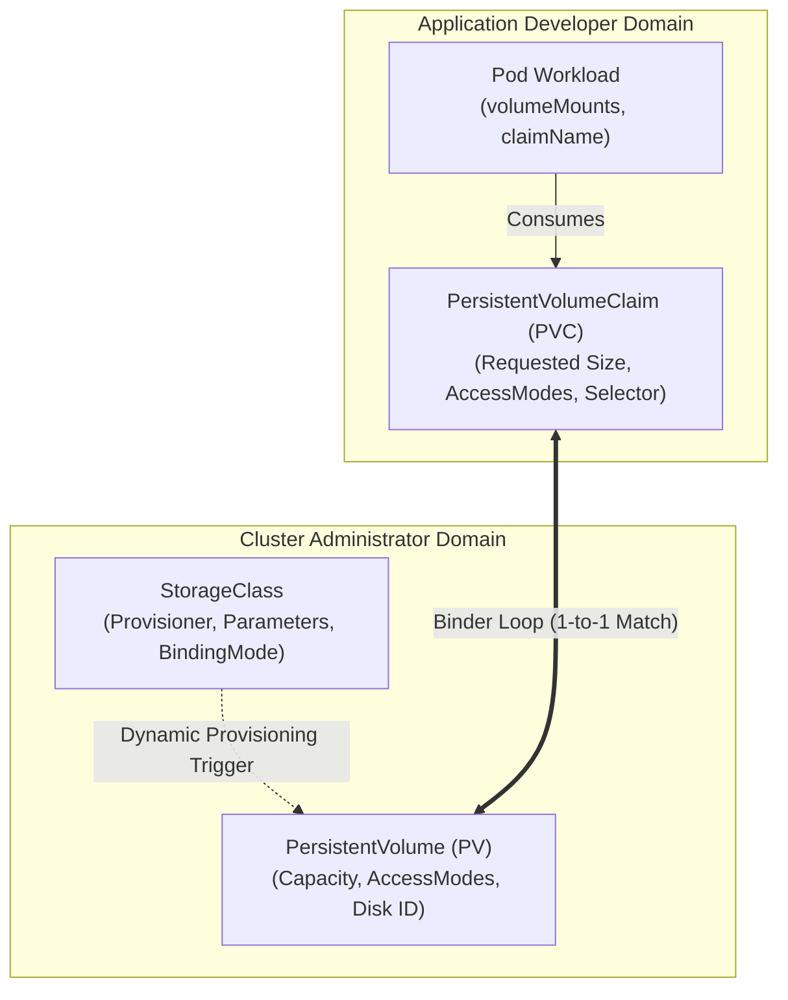
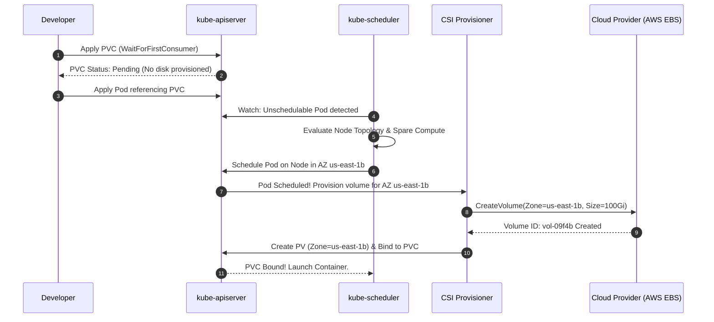

# Chapter 05: Kubernetes Storage Architecture — PVs, PVCs, StorageClasses & CSI

> "Decoupling storage configuration from storage consumption is one of the most powerful design abstractions in Kubernetes. StorageClasses define *how* storage is provisioned, PersistentVolumes represent *what* is available, and PersistentVolumeClaims express *what* an application needs."  
> — *Michael Hausenblas & Stefan Schimanski, Programming Kubernetes*
>
> "Understanding the difference between storage types and access modes, and knowing how to configure and troubleshoot persistent storage using PVs and PVCs, is a core domain tested extensively on the CKA exam."  
> — *Benjamin Muschko, Certified Kubernetes Administrator (CKA) Study Guide*

---

## 💾 1. Storage Abstraction Hierarchy & The Decoupling Model

Containers have ephemeral filesystems: when a container crashes or is rescheduled, its writeable layer is discarded and reset to the base container image. To maintain long-lived application state (e.g., PostgreSQL databases, Elasticsearch indexes, Kafka transaction logs), Kubernetes provides a declarative, layered storage abstraction model that cleanly separates infrastructure administration from developer consumption.

```
===================================================================================================
                              KUBERNETES STORAGE DECOUPLING MODEL
===================================================================================================

 [ Infrastructure Admin Domain ]                [ Application Developer Domain ]
 
   +---------------------------+
   |       StorageClass        |
   | - CSI Driver: ebs.csi.aws |
   | - Type: gp3, IOPS: 3000   |
   | - volumeBindingMode:      |
   |   WaitForFirstConsumer    |
   +-------------+-------------+
                 |
                 v (Dynamic Provisioning)
   +---------------------------+                 +---------------------------+
   |     PersistentVolume      | <--(Bound to)-- |   PersistentVolumeClaim   |
   | - Capacity: 100Gi         |                 | - StorageClass: gp3       |
   | - AccessMode: RWO         |                 | - Request: 100Gi          |
   | - VolumeID: vol-012345678 |                 | - AccessMode: RWO         |
   +-------------+-------------+                 +-------------+-------------+
                 |                                             |
                 |                                             v
                 |                               +---------------------------+
                 +-----------------------------> |         Pod Spec          |
                                                 |  volumes:                 |
                                                 |  - name: data             |
                                                 |    persistentVolumeClaim: |
                                                 |      claimName: data-pvc  |
                                                 +---------------------------+
```



---

## 🏗️ 2. Volume Lifecycle, Access Modes & Binding Semantics

### 2.1 The PV/PVC Lifecycle States
1. **Provisioning:** Storage is provisioned either statically (admin pre-creates PVs) or dynamically (via a StorageClass).
2. **Binding:** The master controller-manager's `persistentvolume-controller` runs a reconciliation loop matching unmatched PVCs to available PVs. Binding is strictly **one-to-one**; a PV cannot be bound to multiple PVCs simultaneously.
3. **Using:** Pods mount the PVC as a volume.
4. **Reclaiming:** When the user deletes the PVC, the PV enters its reclaim policy lifecycle.

#### PV Lifecycle Phase Transitions:
- `Available`: Provisioned and ready to be bound; no PVC attached.
- `Bound`: Successfully bound to a unique PVC.
- `Released`: The associated PVC was deleted, but the physical storage has not yet been reclaimed.
- `Failed`: The automatic volume reclamation process encountered an unrecoverable error.

### 2.2 Reclaim Policies
The `persistentVolumeReclaimPolicy` dictates the lifecycle of the underlying physical storage when its PVC is deleted:

| Policy | Action on PVC Deletion | Data State | Production Best Practice |
| :--- | :--- | :--- | :--- |
| **`Delete`** (Default) | Automatically removes the PV object in Kubernetes and deletes the physical cloud disk (e.g., AWS EBS volume deallocated). | **Permanently Destroyed.** | Standard for ephemeral scratch disks, CI/CD runners, and disposable databases. |
| **`Retain`** | Keeps the PV object and physical block storage intact. The PV transitions to `Released`. | **Preserved on Disk.** | **Mandatory for mission-critical production databases.** Prevents accidental data loss. |
| **`Recycle`** (Deprecated) | Executed basic file scrubber (`rm -rf /volume/*`). | Cleared. | Deprecated in favor of dynamic provisioning. |

### 2.3 Access Modes Matrix
Storage plugins define access modes specifying how many nodes and pods may mount a volume concurrently:

| Access Mode | CLI Flag | Node Concurrency | Typical Storage Providers |
| :--- | :--- | :--- | :--- |
| **ReadWriteOnce** | `RWO` | Single node can mount read-write; multiple pods *on that same node* can share it. | AWS EBS, GCP Persistent Disk, Azure Managed Disk. |
| **ReadOnlyMany** | `ROX` | Many nodes can mount concurrently in read-only mode. | NFS, AWS EFS (read-only), CephFS. |
| **ReadWriteMany** | `RWX` | Many nodes can mount concurrently in read-write mode. | NFS, AWS EFS, Azure Files, GlusterFS, CephFS. |
| **ReadWriteOncePod** | `RWOP` | Strictly a **single Pod** across the entire cluster can mount read-write (Kubernetes 1.27+ GA). | Single-writer transactional databases (guarantees split-brain prevention). |

### 2.4 Volume Modes: `Filesystem` vs. `Block`
- **`Filesystem` (Default):** The storage plugin formats the block device with a filesystem (ext4, xfs) and mounts it as a directory inside the container.
- **`Block`:** Exposes the raw block device directly to the container (e.g., `/dev/xvda`) without an intermediate filesystem layer. Used by ultra-high-performance databases (Oracle, Ceph OSD, ScyllaDB) that manage raw disk blocks directly to bypass filesystem cache overhead.

---

## ⚡ 3. The `volumeBindingMode` Multi-AZ Scheduling Deadlock

One of the most frequent production failures in cloud-hosted Kubernetes clusters (EKS, GKE, AKS) occurs when using multi-Availability-Zone node pools with default storage classes.

```
===================================================================================================
                       THE MULTI-AZ IMMEDIATE BINDING DEADLOCK
===================================================================================================

[ Failure Path: volumeBindingMode: Immediate ]
1. Developer applies PVC requesting 100Gi gp3.
2. CSI Controller immediately calls AWS EC2 API and provisions volume in AZ: `us-east-1a`.
3. PV is created and bound to PVC.
4. Pod is submitted to kube-scheduler requesting the PVC.
5. kube-scheduler checks cluster nodes:
   - Worker nodes in `us-east-1a` are currently at 100% CPU/Memory saturation (Unschedulable).
   - Worker nodes in `us-east-1b` have ample spare capacity.
6. DEADLOCK!
   AWS EBS volumes CANNOT cross AZ boundaries. The volume is locked to `us-east-1a`, but compute
   is only available in `us-east-1b`.
   Pod enters perpetual `Pending` status: "1 node(s) had volume node affinity conflict".

[ Resolution Path: volumeBindingMode: WaitForFirstConsumer ]
1. Developer applies PVC.
2. PVC remains in `Pending` state with zero cloud disk provisioned.
3. Pod is submitted to kube-scheduler.
4. Scheduler evaluates pod CPU/memory requests, affinities, and anti-affinities across ALL AZs.
5. Scheduler selects an optimal node in `us-east-1b`.
6. CSI Controller is triggered with node topology constraints, provisioning the EBS disk
   in the EXACT AZ (`us-east-1b`) where the Pod will run!
===================================================================================================
```



### 3.1 Production StorageClass Manifest
```yaml
apiVersion: storage.k8s.io/v1
kind: StorageClass
metadata:
  name: fast-ebs-gp3
  annotations:
    storageclass.kubernetes.io/is-default-class: "true"
provisioner: ebs.csi.aws.com
volumeBindingMode: WaitForFirstConsumer # Eliminates Multi-AZ scheduling deadlocks
allowVolumeExpansion: true              # Allows dynamic disk expansion
reclaimPolicy: Retain                   # Protects enterprise data from accidental PVC deletion
parameters:
  type: gp3
  iops: "3000"
  throughput: "125"
  encrypted: "true"
```

---

## 🔌 4. Container Storage Interface (CSI) Architecture & Sidecars

Before CSI, storage volume plugins were "in-tree" (compiled directly inside the core `kubelet` and `kube-controller-manager` binaries). Adding or updating a storage vendor required upgrading the entire Kubernetes cluster.

The **Container Storage Interface (CSI)** introduces an out-of-tree, gRPC-based microservice architecture.

```
===================================================================================================
                                CSI RPC PROTOCOL LIFECYCLE
===================================================================================================

  API Server / Controller Manager                   Node (kubelet & CSI Node Plugin)
  ────────────────────────────────                  ─────────────────────────────────
                 │                                                  │
  1. PVC Created │                                                  │
  ───────────────► [ csi-provisioner ]                              │
                 │         │                                        │
                 │         ▼ gRPC                                   │
                 │  CreateVolume()                                  │
                 │  (Cloud allocates EBS disk)                      │
                 │                                                  │
  2. Pod Bound   │                                                  │
  ───────────────► [ csi-attacher ]                                 │
                 │         │                                        │
                 │         ▼ gRPC                                   │
                 │  ControllerPublishVolume()                       │
                 │  (Attaches disk to Node VM: /dev/xvdf)           │
                 │                                                  │
  3. Disk Ready  │                                                  │
  ──────────────────────────────────────────────────────────────────► kubelet invokes CSI Node Driver
                                                                    │         │
                                                                    │         ▼ gRPC
                                                                    │  NodeStageVolume()
                                                                    │  - Formats disk (mkfs.ext4)
                                                                    │  - Mounts to staging path:
                                                                    │    /var/lib/kubelet/plugins/...
                                                                    │         │
                                                                    │         ▼ gRPC
                                                                    │  NodePublishVolume()
                                                                    │  - Bind-mounts staging path
                                                                    │    into Pod rootfs:
                                                                    │    /var/lib/kubelet/pods/<uid>/...
                                                                    ▼
                                                        Container launches with mounted storage!
```

### 4.1 CSI Standard Sidecar Containers
A CSI deployment decomposes storage operations across specialized CNCF helper containers:
1. **`csi-provisioner`:** Watches PVCs and invokes `CreateVolume` / `DeleteVolume` on the storage controller.
2. **`csi-attacher`:** Watches `VolumeAttachment` API objects and invokes `ControllerPublishVolume` / `ControllerUnpublishVolume` to attach/detach physical disks from VMs.
3. **`csi-resizer`:** Watches PVC storage expansion requests and invokes `ControllerExpandVolume`.
4. **`csi-snapshotter`:** Watches `VolumeSnapshot` CRDs and invokes `CreateSnapshot`.
5. **`node-driver-registrar`:** Registers the CSI node plugin with the local `kubelet` via unix domain socket.

---

## 📈 5. Online Volume Expansion & CSI Snapshots

### 5.1 Online Volume Expansion
When `allowVolumeExpansion: true` is configured on the StorageClass, volumes can be expanded without restarting or unmounting pods:

```yaml
apiVersion: v1
kind: PersistentVolumeClaim
metadata:
  name: postgres-pvc
  namespace: database
spec:
  accessModes:
    - ReadWriteOnce
  resources:
    requests:
      storage: 250Gi # Resized up from 100Gi
```

#### Kernel Operations Executed During Expansion:
1. `csi-resizer` sidecar detects PVC spec change and issues gRPC `ControllerExpandVolume` to cloud API (AWS resizes EBS volume from 100Gi to 250Gi).
2. The `kubelet` detects device capacity increase and invokes CSI Node RPC `NodeExpandVolume`.
3. The CSI Node driver executes online filesystem resizing tools directly inside the host kernel without taking the workload offline:
   - For `ext4`: `resize2fs /dev/xvdf`
   - For `xfs`: `xfs_growfs /var/lib/kubelet/pods/<uid>/volumes/...`

### 5.2 CSI VolumeSnapshots
CSI VolumeSnapshots provide point-in-time, crash-consistent backups:

```yaml
apiVersion: snapshot.storage.k8s.io/v1
kind: VolumeSnapshotClass
metadata:
  name: ebs-csi-snapclass
driver: ebs.csi.aws.com
deletionPolicy: Retain
---
apiVersion: snapshot.storage.k8s.io/v1
kind: VolumeSnapshot
metadata:
  name: postgres-snapshot-2026-09-19
  namespace: database
spec:
  volumeSnapshotClassName: ebs-csi-snapclass
  source:
    persistentVolumeClaimName: postgres-pvc
```

To restore data from a snapshot, create a new PVC referencing the `VolumeSnapshot` in its `dataSource`:
```yaml
spec:
  dataSource:
    name: postgres-snapshot-2026-09-19
    kind: VolumeSnapshot
    apiGroup: snapshot.storage.k8s.io
  resources:
    requests:
      storage: 250Gi
```

---

## 🚨 6. Production Troubleshooting & CKA Exam Scenarios

### 6.1 The Multi-Attach Error (`FailedAttachVolume`)
When a node crashes or loses network heartbeat, Kubernetes evicts the Pod and reschedules it onto a healthy node. However, the new Pod remains indefinitely stuck in `ContainerCreating`:

```text
Warning  FailedAttachVolume  3m   attachdetach-controller  
Multi-Attach error for volume "pvc-84fb2" Volume is already exclusively 
attached to node worker-1 and cannot be attached to worker-2.
```

#### Step-by-Step Resolution Runbook:
```bash
# 1. Identify active VolumeAttachment objects
kubectl get volumeattachment | grep <pvc-uid>

# 2. Check if the originating node is truly dead or partitioned
kubectl describe node worker-1

# 3. If worker-1 is permanently dead / shutdown in cloud console, force delete the stuck attachment:
kubectl delete volumeattachment csi-attachment-uid-xxxx

# 4. If the old Pod is stuck in Terminating:
kubectl delete pod <old-pod> --force --grace-period=0
```

### 6.2 CKA Storage Speed Cheatsheet
```bash
# 1. Generate PVC template imperatively
kubectl create pvc my-pvc --storageclass=fast-ebs-gp3 --capacity=50Gi --dry-run=client -o yaml > pvc.yaml

# 2. Inspect PV and PVC bindings
kubectl get pv -o wide
kubectl get pvc -n database -o wide

# 3. Check StorageClass configuration
kubectl get sc

# 4. View VolumeAttachment status and controllers
kubectl get volumeattachments
```
