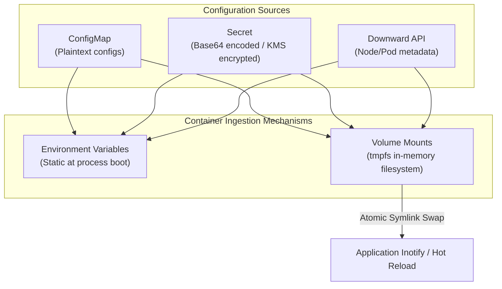
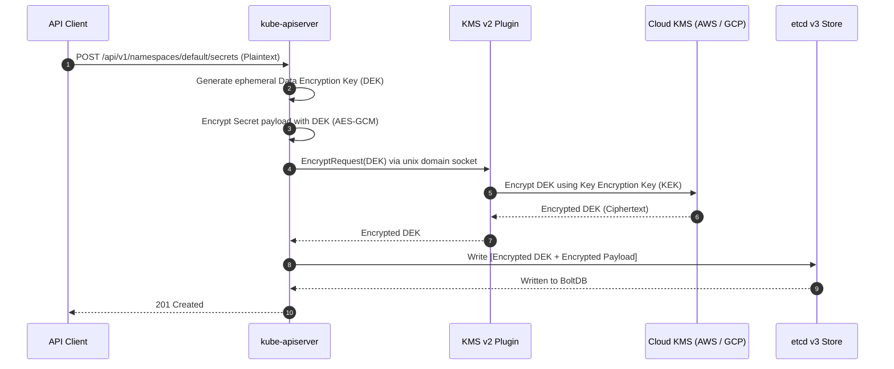

# Chapter 06: Configuration & Secret Management — ConfigMaps, Secrets, Downward API & KMS

> "A container image should be immutable, built once, and deployed across development, staging, and production environments without modification. All environment-specific behaviors must be injected through configuration artifacts."  
> — *Twelve-Factor App Methodology (Rule III: Config)*
>
> "Understanding how to manage application configuration using ConfigMaps and Secrets, and knowing the security ramifications of storing sensitive data in etcd unencrypted, is essential knowledge for both the CKAD and CKS exams."  
> — *Benjamin Muschko, Certified Kubernetes Security Specialist (CKS) Study Guide*

---

## ⚙️ 1. The Configuration Decoupling Paradigm

To guarantee that application containers remain deterministic and reproducible across dev, stage, and production environments, the application binary must be completely decoupled from runtime configuration.

Kubernetes provides three native primitives for configuration and metadata injection:
1. **ConfigMaps:** For non-confidential configuration (environment variables, config files, command-line arguments, feature flags).
2. **Secrets:** For sensitive credentials (passwords, tokens, private keys, TLS certificates).
3. **Downward API:** For reflecting runtime Pod and Node metadata directly into the container filesystem or environment block.

```
===================================================================================================
                                CONFIGURATION INJECTION PATTERNS
===================================================================================================

                +--------------------------------------------------------+
                |             ConfigMap / Secret Source Spec             |
                +---------------------------+----------------------------+
                                            |
               +----------------------------+----------------------------+
               v                                                         v
     [ Pattern 1: Environment ]                                [ Pattern 2: Volume Mount ]
     env:                                                      volumes:
     - name: DB_HOST                                           - name: config-vol
       valueFrom:                                                configMap:
         configMapKeyRef:                                          name: app-config
           name: app-config                                    volumeMounts:
           key: database.host                                  - name: config-vol
               |                                                 mountPath: /etc/config
               v                                                         |
  Injected at container fork()                                           v
  Frozen for process lifetime                               Mounted as tmpfs memory filesystem
  (Requires Pod restart to change)                          Dynamically updated via symlink swapping!
                                                            (Supports zero-downtime hot reloads)
```



---

## 🔄 2. Live Update Semantics: Environment vs. Volume Mounts

A critical architectural distinction tested on the CKAD and CKA exams is how configuration updates propagate to active containers:

### 2.1 Environment Variables: Static Inheritance
When a ConfigMap or Secret is updated in the API server, environment variables inside existing containers **never update**.
In the Linux kernel, a process inherits its environment memory block upon `execve()`. There is no POSIX kernel mechanism to asynchronously mutate a running process's environment space from outside without terminating the process. To consume new environment variables, the Pod must be restarted or the Deployment rolled out:
```bash
kubectl rollout restart deployment/order-service
```

### 2.2 Volume Mounts: Atomic Symlink Swapping
When a ConfigMap or Secret is mounted as a volume directory, the `kubelet` periodically synchronizes the files during its synchronization loop (default every 1 minute).

To prevent application processes from reading partially written files (race conditions during multi-file updates), Kubernetes uses an atomic **double-symlink swapping mechanism**:

```
/etc/config/app.conf  ──► /etc/config/..data/app.conf
                                │
                                ▼
                       /etc/config/..2026_09_19_12_00_00.12345/app.conf

When ConfigMap is updated in etcd:
1. kubelet writes new files to: /etc/config/..2026_09_19_12_05_00.67890/
2. kubelet creates symlink: ..data_tmp -> ..2026_09_19_12_05_00.67890
3. kubelet performs atomic rename: rename("..data_tmp", "..data")
4. Linux kernel guarantees rename() is atomic: processes never see half-written files!
5. Old directory is garbage collected.
```

> [!TIP]
> Applications watching configuration files with `inotify` or file-watcher libraries should watch the **parent directory** (`/etc/config`), not the individual file, because the individual file's inode changes when the symlink target is swapped.

---

## 🔍 3. The Downward API: Exposing Pod Metadata

The Downward API allows containers to consume information about themselves or the host node without coupling the application code to a Kubernetes client SDK.

### 3.1 Supported Fields

| Source | Field | Usage |
| :--- | :--- | :--- |
| **`fieldRef`** | `metadata.name` | Unique Pod name (useful for cluster ordinal identifiers). |
| | `metadata.namespace` | Pod's operating namespace. |
| | `metadata.uid` | Globally unique Pod UID in etcd. |
| | `status.podIP` | IP address allocated to the Pod. |
| | `spec.nodeName` | Worker node hostname hosting the Pod. |
| | `spec.serviceAccountName` | Active ServiceAccount name. |
| **`resourceFieldRef`** | `requests.cpu` | Allocated CPU request (in millicores). |
| | `limits.memory` | Enforced memory limit (in bytes). |

### 3.2 Downward API Manifest Example
```yaml
apiVersion: v1
kind: Pod
metadata:
  name: telemetry-agent
  namespace: observability
spec:
  containers:
  - name: agent
    image: internal/telemetry:v1.0
    env:
    - name: POD_NAME
      valueFrom:
        fieldRef:
          fieldPath: metadata.name
    - name: NODE_NAME
      valueFrom:
        fieldRef:
          fieldPath: spec.nodeName
    - name: POD_IP
      valueFrom:
        fieldRef:
          fieldPath: status.podIP
    - name: MEMORY_LIMIT_BYTES
      valueFrom:
        resourceFieldRef:
          containerName: agent
          resource: limits.memory
```

---

## 🔒 4. Secrets Architecture & CKS Encryption at Rest (KMS v2)

### 4.1 The Base64 Misconception
A primary focus of the CKS exam is dispelling the myth that native Kubernetes Secrets are encrypted.
Standard Kubernetes Secrets are merely **Base64 encoded**:

```bash
echo "c3VwZXItc2VjcmV0" | base64 --decode
# Output: super-secret
```

Furthermore, by default in a standard `kubeadm` cluster, `etcd` persists these Secrets to disk in **unencrypted plaintext**. Anyone with access to the master node's filesystem or an etcd snapshot can read every enterprise credential directly:
```bash
# Direct unencrypted etcd extraction:
strings /var/lib/etcd/member/snap/db | grep -A 2 -B 2 "super-secret"
```

### 4.2 KMS v2 Envelope Encryption Architecture
To protect sensitive data at rest, the `kube-apiserver` must be configured with an `--encryption-provider-config` leveraging **KMS Envelope Encryption**:

```
===================================================================================================
                               KMS ENVELOPE ENCRYPTION ARCHITECTURE
===================================================================================================

  API Client ──► kube-apiserver ──► [ KMS Plugin gRPC Socket ] ──► Cloud KMS (AWS KMS / GCP KMS)
                       │
                       ├─ 1. Generates local ephemeral Data Encryption Key (DEK)
                       ├─ 2. Encrypts plaintext secret payload with DEK using AES-GCM
                       ├─ 3. Calls KMS: Encrypt(DEK) using Key Encryption Key (KEK)
                       │
                       ▼
             Stored in etcd:
             [ Encrypted Secret Payload (AES-GCM) ] + [ Encrypted DEK (Envelope) ]
```



### 4.3 Production EncryptionConfiguration Manifest
On the control plane node at `/etc/kubernetes/enc/encryption-config.yaml`:

```yaml
apiVersion: apiserver.config.k8s.io/v1
kind: EncryptionConfiguration
resources:
  - resources:
      - secrets
    providers:
      - kms:
          apiVersion: v2
          name: aws-kms-provider
          endpoint: unix:///var/run/kmsplugin/socket.sock
          timeout: 3s
      - aescbc:
          keys:
            - name: fallback-key
              secret: c3VwZXItc2VjcmV0LTMyLWJ5dGUtbG9uZy1rZXk=
      - identity: {} # Fallback unencrypted read (Allows migrating plaintext secrets)
```

#### Re-encrypting Existing Secrets (CKS Exam Essential):
Applying an `EncryptionConfiguration` encrypts only newly written secrets. To encrypt existing plaintext secrets in etcd:
```bash
kubectl get secrets --all-namespaces -o json | kubectl replace -f -
```

---

## 🌐 5. Enterprise Secret Management: External Secrets Operator (ESO)

Storing secrets in Git repositories (even encoded) violates enterprise compliance. The industry-standard architecture for continuous synchronization between external vaults and Kubernetes is the **External Secrets Operator (ESO)**.

```
===================================================================================================
                            EXTERNAL SECRETS OPERATOR ARCHITECTURE
===================================================================================================

  +---------------------------------+
  | Enterprise Vault / Cloud Store  |
  | - AWS Secrets Manager           |
  | - HashiCorp Vault               |
  | - Azure Key Vault               |
  +----------------+----------------+
                   |
                   v (mTLS / IAM Role via IRSA)
  +--------------------------------------------------------+
  | Cluster: External Secrets Operator                     |
  |                                                        |
  |  +---------------------------+                         |
  |  |        SecretStore        | (Auth configuration)    |
  |  +-------------+-------------+                         |
  |                |                                       |
  |                v                                       |
  |  +---------------------------+                         |
  |  |      ExternalSecret       | (Mapping definition)    |
  |  +-------------+-------------+                         |
  |                |                                       |
  |                v (Continuous Reconciliation Loop)      |
  |  +---------------------------+                         |
  |  |   Native k8s Secret       | <--(Mounted by App Pod) |
  |  +---------------------------+                         |
  +--------------------------------------------------------+
```

### 5.1 Production ESO Manifests
```yaml
apiVersion: external-secrets.io/v1beta1
kind: SecretStore
metadata:
  name: aws-secrets-manager
  namespace: ecommerce
spec:
  provider:
    aws:
      service: SecretsManager
      region: us-east-1
      auth:
        jwt:
          serviceAccountRef:
            name: eso-irsa-serviceaccount
---
apiVersion: external-secrets.io/v1beta1
kind: ExternalSecret
metadata:
  name: database-credentials
  namespace: ecommerce
spec:
  refreshInterval: 1h # Synchronizes rotated passwords automatically
  secretStoreRef:
    name: aws-secrets-manager
    kind: SecretStore
  target:
    name: db-secret # Name of the generated Kubernetes Secret
    creationPolicy: Owner
  data:
  - secretKey: DB_PASSWORD
    remoteRef:
      key: prod/ecommerce/postgres
      property: password
```

---

## ⚡ 6. Performance Optimization: Immutable ConfigMaps & Secrets

In enterprise clusters running tens of thousands of Pods, `kube-apiserver` maintains extensive memory caches and open HTTP/2 WATCH streams to notify worker nodes of ConfigMap/Secret changes.

Setting `immutable: true`:
```yaml
apiVersion: v1
kind: ConfigMap
metadata:
  name: immutable-app-config
immutable: true
data:
  app.properties: |
    threads.pool.size=64
```

### Performance & Security Advantages:
1. **API Server CPU & Memory Reduction:** The API server ceases watching the object for mutation events, significantly lowering load on etcd and the API server watch cache.
2. **Accidental Corruption Shield:** Any `kubectl edit` or accidental overwrite is rejected at the API validation layer.
3. **Safe GitOps Rollouts:** To change configuration, teams deploy a new versioned ConfigMap (`immutable-app-config-v2`) and update the Deployment, guaranteeing safe, auditable canary deployments.

---

## 🎯 7. CKAD & CKS Exam Rapid Cheatsheet

```bash
# 1. Create a ConfigMap from literal values
kubectl create configmap app-cfg --from-literal=ENV=prod --from-literal=PORT=8080

# 2. Create a ConfigMap from an existing file
kubectl create configmap nginx-cfg --from-file=nginx.conf

# 3. Create a Secret imperatively
kubectl create secret generic db-pass --from-literal=password=P@ssw0rd123

# 4. Create a TLS Secret from cert and key files
kubectl create secret tls cert-secret --cert=tls.crt --key=tls.key

# 5. Extract and decode Secret data instantly
kubectl get secret db-pass -o jsonpath='{.data.password}' | base64 --decode

# 6. Verify etcd Secret encryption status (CKS Master Skill)
ETCDCTL_API=3 etcdctl --cacert=/etc/kubernetes/pki/etcd/ca.crt \
  --cert=/etc/kubernetes/pki/etcd/server.crt \
  --key=/etc/kubernetes/pki/etcd/server.key \
  get /registry/secrets/default/db-pass | hexdump -C
```
