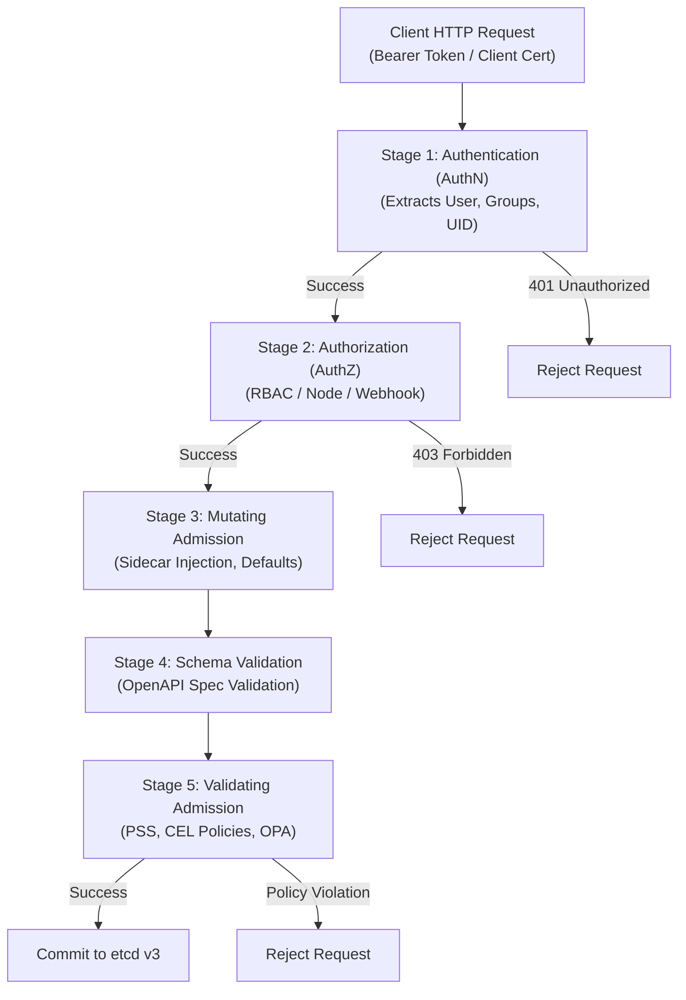

# Chapter 07: Security, RBAC, Admission Controllers & NetworkPolicies

> "Security in Kubernetes is not a single perimeter; it is defense-in-depth across the Four Cs of Cloud Native Security: Cloud, Cluster, Container, and Code. A compromise at any outer layer invalidates protections at inner layers."  
> — *Liz Rice, Container Security (O'Reilly)*
>
> "Understanding how RBAC, Admission Controllers, Pod Security Standards, and NetworkPolicies interact is the heart of the CKS curriculum. Real cluster security requires assuming the attacker already has code execution in a container and designing defenses to prevent lateral movement and privilege escalation."  
> — *Benjamin Muschko, Certified Kubernetes Security Specialist (CKS) Study Guide*

---

## 🛡️ 1. The Multi-Tiered Kubernetes Security Pipeline

Every single API interaction with a Kubernetes cluster—whether initiated by `kubectl`, a CI/CD runner, or an in-cluster ServiceAccount—must pass sequentially through an uncompromising multi-stage gatekeeping pipeline inside `kube-apiserver` before any state can be persisted to `etcd`.

```
===================================================================================================
                                API SERVER SECURITY LIFECYCLE
===================================================================================================

  kubectl / API Client Request
               │
               ▼
  +-------------------------+
  |   1. Authentication     |  - Verifies identity: Who are you?
  |        (AuthN)          |  - X.509 Client Certs, OIDC (Okta/Dex), Projected ServiceAccount Tokens
  +------------+------------+
               │ (Authenticated: User "alice" or ServiceAccount "payment-svc")
               ▼
  +-------------------------+
  |   2. Authorization      |  - Verifies permissions: Can you do this?
  |        (AuthZ)          |  - Role-Based Access Control (RBAC), Node Authorizer, ABAC
  +------------+------------+
               │ (Authorized: Can "create" "deployments" in "production")
               ▼
  +-------------------------+
  | 3. Mutating Admission   |  - Modifies request payload
  |       Webhooks          |  - Injects Istio sidecars, sets default security contexts, adds labels
  +------------+------------+
               │
               ▼
  +-------------------------+
  |   4. Object Schema      |  - Validates OpenAPI schema compliance and field types
  |      Validation         |
  +------------+------------+
               │
               ▼
  +-------------------------+
  | 5. Validating Admission |  - Enforces cluster invariants & policies: Allowed to commit?
  |       Webhooks          |  - Pod Security Standards (PSS), ValidatingAdmissionPolicy (CEL), Kyverno
  +------------+------------+
               │ (Passed all policy gates)
               ▼
      Committed to etcd!
```



---

## 🔑 2. Authentication (AuthN) & Modern Bound ServiceAccount Tokens

Kubernetes recognizes two distinct classes of users:
1. **Normal Users:** Humans or external systems managed outside Kubernetes (via corporate IdPs, Active Directory, Okta, AWS IAM). Kubernetes does not store "User" database objects.
2. **ServiceAccounts:** Internal machine identities managed natively as API resources within namespaces.

### 2.1 Bound ServiceAccount Token Projection (TokenRequest API)
In legacy Kubernetes, a ServiceAccount token was a static, non-expiring JWT stored indefinitely inside a Secret object and mounted into every container. If a pod was compromised via Remote Code Execution (RCE), an attacker could exfiltrate the token and maintain persistent access to the cluster indefinitely.

Modern Kubernetes implements **Bound ServiceAccount Token Projection**:
- **Cryptographic Binding:** Tokens are bound to the specific Pod UID, namespace, and targeted audience (`aud`).
- **Short-Lived Expiration:** Tokens have a default lifetime (e.g., 1 hour) and are automatically refreshed by the `kubelet` before expiration.
- **In-Memory Mount:** Injected via an in-memory `tmpfs` volume, never written to node disk.
- **Immediate Revocation:** Once the host Pod terminates, the API server immediately rejects any further requests bearing that token UID.

```yaml
apiVersion: v1
kind: ServiceAccount
metadata:
  name: payment-processor
  namespace: checkout
automountServiceAccountToken: false # Hardening: Disable token mounting unless explicitly needed!
```

---

## 📜 3. Role-Based Access Control (RBAC) Internals

RBAC evaluates requests using four attributes: **User/Group**, **Verb**, **API Group**, and **Resource/Subresource**.

### 3.1 The Four Core RBAC Primitives

```
===================================================================================================
                                      RBAC TOPOLOGY MATRIX
===================================================================================================

  [ Scoped to Single Namespace ]                  [ Cluster-Wide Scope ]
  
     +----------------------+                        +----------------------+
     |         Role         |                        |     ClusterRole      |
     | namespace: payment   |                        | (Cluster Scoped)     |
     | resources: [pods]    |                        | resources: [nodes]   |
     | verbs: [get, list]   |                        | verbs: [get, list]   |
     +----------+-----------+                        +----------+-----------+
                |                                               |
                v                                               v
     +----------------------+                        +----------------------+
     |     RoleBinding      |                        |  ClusterRoleBinding  |
     | binds: payment-sa    |                        | binds: cluster-admin |
     | to: Role             |                        | to: ClusterRole      |
     +----------------------+                        +----------------------+
```

> [!NOTE]
> A `RoleBinding` can reference a `ClusterRole`! When it does, the permissions of the ClusterRole are scoped strictly to the namespace of the RoleBinding. This allows administrators to define reusable common roles (e.g., `view`, `edit`) cluster-wide while binding them to individual project namespaces.

### 3.2 Subresources & Least Privilege
Permissions in Kubernetes must explicitly specify subresources:
- `resources: ["pods"]`: Allows interacting with Pod specs.
- `resources: ["pods/log"]`: Allows reading container standard logs.
- `resources: ["pods/exec"]`: **High Risk!** Allows interactive terminal execution (`kubectl exec`) inside containers.
- `resources: ["deployments/scale"]`: Allows mutating replica counts without modifying pod templates.

```yaml
apiVersion: rbac.authorization.k8s.io/v1
kind: Role
metadata:
  name: incident-debugger
  namespace: ecommerce
rules:
- apiGroups: [""]
  resources: ["pods", "pods/log"]
  verbs: ["get", "list", "watch"]
- apiGroups: [""]
  resources: ["pods/exec"]
  verbs: ["create"] # Exec requires POST/create on the exec subresource
- apiGroups: ["apps"]
  resources: ["deployments"]
  verbs: ["get"]
```

---

## 👮 4. Pod Security Standards (PSS) & Admission Enforcement

PodSecurityPolicies (PSP) were completely removed in Kubernetes v1.25. The modern standard is **Pod Security Standards (PSS)**, implemented natively in the `kube-apiserver` via namespace labels.

### 4.1 The Three Security Levels

| Security Level | Description | Target Use Case |
| :--- | :--- | :--- |
| **`Privileged`** | Completely unrestricted. Allows host root, host PID/IPC/Network, privileged containers, and arbitrary volume mounts. | System infrastructure daemons (Calico CNI, Cilium, CSI drivers, node exporters). |
| **`Baseline`** | Minimally restrictive. Prevents known privilege escalations (forbids host access), allows default container runtime settings. | Standard enterprise applications, legacy docker containers. |
| **`Restricted`** | Strictly hardened production posture. Requires rootless execution, drops all Linux capabilities, enforces read-only rootfs. | **Mandatory for all production microservices and regulated workloads.** |

### 4.2 Namespace Enforcement Modes
Administrators configure PSS by applying three distinct modes via labels:
1. `pod-security.kubernetes.io/enforce`: Hard-blocks any non-compliant Pod admission with an HTTP 403.
2. `pod-security.kubernetes.io/audit`: Allows the Pod, but logs an audit event to the API server audit log.
3. `pod-security.kubernetes.io/warn`: Allows the Pod, but returns an interactive warning message directly to the `kubectl` client terminal.

```yaml
apiVersion: v1
kind: Namespace
metadata:
  name: secure-prod
  labels:
    pod-security.kubernetes.io/enforce: restricted
    pod-security.kubernetes.io/enforce-version: latest
    pod-security.kubernetes.io/audit: restricted
    pod-security.kubernetes.io/warn: restricted
```

### 4.3 Hardened Restricted Container Specification (CKS Golden Standard)
```yaml
apiVersion: apps/v1
kind: Deployment
metadata:
  name: secure-microservice
  namespace: secure-prod
spec:
  replicas: 3
  selector:
    matchLabels:
      app: secure-app
  template:
    metadata:
      labels:
        app: secure-app
    spec:
      securityContext:
        runAsNonRoot: true
        runAsUser: 10001
        runAsGroup: 10001
        fsGroup: 10001
        seccompProfile:
          type: RuntimeDefault # Blocks risky Linux syscalls
      containers:
      - name: app
        image: cgr.dev/chainguard/static:latest
        securityContext:
          allowPrivilegeEscalation: false # Sets PR_SET_NO_NEW_PRIVS in Linux kernel
          readOnlyRootFilesystem: true    # Container rootfs is read-only
          capabilities:
            drop:
            - ALL                         # Drops all 38+ Linux kernel capabilities
        volumeMounts:
        - name: ephemeral-tmp
          mountPath: /tmp
      volumes:
      - name: ephemeral-tmp
        emptyDir: {}
```

---

## ⚡ 5. ValidatingAdmissionPolicy: In-Tree CEL Governance

Historically, validating business rules required deploying heavy third-party webhook admission controllers (OPA Gatekeeper, Kyverno) that added network latency and failure points.
Kubernetes introduces **ValidatingAdmissionPolicy** (GA in v1.30+), which evaluates declarative policies in-tree using the **Common Expression Language (CEL)**:

```yaml
apiVersion: admissionregistration.k8s.io/v1
kind: ValidatingAdmissionPolicy
metadata:
  name: require-resource-limits
spec:
  failurePolicy: Fail
  matchConstraints:
    resourceRules:
    - apiGroups: [""]
      apiVersions: ["v1"]
      operations: ["CREATE", "UPDATE"]
      resources: ["pods"]
  validations:
  - expression: "object.spec.containers.all(c, has(c.resources) && has(c.resources.limits) && has(c.resources.limits.cpu))"
    message: "All containers must specify a CPU resource limit!"
---
apiVersion: admissionregistration.k8s.io/v1
kind: ValidatingAdmissionPolicyBinding
metadata:
  name: require-resource-limits-binding
spec:
  policyName: require-resource-limits
  validationActions: [Deny]
  matchResources:
    namespaceSelector:
      matchLabels:
        environment: production
```

---

## 🕸️ 6. Zero-Trust NetworkPolicies

By default, the Kubernetes network fabric is completely flat and open: any container can initiate TCP/UDP traffic to any other container across any namespace. **NetworkPolicies** enable stateful packet filtering implemented directly in the Linux kernel datapath by the CNI plugin.

### 6.1 Default-Deny-All Baseline (Golden Production Rule)
Every namespace must possess a default-deny baseline for both ingress and egress:
```yaml
apiVersion: networking.k8s.io/v1
kind: NetworkPolicy
metadata:
  name: default-deny-all
  namespace: checkout
spec:
  podSelector: {} # Applies to ALL pods in namespace
  policyTypes:
  - Ingress
  - Egress
```

### 6.2 Microservice Ingress & Egress Whitelist
```yaml
apiVersion: networking.k8s.io/v1
kind: NetworkPolicy
metadata:
  name: checkout-network-policy
  namespace: checkout
spec:
  podSelector:
    matchLabels:
      app: checkout-api
  policyTypes:
  - Ingress
  - Egress
  ingress:
  # Allow incoming traffic ONLY from Ingress Gateway on TCP port 8080
  - from:
    - namespaceSelector:
        matchLabels:
          kubernetes.io/metadata.name: ingress-system
      podSelector:
        matchLabels:
          app: envoy-gateway
    ports:
    - protocol: TCP
      port: 8080
  egress:
  # 1. Allow egress to PostgreSQL database on port 5432
  - to:
    - namespaceSelector:
        matchLabels:
          kubernetes.io/metadata.name: database
      podSelector:
        matchLabels:
          app: postgres
    ports:
    - protocol: TCP
      port: 5432
  # 2. CRITICAL: Allow egress to CoreDNS on port 53 (UDP & TCP)
  - to:
    - namespaceSelector: {}
      podSelector:
        matchLabels:
          k8s-app: kube-dns
    ports:
    - protocol: UDP
      port: 53
    - protocol: TCP
      port: 53
```

> [!CAUTION]
> **The CoreDNS Egress Trap:** When you define an `Egress` policy on a Pod, Kubernetes drops ALL outbound traffic not explicitly whitelisted. If you forget to whitelist egress to CoreDNS on UDP/TCP port 53, the Pod will lose internal and external DNS resolution completely!

---

## 🎯 7. CKS Security Audit & Exam Speed Tactics

```bash
# 1. Test RBAC permissions imperatively
kubectl auth can-i create deployments --as=developer -n default
kubectl auth can-i delete pods --as=system:serviceaccount:checkout:payment-processor

# 2. Check which ServiceAccount a Pod is using
kubectl get pod order-api-7f4b -o jsonpath='{.spec.serviceAccountName}'

# 3. Label a namespace for Restricted Pod Security Standard
kubectl label --overwrite ns secure-prod pod-security.kubernetes.io/enforce=restricted

# 4. Dry-run test a Pod against PSS without modifying cluster
kubectl apply --dry-run=server -f pod.yaml

# 5. Inspect active NetworkPolicies across all namespaces
kubectl get netpol -A

# 6. Audit Linux capabilities of a running container
crictl inspect <container-id> | jq '.info.runtimeSpec.linux.capabilities'
```
