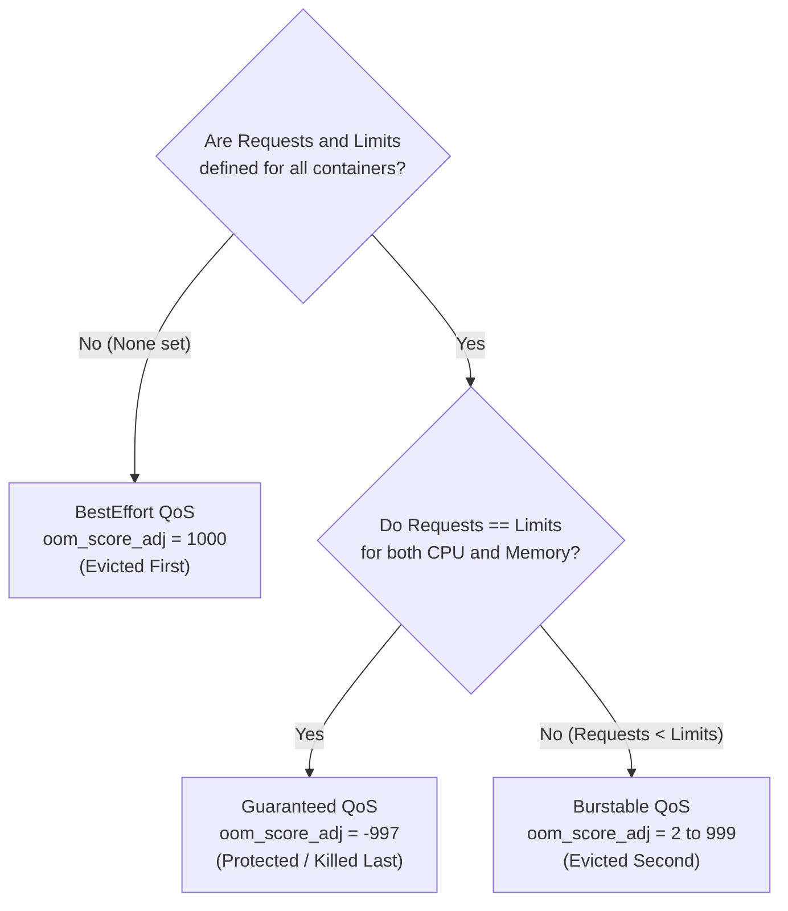

# Chapter 08: Scheduling, Resource Management & Autoscaling — HPA, VPA & Karpenter

> "A distributed scheduler must solve an NP-hard multidimensional bin-packing problem in milliseconds while honoring complex placement constraints, hardware topologies, and dynamic resource demands."  
> — *Michael Hausenblas & Stefan Schimanski, Programming Kubernetes*
>
> "Understanding how requests and limits affect scheduling decisions and pod eviction priorities during node resource exhaustion is one of the most critical topics tested on the CKA examination."  
> — *Benjamin Muschko, Certified Kubernetes Administrator (CKA) Study Guide*

---

## ⚖️ 1. The Kubernetes Resource Model & Linux Kernel Enforcements

Kubernetes models two primary computational resources for container execution:
1. **CPU (Compressible Resource):** Expressed in millicores ($1000\text{m} = 1\text{ vCPU}$). When a container attempts to consume more CPU than its declared limit, the Linux kernel **throttles** its execution time slices using the Completely Fair Scheduler (CFS) bandwidth controller. The process runs slower, but is not terminated.
2. **Memory (Incompressible Resource):** Expressed in byte quantities (`Mi`, `Gi`). Because physical RAM cannot be stretched or compressed, when a container attempts to allocate memory beyond its limit, the Linux kernel immediately invokes the **Out-Of-Memory (OOM) Killer**, dispatching `SIGKILL` (Exit Code `137`).

```
===================================================================================================
                             REQUESTS VS. LIMITS: SYSTEM ROLES
===================================================================================================

                Pod Container Spec
                ├── requests.cpu: 500m      ──► Used exclusively by kube-scheduler for Bin-Packing
                ├── requests.memory: 1Gi        (Reserves node capacity; guarantees execution)
                │
                ├── limits.cpu: 2000m       ──► Kernel CFS Bandwidth Quota (Throttles if exceeded)
                └── limits.memory: 2Gi      ──► Kernel cgroup memory.max (OOMKills if exceeded)
```

### 1.1 Linux CFS Bandwidth Controller Mechanics
On Linux systems running cgroups v1/v2, CPU limits translate into two kernel parameters:
- `cpu.cfs_period_us`: The evaluation period window (default: $100,000\mu\text{s} = 100\text{ms}$).
- `cpu.cfs_quota_us`: The total allowed runtime within that window.

$$\text{Quota} = \text{Limits in vCPUs} \times 100,000\mu\text{s}$$
- A limit of `500m` ($0.5\text{ vCPU}$) sets `cpu.cfs_quota_us = 50,000`.
- A limit of `2000m` ($2\text{ vCPUs}$) sets `cpu.cfs_quota_us = 200,000` (allowing multi-threaded processes to consume across multiple physical cores within the $100\text{ms}$ window).

---

## 🎯 2. Quality of Service (QoS) Classes & Linux OOM Scoring

The `kubelet` automatically classifies every Pod into one of three QoS classes based strictly on the mathematical symmetry of its declared requests and limits:

```
===================================================================================================
                                  QoS CLASS EVICTION HIERARCHY
===================================================================================================

  Worker Node Under Severe Memory Pressure (Kernel invokes OOM Killer)
  │
  ├─► [ Killed First ]   BestEffort
  │   - Criteria: Zero requests and limits set on ANY container in the Pod.
  │   - Kernel oom_score_adj: 1000 (Maximum vulnerability)
  │
  ├─► [ Killed Second ]  Burstable
  │   - Criteria: requests < limits, or only requests defined.
  │   - Kernel oom_score_adj: 1000 - (1000 * requests.memory) / NodeCapacity.memory
  │
  └─► [ Killed Last ]    Guaranteed
      - Criteria: requests == limits for CPU AND memory across EVERY container in the Pod.
      - Kernel oom_score_adj: -997 (Near system daemon immunity at -1000)
```



> [!IMPORTANT]
> **Production Database Rule:** Transactional databases and message brokers (PostgreSQL, Kafka, Redis) **must** always be assigned the `Guaranteed` QoS class. If memory pressure strikes a node, `BestEffort` batch jobs and `Burstable` web frontends will be terminated first, preserving database integrity.

---

## 🧭 3. The `kube-scheduler` Scheduling Framework

When a Pod is submitted without a `spec.nodeName`, the `kube-scheduler` executes a 2-phase decision cycle:

```
===================================================================================================
                               SCHEDULING PIPELINE PHASES
===================================================================================================

  All Cluster Nodes (e.g. 500 Nodes)
            │
            ▼ [ Phase 1: Filtering / Predicates ]
            Evaluates hard constraints:
            - NodeResourcesFit (Enough spare CPU/RAM requests?)
            - NodeName & NodeSelector matching
            - PodTopologySpread
            - NodeAffinity / Taints & Tolerations
            │
            ▼ (Filtered Candidates: e.g. 12 Nodes)
            │
            ▼ [ Phase 2: Scoring / Priorities ]
            Ranks candidate nodes (0 to 100 points):
            - NodeResourcesBalancedAllocation (Balanced CPU vs RAM usage)
            - ImageLocality (Are container layers already cached on node disk?)
            - PodAffinity / AntiAffinity scoring weights
            │
            ▼ (Highest Scoring Node Selected)
            │
      Committed to etcd via Binding API: pod.spec.nodeName = "worker-04"
```

### 3.1 Affinities & Anti-Affinities
Operators steer workload placement using node and pod affinity rules:
1. **`nodeAffinity`:** Directs Pods to specific node pools (e.g., GPU instances, specific cloud zones).
   - `requiredDuringSchedulingIgnoredDuringExecution`: Hard constraint (must match or Pod stays Pending).
   - `preferredDuringSchedulingIgnoredDuringExecution`: Soft constraint (scheduler scores matching nodes higher).
2. **`podAntiAffinity`:** Prevents Pods of the same service from sharing failure domains (preventing all 3 replicas from landing on the same physical host).

```yaml
affinity:
  podAntiAffinity:
    requiredDuringSchedulingIgnoredDuringExecution:
    - labelSelector:
        matchExpressions:
        - key: app
          operator: In
          values: ["payment-service"]
      topologyKey: "kubernetes.io/hostname" # Enforces 1 replica per physical server
```

### 3.2 Taints and Tolerations
While Affinities attract Pods to nodes, **Taints** repel Pods unless the Pod possesses an explicit **Toleration**:
- `NoSchedule`: The scheduler will not place the Pod on this node unless it has a matching toleration.
- `PreferNoSchedule`: Soft rejection.
- `NoExecute`: Already running Pods lacking the toleration are **evicted immediately** from the node!

```bash
# Taint a node with GPU hardware
kubectl taint nodes gpu-worker-01 accelerator=nvidia-h100:NoSchedule
```
```yaml
# Pod toleration to permit placement on the tainted GPU node
tolerations:
- key: "accelerator"
  operator: "Equal"
  value: "nvidia-h100"
  effect: "NoSchedule"
```

### 3.3 Topology Spread Constraints
Guarantees even distribution of replicas across cloud Availability Zones to survive whole-datacenter disasters:

```yaml
topologySpreadConstraints:
- maxSkew: 1                                # Max difference in replica count between zones
  topologyKey: topology.kubernetes.io/zone  # Cloud AZ key
  whenUnsatisfiable: DoNotSchedule          # Hard constraint
  labelSelector:
    matchLabels:
      app: checkout-api
```

---

## 📈 4. The Autoscaling Triad: HPA, VPA & Karpenter

Modern cloud-native architectures balance autoscaling across the workload layer (Pods) and the infrastructure layer (Nodes).

```
===================================================================================================
                                AUTOSCALING CONTROL ARCHITECTURE
===================================================================================================

                 [ Application Traffic Spike / Workload Demand ]
                                       │
                 +---------------------+---------------------+
                 v                                           v
   Horizontal Pod Autoscaler (HPA)             Vertical Pod Autoscaler (VPA)
   (Scales Pod Count Out: 3 -> 15)             (Resizes Pod CPU/RAM: 1Gi -> 4Gi)
                 │                                           │
                 +---------------------+---------------------+
                                       │
                         Pods enter "Pending" state
                         (Cluster out of available CPU/RAM)
                                       │
                                       v
                         Karpenter / Node Autoscaler
                         (Provisions optimal cloud instances directly)
```

### 4.1 Horizontal Pod Autoscaler (HPA v2) Math
The HPA controller runs periodically inside `kube-controller-manager` (default every 15 seconds) evaluating:

$$\text{DesiredReplicas} = \left\lceil \text{CurrentReplicas} \times \left( \frac{\text{CurrentMetricValue}}{\text{TargetMetricValue}} \right) \right\rceil$$

```yaml
apiVersion: autoscaling/v2
kind: HorizontalPodAutoscaler
metadata:
  name: checkout-hpa
  namespace: ecommerce
spec:
  scaleTargetRef:
    apiVersion: apps/v1
    kind: Deployment
    name: checkout-service
  minReplicas: 3
  maxReplicas: 30
  metrics:
  - type: Resource
    resource:
      name: cpu
      target:
        type: Utilization
        averageUtilization: 75
  - type: Pods
    pods:
      metric:
        name: http_requests_per_second
      target:
        type: AverageValue
        averageValue: "1200m"
  behavior:
    scaleDown:
      stabilizationWindowSeconds: 300 # Wait 5 minutes before scaling down to prevent flapping
      policies:
      - type: Percent
        value: 10
        periodSeconds: 60
```

---

## ⚡ 5. Next-Generation Node Autoscaling: Karpenter

Traditional cloud cluster autoscalers rely on cloud provider Auto Scaling Groups (ASGs). ASGs are slow, rigid, and require pre-configuring multiple heterogeneous node groups.

**Karpenter** is a high-performance, group-less Kubernetes node autoscaler designed to optimize compute costs and provisioning latency:

| Architectural Dimension | Legacy Cluster Autoscaler (CAS) | Karpenter (Modern Standard) |
| :--- | :--- | :--- |
| **Cloud Integration** | Bound to AWS Auto Scaling Groups (ASGs) / Managed Node Groups. | **Group-less.** Communicates directly with EC2 Fleet / Cloud Compute APIs. |
| **Spin-Up Latency** | $3\text{ to }6\text{ minutes}$ to join cluster. | **$30\text{ to }45\text{ seconds}$** from Pending pod to ready node. |
| **Instance Selection** | Rigid: scales predefined instance families. | **Dynamic:** Evaluates exact CPU/RAM/GPU requests of pending pods and picks cheapest instance. |
| **Consolidation** | Weak bin-packing; leaves nodes partially idle. | **Continuous Consolidation:** Actively drains underutilized nodes and replaces them with smaller instances. |

### 5.1 Karpenter NodePool Manifest
```yaml
apiVersion: karpenter.sh/v1beta1
kind: NodePool
metadata:
  name: general-compute
spec:
  template:
    spec:
      requirements:
      - key: karpenter.sh/capacity-type
        operator: In
        values: ["spot", "on-demand"]
      - key: kubernetes.io/arch
        operator: In
        values: ["arm64", "amd64"]
      - key: node.kubernetes.io/instance-type
        operator: In
        values: ["c6g.xlarge", "c6i.xlarge", "m6g.xlarge", "m6i.xlarge"]
      nodeClassRef:
        name: default-ec2-node-class
  disruption:
    consolidationPolicy: WhenUnderutilized
    expireAfter: 720h # Enforces 30-day node replacement for security patching
```

---

## 🎯 6. CKA Scheduling Diagnostics & Speed Tactics

```bash
# 1. Inspect why a Pod is stuck in Pending
kubectl describe pod <pod-name> | grep -A 5 Events:

# 2. View node resource allocation and capacity
kubectl describe node <node-name> | grep -A 8 "Allocated resources"

# 3. Drain a node safely for maintenance (respects PodDisruptionBudgets)
kubectl drain <node-name> --ignore-daemonsets --delete-emptydir-data

# 4. Make a node unschedulable (Cordon)
kubectl cordon <node-name>

# 5. Restore node to schedulable state (Uncordon)
kubectl uncordon <node-name>

# 6. Check active QoS class of a Pod
kubectl get pod <pod-name> -o jsonpath='{.status.qosClass}'
```
