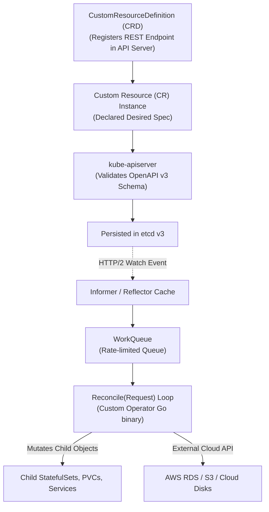

# Chapter 09: Extensibility — CRDs, Custom Controllers & The Operator Pattern

> "The Operator pattern encapsulates operational domain knowledge—deploying, scaling, backing up, failover, and upgrading complex stateful applications—into autonomous, self-healing software running directly inside the cluster control loop."  
> — *Michael Hausenblas & Stefan Schimanski, Programming Kubernetes (O'Reilly)*
>
> "Custom Resource Definitions turn Kubernetes from an application orchestrator into a programmable cloud platform. Once you understand informers, work queues, and reconciliation loops, you understand how Kubernetes itself was built."  
> — *Brendan Burns, Joe Beda, Kelsey Hightower, Lachlan Evenson, Kubernetes: Up and Running (3rd Ed)*

---

## 🧩 1. The Extensible Platform Architecture

Kubernetes was designed from inception not as a rigid monolith, but as an extensible, programmable control plane. By combining **Custom Resource Definitions (CRDs)** with custom controllers, engineers can introduce new first-class domain abstractions (e.g., `PostgresCluster`, `KafkaTopic`, `VaultSecret`, `MLPipeline`) that behave identically to native primitives like `Pod` and `Deployment`.

```
===================================================================================================
                                  THE OPERATOR PATTERN TRIANGLE
===================================================================================================

                               +---------------------------+
                               | Custom Resource Definition|
                               |   (Schema registered etcd)|
                               +-------------+-------------+
                                             | Defines API Schema
                                             v
  +---------------------------+  Declares   +---------------------------+
  |    Software Engineer      |-----------> |      Custom Resource      |
  |     (kubectl apply)       |   Desired   | (e.g., PostgresCluster)   |
  +---------------------------+    State    +-------------+-------------+
                                                          | Observed by
                                                          v
                                            +---------------------------+
                                            |     Custom Controller     |
                                            |   (Reconciliation Loop)   |
                                            +-------------+-------------+
                                                          |
                                                          v Reconciles to
                                            +---------------------------+
                                            |    Actual Infrastructure  |
                                            | (Pods, EBS Disks, Cloud)  |
                                            +---------------------------+
```



---

## 📜 2. Custom Resource Definitions (CRDs) Deep Dive

A **CustomResourceDefinition (CRD)** instructs the `kube-apiserver` to dynamically generate a new RESTful endpoint under a specified API Group and Version.

### 2.1 Production CRD Manifest with OpenAPI v3 Validation & Subresources
```yaml
apiVersion: apiextensions.k8s.io/v1
kind: CustomResourceDefinition
metadata:
  name: databases.database.enterprise.io
spec:
  group: database.enterprise.io
  names:
    kind: Database
    listKind: DatabaseList
    plural: databases
    singular: database
    shortNames:
    - db
  scope: Namespaced
  versions:
  - name: v1alpha1
    served: true
    storage: true # Primary version persisted to etcd
    subresources:
      status: {}  # Enables updating .status without modifying .spec (and without incrementing metadata.generation)
      scale:      # Enables kubectl scale and HPA integration!
        specReplicasPath: .spec.replicas
        statusReplicasPath: .status.replicas
        labelSelectorPath: .status.selector
    schema:
      openAPIV3Schema:
        type: object
        required: ["spec"]
        properties:
          spec:
            type: object
            required: ["engine", "storageSizeGi"]
            properties:
              engine:
                type: string
                enum: ["postgres", "mysql"]
              storageSizeGi:
                type: integer
                minimum: 10
                maximum: 2000
              replicas:
                type: integer
                minimum: 1
                default: 1
          status:
            type: object
            properties:
              phase:
                type: string
              readyReplicas:
                type: integer
              connectionEndpoint:
                type: string
```

---

## ⚙️ 3. Inside `client-go`: The Controller Machinery Architecture

Writing custom controllers requires understanding `client-go` internals to avoid overwhelming `kube-apiserver` with repetitive polling.

```
===================================================================================================
                                  client-go CONTROLLER PIPELINE
===================================================================================================

       kube-apiserver
             │
             │ HTTP/2 Long-Lived Watch Stream
             ▼
      +--------------+
      |  Reflector   |
      +------+-------+
             │ Enqueues
             ▼
      +--------------+
      |  DeltaFIFO   |
      +------+-------+
             │ Dequeues
             ▼
      +--------------+
      |   Informer   | ----------> Local In-Memory Cache (Indexer)
      +------+-------+             - Zero network latency for reads!
             │ Triggers Events (OnAdd, OnUpdate, OnDelete)
             ▼
     +----------------+
     | ResourceEventHandler
     +-------+--------+
             │ Enqueues Key ("namespace/name")
             ▼
     +----------------+
     |   WorkQueue    | <--- Exponential backoff rate limiting & deduplication
     +-------+--------+
             │ Worker Goroutines pop keys
             ▼
     +----------------+
     | Reconcile Loop | ---> Reads Indexer, mutates cluster, updates Status subresource
     +----------------+
```

### 3.1 Key Distributed Controller Invariants
1. **Level-Triggered Eventual Consistency:** A controller must never depend on receiving every intermediate transition. The `Reconcile(Request)` function inspects the current state of the world, calculates the delta against desired spec, and executes mutations until convergence is reached.
2. **Strict Idempotency:** Invoking `Reconcile()` once, ten times, or a hundred times with no state changes must yield the identical outcome with zero side effects.
3. **Optimistic Concurrency Control (OCC):** Updates to API objects check `metadata.resourceVersion`. If a conflict occurs (`409 Conflict`), the worker thread must abort, requeue the key, and re-read the freshest object from the local cache.

---

## 🧹 4. Finalizers & Graceful Asynchronous Deletion

When an engineer deletes a Custom Resource (`kubectl delete db my-postgres`), Kubernetes will immediately purge the object from etcd unless protected by a **Finalizer**.

```yaml
metadata:
  finalizers:
  - database.enterprise.io/cleanup-cloud-storage
```

### Finalizer Execution Lifecycle:
1. User issues `kubectl delete db my-postgres`.
2. The API Server sets `metadata.deletionTimestamp` (object enters "Terminating" state) but **does not delete it from etcd**.
3. The custom controller observes the non-nil `deletionTimestamp`.
4. The controller executes external teardown: takes final database snapshot, drains connections, and deallocates cloud disks.
5. Once external cleanup succeeds, the controller removes its finalizer string from `metadata.finalizers` via JSON patch.
6. When `metadata.finalizers` becomes empty, the API server permanently purges the object from etcd!

---

## 💻 5. Building Production Operators with Kubebuilder (Go Implementation)

The industry standard framework for developing operators is **Kubebuilder** (built upon `sigs.k8s.io/controller-runtime`).

### 5.1 Production Reconciliation Loop in Go
```go
package controllers

import (
	"context"
	"fmt"
	"time"

	appsv1 "k8s.io/api/apps/v1"
	corev1 "k8s.io/api/core/v1"
	"k8s.io/apimachinery/pkg/api/errors"
	metav1 "k8s.io/apimachinery/pkg/apis/meta/v1"
	"k8s.io/apimachinery/pkg/runtime"
	ctrl "sigs.k8s.io/controller-runtime"
	"sigs.k8s.io/controller-runtime/pkg/client"
	"sigs.k8s.io/controller-runtime/pkg/controller/controllerutil"
	"sigs.k8s.io/controller-runtime/pkg/log"

	dbv1alpha1 "enterprise.io/api/v1alpha1"
)

// DatabaseReconciler reconciles a Database object
type DatabaseReconciler struct {
	client.Client
	Scheme *runtime.Scheme
}

const dbFinalizer = "database.enterprise.io/finalizer"

// +kubebuilder:rbac:groups=database.enterprise.io,resources=databases,verbs=get;list;watch;create;update;patch;delete
// +kubebuilder:rbac:groups=database.enterprise.io,resources=databases/status,verbs=get;update;patch
// +kubebuilder:rbac:groups=database.enterprise.io,resources=databases/finalizers,verbs=update
// +kubebuilder:rbac:groups=apps,resources=statefulsets,verbs=get;list;watch;create;update;patch;delete

func (r *DatabaseReconciler) Reconcile(ctx context.Context, req ctrl.Request) (ctrl.Result, error) {
	logger := log.FromContext(ctx)

	// 1. Fetch the Database instance from local cache
	var db dbv1alpha1.Database
	if err := r.Get(ctx, req.NamespacedName, &db); err != nil {
		if errors.IsNotFound(err) {
			// Object deleted; return without requeuing
			return ctrl.Result{}, nil
		}
		return ctrl.Result{}, err
	}

	// 2. Handle Finalizers (Graceful Deletion)
	if !db.DeletionTimestamp.IsZero() {
		if controllerutil.ContainsFinalizer(&db, dbFinalizer) {
			logger.Info("Executing external cleanup before deletion")
			if err := r.teardownExternalDatabase(&db); err != nil {
				return ctrl.Result{}, err
			}
			controllerutil.RemoveFinalizer(&db, dbFinalizer)
			return ctrl.Result{}, r.Update(ctx, &db)
		}
		return ctrl.Result{}, nil
	}

	// Ensure finalizer is registered on active objects
	if !controllerutil.ContainsFinalizer(&db, dbFinalizer) {
		controllerutil.AddFinalizer(&db, dbFinalizer)
		return ctrl.Result{}, r.Update(ctx, &db)
	}

	// 3. Define and Reconcile Child StatefulSet
	desiredSts := r.constructChildStatefulSet(&db)
	var existingSts appsv1.StatefulSet
	err := r.Get(ctx, client.ObjectKeyFromObject(desiredSts), &existingSts)

	if errors.IsNotFound(err) {
		logger.Info("Creating child StatefulSet", "Name", desiredSts.Name)
		if err := r.Create(ctx, desiredSts); err != nil {
			return ctrl.Result{}, err
		}
		return ctrl.Result{RequeueAfter: 5 * time.Second}, nil
	} else if err != nil {
		return ctrl.Result{}, err
	}

	// 4. Update Status Subresource
	if existingSts.Status.ReadyReplicas == *db.Spec.Replicas {
		if db.Status.Phase != "Ready" {
			db.Status.Phase = "Ready"
			db.Status.ReadyReplicas = existingSts.Status.ReadyReplicas
			db.Status.ConnectionEndpoint = fmt.Sprintf("%s.%s.svc.cluster.local:5432", db.Name, db.Namespace)
			if err := r.Status().Update(ctx, &db); err != nil {
				return ctrl.Result{}, err
			}
		}
	}

	return ctrl.Result{}, nil
}

func (r *DatabaseReconciler) constructChildStatefulSet(db *dbv1alpha1.Database) *appsv1.StatefulSet {
	sts := &appsv1.StatefulSet{
		ObjectMeta: metav1.ObjectMeta{
			Name:      db.Name + "-engine",
			Namespace: db.Namespace,
		},
		Spec: appsv1.StatefulSetSpec{
			Replicas: db.Spec.Replicas,
			// Additional container specs, PVC templates configured here...
		},
	}
	// Establish parental ownership reference for automated garbage collection
	controllerutil.SetControllerReference(db, sts, r.Scheme)
	return sts
}

func (r *DatabaseReconciler) teardownExternalDatabase(db *dbv1alpha1.Database) error {
	// External disk backup or cloud resource release logic...
	return nil
}

// SetupWithManager registers the controller with the Manager
func (r *DatabaseReconciler) SetupWithManager(mgr ctrl.Manager) error {
	return ctrl.NewControllerManagedBy(mgr).
		For(&dbv1alpha1.Database{}).
		Owns(&appsv1.StatefulSet{}). // Automatically wake up Reconcile() if child StatefulSet changes!
		Complete(r)
}
```

---

## 📊 6. Operator Maturity Model

When designing operators, the CNCF Operator Framework establishes a 5-level maturity model:

```
===================================================================================================
                                    OPERATOR MATURITY MODEL
===================================================================================================

  [ Level 1: Basic Install ]       Automated application provisioning and configuration.
              │
              ▼
  [ Level 2: Seamless Upgrades ]   Automated version upgrades, schema migrations, rollbacks.
              │
              ▼
  [ Level 3: Full Lifecycle ]      Automated backup, restore, high availability, failover.
              │
              ▼
  [ Level 4: Deep Insights ]       Prometheus metrics, alerts, distributed tracing, log analysis.
              │
              ▼
  [ Level 5: Auto-Pilot ]          Autonomous horizontal/vertical scaling, self-healing, anomaly detection.
===================================================================================================
```
