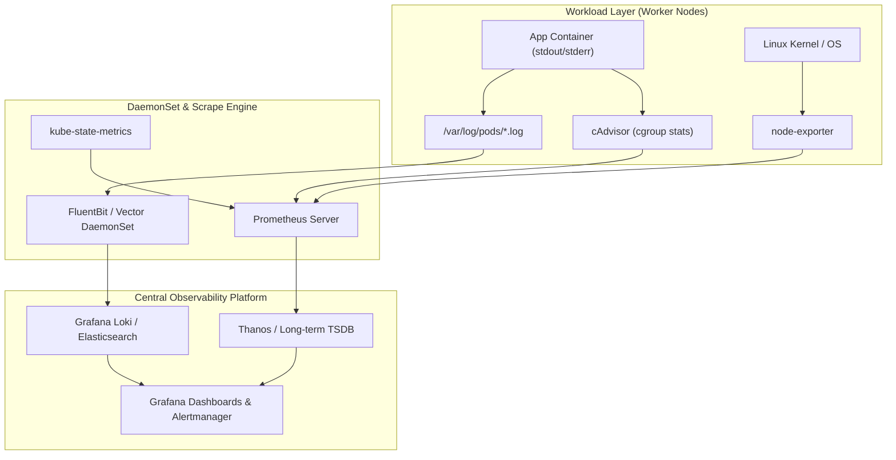
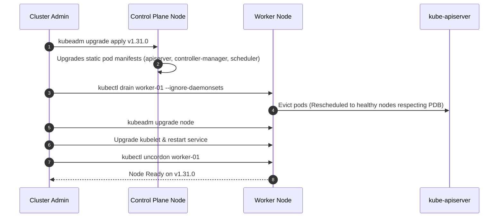

# Chapter 10: Production Operations, Observability & Disaster Recovery

> "Hope is not a strategy. In large-scale distributed systems, failure is not an exceptional circumstance; it is an ambient, continuous state of reality."  
> — *Site Reliability Engineering: How Google Runs Production Systems (O'Reilly)*
>
> "Cluster administration and maintenance—performing seamless node drains, kubeadm version upgrades, and etcd disaster recovery—form the backbone of the practical CKA examination and real-world 24/7 cluster operations."  
> — *Benjamin Muschko, Certified Kubernetes Administrator (CKA) Study Guide*

---

## 📊 1. Full-Stack Kubernetes Observability Pipeline

Observability in a production Kubernetes cluster requires correlating telemetry across four distinct physical and logical abstraction layers: Host Infrastructure, Container Runtime, Kubernetes Control Plane, and Application Microservices.

```
===================================================================================================
                                 KUBERNETES OBSERVABILITY STACK
===================================================================================================

  +-----------------------------------------------------------------------------------------------+
  |                            APPLICATIONS & TRACING (OpenTelemetry)                             |
  |   - Distributed Context Propagation (W3C Traceparent headers)                                 |
  |   - Jaeger / Grafana Tempo Distributed Tracing Collector                                      |
  +-----------------------------------------------+-----------------------------------------------+
                                                  |
  +-----------------------------------------------+-----------------------------------------------+
  |                             METRICS ENGINE (Prometheus Ecosystem)                             |
  |                                                                                               |
  |  +------------------------+   +------------------------+   +------------------------------+   |
  |  |   kube-state-metrics   |   |   node-exporter        |   |       cAdvisor               |   |
  |  |  (Object health: Pods, |   |  (Host metrics: disk,  |   |  (Container cgroup stats:    |   |
  |  |   Deployments, PVCs)   |   |   NICs, kernel stats)  |   |   CPU throttling, OOM kills) |   |
  |  +-----------+------------+   +-----------+------------+   +--------------+---------------+   |
  |              |                            |                               |                   |
  |              +----------------------------+-------------------------------+                   |
  |                                           v                                                   |
  |                        Prometheus / Thanos / VictoriaMetrics TSDB                             |
  +-----------------------------------------------+-----------------------------------------------+
                                                  |
  +-----------------------------------------------+-----------------------------------------------+
  |                             LOGGING PIPELINE (DaemonSet Engine)                               |
  |                                                                                               |
  |  Pods write to stdout/stderr ---> Linux JSON logs: /var/log/pods/<pod>/*/*.log                |
  |                                                    |                                          |
  |                                                    v (Inotify file streaming)                 |
  |                                       Vector / FluentBit DaemonSet                            |
  |                                                    | (Filter, enrich with pod labels)         |
  |                                                    v                                          |
  |                                    Elasticsearch / OpenSearch / Grafana Loki                  |
  +-----------------------------------------------------------------------------------------------+
```



---

## 🚨 2. The Golden Signals for Production Cluster Health

Monitoring Kubernetes requires alerting on root indicators rather than symptom noise. Production Site Reliability Engineers track these core signals:

| Component | Metric Name | Critical Threshold | Root Cause & Operational Impact |
| :--- | :--- | :--- | :--- |
| **API Server** | `apiserver_request_duration_seconds_bucket` | $P_{99} > 1.0\text{s}$ for `LIST` | etcd disk latency high, unindexed client queries, controller thrashing. |
| **etcd Quorum** | `etcd_disk_backend_commit_duration_seconds` | $P_{99} > 25\text{ms}$ | Disk I/O bottleneck; Raft heartbeat missed; risks leader election storms! |
| **Container Runtime** | `container_cpu_cfs_throttled_periods_total` | $> 25\%$ of periods | CPU limits set too aggressively; latency spikes on client threads. |
| **Memory Pressure** | `container_memory_working_set_bytes` | $> 90\%$ of limit | Imminent kernel `OOMKilled` (Exit Code 137). |
| **Pod Lifecycle** | `kube_pod_container_status_restarts_total` | Rate $> 0.2/\text{min}$ | `CrashLoopBackOff`; failed liveness probes or unhandled exceptions. |
| **Node Disk** | `node_filesystem_free_bytes` | $< 15\%$ available | Kubelet initiates Pod eviction due to `DiskPressure`. |

---

## 🛡️ 3. PodDisruptionBudgets (PDB): Protecting Workload Availability

When an administrator drains a worker node for kernel patching or cluster upgrades, Kubernetes evicts running Pods. Without protection, a cluster upgrade can inadvertently evict all replicas of a critical service simultaneously.

A **PodDisruptionBudget (PDB)** limits the number of simultaneously evicted pods during voluntary disruptions:

```yaml
apiVersion: policy/v1
kind: PodDisruptionBudget
metadata:
  name: payment-service-pdb
  namespace: checkout
spec:
  minAvailable: 2 # Guarantees at least 2 pods remain running and Ready at all times
  # Alternatively: maxUnavailable: 1
  selector:
    matchLabels:
      app: payment-service
```

> [!IMPORTANT]
> **Voluntary vs. Involuntary Disruptions:**
> PDBs protect strictly against **voluntary disruptions** (`kubectl drain`, cluster autoscaler scale-down, node upgrades).
> PDBs **cannot** prevent involuntary disruptions (physical hardware failure, kernel panic, power outage).

---

## 🔄 4. Zero-Downtime Cluster Upgrades with `kubeadm` (CKA Core Domain)

Upgrading a Kubernetes cluster must strictly follow the version skew policy: **Control Plane First, Worker Nodes Second**. You can never upgrade across more than one minor release at a time (e.g., $1.30 \to 1.31$ is valid; $1.29 \to 1.31$ is unsupported).

```
===================================================================================================
                                  KUBEADM UPGRADE SEQUENCE
===================================================================================================

  [ Step 1: Control Plane Node 1 ]
  1. apt-get update && apt-get install -y kubeadm=1.31.0-00
  2. kubeadm upgrade plan
  3. kubeadm upgrade apply v1.31.0
  4. kubectl drain control-plane-01 --ignore-daemonsets
  5. apt-get install -y kubelet=1.31.0-00 kubectl=1.31.0-00
  6. systemctl daemon-reload && systemctl restart kubelet
  7. kubectl uncordon control-plane-01

  [ Step 2: Worker Nodes (Sequentially) ]
  1. kubectl drain worker-01 --ignore-daemonsets --delete-emptydir-data
  2. apt-get install -y kubeadm=1.31.0-00
  3. kubeadm upgrade node
  4. apt-get install -y kubelet=1.31.0-00
  5. systemctl daemon-reload && systemctl restart kubelet
  6. kubectl uncordon worker-01
===================================================================================================
```



---

## 💾 5. etcd Disaster Recovery: Backup & Restore Runbook

`etcd` is the distributed datastore holding all cluster state. If `etcd` loses quorum or suffers disk corruption, the entire cluster becomes unresponsive.

```
===================================================================================================
                                    etcd DISASTER RECOVERY FLOW
===================================================================================================

  1. Active Control Plane            2. Take Atomic Snapshot              3. Disaster: Quorum Lost
  +---------------------+            +---------------------+              +---------------------+
  |   kube-apiserver    |            | etcdctl snapshot    |              |  etcd database      |
  |   (Active writes)   |            | save /backup.db     |              |  corrupted / wiped  |
  +----------+----------+            +----------+----------+              +----------+----------+
             │                                  │                                    │
             v                                  v                                    v
  +---------------------+            +---------------------+              +---------------------+
  |     etcd Leader     |            | Verified Snapshot   |              | Stop all Apiservers |
  |   (Port 2379 mTLS)  |            | (sha256 checked)    |              | Restore from Backup |
  +---------------------+            +---------------------+              +---------------------+
```

### 5.1 Atomic Snapshot Backup Command
```bash
# Export environment flag for etcd v3 API
export ETCDCTL_API=3

# Execute snapshot with mTLS certificates
etcdctl --endpoints=https://127.0.0.1:2379 \
  --cacert=/etc/kubernetes/pki/etcd/ca.crt \
  --cert=/etc/kubernetes/pki/etcd/server.crt \
  --key=/etc/kubernetes/pki/etcd/server.key \
  snapshot save /var/backups/etcd-snapshot-$(date +%Y%m%d_%H%M%S).db

# Verify snapshot integrity immediately (Must return non-zero Revision and Total Keys)
etcdctl snapshot status /var/backups/etcd-snapshot-latest.db -w table
```

### 5.2 Restoration Runbook (Restoring Quorum on Control Plane)
1. **Stop all active API server instances:**
   Move static pod manifests out of the kubelet auto-mount directory:
   ```bash
   mv /etc/kubernetes/manifests/kube-apiserver.yaml /tmp/
   mv /etc/kubernetes/manifests/etcd.yaml /tmp/
   ```
2. **Execute Snapshot Restore into a new data directory:**
   ```bash
   ETCDCTL_API=3 etcdctl snapshot restore /var/backups/etcd-snapshot-latest.db \
     --data-dir=/var/lib/etcd-restored \
     --name=control-plane-01 \
     --initial-cluster=control-plane-01=https://192.168.1.10:2380 \
     --initial-cluster-token=etcd-cluster-restore-token \
     --initial-advertise-peer-urls=https://192.168.1.10:2380
   ```
3. **Update etcd Static Pod Manifest:**
   Edit `/tmp/etcd.yaml` to point the host volume mount to `/var/lib/etcd-restored`:
   ```yaml
   volumes:
   - name: etcd-data
     hostPath:
       path: /var/lib/etcd-restored
       type: DirectoryOrCreate
   ```
4. **Restore Static Pods:**
   ```bash
   mv /tmp/etcd.yaml /etc/kubernetes/manifests/
   mv /tmp/kube-apiserver.yaml /etc/kubernetes/manifests/
   ```
5. **Verify Recovery:**
   ```bash
   kubectl get nodes
   kubectl get pods -A
   ```

---

## 🎯 6. CKA Production Operations Diagnostic Cheatsheet

```bash
# 1. Drain node safely with timeout and PDB respect
kubectl drain <node> --ignore-daemonsets --delete-emptydir-data --force --timeout=120s

# 2. Check cluster-wide events sorted by timestamp
kubectl get events -A --sort-by='.metadata.creationTimestamp'

# 3. View kubelet systemd journal logs on a failed node
journalctl -u kubelet -n 100 --no-pager

# 4. Check API Server static pod logs directly on control plane
crictl ps | grep kube-apiserver
crictl logs <container-id>

# 5. Check PodDisruptionBudget status
kubectl get pdb -A

# 6. Verify cluster component statuses
kubectl get componentstatuses # (Legacy) or inspect pods in kube-system
```
