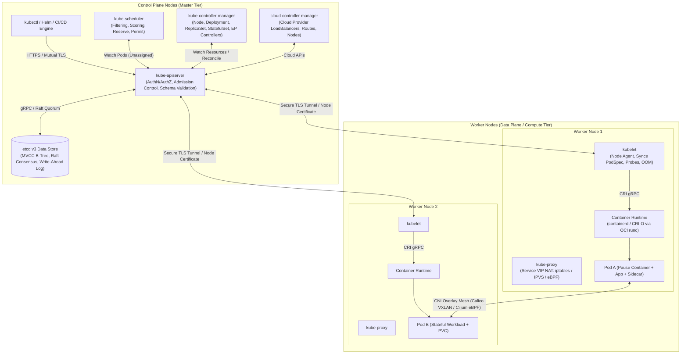

# Kubernetes Architecture & Production Engineering: Master Portal

> "Kubernetes is a portable, extensible, open-source platform for managing containerized workloads and services, that facilitates both declarative configuration and automation."  
> — *Kelsey Hightower, Brendan Burns, Joe Beda (Kubernetes: Up and Running, 3rd Edition, O'Reilly)*

---

## 🏛️ Executive Architecture: The Kubernetes Control Plane & Data Plane

Kubernetes implements a distributed, declarative, self-healing orchestration engine designed around the **Level-Triggered Reconciliation Loop** (Control Loop):

$$\text{Reconcile}() : \text{Observed Actual State} \longrightarrow \text{Desired Declared State}$$

Rather than reacting to edge-triggered events once and risking state divergence during transient failures, Kubernetes controllers continuously observe the cluster state via the **API Server Watch API**, calculate the divergence ($\Delta$) against the specifications stored in `etcd`, and execute convergent mutations.



---

## 📚 Canonical Literature & Certification Mappings

This comprehensive engineering curriculum is aligned directly with the Linux Foundation / CNCF certification syllabi and draws upon the definitive literature in the Kubernetes ecosystem:

| Certification | Focus Domain | Primary Reference Books |
| :--- | :--- | :--- |
| **CKA** (Certified Kubernetes Administrator) | Cluster Architecture, Installation, Storage, Networking, Troubleshooting | *CKA Study Guide* (Benjamin Muschko, O'Reilly)<br/>*Production Kubernetes* (Josh Rosso et al., O'Reilly)<br/>*Kubernetes: Up and Running (3rd Ed)* (Burns, Beda, Hightower) |
| **CKAD** (Certified Kubernetes Application Developer) | Pod Design, Multi-Container Pods, Deployment Rollouts, ConfigMaps/Secrets, Services | *CKAD Study Guide* (Benjamin Muschko, O'Reilly)<br/>*Kubernetes in Action (2nd Ed)* (Marko Lukša, Manning)<br/>*Cloud Native DevOps with Kubernetes* (John Arundel, O'Reilly) |
| **CKS** (Certified Kubernetes Security Specialist) | Cluster Hardening, Microservice Defense, Admission Controllers, Supply Chain Security | *CKS Study Guide* (Benjamin Muschko, O'Reilly)<br/>*Container Security* (Liz Rice, O'Reilly)<br/>*Hacking Kubernetes* (Andrew Martin & Michael Hausenblas, O'Reilly) |
| **Core Architecture & Extensibility** | Custom Resource Definitions, Controllers, Informers, Workqueues | *Programming Kubernetes* (Michael Hausenblas & Stefan Schimanski, O'Reilly)<br/>*CoreDNS: Operating DNS on Kubernetes* (John Belamaric & Cricket Liu) |

---

## 📑 Complete Chapter Roadmap

### [01. Control Plane & Node Architecture Internals](file:///Users/kunalkumar/desktop/knowledge-base/Projects/k8s/01.%20Control%20Plane%20&%20Node%20Architecture%20Internals.md)
- `kube-apiserver` request pipeline: Authentication (X.509, Webhooks, OIDC), Authorization (RBAC, Node AuthZ), Mutating & Validating Admission Webhooks, Schema Validation, Storage commit.
- `etcd v3` distributed data store: Raft consensus, Multi-Version Concurrency Control (MVCC), BoltDB B-Tree disk layout, key revisions, snapshot compaction, quorum arithmetic.
- `kube-controller-manager` & `kube-scheduler`: Informer architecture, Reflector, DeltaFIFO, workqueue, scheduling pipeline (QueueSort, Filter, PreScore, Score, Reserve, Permit, Bind).
- `kubelet` internals: SyncLoop mechanics, PLEG (Pod Lifecycle Event Generator), cgroup managers (`cfs_quota_us`, systemd vs cgroupfs), Container Runtime Interface (CRI) gRPC protocol.
- `kube-proxy`: Packet filtering architectures (iptables chains, IPVS hash tables, and Cilium eBPF socket-level redirection).

### [02. Pod Anatomy, Lifecycle & Container Runtime Interface (CRI)](file:///Users/kunalkumar/desktop/knowledge-base/Projects/k8s/02.%20Pod%20Anatomy%2C%20Lifecycle%20%26%20Container%20Runtime%20Interface%20%28CRI%29.md)
- The Linux container primitive: Namespaces (`ipc`, `net`, `mnt`, `pid`, `uts`), cgroups v1 vs v2, and the role of the **`pause` container** in holding shared network/IPC namespaces.
- Pod lifecycle state transitions: `Pending`, `Running`, `Succeeded`, `Failed`, `Unknown`, and container exit code diagnostics (OOMKilled 137, Command not found 127, Fatal error 1).
- Initialization & Sidecar patterns: `initContainers` sequential ordering guarantees, native Kubernetes sidecars (`restartPolicy: Always`), ephemeral debug containers (`kubectl debug`).
- Container health monitoring: Startup, Liveness, and Readiness probes (HTTP, TCP Socket, Exec, gRPC) and their impact on EndpointSlices.
- Container Runtime Interface (CRI): containerd architecture, `containerd-shim`, and Open Container Initiative (OCI) `runc` runtime.

### [03. Workload Controllers (Deployments, StatefulSets, DaemonSets)](file:///Users/kunalkumar/desktop/knowledge-base/Projects/k8s/03.%20Workload%20Controllers%20%28Deployments%2C%20StatefulSets%2C%20DaemonSets%29.md)
- **Deployments & ReplicaSets**: Declarative rolling updates, mathematical sizing of `maxSurge` and `maxUnavailable`, revision history limits, rollback mechanics, pause/resume.
- **StatefulSets**: Identity guarantees, stable network hostnames (`$(statefulset-name)-$(ordinal)`), Headless Services, ordinal startup/teardown sequences, dynamic `volumeClaimTemplates`.
- **DaemonSets**: Guaranteeing pod execution across all schedulable nodes, handling node taints (`node.kubernetes.io/unschedulable`), rolling updates with `maxSurge`.
- **Batch Workloads**: Jobs (completions, parallelism, backoffLimit) and CronJobs (concurrency policies: `Allow`, `Forbid`, `Replace`, timezone handling).

### [04. Networking Deep Dive - CNI, Services, kube-proxy & Ingress](file:///Users/kunalkumar/desktop/knowledge-base/Projects/k8s/04.%20Networking%20Deep%20Dive%20-%20CNI%2C%20Services%2C%20kube-proxy%20%26%20Ingress.md)
- The 4 Fundamental Kubernetes Networking Rules: Container-to-Container, Pod-to-Pod, Pod-to-Service, External-to-Service.
- Container Network Interface (CNI): IPAM (Host-Local vs Calico IPAM), veth pairs, routing models (Overlay VXLAN/Geneve vs Flat BGP routed networks).
- CoreDNS Internals: Service DNS resolution (`my-svc.my-namespace.svc.cluster.local`), SRV records, upstream forwarding, `ndots:5` search latency penalty and solutions.
- Services & Virtual IPs: ClusterIP, NodePort, LoadBalancer, ExternalName, and the migration from Endpoints to scalable `EndpointSlices`.
- Ingress vs Gateway API: Layer 7 reverse proxy routing, TLS termination, path-based routing, and the next-generation `GatewayClass`, `Gateway`, and `HTTPRoute` primitives.

### [05. Storage Architecture - PVs, PVCs, StorageClasses & CSI](file:///Users/kunalkumar/desktop/knowledge-base/Projects/k8s/05.%20Storage%20Architecture%20-%20PVs%2C%20PVCs%2C%20StorageClasses%20%26%20CSI.md)
- Ephemeral vs Persistent Volumes: `emptyDir` (RAM/Disk), `hostPath`, and networked persistent storage.
- PersistentVolumes (PV) & PersistentVolumeClaims (PVC): The two-phase binding lifecycle, AccessModes (`ReadWriteOnce`, `ReadOnlyMany`, `ReadWriteMany`, `ReadWriteOncePod`), Reclaim Policies (`Retain`, `Delete`).
- Dynamic Provisioning with StorageClasses: Provisioners, volume expansion (`allowVolumeExpansion: true`), volume binding modes (`Immediate` vs `WaitForFirstConsumer`).
- Container Storage Interface (CSI) Architecture: CSI Controller plugin (`CreateVolume`, `ControllerPublishVolume`), CSI Node plugin (`NodeStageVolume`, `NodePublishVolume`).

### [06. Configuration & Secret Management (ConfigMaps, Secrets, Vault)](file:///Users/kunalkumar/desktop/knowledge-base/Projects/k8s/06.%20Configuration%20%26%20Secret%20Management%20%28ConfigMaps%2C%20Secrets%2C%20Vault%29.md)
- ConfigMaps: Creating from files, directories, and literals; injecting via environment variables, `envFrom`, and volume mounts; live updates vs immutable ConfigMaps (`immutable: true`).
- Secrets: Base64 encoding vs encryption, Secret types (`Opaque`, `kubernetes.io/tls`, `kubernetes.io/dockerconfigjson`), memory-backed tmpfs volume mounting.
- Secret Encryption at Rest: Configuring `EncryptionConfiguration` with KMS v2 envelope encryption (AWS KMS, GCP KMS, Vault).
- External Secret Management: External Secrets Operator (ESO) syncing HashiCorp Vault / Cloud Secret Managers into native Kubernetes Secrets.

### [07. Security, RBAC, Admission Controllers & NetworkPolicies](file:///Users/kunalkumar/desktop/knowledge-base/Projects/k8s/07.%20Security%2C%20RBAC%2C%20Admission%20Controllers%20%26%20NetworkPolicies.md)
- Authentication (AuthN): X.509 client certificates, OpenID Connect (OIDC) with identity providers, ServiceAccount JWT tokens (Projected ServiceAccount Tokens).
- Authorization (AuthZ) & RBAC: Roles vs ClusterRoles, RoleBindings vs ClusterRoleBindings, least privilege scoping, API Groups, verbs.
- Admission Controllers: Mutating vs Validating webhooks, Kubernetes 1.28+ native `ValidatingAdmissionPolicy` (CEL expressions), OPA Gatekeeper, Kyverno.
- Pod Security Standards (PSS): `Privileged`, `Baseline`, `Restricted` levels enforced via namespace labels (`pod-security.kubernetes.io/enforce`).
- Zero-Trust NetworkPolicies: Default-deny ingress/egress, label-selector whitelisting, CIDR blocks, namespace selectors.

### [08. Scheduling, Resource Management & Autoscaling (HPA, VPA, Karpenter)](file:///Users/kunalkumar/desktop/knowledge-base/Projects/k8s/08.%20Scheduling%2C%20Resource%20Management%20%26%20Autoscaling%20%28HPA%2C%20VPA%2C%20Karpenter%29.md)
- Resource Allocation: CPU millicores, Memory bytes, `requests` (scheduling floor) vs `limits` (throttling and OOM ceiling), CFS quota period math.
- Quality of Service (QoS) Classes: `Guaranteed`, `Burstable`, `BestEffort` and Linux kernel `oom_score_adj` eviction prioritization.
- Advanced Placement: `nodeSelector`, `nodeAffinity` (hard vs soft), `podAffinity` / `podAntiAffinity` for high availability across failure domains, Taints and Tolerations.
- Autoscaling: Horizontal Pod Autoscaler (HPA v2 metrics, stabilization windows), Vertical Pod Autoscaler (VPA recommendation vs auto-restart), Cluster Autoscaler vs **Karpenter** (Just-in-time direct cloud node provisioning).

### [09. Extensibility - CRDs, Custom Controllers & Operator Pattern](file:///Users/kunalkumar/desktop/knowledge-base/Projects/k8s/09.%20Extensibility%20-%20CRDs%2C%20Custom%20Controllers%20%26%20Operator%20Pattern.md)
- Custom Resource Definitions (CRDs): Structural schemas, OpenAPI v3 validation, custom columns, `/status` and `/scale` subresources, version conversion webhooks.
- `client-go` Internals: Reflector, Informer, Indexer, ThreadSafeStore, DeltaFIFO, and rate-limiting WorkQueue architecture.
- The Operator Pattern: Writing production Kubernetes operators in Go using **Kubebuilder** and `controller-runtime`, implementing idempotent `Reconcile()` loops, finalizers, and owner references for garbage collection.

### [10. Production Operations, Observability & Disaster Recovery](file:///Users/kunalkumar/desktop/knowledge-base/Projects/k8s/10.%20Production%20Operations%2C%20Observability%20%26%20Disaster%20Recovery.md)
- Cluster Maintenance: Zero-downtime cluster upgrades with `kubeadm` (`kubeadm upgrade apply`, `kubectl drain`, `kubeadm upgrade node`), handling etcd versions.
- Disaster Recovery: `etcdctl snapshot save` and `etcdctl snapshot restore` procedures, verification of quorum data integrity.
- Observability: Prometheus metrics scraping, Prometheus Operator (ServiceMonitors), cAdvisor metrics, Fluentbit log collection, OpenTelemetry tracing.
- Troubleshooting Diagnostics: Systematic failure triage (CrashLoopBackOff, ImagePullBackOff, Pending, Evicted, OOMKilled), debugging static pods via `crictl` and `journalctl`.

---

## ⚖️ Architectural Comparison: Service Virtual IP Routing

| Dimension | `iptables` Mode | `IPVS` Mode | `Cilium eBPF` Mode |
| :--- | :--- | :--- | :--- |
| **Algorithmic Complexity** | $\mathcal{O}(N)$ sequential rule evaluation | $\mathcal{O}(1)$ IPVS hash table lookups | $\mathcal{O}(1)$ direct kernel BPF map lookup |
| **Performance at 10,000+ Services** | Severe latency degradation, slow table rewrites | High throughput, sub-millisecond route resolution | Zero netfilter traversal, near line-rate speed |
| **Load Balancing Algorithms** | Random probability selection only | Round-Robin, Least-Connection, Source Hash | Consistent Hashing, Topology-Aware, Weighted |
| **Packet Path** | Traverses `PREROUTING`, `KUBE-SERVICES` chains | Linux IPVS netfilter kernel module | Hooked directly at socket layer / XDP driver |
| **Debugging Tools** | `iptables-save`, massive chain jump analysis | `ipvsadm -ln` clean connection tables | `bpftool`, `cilium monitor` packet tracer |

---

## 🎯 Certified Kubernetes Administrator (CKA/CKAD/CKS) Quick Reference

```
+-------------------------------------------------------------------------------+
|                       CKA / CKAD / CKS RAPID CHEATSHEET                       |
+-------------------------------------------------------------------------------+
| Imperative Generation (Never write YAML from scratch in exams!):               |
|   kubectl run nginx --image=nginx --dry-run=client -o yaml > pod.yaml         |
|   kubectl create deploy web --image=nginx --replicas=3 --dry-run=client -o yaml|
|   kubectl expose deploy web --port=80 --target-port=8080 --type=ClusterIP     |
|   kubectl create job my-job --image=busybox --dry-run=client -o yaml -- date   |
|                                                                               |
| Node Maintenance & Draining:                                                  |
|   kubectl cordon <node-name>             # Mark node unschedulable            |
|   kubectl drain <node-name> --ignore-daemonsets --delete-emptydir-data        |
|   kubectl uncordon <node-name>           # Re-enable scheduling               |
|                                                                               |
| etcd Backup & Restoration:                                                    |
|   ETCDCTL_API=3 etcdctl --endpoints=https://127.0.0.1:2379 \                  |
|     --cacert=/etc/kubernetes/pki/etcd/ca.crt \                                |
|     --cert=/etc/kubernetes/pki/etcd/server.crt \                              |
|     --key=/etc/kubernetes/pki/etcd/server.key \                               |
|     snapshot save /var/lib/etcd-backup.db                                     |
|                                                                               |
| Troubleshooting Pod Failures:                                                 |
|   kubectl describe pod <pod-name>        # Inspect Events section at bottom!  |
|   kubectl logs <pod-name> -c <container> --previous  # Read crashed logs      |
|   crictl ps / crictl logs <container-id> # When kubelet fails to start pods   |
+-------------------------------------------------------------------------------+
```
