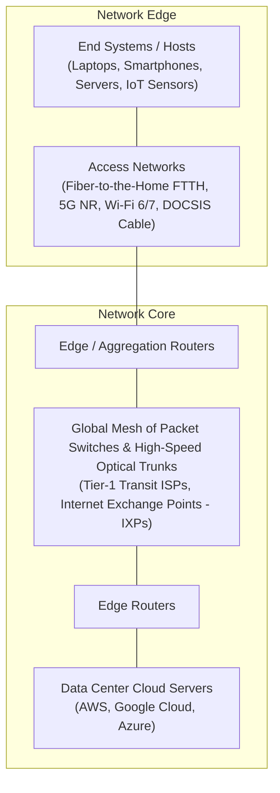
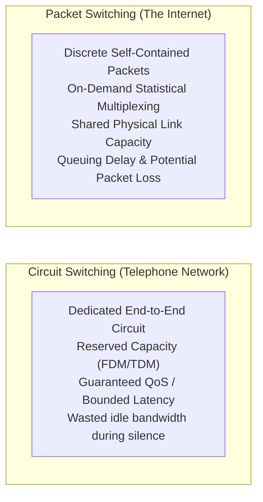
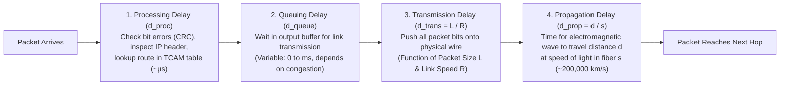

# Chapter 01: Foundations & Network Core — Delays, Loss & Protocol Stacks

> "The Internet is not a monolithic machine, but a decentralized network of networks. At its core lies packet switching—a design philosophy that trades deterministic timing guarantees for extraordinary efficiency, flexibility, and global scale."  
> — *James F. Kurose & Keith W. Ross, Computer Networking: A Top-Down Approach*

---

## 📚 Recommended Book References
- **Computer Networking: A Top-Down Approach (Kurose & Ross, 8th Ed)**: Chapter 1 (Computer Networks and the Internet: Core concepts, Delays, Protocol Layers).
- **Computer Networks (Tanenbaum & Wetherall, 5th/6th Ed)**: Chapter 1 (Introduction: Hardware, Software, Reference Models, Metric Units).
- **TCP/IP Illustrated, Volume 1: The Protocols (Stevens & Fall, 2nd Ed)**: Chapter 1 (Introduction to TCP/IP & Encapsulation).
- **Internetworking with TCP/IP, Volume 1 (Douglas Comer, 6th Ed)**: Chapter 1–3 (Network Organization, Internet Architecture).

---

## 1. The Network Edge vs. The Network Core

A computer network is logically divided into two primary zones:



### 1.1 ISP Hierarchy & Peering Economics
The global Internet is structured as a hierarchical topology of autonomous networks:
1. **Tier-1 ISPs (Global Backbone Providers)**: Commercial giants (e.g., Lumen, NTT, Telia, AT&T) that operate transcontinental fiber cables and peer with all other Tier-1 providers without paying transit fees (**Settlement-Free Peering**).
2. **Tier-2 & Regional ISPs**: Purchase transit bandwidth from Tier-1 ISPs to reach the global routing table.
3. **Internet Exchange Points (IXPs)**: Physical switching facilities where hundreds of commercial ISPs, Content Delivery Networks (CDNs like Cloudflare, Akamai), and hyperscalers (Google, Meta) interconnect directly to exchange traffic without paying transit fees (**BGP Peering**).

---

## 2. Circuit Switching vs. Packet Switching

How should data be transported through the network core?



### 2.1 Statistical Multiplexing: Mathematical Proof of Efficiency
Suppose users share a **$1\text{ Mbps}$** physical link. Each user requires **$100\text{ kbps}$** when transmitting, but each user transmits only **$10\%$ of the time** ($p = 0.1$).

- **Under Circuit Switching (TDM/FDM)**:
  $$\text{Max Users} = \frac{1\text{ Mbps}}{100\text{ kbps}} = \mathbf{10\text{ users}}$$
  The link cannot admit an 11th user, even if the other 10 are completely idle!

- **Under Packet Switching**:
  Suppose we admit **$35$ users**. Using the **Binomial Distribution**, what is the probability that $11$ or more users transmit simultaneously (causing link congestion)?
  $$P(X \ge 11) = \sum_{k=11}^{35} \binom{35}{k} (0.1)^k (0.9)^{35-k} \approx \mathbf{0.0004} \quad (\mathbf{0.04\%}!)$$
  With packet switching, the link supports **3.5x more users** with a $99.96\%$ probability that zero queuing occurs! This is the fundamental economic and technical engine of the Internet.

---

## 3. The Four Sources of Packet Delay

When a packet travels from source to destination across a chain of routers, the total nodal delay experienced at each hop is the sum of four distinct delay components:

$$d_{\text{nodal}} = d_{\text{proc}} + d_{\text{queue}} + d_{\text{trans}} + d_{\text{prop}}$$



### 3.1 Mathematical Definitions & Physical Realities

| Delay Component | Formula | Primary Cause | Typical Magnitude |
| :--- | :--- | :--- | :--- |
| **Nodal Processing ($d_{\text{proc}}$)** | — | Router CPU / ASIC hardware header inspection and checksum calculation | $< 10\text{ µs}$ |
| **Queuing Delay ($d_{\text{queue}}$)** | Depends on traffic | Packets buffering in router memory awaiting transmission | $0\text{ to } 100\text{ ms}$ |
| **Transmission Delay ($d_{\text{trans}}$)** | $\mathbf{\frac{L}{R}}$ | Time to push $L$ bits onto link with transmission rate $R$ bps | Nanoseconds to milliseconds |
| **Propagation Delay ($d_{\text{prop}}$)** | $\mathbf{\frac{d}{s}}$ | Physical distance $d$ divided by propagation speed in medium $s$ | Distance-bound (~5 µs per km in fiber) |

### 3.2 Queuing Delay & Traffic Intensity ($I$)
Let:
- $L$ = Packet length in bits.
- $a$ = Average packet arrival rate (packets/sec).
- $R$ = Transmission rate of the outgoing link (bits/sec).

The dimensionless ratio $\mathbf{I = \frac{La}{R}}$ is the **Traffic Intensity**:
- If $I \approx 0$: Very little traffic; average queuing delay is near zero ($d_{\text{queue}} \approx 0$).
- If $I \to 1$: Traffic approaches link capacity; queuing delay explodes exponentially ($d_{\text{queue}} \to \infty$).
- If $I > 1$: Arrival rate exceeds departure rate; router buffers overflow, causing **Packet Loss (Drops)**!

### 3.3 The Bandwidth-Delay Product (BDP)
$$\text{BDP} = R \times \text{RTT}$$
The **Bandwidth-Delay Product** measures the maximum number of unacknowledged bits that can be "in flight" inside the physical network pipe simultaneously.
- *Example*: A transcontinental 10 Gbps link with 80 ms RTT:
  $$\text{BDP} = 10 \times 10^9\text{ bps} \times 0.080\text{ s} = 800,000,000\text{ bits} = \mathbf{100\text{ Megabytes!}}$$
  A sender must be able to buffer at least $100\text{ MB}$ of unacknowledged data in its socket buffers to saturate the link!

---

## 4. Layered Protocol Stacks: OSI 7-Layer vs. TCP/IP 5-Layer

Modern networking uses a **layered protocol stack** based on separation of concerns. Each layer provides services to the layer above while hiding lower-level implementation details.

```mermaid
flowchart TD
    subgraph OSI_7_Layer_Referenc_132 ["OSI 7-Layer Reference Model"]
        O7["7. Application (HTTP, DNS, SSH, gRPC)"]
        O6["6. Presentation (Encryption, Compression, Serialization)"]
        O5["5. Session (RPC Handshakes, Connection Checkpoints)"]
        O4["4. Transport (TCP, UDP, QUIC)"]
        O3["3. Network (IPv4, IPv6, BGP, OSPF)"]
        O2["2. Data Link (Ethernet, Wi-Fi 802.11, ARP)"]
        O1["1. Physical (Optical Fiber, Copper Twisting, Radio Frequencies)"]
        O7 --- O6 --- O5 --- O4 --- O3 --- O2 --- O1
    end

    subgraph Practical_Internet_T_133 ["Practical Internet TCP/IP 5-Layer Model"]
        T5["5. Application (HTTP/3, DNS, TLS integrated)"]
        T4["4. Transport (End-to-end process multiplexing, TCP/UDP)"]
        T3["3. Network (Host-to-host datagram routing, IP)"]
        T2["2. Link (Node-to-node frame transfer, Ethernet/MAC)"]
        T1["1. Physical (Raw electromagnetic bit streaming)"]
        T5 --- T4 --- T3 --- T2 --- T1
    end
```



### 4.1 Encapsulation and Decapsulation Walkthrough
As user data descends the sender's protocol stack, each layer prepends a **Protocol Header** (and occasionally appends a Trailer):

```
+-------------------------------------------------------------------------------+
| Application Layer: [ HTTP Request Payload ]                                   |
+-------------------------------------------------------------------------------+
                                      │
                                      ▼
+-----------------------+-------------------------------------------------------+
| Transport Layer (TCP):| [ TCP Header (20B) ] | HTTP Payload                   |
+-----------------------+-------------------------------------------------------+
                                      │
                                      ▼
+-----------------------+-------------------------------------------------------+
| Network Layer (IP):   | [ IP Header (20B) ] | TCP Header | HTTP Payload       |
+-----------------------+-------------------------------------------------------+
                                      │
                                      ▼
+-----------------------+-----------------------------------------------+-------+
| Link Layer (Ethernet):| [ Eth Header (14B) ] | IP | TCP | HTTP Payload |[CRC 4B|
+-----------------------+-----------------------------------------------+-------+
                                      │
                                      ▼
Physical Layer: 0110100101101110011101000110010101110010011011100110010101110100...
```

---
