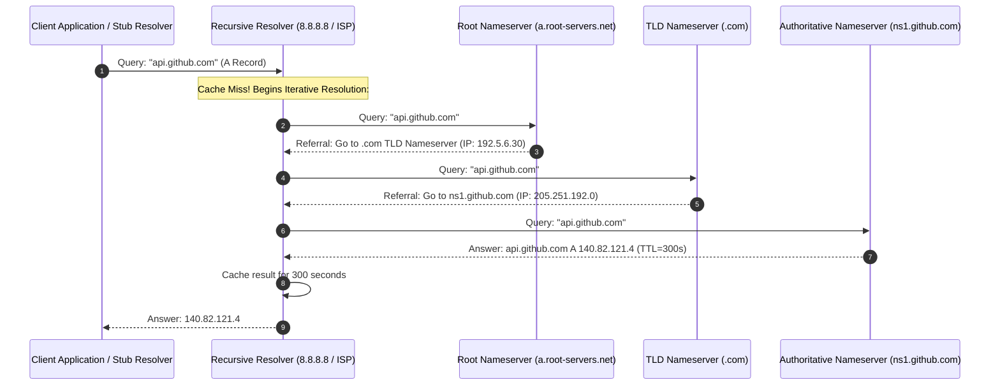
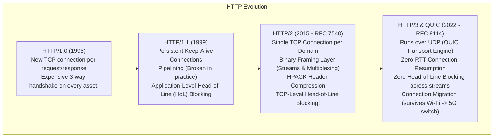
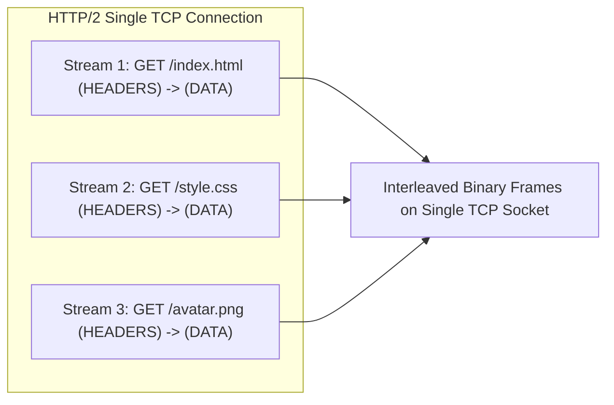
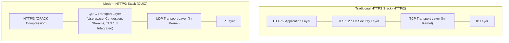
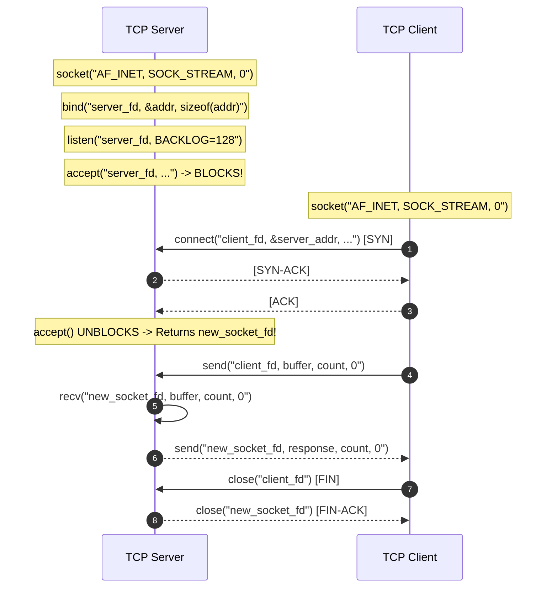

# Chapter 02: Application Layer — HTTP Evolution, DNS & Socket Programming

> "The application layer is where the network becomes useful. From the hierarchical foundations of DNS to the multiplexed binary streams of HTTP/3 over QUIC, application protocols shape the performance, security, and developer experience of the modern web."  
> — *Ilya Grigorik, High Performance Browser Networking*

---

## 📚 Recommended Book References
- **Computer Networking: A Top-Down Approach (Kurose & Ross, 8th Ed)**: Chapter 2 (Application Layer: Web & HTTP, DNS, Socket Programming).
- **High Performance Browser Networking (Ilya Grigorik)**: Chapters 8–12 (HTTP/1.X, HTTP/2, HTTP/3, WebSockets, WebRTC).
- **Unix Network Programming, Volume 1: The Sockets Networking API (W. Richard Stevens)**: Chapters 3–6 (Sockets API Architecture).
- **RFC Specifications**: RFC 2616 (HTTP/1.1), RFC 7540 (HTTP/2), RFC 9000 & 9114 (QUIC & HTTP/3), RFC 1034 & 1035 (DNS).

---

## 1. The Domain Name System (DNS): Internet Directory Architecture

The **Domain Name System (DNS)** is an application-layer protocol running over UDP/TCP port 53 that translates human-friendly hostnames (`api.github.com`) into routable IP addresses (`140.82.121.4`).



### 1.1 DNS Resource Record (RR) Types
DNS entries are stored in distributed database files as Resource Records:
- **`A`**: Maps hostname to IPv4 address (`example.com $\to$ 93.184.216.34`).
- **`AAAA`**: Maps hostname to 128-bit IPv6 address (`example.com $\to$ 2606:2800:220:1:248:1893:25c8:1946`).
- **`CNAME` (Canonical Name)**: Maps alias hostname to another canonical hostname (`www.example.com $\to$ example.com`).
- **`MX` (Mail Exchange)**: Identifies SMTP mail server for the domain with relative priority.
- **`NS` (Name Server)**: Delegates domain resolution to an authoritative nameserver.
- **`TXT`**: Arbitrary text attributes; widely used for email authenticity verification (**SPF, DKIM, DMARC**).

### 1.2 Modern DNS Security & Privacy
- **DNS Poisoning & Kaminsky Attack**: An attacker floods a recursive resolver with forged UDP responses matching randomized 16-bit Transaction IDs before the legitimate nameserver can answer.
- **DNSSEC (DNS Security Extensions)**: Cryptographically signs all Resource Records using asymmetric public keys (RRSIG, DNSKEY, DS records), proving data integrity and authenticity.
- **DNS over HTTPS (DoH / RFC 8484) & DNS over TLS (DoT / RFC 7858)**: Encrypts DNS lookups over TLS to prevent surveillance, tampering, and ISP snooping.

---

## 2. The Evolution of the Hypertext Transfer Protocol (HTTP)



### 2.1 HTTP/1.1: Persistent Connections & Head-of-Line (HoL) Blocking
HTTP/1.1 introduced `Connection: keep-alive`, reusing an established TCP connection across multiple sequential HTTP requests.
- **The Application Head-of-Line (HoL) Bottleneck**: Under HTTP/1.1, responses **must be sent strictly in the order requested**. If request #1 is an expensive database query taking 2 seconds, requests #2, #3, and #4 are completely blocked, even if ready instantly!
- **Hacks to Mitigate**: Browsers opened 6 parallel TCP connections per domain; engineers implemented **Domain Sharding** (`img1.site.com`, `img2.site.com`) and CSS/JS asset bundling.

---

### 2.2 HTTP/2: Binary Framing & Stream Multiplexing
HTTP/2 discarded ASCII plain text, inserting a **Binary Framing Layer** between HTTP and TCP:

```
+---------------------------------------------------------------+
| Length (24 bits) | Type (8 bits) | Flags (8 bits) | R |Stream ID(31b)|
+---------------------------------------------------------------+
| Frame Payload (Variable Length)...                            |
+---------------------------------------------------------------+
```



#### Key HTTP/2 Features:
1. **Multiplexing**: Independent bidirectional streams are interleaved on a single TCP connection.
2. **HPACK Compression**: Headers are compressed using differential encoding with **Static Tables** (pre-defined common headers like `:method: GET`) and **Dynamic Tables** (storing repeated custom headers like cookies across the session).
3. **The Hidden TCP Flaw**: Because HTTP/2 multiplexes all streams over a single TCP connection, if **a single packet is dropped** by the network, the underlying TCP stack pauses **all streams** until the missing packet is retransmitted! This is **TCP-Level Head-of-Line Blocking**.

---

### 2.3 HTTP/3 & QUIC: The UDP Revolution

HTTP/3 completely abandons TCP, operating over **QUIC** (Quick UDP Internet Connections) directly on top of UDP.



#### Why HTTP/3 Solves the Core Flaws of the Internet:
1. **Independent Stream Processing (No HOL Blocking)**: In QUIC, each stream has its own independent sequence tracking. If a packet on Stream 3 is dropped, Stream 1 and Stream 2 continue streaming without pause!
2. **0-RTT Connection Establishment**: QUIC integrates the TLS 1.3 cryptographic handshake directly into the transport handshake. On repeat connections, data can be transmitted in the very first network packet (**Zero RTT**)!
3. **Connection Migration via Connection IDs**: TCP connections are defined by the 4-tuple `(src_ip, src_port, dst_ip, dst_port)`. When a user walks out of their house and their phone switches from Wi-Fi to 5G, the IP address changes, abruptly breaking all active TCP connections! QUIC replaces IP addresses with a 64-bit **Connection ID**; the session survives IP address switches seamlessly without reconnecting!

---

## 3. Real-Time Web Protocols: WebSockets, SSE & WebRTC

| Feature | Polling / Long Polling | Server-Sent Events (SSE) | WebSockets (`ws://`, `wss://`) | WebRTC |
| :--- | :--- | :--- | :--- | :--- |
| **Protocol** | Standard HTTP/1.1 | HTTP text stream | Custom Framing (RFC 6455) | UDP / DTLS-SRTP |
| **Direction** | Unidirectional (Client pull) | **Unidirectional (Server push)** | **Full-Duplex (Bidirectional)** | **Peer-to-Peer Full-Duplex** |
| **Transport** | TCP (HTTP request/response) | TCP (Continuous HTTP chunked) | TCP (Upgrade from HTTP) | UDP (Direct P2P via STUN/TURN) |
| **Overhead** | Huge (Headers on each poll) | Low (Lightweight text events) | Minimal (2–10 byte frame header) | Ultra-Low Latency (~sub-100ms) |
| **Ideal For** | Legacy simple notifications | Stock tickers, real-time logs | Real-time chat, gaming, trading | Video calls, audio, screen sharing |

---

## 4. BSD Socket Programming Architecture

The **Berkeley Sockets API** is the universal operating system interface for network programming.



---
