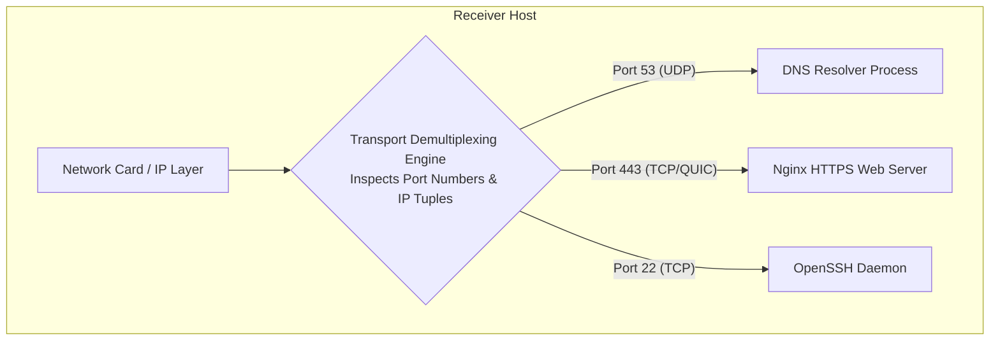
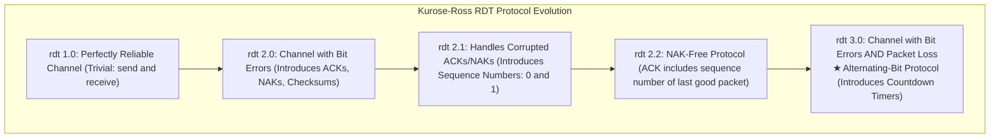
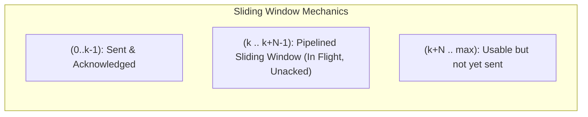

# Chapter 03: Transport Layer Foundations — UDP, TCP & Reliable Data Transfer (RDT)

> "While the network layer provides logical communication between hosts, the transport layer provides logical communication between application processes running on different hosts. It is here that the fundamental algorithms for multiplexing, error recovery, and reliable data transfer reside."  
> — *James F. Kurose & Keith W. Ross, Computer Networking: A Top-Down Approach*

---

## 📚 Recommended Book References
- **Computer Networking: A Top-Down Approach (Kurose & Ross, 8th Ed)**: Chapter 3 (Transport Layer: Principles of RDT, UDP, Connection-Oriented Transport).
- **TCP/IP Illustrated, Volume 1: The Protocols (Stevens & Fall, 2nd Ed)**: Chapter 10 (UDP) and Chapter 11 (TCP Introduction).
- **Computer Networks (Tanenbaum & Wetherall, 5th/6th Ed)**: Chapter 6 (The Transport Layer).
- **RFC Specifications**: RFC 768 (User Datagram Protocol), RFC 793 (Transmission Control Protocol).

---

## 1. Transport Layer Principles: Multiplexing and Demultiplexing

The network layer IP protocol delivers packets between physical hosts (Host-to-Host). The transport layer delivers payloads to the specific application process running on that host (**Process-to-Process**).



### 1.1 Socket Identification & Port Hierarchy
- **Connectionless Demultiplexing (UDP)**: Identified strictly by a 2-tuple: `(Destination IP, Destination Port)`.
- **Connection-Oriented Demultiplexing (TCP)**: Identified strictly by a **4-tuple**:
  $$\mathbf{(\text{Source IP}, \text{Source Port}, \text{Destination IP}, \text{Destination Port})}$$
  Two incoming TCP packets with identical destination IP and port are demultiplexed to **different sockets** if their source IP or source port differs!

| Port Category | Range | Purpose | Standard Protocols |
| :--- | :--- | :--- | :--- |
| **Well-Known Ports** | 0 – 1,023 | Privileged system services (requires root) | HTTP (80), HTTPS (443), SSH (22), DNS (53), SMTP (25) |
| **Registered Ports** | 1,024 – 49,151 | Vendor & application services | PostgreSQL (5432), MySQL (3306), Redis (6379), Kafka (9092) |
| **Dynamic / Ephemeral** | 49,152 – 65,535 | Temporary client source ports | Allocated dynamically by the OS kernel upon `connect()` |

---

## 2. User Datagram Protocol (UDP - RFC 768)

UDP is a minimal, lightweight transport protocol that adds almost nothing to IP other than port multiplexing and error checking.

```
 0                   15 16                   31
+----------------------+----------------------+
|  Source Port (16b)   | Destination Port(16b)|
+----------------------+----------------------+
|  Length (16 bits)    |  Checksum (16 bits)  |
+----------------------+----------------------+
|         Application Payload Data...         |
+---------------------------------------------+
```

### 2.1 The UDP 1's Complement Checksum Derivation
UDP verifies data integrity using the Internet Checksum algorithm:
1. Treat all 16-bit words in the UDP pseudo-header, UDP header, and payload as integers.
2. Sum all 16-bit words using **1's complement arithmetic** (any carry bit overflowing bit 15 is wrapped around and added to the lowest bit).
3. Invert all bits (bitwise NOT) to produce the checksum.
4. **Receiver Verification**: The receiver sums all received 16-bit words plus the checksum. If no bit errors occurred, the sum is **all 1s (`0xFFFF`)**!

---

## 3. Principles of Reliable Data Transfer (RDT)

How do you build a reliable communication channel over an unreliable network (a channel that can corrupt bits and drop packets arbitrarily)?



### 3.1 The Fatal Flaw of Stop-and-Wait Protocols (`rdt 3.0`)
In a stop-and-wait protocol, the sender sends 1 packet and waits for an ACK before sending the next.
Consider a transcontinental 1 Gbps fiber link across the US ($RTT = 30\text{ ms}$, Packet size $L = 1000\text{ bytes} = 8000\text{ bits}$):
- **Transmission Delay**:
  $$d_{\text{trans}} = \frac{L}{R} = \frac{8000\text{ bits}}{10^9\text{ bps}} = 0.008\text{ ms} = 8\text{ µs}$$
- **Sender Utilization ($U_{\text{sender}}$)**:
  $$U_{\text{sender}} = \frac{d_{\text{trans}}}{RTT + d_{\text{trans}}} = \frac{0.008\text{ ms}}{30.008\text{ ms}} = \mathbf{0.000267} \quad (\mathbf{0.027\%}!)$$
- **Effective Throughput**:
  $$\text{Throughput} = U_{\text{sender}} \times R = 0.000267 \times 1\text{ Gbps} = \mathbf{267\text{ kbps}}$$
A 1 Gigabit physical line achieves less than 300 kilobits throughput! **Stop-and-wait is catastrophic over high-speed networks.**

---

## 4. Pipelined Protocols: Go-Back-N vs. Selective Repeat

To saturate the network pipe, the sender must allow multiple in-flight, unacknowledged packets simultaneously.



### 4.1 Go-Back-N (GBN)
- **Cumulative ACKs**: An ACK for sequence number $n$ indicates that all packets up to and including $n$ have been received correctly.
- **Single Timer**: Tracks the oldest unacknowledged packet.
- **On Timeout**: The sender **retransmits ALL $N$ packets** currently in the window, even if some were received correctly!
- **Receiver**: Discards any out-of-order packets (buffer size = 1).

### 4.2 Selective Repeat (SR)
- **Individual ACKs**: The receiver acknowledges each correctly received packet individually, regardless of order, storing out-of-order packets in a buffer.
- **Individual Timers**: The sender maintains an independent logical timer for every unacknowledged packet.
- **On Timeout**: Retransmits **only the specific packet** whose timer expired.

#### The Window Size Constraint in Selective Repeat:
To prevent a receiver from confusing a new packet with a retransmitted duplicate when sequence numbers wrap around:
$$\mathbf{\text{Window Size } W \le 2^{k-1}}$$
Where $k$ is the number of bits in the sequence number field. (The window size must be at most half the sequence number space!).

---
