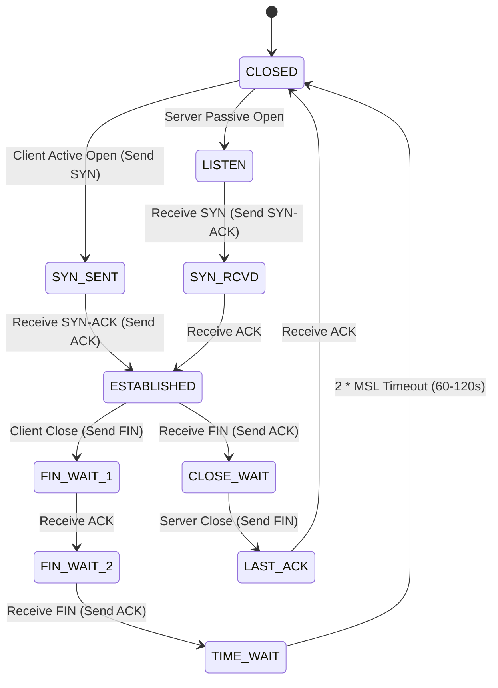
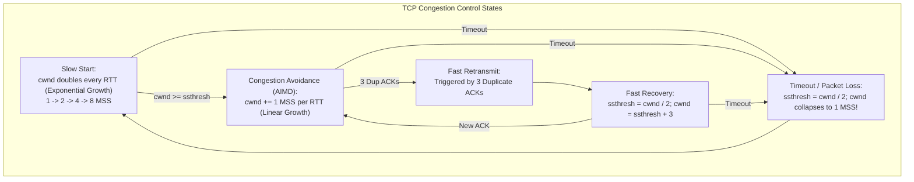
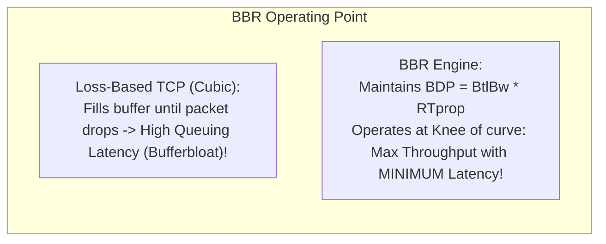

# Chapter 04: TCP Deep Dive — Connection Lifecycle, Flow Control & Congestion Control

> "TCP is a masterpiece of distributed engineering. It transforms an unreliable, best-effort packet network into a reliable, in-order, flow-controlled, and congestion-controlled byte stream that dynamically probes the physical capacity of the global Internet."  
> — *W. Richard Stevens & Kevin R. Fall, TCP/IP Illustrated, Volume 1*

---

## 📚 Recommended Book References
- **TCP/IP Illustrated, Volume 1: The Protocols (Stevens & Fall, 2nd Ed)**: Chapters 12–16 (TCP Basics, Connection Management, Timeout & Retransmission, Data Flow, Congestion Control).
- **Computer Networking: A Top-Down Approach (Kurose & Ross, 8th Ed)**: Chapter 3, Section 3.5–3.8 (TCP Connection, Flow Control, Congestion Control).
- **High Performance Browser Networking (Ilya Grigorik)**: Chapter 2 (TCP Performance Optimization).
- **RFC Specifications**: RFC 793 (TCP Original), RFC 5681 (TCP Congestion Control), RFC 2018 (SACK), RFC 7323 (TCP Extensions for High Performance: Window Scale & Timestamps), RFC 8257 (DCTCP).

---

## 1. The TCP Segment Architecture

A standard TCP header is **20 bytes** (extensible up to 60 bytes with Options).

```
 0                   15 16                   31
+----------------------+----------------------+
|  Source Port (16b)   | Destination Port(16b)|
+---------------------------------------------+
|          Sequence Number (32 bits)          |
+---------------------------------------------+
|       Acknowledgment Number (32 bits)       |
+------+--------+------+----------------------+
|Offset|Reserved|Flags | Receive Window (16b) |
+------+--------+------+----------------------+
|   Checksum (16 bits) | Urgent Pointer (16b) |
+---------------------------------------------+
|    Options (0 to 40 Bytes: MSS, Scale, SACK)|
+---------------------------------------------+
|               Payload Data...               |
+---------------------------------------------+
```

### 1.1 Header Fields & Flags
- **Sequence Number (32-bit)**: Byte-stream offset of the first byte of data in this segment.
- **Acknowledgment Number (32-bit)**: Next expected byte number from the sender (**Cumulative ACK**).
- **Data Offset (4 bits)**: Number of 32-bit words in the header (indicates where data begins).
- **Control Flags**:
  - `SYN`: Synchronize sequence numbers during connection establishment.
  - `ACK`: Acknowledgment field is valid.
  - `FIN`: Sender has finished transmitting data.
  - `RST`: Abort connection immediately (reset).
  - `PSH`: Push buffered data to application immediately.
  - `ECE / CWR`: Explicit Congestion Notification signaling.
- **Receive Window (`rwnd`, 16-bit)**: Bytes the receiver is willing to buffer (scaled by the **Window Scale Option** up to 1GB).

---

## 2. TCP Connection Lifecycle State Machine



### 2.1 The Three-Way Handshake
1. **Client $\to$ Server: `SYN` (seq = $X$)**: Proposes Initial Sequence Number (ISN).
2. **Server $\to$ Client: `SYN-ACK` (seq = $Y$, ack = $X + 1$)**: Acknowledges client ISN and proposes server ISN.
3. **Client $\to$ Server: `ACK` (ack = $Y + 1$)**: Completes handshake. (May carry application payload).

#### Why ISN Randomization is Mandatory:
ISNs are generated pseudo-randomly using cryptographic PRNGs keyed by time and socket tuples. If sequence numbers were predictable ($0, 1, 2...$), an off-path attacker could inject malicious TCP segments into an active connection (**TCP Hijacking / Reset Attacks**).

#### SYN Flood Denial-of-Service & SYN Cookies:
An attacker floods a server with `SYN` packets from spoofed IPs without sending the final `ACK`. The server allocates memory in its **SYN Queue**, rapidly exhausting RAM.
- **SYN Cookies Defense**: The server allocates **zero state** in RAM upon receiving a `SYN`! Instead, it encodes the connection metadata (MSS, timestamp, cryptographic secret) into the 32-bit server ISN ($Y$).
- When the client returns the final `ACK` ($Y+1$), the server reconstructs the connection parameters purely by inspecting the acknowledged number, defeating the attack!

### 2.2 Connection Termination & The `TIME_WAIT` State
Closing a connection requires a 4-way exchange because TCP is **Full-Duplex** (either direction can close independently).

#### Why `TIME_WAIT` (2 x MSL = 60–120s) is Essential:
1. **Graceful ACK Delivery**: If the client's final `ACK` is lost in transit, the server will retransmit its `FIN`. If the client closed immediately, it would return an `RST`, causing the server to report an unclean connection error!
2. **Drain Old Duplicate Segments**: Guarantees that any lingering packets delayed in internet routing buffers die before a new connection reuses the same socket 4-tuple (`SO_REUSEADDR`).

---

## 3. Retransmission Timeout (RTO) & Jacobson's Algorithm

TCP adjusts its retransmission timer dynamically using an Exponential Weighted Moving Average (EWMA):

$$\text{EstimatedRTT} \leftarrow (1 - \alpha) \cdot \text{EstimatedRTT} + \alpha \cdot \text{SampleRTT} \quad (\alpha = 0.125)$$
$$\text{DevRTT} \leftarrow (1 - \beta) \cdot \text{DevRTT} + \beta \cdot |\text{SampleRTT} - \text{EstimatedRTT}| \quad (\beta = 0.25)$$
$$\mathbf{\text{RTO} = \text{EstimatedRTT} + 4 \cdot \text{DevRTT}}$$

- **Karn's Algorithm**: Do **not** update `SampleRTT` for retransmitted segments (ambiguity of whether ACK was for initial or retransmitted segment).
- **Exponential Backoff**: On timeout, double the RTO ($\text{RTO} \leftarrow 2 \times \text{RTO}$) to avoid exacerbating network congestion.

---

## 4. TCP Flow Control

Flow control matches the sender's transmission rate to the receiver's application read rate, preventing the sender from overflowing receiver buffers.

$$\text{rwnd} = \text{RcvBuffer} - (\text{LastByteRcvd} - \text{LastByteRead})$$

The receiver advertises its available `rwnd` in every header. The sender ensures:
$$\text{LastByteSent} - \text{LastByteAcked} \le \text{rwnd}$$

- **Zero-Window Probing**: If the receiver advertises `rwnd = 0`, the sender stops transmitting but periodically sends **1-byte probe packets** to elicit window updates, preventing deadlock if a window update ACK is lost.
- **Nagle's Algorithm vs. Delayed ACKs**:
  - Nagle buffers small writes until all preceding bytes are acknowledged.
  - Combined with Delayed ACKs (~200ms delay), this creates a catastrophic latency penalty in real-time applications (fixed by enabling `TCP_NODELAY`).

---

## 5. TCP Congestion Control: AIMD, Cubic, and BBR

While flow control protects the receiver, **congestion control** protects the network core.



### 5.1 AIMD (Additive-Increase, Multiplicative-Decrease)
- **Additive Increase**: Increase window by 1 MSS each RTT: $\text{cwnd} \leftarrow \text{cwnd} + 1$.
- **Multiplicative Decrease**: Cut window in half on loss: $\text{cwnd} \leftarrow \text{cwnd} / 2$.
- *Mathematical Invariant*: Chiu & Jain (1989) proved that only AIMD mathematically converges to both **Efficiency** and **Fairness** on a shared bottleneck link.

---

### 5.2 Modern Production Congestion Control Algorithms

| Algorithm | Signal Type | Core Philosophy | Default Usage |
| :--- | :--- | :--- | :--- |
| **TCP Reno** | Packet Loss | Slow-start + Linear AIMD | Historical reference |
| **TCP Cubic** | Packet Loss | Window growth is a cubic function of time since last loss ($W(t) = C(t-K)^3 + W_{\text{max}}$); fast recovery on high-BDP networks | **Linux Default (2.6.19+)** |
| **TCP BBR (Google)**| **Delay & Bandwidth (Model-Based)** | Estimates Bottleneck Bandwidth ($\text{BtlBw}$) and min RTT ($\text{RTprop}$); completely decouples from packet loss! | **Google Cloud, YouTube** |
| **DCTCP (RFC 8257)**| **ECN Markings** | Adjusts window proportionally to fraction of ECN-marked packets | Data Centers / Cloud Fabrics |



---
