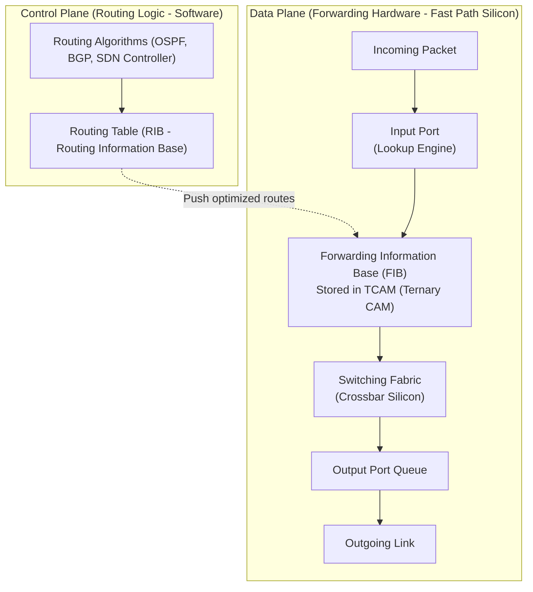
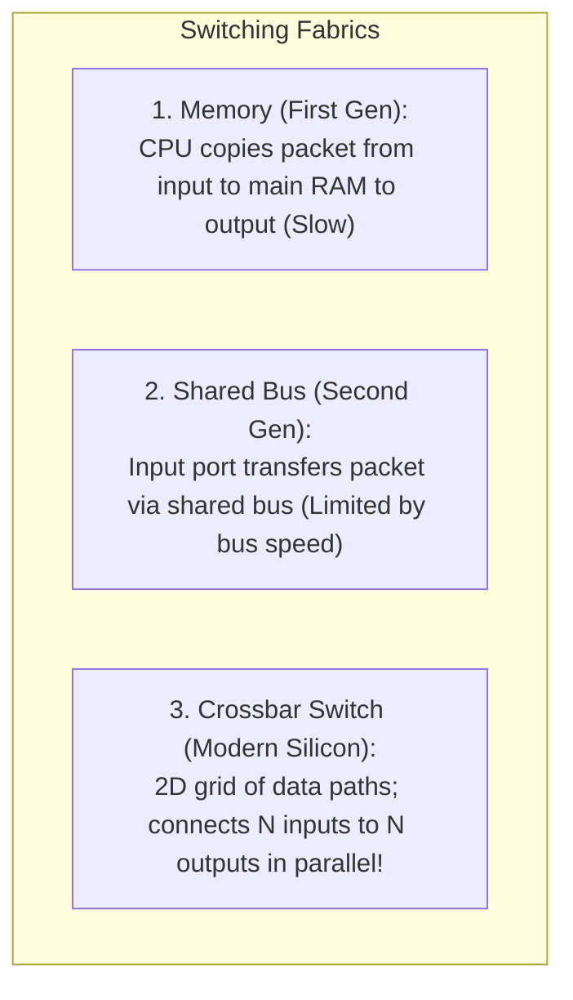
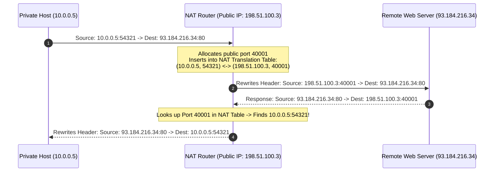

# Chapter 05: Network Layer — Data Plane & IP Addressing (IPv4, IPv6, NAT, CIDR)

> "The network layer is the beating heart of the Internet. Its primary mission is deceivingly simple: deliver packets from sending host to receiving host across a labyrinth of disparate physical networks."  
> — *James F. Kurose & Keith W. Ross, Computer Networking: A Top-Down Approach*

---

## 📚 Recommended Book References
- **Computer Networking: A Top-Down Approach (Kurose & Ross, 8th Ed)**: Chapter 4 (The Network Layer: Data Plane: Router Architecture, IP, Addressing, NAT, IPv6).
- **TCP/IP Illustrated, Volume 1: The Protocols (Stevens & Fall, 2nd Ed)**: Chapter 2 (The Internet Address Architecture), Chapter 5 (IPv4 and IPv6), Chapter 7 (DHCP and Auto-Configuration).
- **Internetworking with TCP/IP, Volume 1 (Douglas Comer, 6th Ed)**: Chapters 4–10 (IP Addressing, CIDR, Forwarding, Subnets).
- **RFC Specifications**: RFC 791 (IPv4), RFC 2460 & 8200 (IPv6), RFC 4632 (CIDR), RFC 3022 (Traditional NAT).

---

## 1. Forwarding (Data Plane) vs. Routing (Control Plane)

The network layer is bifurcated into two distinct operational planes:
- **Data Plane (Forwarding)**: The local, per-router hardware process that moves an incoming packet from an input link interface to an appropriate output link interface in nanoseconds.
- **Control Plane (Routing)**: The network-wide logic that coordinates and computes the end-to-end paths along which packets travel between source and destination (via routing protocols like OSPF and BGP, or centralized SDN controllers).



---

## 2. Router Hardware Architecture Internals

Modern high-performance core routers process billions of packets per second using specialized hardware:

### 2.1 Input Ports & Ternary Content-Addressable Memory (TCAM)
1. **Line Termination & PHY Layer**: Receives raw optical/electrical signals.
2. **Data Link Processing**: Decapsulates Ethernet frames and verifies checksums.
3. **Lookup Engine**: Performs **Longest Prefix Match (LPM)** lookup.
   - Traditional software hash tables and binary tries are too slow for 400 Gbps line rates.
   - Core routers use **TCAM (Ternary Content-Addressable Memory)**: hardware memory that can search the entire routing table in **a single clock cycle (~1 nanosecond)**! Bits can match `0`, `1`, or `?` (Don't Care wildcard mask).

### 2.2 Switching Fabrics: Memory vs. Bus vs. Crossbar



---

## 3. IPv4 Datagram Format & Fragmentation

```
 0                   15 16                   31
+----+----+----------+--+---------------------+
|Ver |IHL | DSCP/ECN |  Total Length (16 bits)|
+----+----+----------+--+----+----------------+
|   Identification (16 bits) |Flags|Fragment Off|
+--------------------+-------+----+-----------+
|Time to Live (8 bits)|Protocol|Header Checksum|
+--------------------+-------+----------------+
|            Source IP Address (32 bits)      |
+---------------------------------------------+
|         Destination IP Address (32 bits)    |
+---------------------------------------------+
|              Options (Optional)             |
+---------------------------------------------+
|               Payload Data...               |
+---------------------------------------------+
```

### 3.1 Key Header Fields:
- **TTL (Time to Live, 8 bits)**: Decremented by 1 at every router hop. When $\text{TTL} = 0$, the packet is discarded and an **ICMP Time Exceeded (Type 11)** message is sent back to the sender (this is how `traceroute` works!).
- **Protocol (8 bits)**: Identifies transport layer payload (`6 = TCP`, `17 = UDP`, `1 = ICMP`).
- **Flags**: `DF` (Don't Fragment), `MF` (More Fragments).
- **Fragment Offset (13 bits)**: Specified in **8-byte (64-bit) units**.

### 3.2 Path MTU Discovery (PMTUD)
Routers historically fragmented packets when transitioning from high MTU links (e.g., Ethernet 1500B) to low MTU links (e.g., PPPoE 1492B).
- Modern systems avoid fragmentation by setting **`DF = 1`** on all packets.
- If a router cannot forward the packet without fragmenting, it drops the packet and sends an **ICMP Fragmentation Needed (Type 3, Code 4)** packet containing the link's next-hop MTU.
- The sender dynamically reduces its Maximum Segment Size (**MSS**).

---

## 4. IP Addressing, Subnetting & Classless Inter-Domain Routing (CIDR)

An IPv4 address is a 32-bit integer typically represented in **Dotted-Decimal Notation** (e.g., `192.168.1.1`).

### 4.1 CIDR Notation (`/PrefixLength`)
Classful addressing (Class A, B, C) was abandoned in 1993 (RFC 4632) due to massive address wastage. Modern routing uses **CIDR (Classless Inter-Domain Routing)**:
$$\text{IP Address / Prefix Length} \quad \text{e.g., } \mathbf{192.168.1.0/24}$$
- The first $24$ bits represent the **Network Subnet**.
- The remaining $32 - 24 = 8$ bits represent the **Host Identifier** ($2^8 - 2 = 254$ assignable hosts; all 0s is the Network Address, all 1s is the Broadcast Address).

### 4.2 Longest Prefix Match (LPM)
When a router receives a packet for `128.9.176.4`, multiple routing table entries might match:
1. `128.9.0.0/16` $\to$ Interface 1
2. `128.9.176.0/24` $\to$ Interface 2
3. `0.0.0.0/0` (Default Gateway) $\to$ Interface 3

*The Rule of Longest Prefix Match*: The router forward the packet out the interface corresponding to the **most specific (longest prefix)** match (in this case, `/24` $\to$ Interface 2).

---

## 5. Network Address Translation (NAT)

NAT allows an entire private network (e.g., a home or office) to share a single public IPv4 address.



---

## 6. IPv6 Architecture & The Next Generation

IPv6 solves the global exhaustion of 32-bit IPv4 addresses by expanding the address space to **128 bits** ($3.4 \times 10^{38}$ unique addresses).

```
 0                   15 16                   31
+----+--------+-------------------------------+
|Ver | Traffic Class |        Flow Label      |
+----+--------+-------------------------------+
|   Payload Length (16b)   |Next Header|Hop Lmt|
+--------------------------+-----------+------+
|                                             |
|        Source IPv6 Address (128 bits)       |
|                                             |
+---------------------------------------------+
|                                             |
|     Destination IPv6 Address (128 bits)     |
|                                             |
+---------------------------------------------+
```

### 6.1 Architectural Improvements in IPv6:
1. **Fixed 40-Byte Base Header**: Streamlines hardware parsing in router ASICs.
2. **Zero In-Router Fragmentation**: The router never fragments packets. If a packet is too large, the router drops it and sends ICMPv6 "Packet Too Big".
3. **No Header Checksum**: Checksums at the link and transport layers make IP-level checksumming redundant, eliminating the need for routers to recalculate checksums at every hop when decrementing the Hop Limit.
4. **Flow Labels**: 20-bit field identifying specific traffic flows to enable fast Quality of Service (QoS) routing without inspecting transport layer headers.

---
