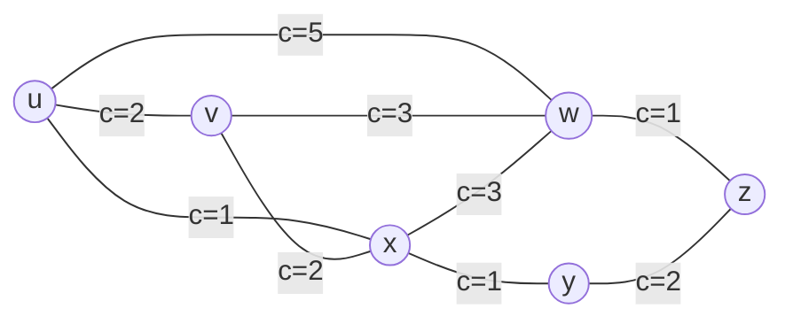
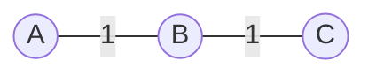
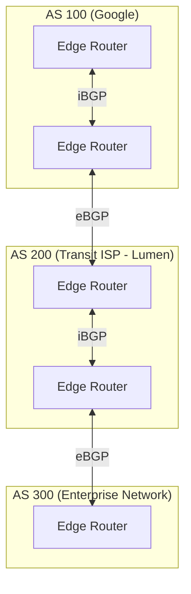

# Chapter 06: Network Layer — Control Plane & Routing Algorithms (OSPF, BGP)

> "A packet cannot find its way through the global Internet by luck. The Control Plane is the collective intelligence of the network, computing the optimal paths across millions of routers, autonomous systems, and geopolitical boundaries."  
> — *Radia Perlman, Interconnections: Bridges, Routers, Switches, and Internetworking Protocols*

---

## 📚 Recommended Book References
- **Computer Networking: A Top-Down Approach (Kurose & Ross, 8th Ed)**: Chapter 5 (The Network Layer: Control Plane: Routing Algorithms, OSPF, BGP, SDN).
- **Interconnections: Bridges, Routers, Switches, and Internetworking Protocols (Radia Perlman, 2nd Ed)**: Chapters 9–14 (Routing Algorithms, Link State vs Distance Vector, OSPF, BGP).
- **Computer Networks (Tanenbaum & Wetherall, 5th/6th Ed)**: Chapter 5 (The Network Layer: Routing Algorithms & Congestion Control).
- **RFC Specifications**: RFC 2328 (OSPF Version 2), RFC 4271 (Border Gateway Protocol 4 - BGP-4), RFC 7938 (BGP in Large-Scale Data Centers).

---

## 1. Graph Theory of Routing

A network is mathematically modeled as a weighted directed graph $G = (V, E)$:
- **Vertices ($V$)**: Routers.
- **Edges ($E$)**: Physical communication links.
- **Cost Function ($c(x, y)$)**: The weight assigned to link $(x, y)$ (e.g., physical latency, inverse bandwidth $\frac{10^8}{\text{Bandwidth}}$, or financial transit cost).



---

## 2. Link-State (LS) Routing & Dijkstra's Algorithm

In **Link-State routing**, every router possesses complete knowledge of the entire network topology.
- **Link-State Broadcast**: Every node periodically broadcasts its immediate neighbor links and costs to **all other routers** via reliable flooding (**LSA - Link State Advertisements**).
- Every node constructs an identical global graph representation of the network.
- Every node independently executes **Dijkstra's Shortest Path Algorithm** to compute its shortest path tree:

### 2.1 Dijkstra's Algorithm Pseudocode:
```text
1. Initialization:
   N' = {u}  // u is the source node
   For all nodes v:
     if v is a direct neighbor of u:
       D(v) = c(u, v)
     else:
       D(v) = infinity

2. Loop:
   Find w not in N' such that D(w) is a minimum
   Add w to N'
   Update D(v) for all neighbors of w not in N':
     D(v) = min(D(v), D(w) + c(w, v))
   Until all nodes are in N'
```
- **Time Complexity**: $O(|E| \log |V|)$ using a Fibonacci or binary min-heap priority queue.

### 2.2 OSPF (Open Shortest Path First - RFC 2328)
OSPF is the dominant intra-domain (Interior Gateway) protocol in enterprise networks:
- **Hierarchical Areas**: Slices the Autonomous System into **Areas** centered around **Backbone Area 0**. Routers inside an area only flood LSAs locally, containing routing table sizes.
- **Designated Routers (DR / BDR)**: Over broadcast networks (Ethernet), electing a Designated Router reduces LSA broadcast traffic from $O(N^2)$ to $O(N)$.

---

## 3. Distance-Vector (DV) Routing & The Bellman-Ford Algorithm

In **Distance-Vector routing**, nodes do **not** know the global network topology. It is decentralized, iterative, and asynchronous:
- Each node maintains a vector of distances $D_x = [D_x(y) : y \in V]$.
- Nodes periodically send their distance vectors **only to their immediate neighbors**.

### 3.1 The Bellman-Ford Equation
$$d_x(y) = \min_v \{ c(x, v) + d_v(y) \}$$
The shortest path from $x$ to $y$ is found by choosing the neighbor $v$ that minimizes the link cost to $v$ plus $v$'s advertised distance to $y$.

### 3.2 The Count-to-Infinity Problem & Routing Loops
When a link cost **decreases**, good news travels fast.
When a link cost **increases** (or breaks), distance vector suffers from the **Count-to-Infinity** anomaly:


- Suppose link $A-B$ breaks ($\text{cost} = \infty$).
- $B$ knows $A$ is down, but $C$ previously advertised that it can reach $A$ in 2 hops ($C \to B \to A$).
- $B$ falsely assumes: "I can reach $A$ through $C$ with cost $1 + 2 = 3$!"
- $B$ updates $C$; $C$ updates $B$; costs slowly increment ($4, 5, 6 \dots$) until reaching infinity ($16$ in RIP protocol)!
- **Mitigations**:
  - **Split Horizon**: A router never advertises a route back out the interface it learned it from.
  - **Poisoned Reverse**: If $B$ routes to $A$ through $C$, $B$ tells $C$ that its distance to $A$ is $\infty$.

---

## 4. Inter-Domain Routing: Border Gateway Protocol (BGP-4)

While OSPF runs inside a single organization, the **Border Gateway Protocol (BGP-4 - RFC 4271)** is the glue connecting over **75,000 independent Autonomous Systems (AS)** that constitute the global Internet.



### 4.1 BGP: A Path-Vector Protocol
BGP does not advertise raw metrics or link costs. It advertises **complete reachable paths**:
- **`AS-PATH` Attribute**: Lists every Autonomous System through which the route advertisement has passed:
  $$\text{Prefix } 8.8.8.0/24 \longrightarrow \mathbf{\text{AS-PATH: } [15169, 3356, 1299]}$$
- **Loop Prevention**: When a BGP router receives an update, if its own ASN is already in the `AS-PATH`, it **instantly discards the route**!

### 4.2 BGP Policy Engine & Valley-Free Routing
BGP routing decisions are driven by commercial business relationships rather than shortest latency (**Policy-Based Routing**):
1. **Customer-Provider**: Customer pays provider for transit.
2. **Peer-to-Peer**: Settlement-free exchange of traffic between equals.

**The Gao-Rexford Economic Rule**:
$$\text{Customer Routes (Revenue)} > \text{Peer Routes (Free)} > \text{Provider Routes (Cost)}$$
A network never provides transit between two of its providers or peers (**Valley-Free Routing**).

### 4.3 Modern BGP Security: RPKI (Resource Public Key Infrastructure)
Because traditional BGP relied on implicit trust, malicious or misconfigured networks could announce IP blocks they did not own (**BGP Route Hijacking**).
- **RPKI** issues cryptographically signed **Route Origin Authorizations (ROAs)** linking IP prefixes to authorized ASNs, allowing border routers to automatically drop unauthorized rogue announcements.

---
