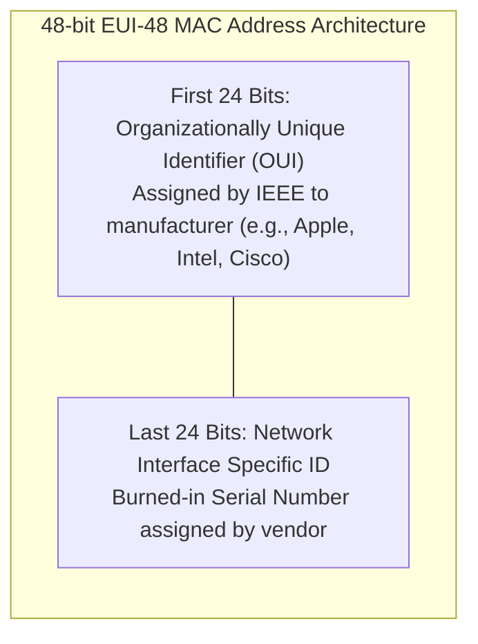
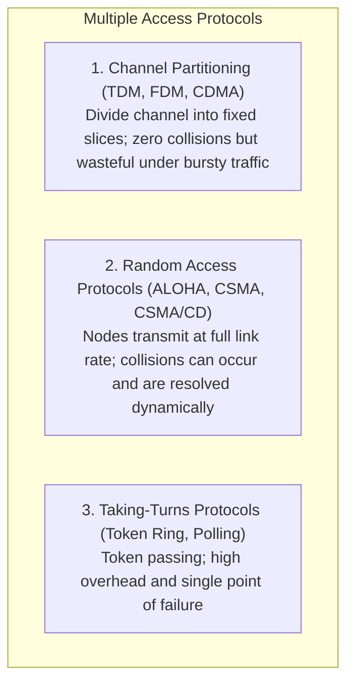
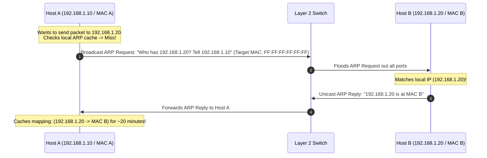
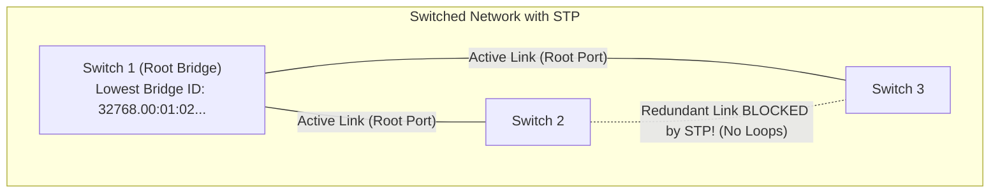
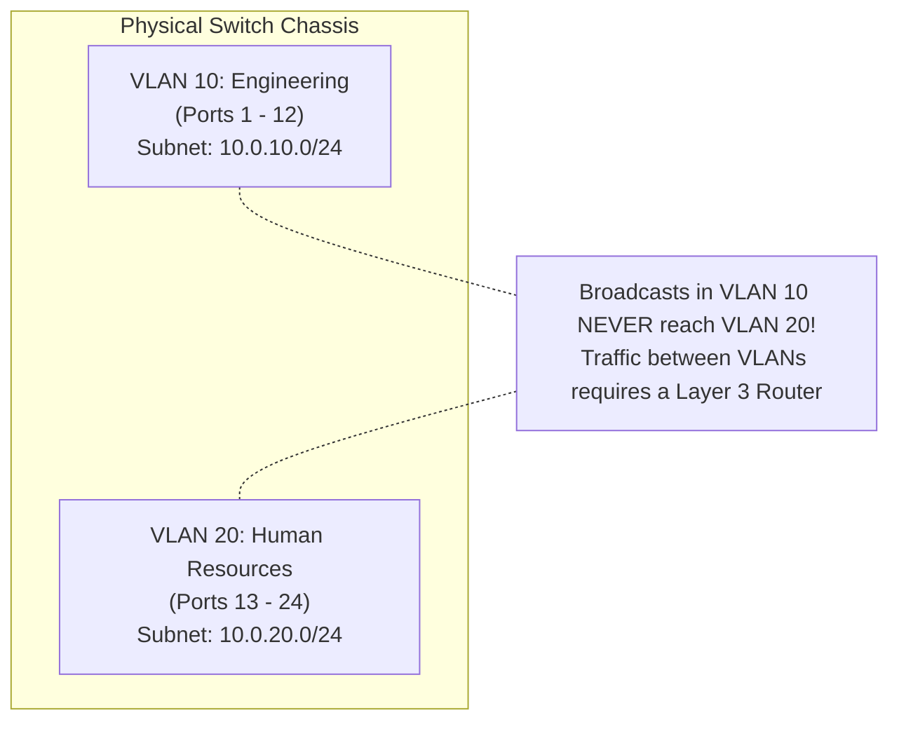

# Chapter 07: Link Layer & Local Area Networks — Ethernet, ARP, Switches & VLANs

> "While the network layer routes packets across the global Internet from end-to-end, the link layer is responsible for transporting frames from one node to physically adjacent nodes over a single communication link."  
> — *Radia Perlman, Interconnections: Bridges, Routers, Switches, and Internetworking Protocols*

---

## 📚 Recommended Book References
- **Computer Networking: A Top-Down Approach (Kurose & Ross, 8th Ed)**: Chapter 6 (The Link Layer and LANs: Error Detection, Multiple Access, MAC, Ethernet, Switches, VLANs).
- **Interconnections: Bridges, Routers, Switches, and Internetworking Protocols (Radia Perlman, 2nd Ed)**: Chapters 3–7 (Bridges, Switches, Spanning Tree Protocol, Source Routing).
- **Computer Networks (Tanenbaum & Wetherall, 5th/6th Ed)**: Chapter 4 (The Medium Access Control Sublayer).
- **IEEE Standards**: IEEE 802.3 (Ethernet), IEEE 802.1D (Spanning Tree Protocol), IEEE 802.1Q (VLAN Tagging).

---

## 1. Link Layer Fundamentals & MAC Addressing

The link layer encapsulates network-layer IP datagrams into **Frames** for physical transmission across a shared medium.


- **MAC Address**: Permanent 48-bit hexadecimal identifier (e.g., `00:1A:2B:3C:4D:5E`) burned into the ROM of every Network Interface Card (NIC).
- **IP Address vs. MAC Address**: An IP address is hierarchical (like a postal mailing address); a MAC address is flat and portable (like a social security number).

---

## 2. Multiple Access Protocols & CSMA/CD

When multiple nodes share a broadcast wire, simultaneous transmissions cause **Collisions**, destroying data frames.



### 2.1 CSMA/CD (Carrier Sense Multiple Access with Collision Detection)
Classical half-duplex Ethernet relies on **CSMA/CD**:
1. **Carrier Sense**: "Listen before speaking". If the line is busy, wait until it is idle.
2. **Collision Detection**: "Listen while speaking". If another node transmits simultaneously, electrical voltage on the wire jumps above a collision threshold.
3. **Jam Signal & Abort**: Upon detecting collision, immediately transmit a **32-bit Jamming Signal** to ensure all nodes recognize the collision, then abort transmission.
4. **Binary Exponential Backoff**: Wait a random time before retrying:
   - After $m$ collisions, pick an integer $K$ randomly from $\{0, 1, 2, \dots, 2^m - 1\}$ (capped at $m=10$).
   - Wait $K \times 512$ bit-times, then return to Step 1.

#### The Minimum Frame Size Constraint (64 Bytes):
To detect a collision before transmission completes:
$$\text{Transmission Time } (T_{\text{trans}}) \ge 2 \times \text{Propagation Delay } (T_{\text{prop}})$$
$$\text{Min Frame Size} = 2 \times T_{\text{prop}} \times \text{Bandwidth} = \mathbf{64\text{ Bytes (512 bits in 10Mbps Ethernet)}}$$
If a frame were smaller than 64 bytes, a sender could finish transmitting and assume success before the collision wave arrived back from the far end of the cable (**Late Collision**)!

---

## 3. Address Resolution Protocol (ARP - RFC 826)

How does a sending host know the destination MAC address for an IP address on the local network?



---

## 4. Layer 2 Switched Networks & Self-Learning CAM Tables

Modern Ethernet is completely switched and **Full-Duplex**: every host has a dedicated link to a switch port; collisions are physically impossible.

### 4.1 The Self-Learning Switch Algorithm
A switch maintains a **Switch Table (CAM - Content-Addressable Memory Table)** mapping MAC addresses to physical output ports:
```c
/* Switch Processing Pseudocode */
void process_frame(struct eth_frame *frame, int arrival_port) {
    /* 1. Learn Source MAC */
    cam_table_insert(frame->src_mac, arrival_port, current_time());

    /* 2. Forwarding Logic */
    int dest_port = cam_table_lookup(frame->dst_mac);
    
    if (is_broadcast(frame->dst_mac) || dest_port == NOT_FOUND) {
        flood_out_all_ports_except(arrival_port, frame);
    } else if (dest_port == arrival_port) {
        drop(frame); /* Filtering */
    } else {
        forward_out_port(dest_port, frame);
    }
}
```

---

## 5. Spanning Tree Protocol (STP - IEEE 802.1D)

To provide fault tolerance, network engineers add redundant physical links between switches.
- *The Disaster*: Redundant links create physical loops! A single broadcast frame (e.g., an ARP request) is copied infinitely around the loop, creating a **Broadcast Storm** that consumes $100\%$ of switch CPU and bandwidth within seconds!

Invented by Radia Perlman, **STP (Spanning Tree Protocol)** converts a physical loopy network into a loop-free logical tree by selectively blocking redundant ports.



### 5.1 STP Protocol Walkthrough:
1. **Elect Root Bridge**: The switch with the lowest **Bridge ID (Priority + MAC address)** becomes the Root.
2. **Select Root Ports**: On every non-root switch, the port with the lowest path cost to the Root Bridge is marked **Root Port**.
3. **Select Designated Ports**: On every network segment, the port with the lowest cost to the Root is marked **Designated Port** (Forwarding state).
4. **Block All Other Ports**: All remaining redundant ports are placed in **Blocking State** (they listen to BPDUs but drop all user data frames).

---

## 6. Virtual Local Area Networks (VLANs - IEEE 802.1Q)

A **VLAN** breaks a single physical switch into multiple isolated logical broadcast domains.



### 6.1 The 802.1Q Trunk Tag
When frames travel across a **Trunk Link** connecting two switches, the sending switch inserts a **4-byte 802.1Q Tag** into the Ethernet header:
- **TPID (Tag Protocol Identifier, 16 bits)**: Set to `0x8100` (identifies 802.1Q frame).
- **PCP (Priority Code Point, 3 bits)**: Quality of Service (QoS / 802.1p).
- **VID (VLAN Identifier, 12 bits)**: Identifies the specific VLAN ($2^{12} = \mathbf{4,096\text{ VLANs}}$).

---
