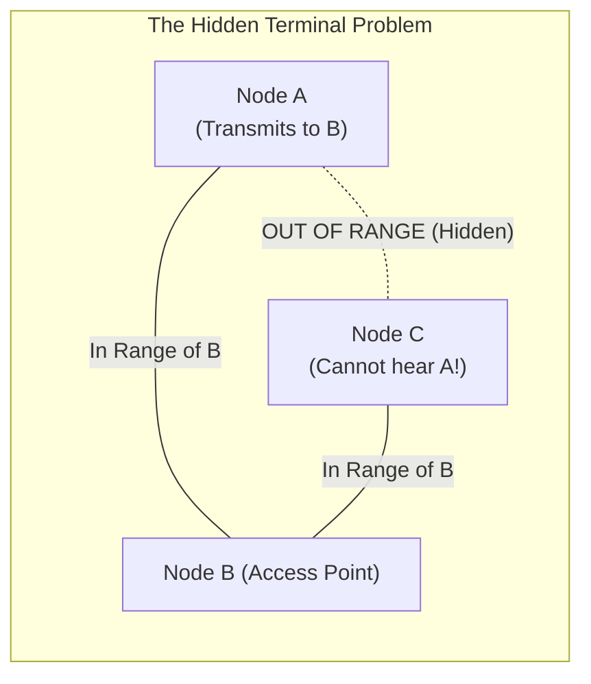
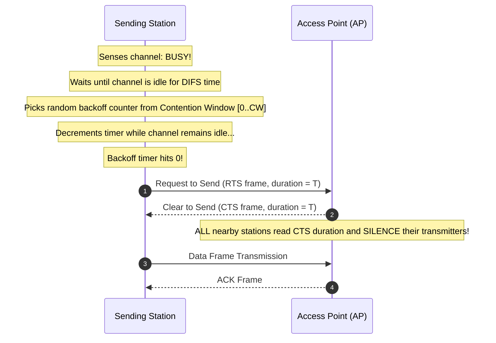
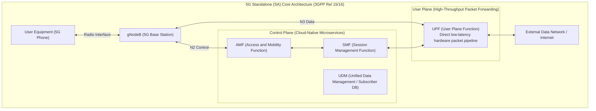

# Chapter 08: Wireless & Mobile Networks — Wi-Fi (802.11), Cellular (4G-5G) & Mobility

> "The wireless link is an untamed, shared ether subject to path loss, multipath fading, electromagnetic interference, and the mobility of endpoints. Bridging this unpredictable medium to the deterministic wired Internet requires sophisticated physical and link layer engineering."  
> — *James F. Kurose & Keith W. Ross, Computer Networking: A Top-Down Approach*

---

## 📚 Recommended Book References
- **Computer Networking: A Top-Down Approach (Kurose & Ross, 8th Ed)**: Chapter 7 (Wireless and Mobile Networks: 802.11 Wi-Fi, 4G LTE, 5G NR, Mobility Management).
- **Computer Networks (Tanenbaum & Wetherall, 5th/6th Ed)**: Chapter 2, Section 2.6 (Wireless Transmission) and Chapter 4, Section 4.4 (Wireless LANs).
- **3GPP Standards Specifications**: Release 15 & 16 (5G System Architecture - 5GS).

---

## 1. Physical Characteristics of the Wireless Medium

Wireless transmission is fundamentally different from guided wired transmission (copper/fiber):
1. **Path Loss & Attenuation**: Electromagnetic signal strength decreases quadratically with distance according to the Free-Space Path Loss equation:
   $$\text{FSPL} = \left(\frac{4\pi df}{c}\right)^2$$
   High frequencies (e.g., 5G mmWave at 28GHz) attenuate drastically faster than low frequencies (e.g., 700MHz), requiring ultra-dense small cell deployments.
2. **Multipath Fading**: Radio waves reflect off walls, buildings, and terrain, arriving at the receiver at slightly different times out-of-phase, causing constructive and destructive interference.
3. **Signal-to-Noise Ratio (SNR) vs. Bit Error Rate (BER)**:
   - High SNR allows higher-order digital modulation (**256-QAM, 1024-QAM** in Wi-Fi 6), yielding massive throughput.
   - Low SNR forces fallback to robust, low-throughput modulation (**BPSK / QPSK**).

---

## 2. Wi-Fi (IEEE 802.11) & CSMA/CA Architecture

In wired Ethernet, a transmitting station senses collisions directly by measuring cable voltage (CSMA/CD).
**In wireless, Collision Detection is physically impossible**:
- The strength of the station's own transmitted signal drowns out any faint incoming signal from a colliding distant station!

Because Node A and Node C cannot hear each other, both believe the medium is idle, transmit simultaneously to B, and **collide catastrophically at B**!

---

### 2.1 CSMA/CA (Carrier Sense Multiple Access with Collision Avoidance)
To prevent collisions before they occur, 802.11 employs **CSMA/CA** with Interframe Spacing and randomized backoff:

### 2.2 Wi-Fi Evolution: 802.11n to Wi-Fi 7 (802.11be)

| Standard | Commercial Name | Frequency Bands | Max Theoretical Rate | Key Technological Innovation |
| :--- | :--- | :--- | :--- | :--- |
| **802.11n** | Wi-Fi 4 (2009) | 2.4 GHz, 5 GHz | 600 Mbps | MIMO (Multiple Input, Multiple Output - up to 4 spatial streams) |
| **802.11ac** | Wi-Fi 5 (2013) | 5 GHz | 6.9 Gbps | 160 MHz Channel Width, 256-QAM, Downlink MU-MIMO |
| **802.11ax** | **Wi-Fi 6 / 6E** (2019)| 2.4 GHz, 5 GHz, 6 GHz | 9.6 Gbps | **OFDMA (Orthogonal FDM Access)**, Uplink/Downlink MU-MIMO, Target Wake Time (IoT battery) |
| **802.11be** | **Wi-Fi 7** (2024) | 2.4 GHz, 5 GHz, 6 GHz | **46 Gbps** | **320 MHz Channels, 4096-QAM, Multi-Link Operation (MLO)** across bands simultaneously |

---

## 3. Cellular Networks: 4G LTE vs. 5G Standalone (SA) Core

Cellular networks divide geography into hexagonal **Cells** serviced by cellular base stations.

### 3.1 The Three Pillars of 5G NR:
1. **eMBB (Enhanced Mobile Broadband)**: Peak data rates up to **20 Gbps** via massive MIMO and millimeter-wave (mmWave) frequencies (24GHz – 100GHz).
2. **uRLLC (Ultra-Reliable Low-Latency Communication)**: Latency under **1 millisecond** with $99.999\%$ reliability, enabling autonomous vehicles, remote surgery, and industrial robotics.
3. **mMTC (Massive Machine-Type Communications)**: Supports over **1,000,000 IoT devices per square kilometer** with ultra-low power consumption.

### 3.2 Network Slicing
In 5G, the physical infrastructure is virtualized via Software-Defined Networking (SDN) into multiple logical **Network Slices**:
- **Slice 1 (Emergency Services / Autonomous Driving)**: Prioritized over uRLLC, ultra-low latency, zero packet loss.
- **Slice 2 (Consumer Mobile Video Streaming)**: High-bandwidth eMBB.
- **Slice 3 (Smart Grid Utility Meters)**: Low-bandwidth, high-density mMTC.

---
