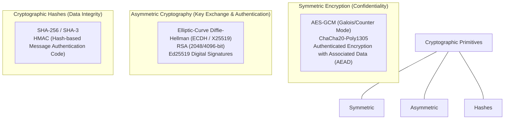
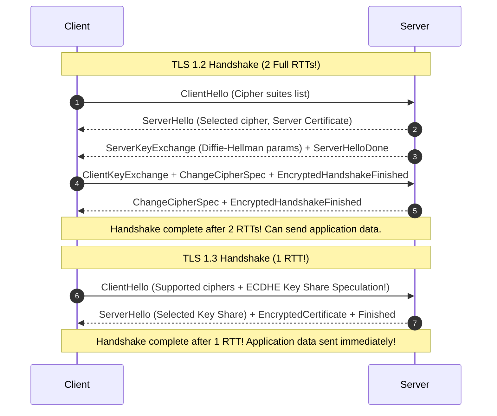
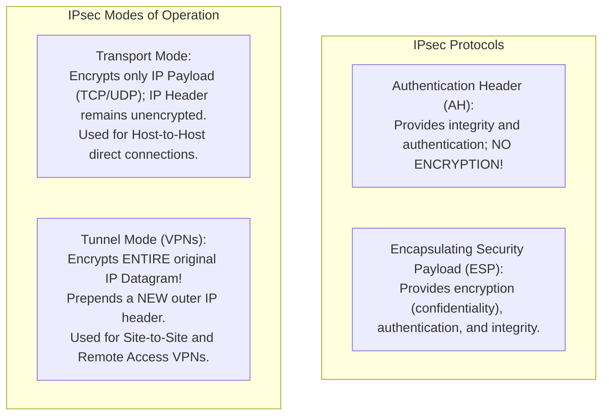

# Chapter 09: Network Security & Cryptographic Protocols — TLS, IPSec, SSH & Firewalls

> "Network security is an active arms race. An untrusted network allows eavesdropping, packet modification, session hijacking, and identity spoofing. Cryptographic protocols provide the mathematical armor required to communicate securely across the wild internet."  
> — *W. Richard Stevens & Kevin R. Fall, TCP/IP Illustrated, Volume 1*

---

## 📚 Recommended Book References
- **Computer Networking: A Top-Down Approach (Kurose & Ross, 8th Ed)**: Chapter 8 (Network Security: Principles of Cryptography, Integrity, Authentication, TLS, IPsec, Firewalls).
- **TCP/IP Illustrated, Volume 1: The Protocols (Stevens & Fall, 2nd Ed)**: Chapter 18 (Security: EAP, IPsec, TLS, DNSSEC, DKIM) and Chapter 19 (Internet Routing and Security).
- **High Performance Browser Networking (Ilya Grigorik)**: Chapter 4 (Transport Layer Security - TLS).
- **RFC Specifications**: RFC 8446 (The Transport Layer Security Protocol Version 1.3), RFC 4301 (Security Architecture for the Internet Protocol - IPsec).

---

## 1. Cryptographic Building Blocks

### 1.1 Public Key Infrastructure (PKI) & X.509 Certificates
How does a client know that a public key belongs to `google.com` and not an attacker?
- **Certificate Authorities (CAs)**: Globally trusted cryptographic entities (e.g., Let's Encrypt, DigiCert) that verify identity and sign the domain's public key with their private key.
- **Certificate Chain of Trust**:
  $$\text{Root CA (Self-Signed in OS Trust Store)} \longrightarrow \text{Intermediate CA} \longrightarrow \text{Server Certificate (Leaf)}$$
- **Revocation Checking**:
  - **CRL (Certificate Revocation List)**: Downloadable list of revoked serial numbers (Slow, outdated).
  - **OCSP (Online Certificate Status Protocol)**: Real-time query to CA responder.
  - **OCSP Stapling**: The web server queries the CA periodically, staples the signed time-stamped OCSP response directly into the TLS handshake, eliminating extra DNS and HTTP round-trips for the client!

---

## 2. Transport Layer Security: TLS 1.2 vs. TLS 1.3 (RFC 8446)

Published in 2018, **TLS 1.3** is the most significant security and performance overhaul in the protocol's history.

### 2.1 Major TLS 1.3 Architectural Improvements:
1. **Reduced Latency (1 RTT vs. 2 RTTs)**: In TLS 1.3, the client speculates the server's preferred elliptic curve (e.g., X25519) and sends its public key share directly inside the `ClientHello`, establishing encrypted session keys in a single round-trip.
2. **Zero-RTT (0-RTT) Early Data**: Reconnecting clients can encrypt and transmit application data (e.g., HTTP `GET`) in the very first network packet using a pre-shared key (PSK) derived from the previous session.
   - *Security Hazard*: 0-RTT is vulnerable to **Replay Attacks** (an eavesdropper can intercept and re-send the packet). Therefore, browsers only permit idempotent requests (`GET`) in 0-RTT data.
3. **Mandatory Forward Secrecy**: Static RSA key exchange was completely removed! Every session strictly uses ephemeral Diffie-Hellman (**ECDHE**). If an attacker steals the server's private key in 2030, they **cannot** decrypt traffic recorded today!
4. **Purged Insecure Cryptography**: Removed MD5, SHA-1, RC4, DES, 3DES, static DH, and CBC ciphers (vulnerable to padding oracle attacks like POODLE).

---

## 3. IP Security (IPsec)

While TLS secures communication at the application layer, **IPsec** secures communication at the network layer, encrypting all traffic transparently between routers, hosts, or gateways.

---

## 4. Firewalls & Modern Zero Trust Architecture (ZTA)

### 4.1 Packet Filters vs. Stateful Firewalls
- **Stateless Packet Filter**: Evaluates individual packets in isolation against an Access Control List (ACL) based purely on the 5-tuple (`src_ip, dst_ip, protocol, src_port, dst_port`). Cannot detect whether a packet belongs to an established connection.
- **Stateful Inspection Firewall (e.g., Linux `iptables` / `nftables` with `conntrack`)**:
  - Maintains an in-memory connection state tracking table.
  - Dynamically permits return packets only if they match an active connection state (`ESTABLISHED` or `RELATED`), dropping unsolicited incoming connection attempts.

### 4.2 Beyond Perimeter Defense: Zero Trust Architecture (ZTA)
Traditional network security relied on the **Castle-and-Moat** model: trust everything inside the corporate VPN, block everything outside.
- *The Flaw*: Once an attacker compromises a single endpoint (via phishing or malware), they can move laterally across the entire internal flat network unrestricted.
- **Zero Trust Principles (NIST SP 800-207)**:
  1. **Never Trust, Always Verify**: Every request—regardless of originating from inside the office or public internet—must be explicitly authenticated and authorized.
  2. **Mutual TLS (mTLS)**: Every microservice validates the cryptographic certificate of caller services.
  3. **Microsegmentation**: Workloads are isolated by software policies; servers can only communicate with explicitly whitelisted dependencies.

---
