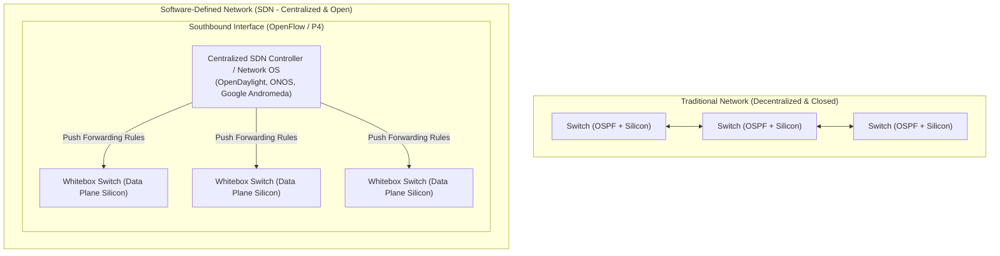
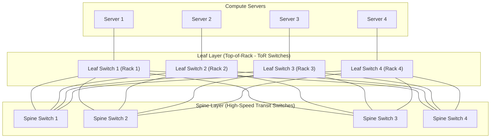
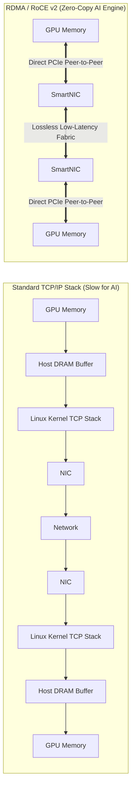
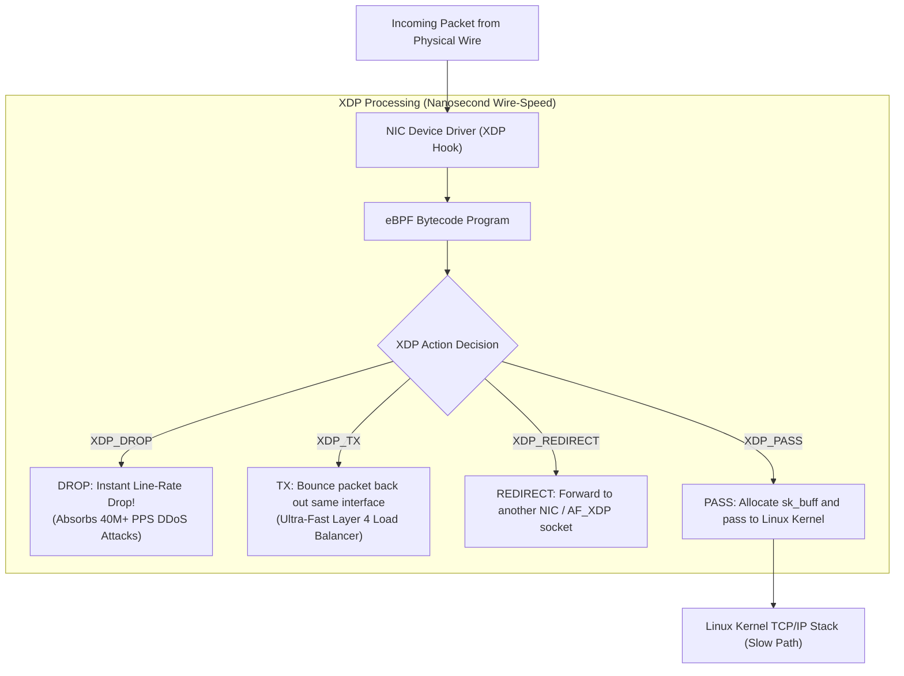
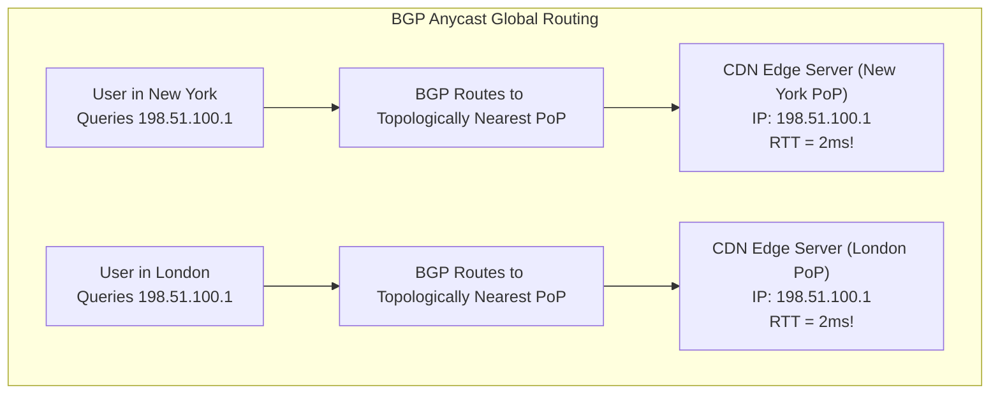

# Chapter 10: Modern Networking Paradigms — SDN, eBPF XDP, Data Center Fabrics & CDN

> "Modern cloud infrastructure has obliterated traditional network assumptions. Hardware switches are decoupled from control software, data centers are wired as massive Clos fabrics, line-rate packet filters run inside kernel drivers via eBPF, and global traffic routes dynamically over Anycast CDNs."  
> — *Brendan Gregg, Systems Performance: Enterprise and the Cloud*

---

## 📚 Recommended Book References
- **Computer Networking: A Top-Down Approach (Kurose & Ross, 8th Ed)**: Chapter 4 & 5 (Software-Defined Networking, OpenFlow), Chapter 2 (Content Delivery Networks).
- **BPF Performance Tools (Brendan Gregg)**: Chapter 4 (eBPF Architecture, XDP, Socket Filters).
- **High Performance Browser Networking (Ilya Grigorik)**: Chapter 13 (Content Delivery Networks).
- **Cloud-Native Data Center Networking (Dinesh G. Dutt, O'Reilly)**: Clos networks, Leaf-Spine, BGP EVPN, VXLAN.

---

## 1. Software-Defined Networking (SDN) & OpenFlow

Traditional networking tightly bundles the **Control Plane** and **Data Plane** inside closed, proprietary switch hardware from single vendors.

### 1.1 Key Principles of SDN:
1. **Decoupled Control Plane**: Routing intelligence is extracted from hardware switches and centralized into scalable software controllers running on commodity servers.
2. **Flow-Based Match-Action Tables (OpenFlow)**: Switches match incoming packets on arbitrary headers (Ethernet, IP, TCP/UDP ports) and execute programmable actions: **Forward**, **Drop**, **Rewrite Header**, or **Send to Controller**.
3. **Programmable Data Planes with P4**: Network engineers write custom packet-processing algorithms compiled directly into switch ASICs (e.g., Intel Tofino).

---

## 2. Modern Data Center Network Fabrics: Clos / Leaf-Spine

Traditional 3-tier enterprise tree networks (Core, Aggregation, Access) suffer from severe oversubscription and East-West traffic bottlenecks (servers communicating with other servers within the same data center).

Modern data centers use the **Clos / Leaf-Spine (Fat-Tree)** topology:

### 2.1 Architectural Invariants of Leaf-Spine:
1. **Every Leaf connects to EVERY Spine switch**: Every server in the entire data center is **exactly 3 network hops away** from every other server!
2. **Equal-Cost Multi-Path (ECMP)**: Layer 3 routing (eBGP underlay) distributes traffic flows across all parallel spine switches using 5-tuple hashing, delivering predictable latency and massive bisection bandwidth.
3. **Network Virtualization via VXLAN & EVPN**: Wraps tenant Layer 2 Ethernet frames inside Layer 3 UDP datagrams (**VXLAN - RFC 7348**), scaling cloud tenant isolation from 4,096 VLANs to **16 million Virtual Network Identifiers (VNIs)**.

---

## 3. High-Performance AI & Data Center Networking: RDMA and RoCE v2

Distributed Large Language Model (LLM) training across thousands of GPUs requires moving petabytes of tensor weights between GPU memories (All-Reduce operations) with microsecond latency.

### 3.1 RDMA (Remote Direct Memory Access) & RoCE v2
- **Zero-Copy**: Hardware SmartNICs read and write directly to remote GPU memory via PCIe DMA without copying bytes into host operating system buffers.
- **Kernel Bypass**: Applications issue I/O operations directly to the NIC hardware queues in user space, bypassing the entire Linux networking stack.
- **RoCE v2 (RDMA over Converged Ethernet)**: Encapsulates InfiniBand transport packets inside standard UDP/IP frames, running RDMA over cost-effective data center Ethernet.
- **Lossless Ethernet Requirement**: RDMA cannot tolerate dropped packets; networks enforce **Priority Flow Control (PFC - 802.1Qbb)** and **Explicit Congestion Notification (ECN)** to guarantee zero-drop transmission.

---

## 4. Kernel-Bypass Networking: eBPF XDP (eXpress Data Path)

When operating at 100 Gbps to 400 Gbps, the operating system kernel cannot allocate `struct sk_buff` socket buffers for every packet.

**XDP (eXpress Data Path)** executes eBPF bytecode **directly inside the network card driver** at the lowest possible layer before memory allocation:

*Production Power*: Cloudflare uses XDP to mitigate massive multi-terabit volumetric DDoS attacks at wire speed; Cilium replaces `kube-proxy` with eBPF XDP for microsecond Kubernetes service routing.

---

## 5. Content Delivery Networks (CDNs) & BGP Anycast

A **Content Delivery Network (CDN)** deploys thousands of edge caching servers across hundreds of Points of Presence (PoPs) globally to serve content with minimal propagation delay.

### 5.1 BGP Anycast Architecture:
- Every CDN edge data center around the world announces the **exact same public IP address block** to Tier-1 ISPs via BGP.
- When a user sends a packet to `198.51.100.1`, global internet routing protocols automatically steer the packet to the **topologically nearest CDN data center**!
- If a data center goes offline, BGP withdraws the route, and traffic automatically reroutes to the next nearest healthy facility within seconds.

---
