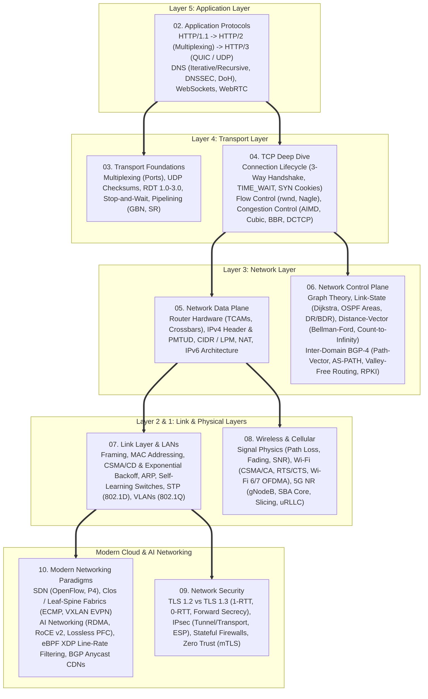
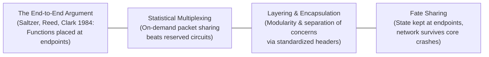

# Computer Networking & Modern Internet Systems — Complete Technical Reference

> **An exhaustive, production-grade deep dive into computer networking theory, Internet protocol internals, transport layer state machines, global routing algorithms, and modern cloud-native networking paradigms.**  
> Structured across the 5-layer Internet architecture alongside modern hyper-scale data center fabrics, kernel-bypass technologies, and AI networking infrastructure.

---

## 🏛️ Comprehensive Protocol Stack & Concept Map

---

## 📚 Core Academic & Industry Textbooks Referenced

| Textbook | Authors | Primary Focus Areas |
| :--- | :--- | :--- |
| **Computer Networking: A Top-Down Approach (8th Ed)** | James F. Kurose & Keith W. Ross | The definitive pedagogical framework: Application $\to$ Transport $\to$ Network Data/Control $\to$ Link $\to$ Wireless $\to$ Security. |
| **TCP/IP Illustrated, Volume 1: The Protocols (2nd Ed)** | W. Richard Stevens & Kevin R. Fall | Authoritative packet formats, TCP state machines, timer calculations (Jacobson RTO), ARP, IP, and socket internals. |
| **High Performance Browser Networking** | Ilya Grigorik | Modern web protocols: HTTP/1.1 vs HTTP/2 vs HTTP/3, QUIC, TLS 1.3 handshakes, BBR congestion control, WebSockets, WebRTC. |
| **Computer Networks (5th/6th Ed)** | Andrew S. Tanenbaum & David J. Wetherall | Mathematical foundations, queuing theory, statistical multiplexing proofs, medium access control, routing graph algorithms. |
| **Interconnections: Bridges, Routers, Switches, and Protocols (2nd Ed)** | Radia Perlman | The definitive authority on Spanning Tree Protocol (STP), link-state vs distance-vector routing, bridge and switch architectures. |
| **Internetworking with TCP/IP, Volume 1 (6th Ed)** | Douglas E. Comer | IP addressing, CIDR, subnetting masks, fragmentation, routing architecture. |
| **BPF Performance Tools / Systems Performance** | Brendan Gregg | Extended Berkeley Packet Filter (eBPF), eXpress Data Path (XDP) kernel-bypass networking, packet filtering, and socket tracing. |

---

## 📑 Complete Chapter Index

### Part I: Foundations, Application Layer & Transport Layer

| Chapter | Title | Key Theoretical & Architectural Concepts | Deep Dives & Protocols |
| :--- | :--- | :--- | :--- |
| **01** | [**Foundations & Network Core**](./01.%20Foundations%20%26%20Network%20Core%20-%20Delays,%20Loss%20%26%20Protocol%20Stacks.md) | Edge vs Core, Circuit vs Packet Switching, Statistical Multiplexing proof, Nodal Delays ($d_{\text{proc}}, d_{\text{queue}}, d_{\text{trans}}, d_{\text{prop}}$), Bandwidth-Delay Product (BDP) | OSI 7-Layer vs TCP/IP 5-Layer Model, Encapsulation & Decapsulation walk-through, Traffic Intensity ($La/R$) and queuing delay |
| **02** | [**Application Layer**](./02.%20Application%20Layer%20-%20HTTP%20Evolution,%20DNS%20%26%20Socket%20Programming.md) | DNS Hierarchical Architecture, Recursive vs Iterative resolution, Resource Records, DNSSEC & DoH, BSD Sockets API | **HTTP Evolution**: HTTP/1.1 (Keep-Alive, HoL) $\to$ HTTP/2 (Binary Framing, HPACK, Streams) $\to$ **HTTP/3 & QUIC** (0-RTT, Connection IDs, zero HoL blocking), WebSockets, WebRTC |
| **03** | [**Transport Layer Foundations**](./03.%20Transport%20Layer%20Foundations%20-%20UDP,%20TCP%20%26%20Reliable%20Data%20Transfer%20%28RDT%29.md) | Process-to-process demultiplexing, Port ranges, UDP 8-byte header & 1's complement checksum | **RDT Protocol Evolution** (rdt 1.0 to 3.0 Alternating-Bit), Stop-and-Wait utilization failure ($U \approx 0.027\%$), **Go-Back-N (GBN) vs Selective Repeat (SR)** |
| **04** | [**TCP Deep Dive**](./04.%20TCP%20Deep%20Dive%20-%20Connection%20Lifecycle,%20Flow%20Control%20%26%20Congestion%20Control.md) | TCP Header structure, 3-Way Handshake (ISN randomization, SYN Cookies), 4-Way Close (`TIME_WAIT` $2 \times \text{MSL}$), Flow Control (`rwnd`, Nagle) | Jacobson's RTT/RTO EWMA math, AIMD convergence proof, Classic Tahoe/Reno, **TCP Cubic** (polynomial window growth), **TCP BBR** (model-based, eliminating bufferbloat), **DCTCP** |

---

### Part II: Network Layer (Data & Control Planes) & Link Layer

| Chapter | Title | Key Theoretical & Architectural Concepts | Deep Dives & Protocols |
| :--- | :--- | :--- | :--- |
| **05** | [**Network Layer: Data Plane**](./05.%20Network%20Layer%20-%20Data%20Plane%20%26%20IP%20Addressing%20%28IPv4,%20IPv6,%20NAT,%20CIDR%29.md) | Forwarding vs Routing, Router architecture (Input/Output ports, Crossbar fabric, TCAM hardware lookup), IPv4 Header & PMTUD | **CIDR Subnetting & Longest Prefix Match (LPM)**, NAT translation table mechanics, **IPv6 Architecture** (40B fixed header, no fragmentation, extension headers) |
| **06** | [**Network Layer: Control Plane**](./06.%20Network%20Layer%20-%20Control%20Plane%20%26%20Routing%20Algorithms%20%28OSPF,%20BGP%29.md) | Graph routing model $G=(V,E)$, Link-State vs Distance-Vector, Per-router vs Centralized SDN | **Dijkstra's Algorithm & OSPF** (Areas, DR/BDR), **Bellman-Ford & Count-to-Infinity** (Poisoned Reverse), **Inter-Domain BGP-4** (`AS-PATH`, Valley-Free routing, RPKI against hijacking) |
| **07** | [**Link Layer & LANs**](./07.%20Link%20Layer%20%26%20Local%20Area%20Networks%20-%20Ethernet,%20ARP,%20Switches%20%26%20VLANs.md) | Framing, 48-bit MAC addresses (OUI), CSMA/CD Binary Exponential Backoff & 64-byte min frame math, ARP protocol | Self-learning Switches (CAM tables), **Spanning Tree Protocol (STP - 802.1D)** loop prevention, **VLANs (802.1Q 4-byte tags & trunking)** |
| **08** | [**Wireless & Mobile Networks**](./08.%20Wireless%20%26%20Mobile%20Networks%20-%20Wi-Fi%20%28802.11%29,%20Cellular%20%284G-5G%29%20%26%20Mobility.md) | Path loss, Multipath fading, SNR vs BER, Hidden Terminal Problem, CSMA/CA (DIFS, SIFS, RTS/CTS handshakes) | **Wi-Fi Generations** (Wi-Fi 4 to Wi-Fi 7 MLO & 320MHz), **4G LTE EPC vs 5G Standalone (SA) Core** (gNodeB, AMF, UPF), **5G Pillars** (eMBB, uRLLC < 1ms, mMTC, Network Slicing) |

---

### Part III: Security & Modern Cloud/AI Networking Paradigms

| Chapter | Title | Key Theoretical & Architectural Concepts | Deep Dives & Protocols |
| :--- | :--- | :--- | :--- |
| **09** | [**Network Security & Cryptography**](./09.%20Network%20Security%20%26%20Cryptographic%20Protocols%20-%20TLS,%20IPSec,%20SSH%20%26%20Firewalls.md) | Symmetric AEAD (AES-GCM), Asymmetric ECDHE, SHA-256, PKI X.509 Certificate chains & OCSP Stapling | **TLS 1.2 vs TLS 1.3** (1 RTT handshake, 0-RTT early data, forward secrecy), **IPsec** (Tunnel vs Transport, ESP/AH), Stateful firewalls (`conntrack`), Zero Trust Architecture (mTLS) |
| **10** | [**Modern Networking Paradigms**](./10.%20Modern%20Networking%20Paradigms%20-%20SDN,%20eBPF%20XDP,%20Data%20Center%20Fabrics%20%26%20CDN.md) | Software-Defined Networking (OpenFlow, P4), Content Delivery Networks (CDNs) & BGP Anycast routing | **Clos / Leaf-Spine Data Center Fabrics** (ECMP, VXLAN EVPN), **High-Performance AI Networking** (**RDMA / RoCE v2**, Lossless PFC, GPU All-Reduce), **eBPF XDP line-rate kernel bypass** |

---

## 🎯 Cross-Cutting Networking Design Principles

1. **The End-to-End Argument (Saltzer, Reed, Clark, 1984)**: Functions (such as error checking, reliability, encryption, and deduplication) can only be completely and correctly implemented with the knowledge and help of the endpoint application. Intermediate network components should remain as simple, stateless, and fast as possible.
2. **Fate Sharing**: State critical to maintaining an active session is maintained directly at the endpoints (the hosts). If intermediate routers crash and reboot, the communication session survives without losing connection state.
3. **Decoupling Transport from Media**: IP operates over any link layer (Ethernet, Wi-Fi, 5G, Optical), and any application protocol (HTTP, DNS, SSH) operates over any transport protocol (TCP, UDP, QUIC), realizing the famous **"Hourglass Architecture"** of the Internet.
