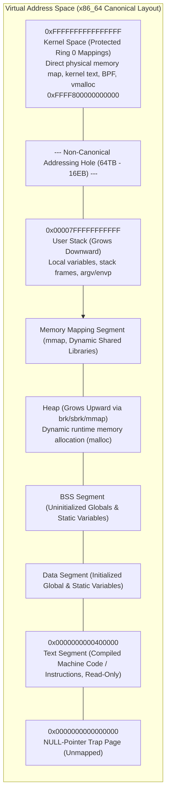
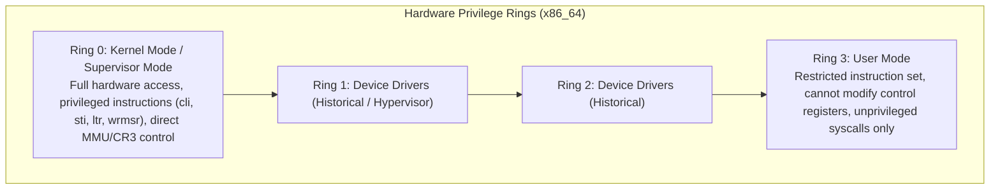
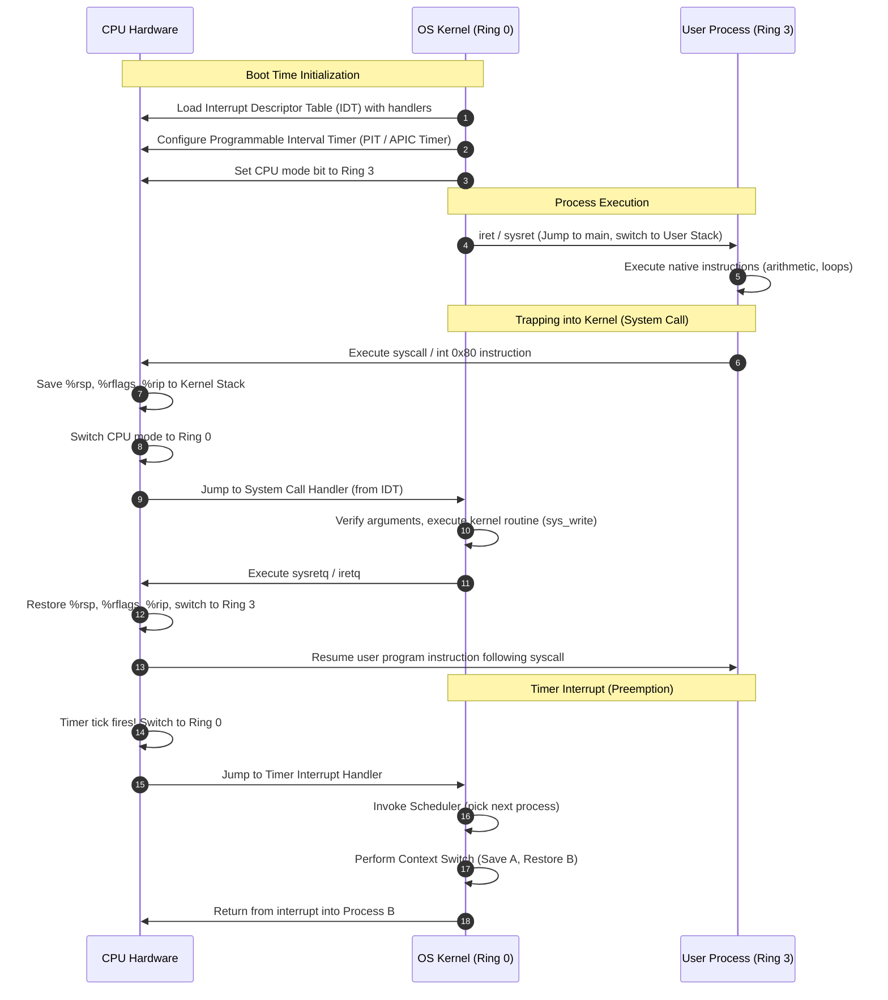
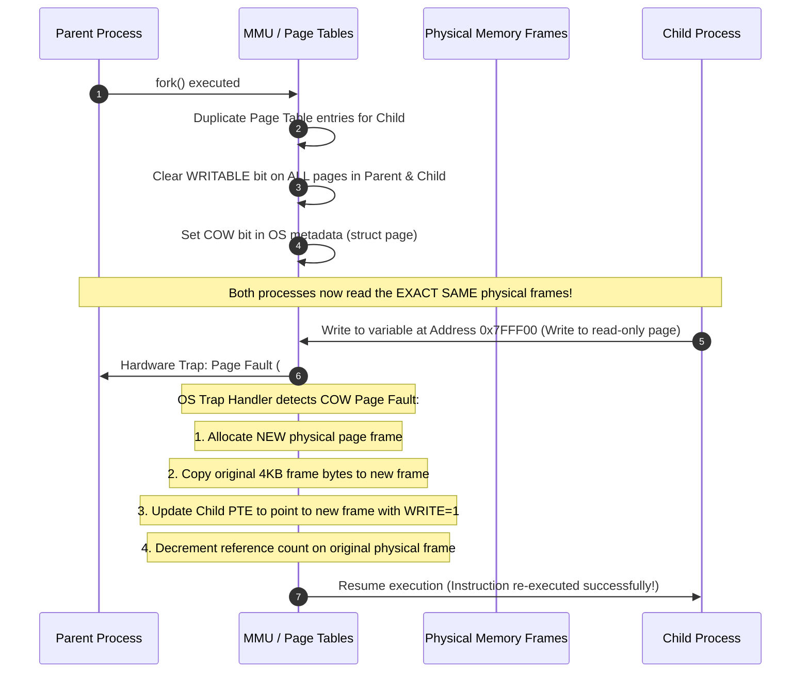
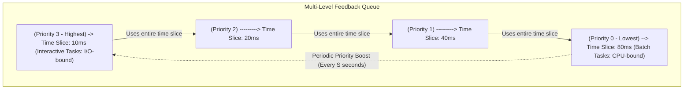
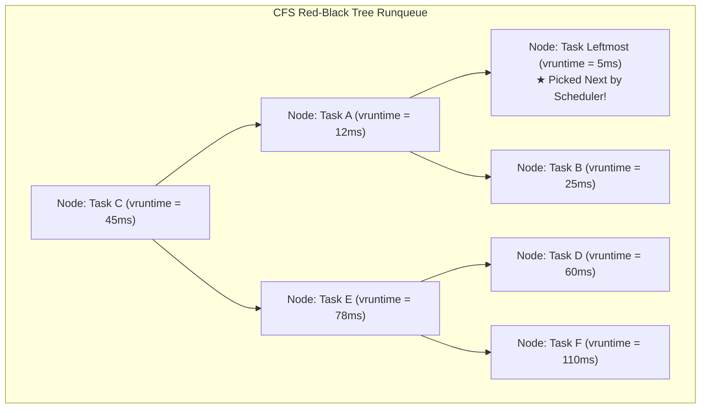

# Chapter 01: CPU Virtualization — Processes, Context Switching & Dual-Mode Execution

> "How can the OS provide the illusion of many CPUs when there is only one physical CPU (or a few)? The answer is time-sharing: running one process for a little while, then running another, and so forth. By time-sharing the CPU, virtualization is achieved."  
> — *Remzi H. Arpaci-Dusseau & Andrea C. Arpaci-Dusseau, Operating Systems: Three Easy Pieces (OSTEP)*

---

## 📚 Recommended Book References
- **OSTEP (Arpaci-Dusseau)**: Chapters 4 (Processes), 5 (Process API), 6 (Direct Execution), 7–10 (CPU Scheduling & Multi-CPU Scheduling).
- **Modern Operating Systems (Tanenbaum & Bos, 4th/5th Ed)**: Chapter 2 (Processes and Threads).
- **Operating System Concepts (Silberschatz, Galvin, Gagne, 10th Ed)**: Chapters 3 (Processes) and 5 (CPU Scheduling).
- **Linux Kernel Development (Robert Love, 3rd Ed)**: Chapter 3 (Process Management) and Chapter 4 (Process Scheduling).
- **Understanding the Linux Kernel (Bovet & Cesati, 3rd Ed)**: Chapter 3 (Processes) and Chapter 7 (Process Scheduling).

---

## 1. The Process Abstraction & Address Space Topology

A **process** is an abstraction of a running computer program. At any given moment, a process is defined by its state: its memory footprint (address space), processor registers (including the Program Counter `%rip` and Stack Pointer `%rsp`), and operating system resources (file descriptors, network sockets, signal handlers).



### 1.1 The Process Control Block (PCB): Linux `task_struct`
In the Linux kernel, every process and thread is represented by a dynamically allocated `struct task_struct` (defined in `<linux/sched.h>`). In Linux, threads are simply processes that share their virtual address space and file descriptor tables (often called *lightweight processes* or tasks).

```c
struct task_struct {
    /* Process State Flag */
    volatile long state;               /* -1 unrunnable, 0 runnable (TASK_RUNNING), >0 stopped */
    void *stack;                       /* Pointer to the 8KB or 16KB kernel-mode stack */
    refcount_t usage;
    unsigned int flags;                /* Per-process flags (e.g., PF_KTHREAD) */

    /* Execution & Scheduling Attributes */
    int prio, static_prio, normal_prio, rt_priority;
    const struct sched_class *sched_class; /* CFS, Real-Time, Deadline */
    struct sched_entity se;            /* CFS scheduling entity (vruntime, load weight) */
    struct sched_rt_entity rt;         /* Real-time scheduling entity */
    unsigned int policy;               /* SCHED_NORMAL, SCHED_FIFO, SCHED_RR, SCHED_DEADLINE */
    cpumask_t cpus_allowed;            /* CPU affinity mask */

    /* Memory Management */
    struct mm_struct *mm;              /* Process memory descriptor (NULL for kernel threads!) */
    struct mm_struct *active_mm;       /* Borrowed mm for kernel threads executing user context */

    /* Process Relationships & Identifiers */
    pid_t pid;                         /* Thread ID (TID in user-space terms) */
    pid_t tgid;                        /* Thread Group ID (Process ID / PID in user space) */
    struct task_struct __rcu *real_parent; /* Real parent process */
    struct task_struct __rcu *parent;      /* Recipient of SIGCHLD */
    struct list_head children;         /* List of child tasks */
    struct list_head sibling;          /* Linkage in parent's children list */

    /* Filesystem & I/O Resources */
    struct fs_struct *fs;              /* Filesystem info (current working directory, root) */
    struct files_struct *files;        /* Open file table (array of struct file pointers) */
    struct signal_struct *signal;      /* Signal descriptors & shared signal queue */
    struct sighand_struct *sighand;    /* Action taken upon signal delivery */
};
```

---

## 2. Dual-Mode Execution & Limited Direct Execution (LDE)

To guarantee that a rogue user process cannot monopolize the CPU, overwrite operating system memory, or execute raw disk writes, modern processors implement **Dual-Mode Execution** backed by hardware privilege rings.



### 2.1 The Limited Direct Execution (LDE) Protocol
The foundational concept introduced in **OSTEP Chapter 6** is **Limited Direct Execution**:
1. **Direct Execution**: Let the user program run directly on the physical CPU hardware for native speed.
2. **Limited**: Restrict what the program can do via hardware privilege boundaries and timer interrupts.



---

## 3. Context Switching Mechanics & Kernel Assembly

A **Context Switch** is the low-level operating system mechanism that stops one running process and resumes another. It is divided into two distinct components:
1. **Processor Register State Switch**: Saving hardware registers to the kernel stack and switching stack pointers.
2. **Virtual Memory State Switch**: Reloading the Translation Lookaside Buffer (TLB) and Page Table Base Register (`%cr3` on x86_64).

### 3.1 Assembly Walkthrough: Linux `__switch_to_asm` (x86_64)
The actual register swap occurs in architecture-specific assembly (`arch/x86/entry/entry_64.S`). When the scheduler decides to switch from `prev` to `next`:

```assembly
/*
 * Context switch between two tasks:
 * rdi = struct task_struct *prev
 * rsi = struct task_struct *next
 */
ENTRY(__switch_to_asm)
    /* 1. Save callee-saved registers of 'prev' on its kernel stack */
    pushq   %rbp
    pushq   %rbx
    pushq   %r12
    pushq   %r13
    pushq   %r14
    pushq   %r15

    /* 2. Switch the kernel stack pointer (%rsp) in task_struct */
    movq    %rsp, TASK_threadsp(%rdi)     /* prev->thread.sp = %rsp */
    movq    TASK_threadsp(%rsi), %rsp     /* %rsp = next->thread.sp */

    /* 3. Restore callee-saved registers from 'next' kernel stack */
    popq    %r15
    popq    %r14
    popq    %r13
    popq    %r12
    popq    %rbx
    popq    %rbp

    /* 4. Jump to C function __switch_to for FPU/TLS/CR3 switching */
    jmp     __switch_to
END(__switch_to_asm)
```

### 3.2 The Direct vs. Indirect Cost of a Context Switch
- **Direct Costs (Measurable CPU cycles: ~1–3 µs)**:
  - Saving and restoring general-purpose registers.
  - Switching kernel stack pointers.
  - Executing scheduler code (`schedule()`, CFS pick next).
  - Reloading `%cr3` (Page Global Directory pointer).
- **Indirect Costs (Microarchitectural Cache Thrashing: ~10–100 µs)**:
  - **L1/L2/L3 Cache Pollution**: The new process reads its own memory, displacing the previous process's hot cache lines.
  - **TLB Invalidation**: If PCID (Process-Context Identifier) is not supported, reloading `%cr3` flushes all non-global TLB entries, causing a storm of expensive multi-level page table walks.
  - **Branch Target Buffer (BTB) & Branch Predictor Pollution**: The CPU branch predictor must relearn the branch history of the new process.

---

## 4. Process Creation: `fork()`, `execve()`, and Copy-On-Write (COW)

Unix divides process creation into two distinct primitives: `fork()` (create a clone) and `execve()` (replace address space with a new executable program).

### 4.1 Copy-On-Write (COW) Architecture
Historically, `fork()` made a complete physical copy of the parent's entire address space. For large processes (e.g., a 10GB database server), this was catastrophic for latency and memory usage, especially since `fork()` is almost always immediately followed by `execve()`.

Modern operating systems implement **Copy-On-Write (COW)**:



### 4.2 The `execve()` Pipeline
When a process invokes `execve(filename, argv, envp)`, the operating system transforms the current process:
1. **Binary Format Verification**: Reads the magic number of the binary (e.g., `\x7fELF` for ELF, `#!` for scripts).
2. **Release Old Memory**: Deallocates the old `mm_struct`, unmapping all existing text, data, heap, and stack pages.
3. **Map New Segments**: Reads the ELF Program Headers (`LOAD` segments):
   - Text segment mapped as `PROT_READ | PROT_EXEC`.
   - Data/BSS segments mapped as `PROT_READ | PROT_WRITE`.
4. **Setup User Stack**: Pushes `argc`, `argv` strings and pointers, and `envp` environment variables onto the new stack.
5. **Set Program Counter (`%rip`)**: Sets the execution entry point (either to the dynamic linker `/lib64/ld-linux.so` or the binary's `_start` symbol).

---

## 5. CPU Scheduling Algorithms & Mathematical Models

The scheduler decides which runnable process in the Ready queue is assigned to an idle CPU core.

### 5.1 Scheduling Metrics
- **Turnaround Time ($T_{\text{turnaround}}$)**: Time from process arrival to completion:
  $$T_{\text{turnaround}} = T_{\text{completion}} - T_{\text{arrival}}$$
- **Response Time ($T_{\text{response}}$)**: Time from process arrival to first scheduled execution:
  $$T_{\text{response}} = T_{\text{firstrun}} - T_{\text{arrival}}$$
- **Throughput**: Number of completed processes per unit time.
- **Fairness**: Equal distribution of CPU resources across all competing entities.

### 5.2 Classic Uniprocessor Scheduling Models

| Algorithm | Preemptive? | Optimizes For | Vulnerability |
| :--- | :--- | :--- | :--- |
| **FIFO / FCFS** | No | Simplicity | **Convoy Effect**: Long process blocks all short processes |
| **SJF (Shortest Job First)** | No | Turnaround Time | Non-preemptive; long jobs still block early arrivals |
| **STCF (Shortest Time-to-Completion First)** | **Yes** | Turnaround Time | **Starvation**: Continuous arrival of short jobs starves long jobs |
| **Round Robin (RR)** | **Yes** | Response Time | Poor Turnaround Time; sensitive to time quantum size $Q$ |

---

## 6. Multi-Level Feedback Queue (MLFQ)

Designed by Fernando Corbató (Turing Award, 1990) for CTSS, **MLFQ** learns process behavior dynamically without requiring advance knowledge of job runtimes.



### The Five Inviolable Rules of MLFQ (OSTEP Ch 8):
1. **Rule 1**: If $\text{Priority}(A) > \text{Priority}(B)$, $A$ runs ($B$ does not).
2. **Rule 2**: If $\text{Priority}(A) == \text{Priority}(B)$, $A$ and $B$ run in Round Robin using the time slice of that priority queue.
3. **Rule 3**: When a job enters the system, it is placed at the highest priority queue.
4. **Rule 4 (Accounting & Gaming Prevention)**: Once a job uses up its time allotment at a given level (regardless of how many times it yields the CPU for I/O), its priority is reduced (it moves down one queue).
5. **Rule 5 (Starvation Prevention / Priority Boost)**: After some time period $S$, move all the jobs in the system to the highest priority queue.

---

## 7. The Linux Completely Fair Scheduler (CFS)

Linux kernel 2.6.23 replaced the historical $O(1)$ scheduler with the **Completely Fair Scheduler (CFS)** developed by Ingo Molnar. CFS models an "Ideal Multi-tasking CPU" where $N$ processes run simultaneously on 1 CPU, each progressing at a rate of $\frac{1}{N}$.

### 7.1 Virtual Runtime (`vruntime`) Mathematics
CFS tracks execution time using a per-process 64-bit monotonically increasing counter called **`vruntime`** (virtual runtime). A process with smaller `vruntime` has received less CPU time and has higher priority to run next.

When process $i$ runs for physical time $\Delta \text{exec\_time}$, its `vruntime` advances according to:
$$vruntime_i \leftarrow vruntime_i + \Delta \text{exec\_time} \times \frac{W_0}{W_i}$$

Where:
- $W_0 = 1024$ (the weight of a process with `nice = 0`).
- $W_i$ is the weight corresponding to the process's `nice` level (ranging from $-20$ to $+19$).

#### CFS Load Weights Array (Linux Kernel)
```c
/* kernel/sched/core.c - load weight scaling factor per nice level */
const int sched_prio_to_weight[40] = {
    /* -20 */ 88761, 71755, 56483, 46273, 36291,
    /* -15 */ 29154, 23254, 18705, 14949, 11916,
    /* -10 */  9548,  7620,  6100,  4904,  3906,
    /*  -5 */  3121,  2501,  1991,  1586,  1277,
    /*   0 */  1024,   820,   655,   526,   423,
    /*   5 */   335,   272,   215,   172,   137,
    /*  10 */   110,    87,    70,    56,    45,
    /*  15 */    36,    29,    23,    18,    15,
};
```
*Mathematical Property*: Each consecutive `nice` level difference scales CPU allocation by approximately a factor of $1.25$ (a $10\%$ difference in CPU proportion), guaranteeing smooth geometric scaling.

### 7.2 Runqueue Implementation: The Red-Black Tree
CFS does not use priority arrays. It stores all runnable processes in a **time-ordered Red-Black Tree** (`struct cfs_rq`):
- The tree is keyed strictly by `se->vruntime`.
- Finding the next task to run is $O(1)$ because the kernel caches a pointer to the **leftmost node** (`rb_leftmost`).
- Inserting or re-inserting a task after its time quantum expires is $O(\log N)$.



### 7.3 Latency Targeting & Minimum Granularity
To prevent high context-switch frequency when hundreds of processes compete, CFS enforces:
- **Target Latency (`sysctl_sched_latency`, default ~6–24ms)**: The period in which all runnable tasks must run at least once.
- **Time Slice Calculation**:
  $$\text{TimeSlice}_i = \text{TargetLatency} \times \frac{W_i}{\sum_{j=1}^N W_j}$$
- **Minimum Granularity (`sysctl_sched_min_granularity`, default ~1–4ms)**: The hard floor for any time slice, guaranteeing that CPU time spent on context switching does not overwhelm actual computational progress.

---
