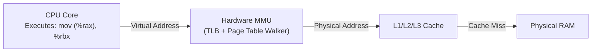
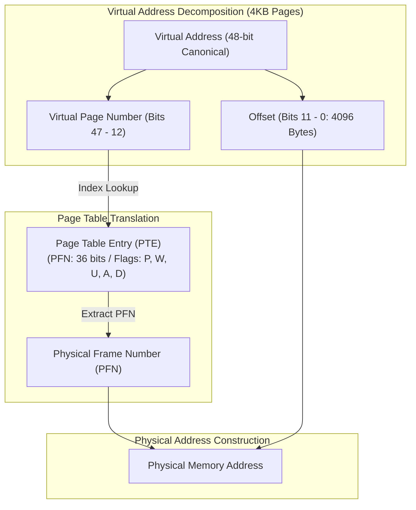
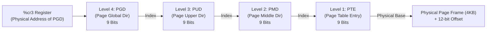
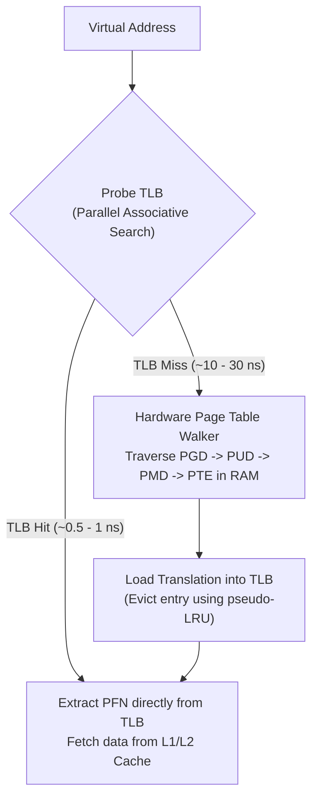
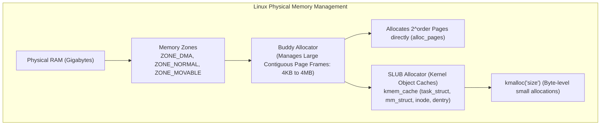

# Chapter 02: Memory Virtualization — Paging, Segmentation, TLB & Virtual Memory

> "In virtualizing memory, the OS provides each process with the illusion that it has a large, private, contiguous address space. The reality is that memory is shared, fragmented, and backed by diverse physical storage tiers."  
> — *Remzi H. Arpaci-Dusseau & Andrea C. Arpaci-Dusseau, Operating Systems: Three Easy Pieces (OSTEP)*

---

## 📚 Recommended Book References
- **OSTEP (Arpaci-Dusseau)**: Chapters 12–17 (Address Spaces, Segmentation, Free Space), 18–20 (Paging & Multi-Level Page Tables), 19 (TLBs), 21–23 (Swapping & Policy).
- **Modern Operating Systems (Tanenbaum & Bos, 4th/5th Ed)**: Chapter 3 (Memory Management).
- **Operating System Concepts (Silberschatz, Galvin, Gagne, 10th Ed)**: Chapter 9 (Main Memory) and Chapter 10 (Virtual Memory).
- **Understanding the Linux Kernel (Bovet & Cesati, 3rd Ed)**: Chapter 2 (Memory Addressing) and Chapter 8 (Memory Management).
- **The Linux Programming Interface (Kerrisk)**: Chapter 6 (Processes & Memory Allocation) and Chapter 49 (Memory Mappings).

---

## 1. Hardware Memory Management Unit (MMU) & Segmentation

The processor never emits physical memory addresses directly. Every memory access (instruction fetch, stack push, pointer dereference) produces a **Virtual Address** that must be translated by the hardware **Memory Management Unit (MMU)** into a **Physical Address**.



### 1.1 Base and Bounds (Dynamic Relocation)
The simplest translation mechanism uses two hardware registers per CPU core:
- **Base Register**: Physical start address where the process image is loaded.
- **Bounds (Limit) Register**: Size of the address space.

$$\text{Physical Address} = \text{Virtual Address} + \text{Base} \quad (\text{Valid if } \text{Virtual Address} < \text{Bounds})$$

*Limitation*: Causes severe **External Fragmentation** (free memory scattered in tiny chunks, unable to satisfy large contiguous allocations) and wastes memory on unused stack/heap address space.

### 1.2 Segmentation
Segmentation splits the address space into logical variable-length regions: **Code**, **Heap**, and **Stack**.
- Virtual address uses top bits to select segment ID, remaining bits for offset.
- *Fatal Flaw*: Because segments vary in size, removing and adding processes creates fragmented holes throughout physical memory, requiring expensive memory compaction.

---

## 2. Paging Architecture & Multi-Level Page Tables

To completely eliminate external fragmentation, modern operating systems use **Paging**:
- **Virtual Address Space** is divided into fixed-size units called **Pages** (typically 4KB).
- **Physical Memory** is divided into identical fixed-size slots called **Page Frames**.

### 2.1 The Address Translation Formula
A virtual address is split into two components:
1. **Virtual Page Number (VPN)**: Index into the page table.
2. **Offset**: Byte index within the page.

$$\text{VPN} = \lfloor \frac{\text{Virtual Address}}{\text{Page Size}} \rfloor, \quad \text{Offset} = \text{Virtual Address} \pmod{\text{Page Size}}$$
$$\text{Physical Address} = (\text{Physical Frame Number (PFN)} \times \text{Page Size}) + \text{Offset}$$



### 2.2 The Space Explosion of Linear Page Tables
Suppose a 32-bit system with 4KB pages:
- $2^{32} / 4096 = 1,048,576$ pages.
- Each Page Table Entry (PTE) is 4 bytes.
- Size of page table = $1\text{M} \times 4\text{B} = \mathbf{4\text{ MB}}$ **per process**!
- With 1,000 processes: $4\text{ GB}$ of RAM consumed just storing page tables!

On a 64-bit architecture ($2^{64}$ bytes):
- A linear page table would require **33 million Gigabytes** per process!

---

## 3. Multi-Level Page Tables (x86_64 4-Level & 5-Level Paging)

Multi-level paging organizes the page table as a tree, allocating page tables **only for address ranges that the process is actively using**.



### 3.1 Bit Splitting in 48-bit Canonical Addressing
```
 63       48 47     39 38     30 29     21 20     12 11          0
+-----------+---------+---------+---------+---------+-------------+
| Sign Ext. | PGD Idx | PUD Idx | PMD Idx | PTE Idx | Byte Offset |
| (16 bits) | (9 bits)| (9 bits)| (9 bits)| (9 bits)|  (12 bits)  |
+-----------+---------+---------+---------+---------+-------------+
```
- Each table level contains exactly $2^9 = 512$ entries.
- Each entry is 8 bytes ($512 \times 8\text{B} = 4096\text{ bytes} = \text{exactly one 4KB page}$).
- If an entire 2MB, 1GB, or 512GB range of virtual memory is unused, its parent pointer is `NULL`, allocating zero child page tables!

### 3.2 Page Table Entry (PTE) Bit Flags (x86_64)
```
 63  62       52 51                               12 11  9 8 7 6 5 4 3 2 1 0
+---+-----------+-----------------------------------+-----+-+-+-+-+-+-+-+-+-+
|XD | Available |    Physical Frame Address (PFN)   | Avl |G|S|D|A|C|W|U|W|P|
+---+-----------+-----------------------------------+-----+-+-+-+-+-+-+-+-+-+
```
- **P (Bit 0 - Present)**: 1 if in physical RAM; 0 if swapped to disk (triggers Page Fault).
- **R/W (Bit 1 - Read/Write)**: 1 for read-write; 0 for read-only (used for COW).
- **U/S (Bit 2 - User/Supervisor)**: 1 for Ring 3 user access; 0 for Ring 0 kernel only.
- **A (Bit 5 - Accessed)**: Hardware sets to 1 whenever page is read/written (for Clock LRU).
- **D (Bit 6 - Dirty)**: Hardware sets to 1 on write (indicates frame must be flushed to disk).
- **G (Bit 8 - Global)**: Prevents TLB invalidation during `%cr3` context switch flushes.
- **XD (Bit 63 - Execute Disable / NX Bit)**: Hardware prevents instruction execution from data/heap/stack pages (mitigates buffer overflow exploits).

---

## 4. Hardware Translation Lookaside Buffer (TLB)

Multi-level page tables save memory, but make memory access slow: a single memory read requires **5 physical memory accesses** (PGD $\to$ PUD $\to$ PMD $\to$ PTE $\to$ Target Data)!

The **Translation Lookaside Buffer (TLB)** is a small, highly associative hardware cache embedded directly in the CPU core that stores recent virtual-to-physical translations.



### 4.1 Effective Access Time (EAT) Formula
$$\text{EAT} = (\text{HitRate} \times \text{MemoryAccessTime}) + ((1 - \text{HitRate}) \times (N + 1) \times \text{MemoryAccessTime})$$

Where $N$ is the number of levels in the page table (e.g., $N=4$ for x86_64).
- With 99% TLB Hit Rate and 50ns DRAM latency:
  $$\text{EAT} = (0.99 \times 50\text{ns}) + (0.01 \times 5 \times 50\text{ns}) = 49.5\text{ns} + 2.5\text{ns} = \mathbf{52\text{ ns}} \quad (\text{Only } 4\% \text{ overhead!})$$
- Without TLB: $\text{Access Time} = 5 \times 50\text{ns} = \mathbf{250\text{ ns}}$ (**500% slower!**).

### 4.2 Multi-Core TLB Shootdowns
When a process running on Core 0 frees memory (`munmap`), its PTE is invalidated. If threads of the same process are running on Core 1 and Core 2, their TLBs still hold the stale translation!
- Core 0 sends an **Inter-Processor Interrupt (IPI)** to Cores 1 and 2.
- Cores 1 and 2 pause execution, invalidate their local TLBs via `invlpg`, and send an acknowledgment.
- This process is called a **TLB Shootdown** and represents a major scalability bottleneck in multi-socket server systems.

---

## 5. Linux Kernel Memory Allocation: Buddy System & SLUB Allocator



### 5.1 The Buddy Allocator Algorithm
Manages physical page frames in power-of-two blocks ($2^0, 2^1, \dots, 2^{10}$ pages = 4KB to 4MB):
1. **Allocation**: To allocate $2^k$ pages, check free list for order $k$. If empty, find a block of order $k+1$, split it into two "buddies", place one on the order $k$ free list, and return the other.
2. **Coalescing**: When order $k$ block is freed, check if its buddy is also free. If yes, merge buddies into an order $k+1$ block and recursively check higher levels. This prevents external fragmentation.

### 5.2 The SLUB Allocator
The buddy allocator operates on page granularity (minimum 4KB). Small kernel data structures (`struct task_struct` ~6KB, `struct inode` ~600B) would waste memory if rounded to 4KB.
- **SLUB (Slab Allocator)** pre-allocates pools of contiguous memory carved into identical object-sized slots.
- Eliminates internal fragmentation and avoids repeated object initialization overhead.

---

## 6. Swapping & Page Replacement Algorithms

When physical memory is exhausted, the operating system evicts pages to secondary storage (Swap partition / NVMe).

### 6.1 Replacement Policy Comparison

| Algorithm | Mechanism | Practical Hardware Feasibility | Anomalies |
| :--- | :--- | :--- | :--- |
| **OPT (Belady's Optimal)** | Evict page that will not be accessed for longest time in future | **Impossible** (Requires future clairvoyance) | None (Theoretical upper bound) |
| **FIFO** | Evict oldest loaded page | Simple (Queue) | **Belady's Anomaly** (More RAM $\to$ More Page Faults!) |
| **True LRU** | Evict least recently accessed page | **Impossible in hardware** (Requires updating timestamp/list on every CPU instruction) | None |
| **Clock (Second-Chance)**| Circular buffer with 1-bit reference flag | **Standard Production Baseline** | None |
| **Linux Active/Inactive Lists** | Two linked lists (Active & Inactive) with `kswapd` daemon scanning | **Modern Production Standard** | None |

### 6.2 The Clock (Second-Chance) Replacement Algorithm
```c
/* Pseudocode for Clock Replacement */
int clock_hand = 0;

int select_victim_page(struct page_frame frames[], int num_frames) {
    while (1) {
        if (frames[clock_hand].referenced_bit == 0) {
            int victim = clock_hand;
            clock_hand = (clock_hand + 1) % num_frames;
            return victim; /* Evict this page */
        }
        /* Page was accessed recently; give second chance */
        frames[clock_hand].referenced_bit = 0;
        clock_hand = (clock_hand + 1) % num_frames;
    }
}
```

### 6.3 Thrashing & The Working Set Model
If the sum of working sets of all running processes exceeds physical RAM:
$$\sum_{i=1}^M \text{WorkingSetSize}_i > \text{Total Physical RAM}$$
The system enters **Thrashing**:
- Every process page faults immediately after being scheduled.
- The CPU spends $99\%$ of its time waiting for disk I/O swapping page frames in and out.
- Throughput collapses to zero.
- **Mitigation**: The Linux **Out-Of-Memory (OOM) Killer** evaluates process badness scores (`oom_score`) and sends `SIGKILL` to high-memory, low-priority processes to restore system stability.

---
