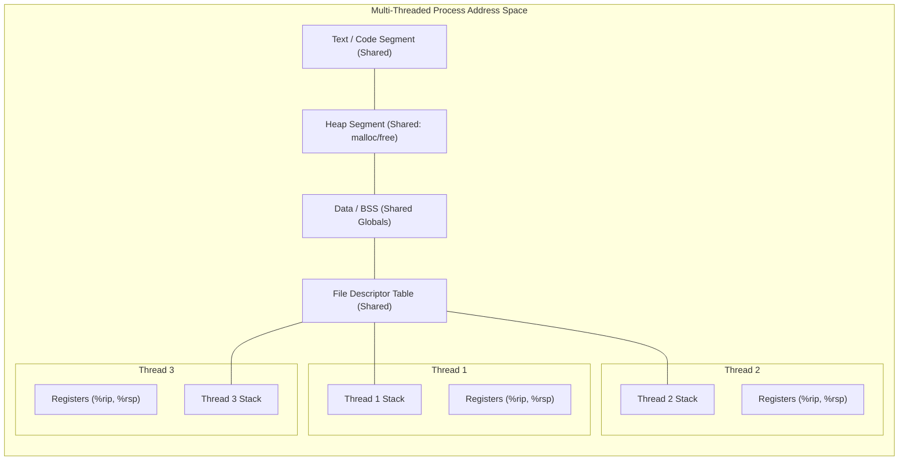
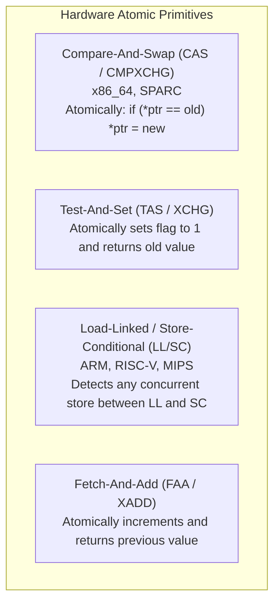

# Chapter 03: Concurrency Foundations — Threads, Mutual Exclusion & Atomic Primitives

> "From the perspective of the operating system, a thread is an independent stream of instructions that can be scheduled to run. But unlike processes, threads share an address space, creating a treacherous minefield of non-deterministic interleavings, data races, and memory reorderings."  
> — *Remzi H. Arpaci-Dusseau & Andrea C. Arpaci-Dusseau, Operating Systems: Three Easy Pieces (OSTEP)*

---

## 📚 Recommended Book References
- **OSTEP (Arpaci-Dusseau)**: Chapters 26 (Concurrency: An Introduction), 27 (Thread API), 28 (Locks), 29 (Lock-Based Concurrent Data Structures).
- **Modern Operating Systems (Tanenbaum & Bos, 4th/5th Ed)**: Chapter 2, Section 2.2 (Threads) and Section 2.3 (Interprocess Communication & Race Conditions).
- **The Linux Programming Interface (Michael Kerrisk)**: Chapters 29–33 (POSIX Threads: Basics, Thread Synchronization, Thread Safety).
- **Linux Kernel Development (Robert Love, 3rd Ed)**: Chapter 7 (Kernel Synchronization Introduction) and Chapter 8 (Kernel Synchronization Methods).
- **The Art of Multiprocessor Programming (Maurice Herlihy & Nir Shavit)**: Chapters 1–3 (Mutual Exclusion, Hardware Primitives).

---

## 1. The Thread Abstraction & Multi-Threading Models

A **thread** is an abstraction of an independent execution context operating within a process.
- **Shared State Across All Threads**:
  - Virtual Address Space (Text, Data, BSS, Heap segments, Memory-mapped libraries).
  - Operating System Resources (Open file descriptors, Network sockets, Working directory, Signal handlers).
- **Private State Per Thread**:
  - Thread ID (TID).
  - Hardware Register State (Program Counter `%rip`, Stack Pointer `%rsp`, General purpose registers).
  - Private Call Stack (Local function variables, frame pointers, return addresses).
  - Thread-Local Storage (TLS, addressed via `%fs` or `%gs` segment registers on x86_64).



### 1.1 Threading Models Comparison

| Model | Architecture | Pros | Cons | Production Examples |
| :--- | :--- | :--- | :--- | :--- |
| **1:1 (Kernel-Level)** | Each user thread maps to 1 kernel `task_struct` | True parallel execution on multi-core; 1 blocking I/O does not block peers | Context switch incurs kernel transition cost (~1µs) | **Linux NPTL (pthreads)**, Windows Threads |
| **M:1 (User-Level)** | Many user threads multiplexed on 1 kernel thread | Blazing fast context switch in user space (~10ns, no syscall) | Cannot utilize multi-core CPUs; 1 blocking syscall blocks all threads | Python Greenlets, Early Java Green Threads |
| **M:N (Hybrid)** | $M$ user coroutines multiplexed across $N$ kernel worker threads | Blazing speed + multi-core scalability | Complex scheduler; scheduler activations needed | **Go (Goroutines)**, Rust Tokio, Erlang BEAM |

---

## 2. The Critical Section & The Lost Update Anomaly

A **Critical Section** is a piece of code that accesses a shared mutable resource (memory, hardware device, file) and must not be concurrently accessed by more than one thread.

### 2.1 Disassembly of `counter++` on x86_64
Consider the seemingly atomic C operation:
```c
volatile int counter = 0;
counter++;
```

The compiler transforms this into three distinct assembly instructions:
```assembly
movl    counter(%rip), %eax    # 1. Load memory into register %eax
addl    $1, %eax               # 2. Add 1 to register %eax
movl    %eax, counter(%rip)    # 3. Store register back to memory
```

### 2.2 The Race Condition Interleaving Trace
Suppose two threads execute `counter++` concurrently when `counter = 50`:

| Step | Thread | Instruction | `%eax` Value | Memory `counter` | Event |
| :--- | :--- | :--- | :--- | :--- | :--- |
| 1 | Thread 1 | `movl counter, %eax` | 50 | 50 | Thread 1 reads 50 |
| 2 | Thread 1 | `addl $1, %eax` | 51 | 50 | Thread 1 computes 51 |
| **3** | *Timer* | *Interrupt Fired!* | — | 50 | **OS preempts Thread 1!** |
| 4 | Thread 2 | `movl counter, %eax` | 50 | 50 | Thread 2 reads 50 |
| 5 | Thread 2 | `addl $1, %eax` | 51 | 50 | Thread 2 computes 51 |
| 6 | Thread 2 | `movl %eax, counter` | 51 | **51** | Thread 2 writes 51 |
| **7** | *Timer* | *Interrupt Fired!* | — | 51 | **OS switches back to Thread 1** |
| 8 | Thread 1 | `movl %eax, counter` | 51 | **51** | Thread 1 overwrites with 51! |

*Result*: `counter = 51` instead of `52`! Thread 2's increment was completely lost.

### 2.3 The Three Core Requirements for Mutual Exclusion
1. **Mutual Exclusion**: If thread $T_1$ is executing in the critical section, no other thread $T_2$ may execute in the critical section simultaneously.
2. **Progress**: If no thread is executing in the critical section and some threads wish to enter, only those threads not executing in their remainder sections can participate in the decision of who enters next.
3. **Bounded Waiting**: There must exist a bound on the number of times other threads are allowed to enter their critical sections after a thread has made a request to enter.

---

## 3. Software Synchronization: Peterson's Algorithm & Modern Realities

Before hardware provided atomic instructions, computer scientists sought purely software solutions.

### 3.1 Peterson's Algorithm (2-Thread Solution)
```c
/* Shared global state */
int flag[2] = {0, 0}; /* flag[i] = 1 indicates thread i wants to enter */
int turn = 0;         /* Indicates whose turn it is to enter */

void enter_critical_section(int self) {
    int other = 1 - self;
    flag[self] = 1;                     /* 1. Declare intent to enter */
    turn = other;                       /* 2. Be polite: give turn to other */
    while (flag[other] == 1 && turn == other) {
        /* Busy-wait (spin) */
    }
}

void leave_critical_section(int self) {
    flag[self] = 0;                     /* Release interest */
}
```

### 3.2 Proof of Correctness
- **Mutual Exclusion**: For both threads to be in the critical section, `flag[0] == 1` and `flag[1] == 1`. But `turn` can only be either $0$ or $1$, not both simultaneously. The thread that wrote `turn` last will be trapped in the `while` loop, proving mutual exclusion.
- **Progress & Bounded Waiting**: A thread is blocked only if the other thread wants to enter AND it is the other thread's turn. As soon as the running thread exits, it sets `flag = 0`, releasing the waiting thread.

### 3.3 Why Peterson's Algorithm Fails on Modern Hardware
On modern out-of-order processors (x86, ARM, RISC-V), Peterson's algorithm **fails completely**:
1. **Compiler Optimization**: The compiler may reorder the writes `flag[self] = 1` and `turn = other` because they target independent variables.
2. **CPU Memory Reordering (Store Buffers)**: Modern CPUs use **Store Buffers** to hide memory latency. A CPU core can execute a read before a preceding write to a different address has drained to the cache. Both threads can read `flag[other] == 0` before their own writes become globally visible, allowing **both threads to enter the critical section simultaneously**!
3. **The Fix**: Peterson's algorithm requires hardware **Memory Barriers / Fences** (`mfence` on x86, `dmb` on ARM).

---

## 4. Hardware Atomic Instructions & Memory Barriers

To provide reliable synchronization, modern CPU architectures introduce hardware instructions that execute atomically on the shared memory bus.



### 4.1 Compare-And-Swap (CAS)
The gold standard atomic primitive in x86_64 is `lock cmpxchg`:
```c
int compare_and_swap(int *ptr, int expected, int new_val) {
    int original = *ptr;
    if (original == expected) {
        *ptr = new_val;
    }
    return original;
}
```

On x86_64, the `LOCK` prefix asserts the CPU cache-coherency lock on the target cache line (using the **MESI** protocol), preventing any other CPU core from reading or modifying the cache line during the instruction.

### 4.2 Memory Consistency Models & Memory Fences
- **Sequential Consistency (Lamport, 1979)**: The execution of all operations appears as if they were executed in some sequential order, and the operations of each individual processor appear in the order specified by its program. (Ideal, but too slow for modern hardware).
- **Total Store Order (TSO - x86_64)**: Reads are not reordered with reads; writes are not reordered with writes; but reads may be reordered before older writes to different addresses.
- **Weak Ordering (ARM, POWER)**: Reads and writes can be aggressively reordered arbitrarily unless explicit memory barriers are inserted.

```c
/* C11 / C++11 Memory Ordering Primitives */
atomic_store_explicit(&flag, 1, memory_order_release); /* All preceding writes flush before this */
int val = atomic_load_explicit(&flag, memory_order_acquire); /* All subsequent reads occur after this */
```

---

## 5. Lock Implementations: Spinlocks to Ticket Locks

### 5.1 Simple Spinlock (Test-And-Set)
```c
typedef struct {
    volatile int lock;
} spinlock_t;

void spin_lock(spinlock_t *l) {
    while (__atomic_test_and_set(&(l->lock), __ATOMIC_ACQUIRE)) {
        /* Spin: Burn CPU cycles */
    }
}

void spin_unlock(spinlock_t *l) {
    __atomic_clear(&(l->lock), __ATOMIC_RELEASE);
}
```

*Problem: The Cache-Bouncing Storm*:
In a multi-core system, while a lock is held, all spinning cores execute `test_and_set` continuously. This repeatedly issues invalidation messages across the inter-connect bus (MESI protocol), saturating memory bus bandwidth and severely slowing down the core actually holding the lock!

### 5.2 Test-and-Test-and-Set (TTAS) with Pause
```c
void ttas_lock(spinlock_t *l) {
    while (1) {
        /* Read-only spin: checks local L1 cache without bus invalidations! */
        while (l->lock == 1) {
            #if defined(__x86_64__)
            __builtin_ia32_pause(); /* Low-power CPU pause instruction */
            #endif
        }
        /* Lock appears free; attempt atomic acquisition */
        if (__atomic_test_and_set(&(l->lock), __ATOMIC_ACQUIRE) == 0) {
            return; /* Acquired! */
        }
    }
}
```

### 5.3 Ticket Lock (Fair FIFO Spinlock)
Simple spinlocks suffer from **starvation**: an unlucky thread can spin forever while competing threads repeatedly acquire the lock.
- A **Ticket Lock** uses two counters: `ticket` and `turn`.

```c
typedef struct {
    volatile int ticket;
    volatile int turn;
} ticket_lock_t;

void ticket_lock(ticket_lock_t *l) {
    int my_ticket = __atomic_fetch_add(&(l->ticket), 1, __ATOMIC_SEQ_CST);
    while (__atomic_load_n(&(l->turn), __ATOMIC_SEQ_CST) != my_ticket) {
        __builtin_ia32_pause();
    }
}

void ticket_unlock(ticket_lock_t *l) {
    __atomic_fetch_add(&(l->turn), 1, __ATOMIC_SEQ_CST);
}
```
*Guarantee*: First-Come, First-Served (FIFO) fairness. Zero starvation.

---
