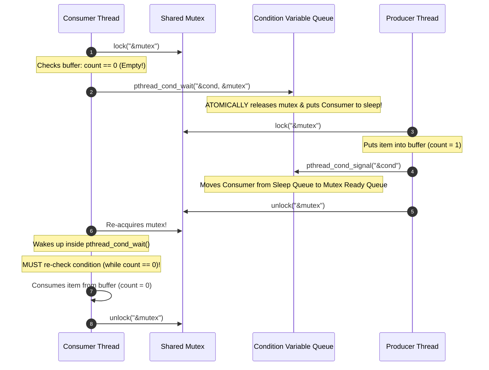
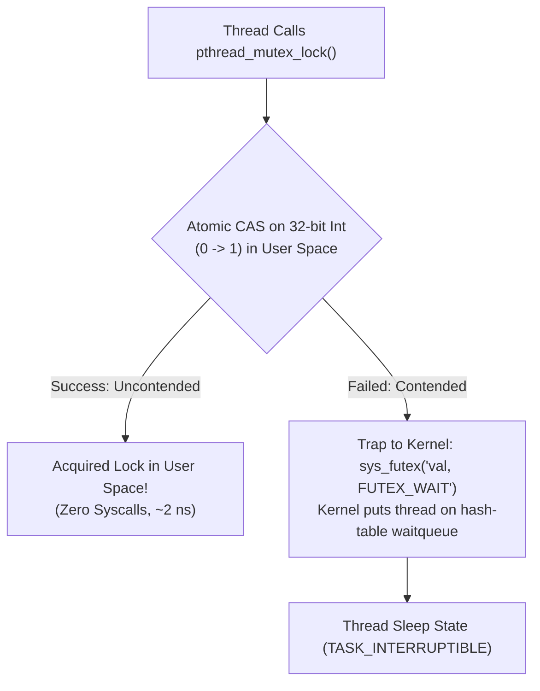
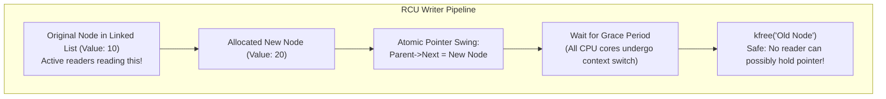
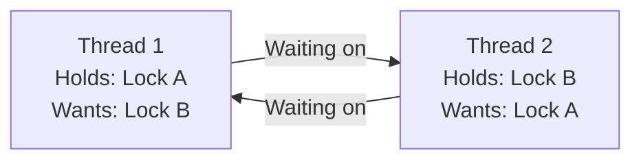
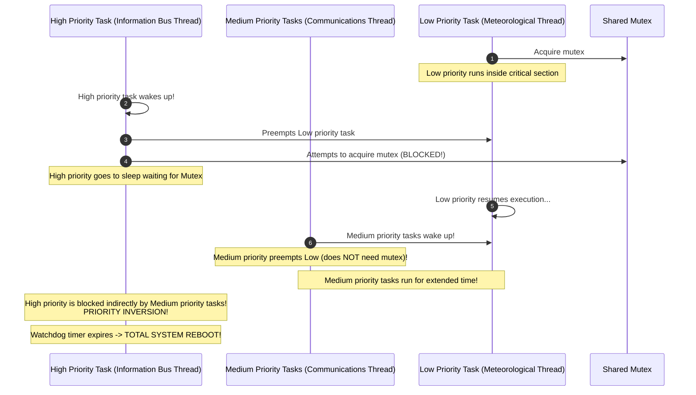

# Chapter 04: Advanced Synchronization — Condition Variables, Semaphores, Deadlocks & Lock-Free

> "Locks provide mutual exclusion, but concurrency is not merely about exclusion. Threads must coordinate, communicate, wait for states to become true, and navigate the fatal embrace of deadlock."  
> — *Remzi H. Arpaci-Dusseau & Andrea C. Arpaci-Dusseau, Operating Systems: Three Easy Pieces (OSTEP)*

---

## 📚 Recommended Book References
- **OSTEP (Arpaci-Dusseau)**: Chapter 30 (Condition Variables), Chapter 31 (Semaphores), Chapter 32 (Concurrency Bugs & Deadlocks).
- **Modern Operating Systems (Tanenbaum & Bos, 4th/5th Ed)**: Chapter 2, Section 2.3 (Classical IPC Problems) and Chapter 6 (Deadlocks).
- **Operating System Concepts (Silberschatz, Galvin, Gagne, 10th Ed)**: Chapters 6 & 7 (Synchronization Tools & Examples), Chapter 8 (Deadlocks).
- **The Linux Programming Interface (Kerrisk)**: Chapter 30 (Threads: Synchronization), Chapter 35 (Process Priorities & Realtime), Chapter 47 (POSIX Semaphores).
- **Linux Kernel Development (Robert Love, 3rd Ed)**: Chapter 9 (Kernel Synchronization: Mutexes, Semaphores, Seqlocks, RCU).

---

## 1. Condition Variables & The Bounded Buffer Problem

A **Condition Variable** is an explicit queue that threads can put themselves on when some state of execution is not as desired (by *waiting* on the condition). Another thread can *signal* the condition variable when the state changes.



### 1.1 The Golden Rule of Condition Variables: `while` NOT `if`
```c
/* FATAL BUG: Using if statement */
if (count == 0) {
    pthread_cond_wait(&cond, &mutex);
}

/* CORRECT PRODUCTION PATTERN */
while (count == 0) {
    pthread_cond_wait(&cond, &mutex);
}
```

#### Why the `while` Loop is Mandatory:
1. **Mesa Semantics (Modern Systems)**: When a thread signals a condition variable, the sleeping thread is awakened and placed on the runqueue, but it does **not** run immediately. Another thread can slip in, acquire the mutex, and consume the item before the awakened thread runs!
2. **Spurious Wakeups**: POSIX specifications permit the operating system to awaken a sleeping thread even if no signal was sent (e.g., due to kernel signal delivery or context switches).

### 1.2 The Complete Producer-Consumer (Bounded Buffer) Solution
```c
#include <pthread.h>
#define BUFFER_SIZE 16

int buffer[BUFFER_SIZE];
int count = 0, fill_ptr = 0, use_ptr = 0;

pthread_mutex_t lock = PTHREAD_MUTEX_INITIALIZER;
pthread_cond_t empty = PTHREAD_COND_INITIALIZER; /* Signaled when space available */
pthread_cond_t fill  = PTHREAD_COND_INITIALIZER; /* Signaled when item available */

void put(int val) {
    buffer[fill_ptr] = val;
    fill_ptr = (fill_ptr + 1) % BUFFER_SIZE;
    count++;
}

int get() {
    int tmp = buffer[use_ptr];
    use_ptr = (use_ptr + 1) % BUFFER_SIZE;
    count--;
    return tmp;
}

void *producer(void *arg) {
    for (int i = 0; i < 1000; i++) {
        pthread_mutex_lock(&lock);
        while (count == BUFFER_SIZE) {
            pthread_cond_wait(&empty, &lock);
        }
        put(i);
        pthread_cond_signal(&fill);
        pthread_mutex_unlock(&lock);
    }
    return NULL;
}

void *consumer(void *arg) {
    while (1) {
        pthread_mutex_lock(&lock);
        while (count == 0) {
            pthread_cond_wait(&fill, &lock);
        }
        int val = get();
        pthread_cond_signal(&empty);
        pthread_mutex_unlock(&lock);
        /* Process val outside critical section */
    }
    return NULL;
}
```

---

## 2. Semaphores (Edsger Dijkstra, 1965)

A **Semaphore** is an object with an internal integer value that can only be manipulated by two atomic operations: `sem_wait()` ($P$ - *proberen*, to test) and `sem_post()` ($V$ - *verhogen*, to increment).

```c
/* Conceptual Definition of Semaphores */
struct semaphore {
    int val;
    wait_queue_t queue;
};

void sem_wait(struct semaphore *s) {
    s->val--;
    if (s->val < 0) {
        /* Put current thread to sleep on s->queue */
    }
}

void sem_post(struct semaphore *s) {
    s->val++;
    if (s->val <= 0) {
        /* Wake up one thread sleeping on s->queue */
    }
}
```
*Mathematical Invariant*: When $val < 0$, its absolute value $|val|$ represents the exact number of threads currently sleeping on the semaphore queue.

---

## 3. The Linux Futex (Fast Userspace Mutex)

Before kernel 2.6, acquiring a mutex required entering the kernel via a system call, costing ~100–300ns even in the uncontended case.

The **Futex (Fast Userspace Mutex)** splits synchronization into two paths:
1. **Uncontended Fast Path (User Space Only: ~1–5ns)**: Perform an atomic CAS on a 32-bit integer in user-space RAM. If uncontended, lock acquired without any kernel involvement!
2. **Contended Slow Path (Kernel Transition)**: If CAS fails, issue the `futex` system call (`sys_futex`) to put the thread to sleep in the kernel's hash table waitqueue.



---

## 4. Advanced Kernel Synchronization: Seqlocks & RCU

### 4.1 Sequential Locks (`seqlock_t`)
Optimized for data structures with **frequent readers and rare writers** (e.g., system time / jiffies):
- Writers increment a sequence number before and after modification (odd = write in progress; even = clean data).
- Readers do **NOT** take locks and do **NOT** block writers!
- A reader reads the sequence number, reads the data, and checks the sequence number again. If it changed or is odd, the reader simply loops and retries.

### 4.2 Read-Copy Update (RCU) — The Linux Crown Jewel
RCU allows reads to occur concurrently with updates with **zero lock overhead**:
- **Readers**: Execute completely lock-free; no atomic instructions, no bus locking.
- **Writers**:
  1. Allocate a new copy of the data structure.
  2. Modify the copy.
  3. Atomically overwrite the public pointer to point to the new copy (`rcu_assign_pointer`).
- **Deferred Reclamation**: The old copy cannot be freed immediately because active readers may still be reading it. The writer waits for a **Grace Period**—a point in time where every CPU core has undergone at least one context switch (**Quiescent State**). Once the grace period passes, the old memory is safely freed via `kfree()`.



---

## 5. Deadlocks & The Four Coffman Conditions

A **Deadlock** occurs when a set of concurrent processes are permanently blocked because each process holds a resource that another process needs, and none can proceed.



### 5.1 The Four Coffman Conditions (All must hold simultaneously for deadlock to occur):
1. **Mutual Exclusion**: Resources cannot be shared; only one thread can hold a resource at a time.
2. **Hold and Wait**: A thread holds at least one resource while waiting to acquire additional resources held by others.
3. **No Preemption**: Resources cannot be forcibly confiscated from a thread holding them.
4. **Circular Wait**: A closed chain of threads exists such that each thread holds at least one resource needed by the next thread in the chain ($T_0 \to T_1 \to \dots \to T_n \to T_0$).

### 5.2 Deadlock Prevention: Breaking Circular Wait via Lock Ordering
The most effective engineering technique to prevent deadlocks is **Total Lock Ordering**:
- Define a strict global hierarchy on all locks (e.g., Lock $A$ is ordered before Lock $B$).
- All threads must acquire locks in strictly ascending order.
- *Mathematical Proof*: If locks are always acquired in ascending order, a cycle cannot form in the Resource Allocation Graph, mathematically eliminating circular wait!

---

## 6. Deadlock Avoidance: Dijkstra's Banker's Algorithm

If resource requirements are declared in advance, the OS can avoid deadlocks dynamically by never transitioning into an **Unsafe State**.

### 6.1 State Vectors & Matrices
Given $n$ processes and $m$ resource types:
- $\text{Available}[m]$: Available instances of each resource.
- $\text{Max}[n][m]$: Maximum demand of each process.
- $\text{Allocation}[n][m]$: Current allocation to each process.
- $\text{Need}[n][m] = \text{Max}[n][m] - \text{Allocation}[n][m]$: Remaining resource need.

### 6.2 The Safety Algorithm Walkthrough
```text
1. Let Work = Available (vector of length m)
   Let Finish[i] = false for all i in 0..n-1

2. Find an index i such that:
   (a) Finish[i] == false
   (b) Need[i] <= Work
   If no such i exists, go to step 4.

3. Work = Work + Allocation[i]
   Finish[i] = true
   Go to step 2.

4. If Finish[i] == true for all i, the system is in a SAFE STATE.
   (A safe sequence exists: <P_0, P_1, ..., P_n-1>).
```

---

## 7. Priority Inversion & The Mars Pathfinder Bug

In 1997, NASA's Mars Pathfinder spacecraft suffered recurring total system resets on Mars due to a classic real-time synchronization bug: **Priority Inversion**.



### The Solution: Priority Inheritance Protocol
When a high-priority task blocks on a mutex held by a low-priority task, the low-priority task **temporarily inherits the high priority** of the blocked task!
- This prevents medium-priority tasks from preempting it.
- As soon as the low-priority task finishes its critical section and releases the mutex, its priority reverts to normal, and the high-priority task immediately acquires the lock and runs.

---
