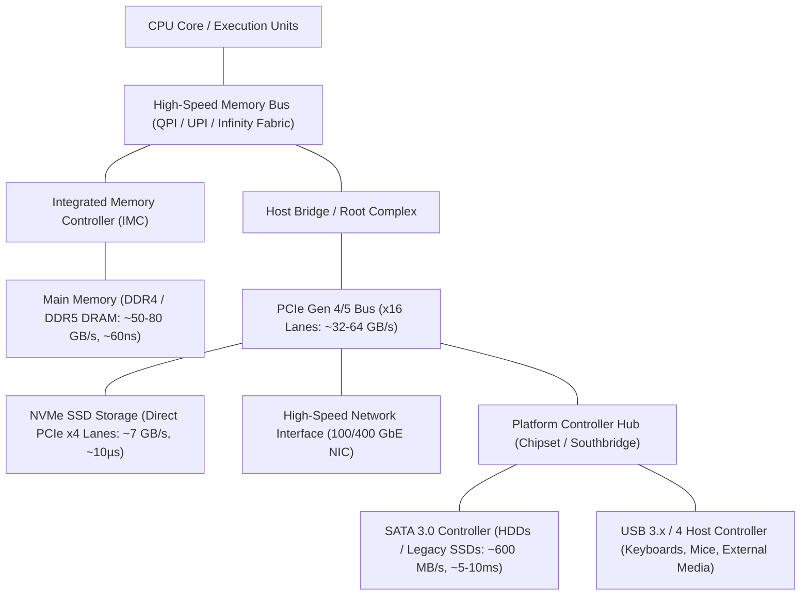
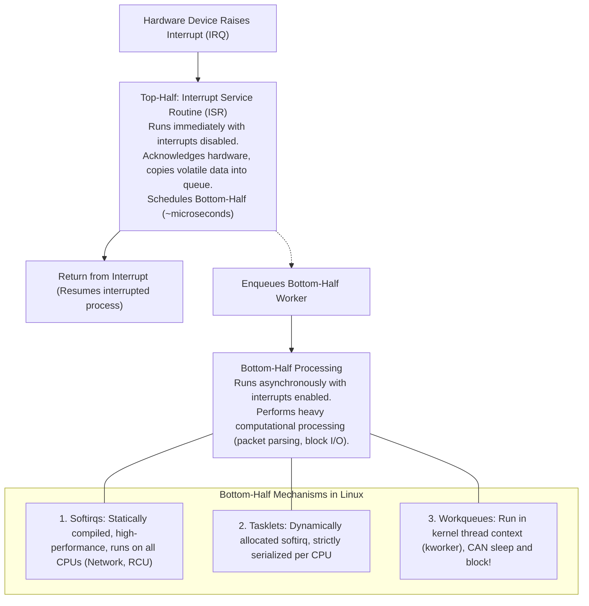
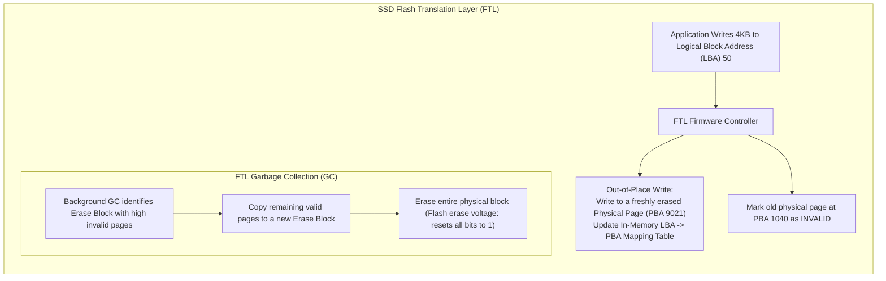
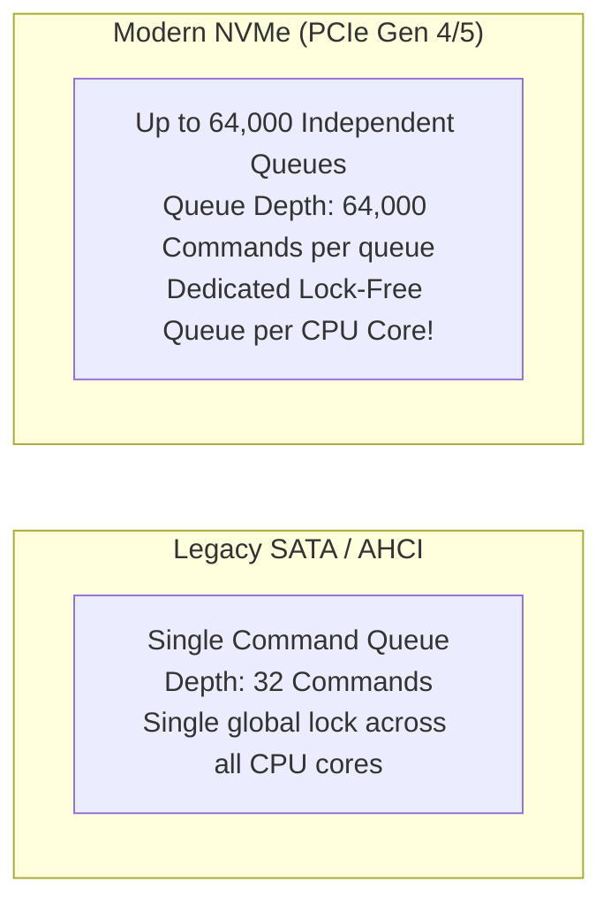
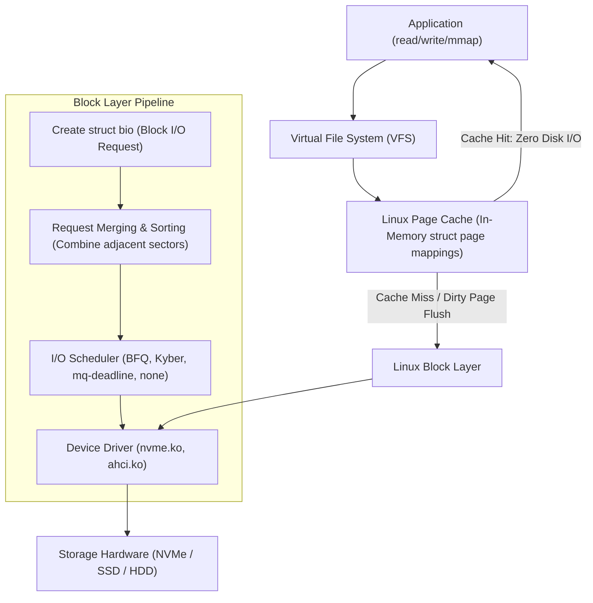

# Chapter 05: I/O Hardware, Storage Devices & Device Drivers

> "I/O is the mechanism by which the computer interacts with the physical world. Without I/O, a program is just a heater that occasionally calculates numbers."  
> — *Remzi H. Arpaci-Dusseau & Andrea C. Arpaci-Dusseau, Operating Systems: Three Easy Pieces (OSTEP)*

---

## 📚 Recommended Book References
- **OSTEP (Arpaci-Dusseau)**: Chapter 36 (I/O Devices), Chapter 37 (Hard Disk Drives), Chapter 38 (Redundant Arrays of Inexpensive Disks - RAID), Chapter 44 (Flash-based SSDs).
- **Modern Operating Systems (Tanenbaum & Bos, 4th/5th Ed)**: Chapter 5 (Input/Output).
- **Operating System Concepts (Silberschatz, Galvin, Gagne, 10th Ed)**: Chapter 11 (Mass-Storage Structure) and Chapter 12 (I/O Systems).
- **Linux Kernel Development (Robert Love, 3rd Ed)**: Chapter 13 (The Virtual Filesystem) and Chapter 14 (The Block I/O Layer).
- **The Linux Programming Interface (Kerrisk)**: Chapter 4 (File I/O: The Universal I/O Model) and Chapter 13 (File I/O Buffering).

---

## 1. Hardware I/O Architecture & Bus Topology

Modern computing systems use a hierarchical bus architecture to connect the central processor to disparate peripheral devices operating across vastly different bandwidth and latency profiles.



---

## 2. CPU-Device Communication: Ports, MMIO, and DMA

The operating system kernel communicates with hardware devices through controller registers (Status, Control, Data-In, Data-Out).

### 2.1 Programmed I/O (PIO) vs. Memory-Mapped I/O (MMIO)

| Mechanism | Hardware Implementation | CPU Instructions | Pros & Cons |
| :--- | :--- | :--- | :--- |
| **Port-Mapped I/O (PMIO)** | Separate 16-bit physical I/O address space (0x0000 to 0xFFFF) | Special assembly instructions (`inb`, `outb`, `inw`, `outw`) | Historical x86; cannot leverage standard memory protection |
| **Memory-Mapped I/O (MMIO)** | Device registers mapped directly into the physical address space of RAM | Standard memory instructions (`mov`, load/store) | Protected by MMU page tables; cacheable/uncacheable flags (`pgprot_noncached`) |

### 2.2 Direct Memory Access (DMA) & Scatter-Gather
Under **Programmed I/O (PIO)**, the CPU must manually read each byte/word from the device data register into a CPU register and store it into RAM. For a 100MB file transfer, the CPU spends $100\%$ of its cycles copying bytes, stalling all computation!

**Direct Memory Access (DMA)** offloads data movement to a dedicated hardware controller:
1. The OS driver programs the DMA Controller: specifies the **source device address**, **destination physical memory buffer**, and **byte count**.
2. The DMA Controller drives the memory bus, streaming data directly between the device and RAM.
3. Once the transfer completes, the DMA controller raises a **hardware interrupt**. The CPU remains completely free to execute other processes while the transfer occurs!

```mermaid
sequenceDiagram
    autonumber
    participant CPU as CPU / Kernel Driver
    participant DMA as DMA Controller
    participant Device as Storage Device (Disk/NVMe)
    participant RAM as Physical RAM

    CPU->>DMA: Program DMA: Device=0x100, Target=RAM[0x70000], Bytes=64KB
    CPU->>Device: Issue Command: READ Sector 5000
    Note over CPU: CPU returns to running other processes!
    Device->>DMA: Data Ready for transfer
    DMA->>RAM: Write 64KB directly into RAM[0x70000] via memory bus
    DMA->>CPU: Raise Hardware Interrupt (IRQ)
    CPU->>CPU: Top-half ISR records completion; wakes waiting process
```

---

## 3. Interrupt Handling Architecture: Top-Halves vs. Bottom-Halves

When a device completes I/O, it signals the CPU via an **Interrupt Request (IRQ)** line (or MSI/MSI-X message-signaled interrupts over PCIe).

### 3.1 The Interrupt Dilemma
- Interrupts run in a special interrupt context where the current process may be unrelated, and sleeping/blocking is **strictly prohibited**.
- The OS must acknowledge the hardware immediately to prevent missing subsequent interrupts, but processing large network packets or disk blocks takes significant time.

### 3.2 Linux Solution: Two-Stage Interrupt Processing



---

## 4. Storage Media Physics: HDD vs. SSD vs. NVMe

### 4.1 Hard Disk Drives (HDD): Geometry & Mechanics
An HDD stores magnetic bits on rotating glass/aluminum **Platters**:
- **Seek Time ($T_{\text{seek}}$)**: Moving the mechanical read/write head arm to the target track/cylinder (~3–10 ms).
- **Rotational Latency ($T_{\text{rotation}}$)**: Waiting for the desired magnetic sector to spin underneath the head:
  $$T_{\text{rotation}} = \frac{1}{2} \times \frac{60}{\text{RPM}} \quad (\approx 4.16\text{ ms for 7,200 RPM}, \approx 2.0\text{ ms for 15,000 RPM})$$
- **Transfer Time ($T_{\text{transfer}}$)**: Time to physically stream the magnetic bits off the surface (~150–250 MB/s).
- **Total I/O Time**:
  $$T_{\text{I/O}} = T_{\text{seek}} + T_{\text{rotation}} + T_{\text{transfer}} \approx \mathbf{10\text{ ms}} \implies \text{Only } \sim\mathbf{100\text{ IOPS!}}$$

#### Disk Arm Scheduling Algorithms:
- **FCFS**: First-Come, First-Served (High seek distances).
- **SSTF (Shortest Seek Time First)**: Selects request closest to current arm position (Risk of starvation for distant tracks).
- **SCAN (Elevator Algorithm)**: The arm sweeps continuously from one end of the disk to the other, servicing requests along its path, then reverses direction.
- **C-SCAN (Circular SCAN)**: Moves arm in one direction only, then returns immediately to the start (Provides more uniform wait times).

---

### 4.2 Solid-State Drives (SSD) & Flash Translation Layer (FTL)
NAND flash memory operates on quantum tunnel injection principles, completely eliminating mechanical heads and rotational delays.

#### The Physical Asymmetry of NAND Flash:
- **Pages (typically 4KB – 16KB)**: Smallest unit of **Reading and Programming (Writing)**.
- **Erase Blocks (typically 2MB – 8MB, containing 128–512 pages)**: Smallest unit of **Erasing**.
- **The In-Place Update Impossibility**: In NAND flash, a bit can only transition from $1 \to 0$ during programming. To transition from $0 \to 1$, the **entire multi-megabyte Erase Block must be erased**!



#### Key FTL Responsibilities:
1. **Wear Leveling**: Flash memory cells physically degrade after $\sim 1,000 - 100,000$ Program/Erase (P/E) cycles. The FTL distributes writes evenly across all physical blocks (Dynamic and Static Wear Leveling) to prevent premature drive death.
2. **Write Amplification (WA)**:
   $$\text{WA} = \frac{\text{Total Bytes Written to NAND Flash}}{\text{Bytes Written by Host OS}} \ge 1.0$$
3. **The TRIM Command**: Because the OS unlinks files logically in the filesystem without zeroing the physical sectors, the SSD cannot know which LBAs are free. The `TRIM` command explicitly informs the FTL which sectors are deleted, allowing garbage collection to skip copying stale data.

---

### 4.3 NVMe vs. Legacy SATA/AHCI



| Dimension | SATA / AHCI | NVMe (Non-Volatile Memory Express) |
| :--- | :--- | :--- |
| **Interface / Bus** | SATA 3.0 Cable (~600 MB/s max) | PCIe Gen 4/5 Direct Bus (~7,000–14,000 MB/s) |
| **Queue Architecture** | 1 Queue, Depth = 32 | **64,000 Queues, Depth = 64,000 each** |
| **Multi-Core Scaling** | Massive CPU lock contention | **1 dedicated hardware queue per CPU core** (Zero locking!) |
| **Latency** | ~50 – 100 µs | **~5 – 15 µs** |
| **Interrupts** | Single legacy line interrupt / MSI | **MSI-X per queue** (Routed to target core directly) |

---

## 5. The Operating System Block Layer & Page Cache

The Linux Block Layer sits between filesystems and device drivers, abstracting storage media as linear arrays of fixed-size blocks (typically 512B or 4096B).



### 5.1 Linux Page Writeback: `fsync()` vs. `fdatasync()`
When an application calls `write()`, data is written **only to the Linux Page Cache**; the kernel marks the affected pages as **Dirty** and returns immediately.
- Background kernel threads (`kworker/flush`) wake up periodically to write dirty pages back to disk.
- If power fails before writeback, unwritten data in RAM is **permanently lost**!

#### Synchronization Primitives:
- **`sync()`**: Schedules all dirty pages across the entire operating system for writeback.
- **`fsync(int fd)`**: Blocks until all dirty data **and file metadata (inode modification time, file size)** of descriptor `fd` are physically flushed to persistent storage.
- **`fdatasync(int fd)`**: Blocks until file **data** is flushed; skips metadata updates unless the metadata is strictly required to read the data back (e.g., file size changed). **Massive performance boost for database WALs!**
- **Direct I/O (`O_DIRECT`)**: Opens a file with page cache bypass. Data is DMA-transferred directly between the user-space buffer and storage, eliminating page cache double-buffering for database engines (e.g., PostgreSQL, Oracle, RocksDB).

---
