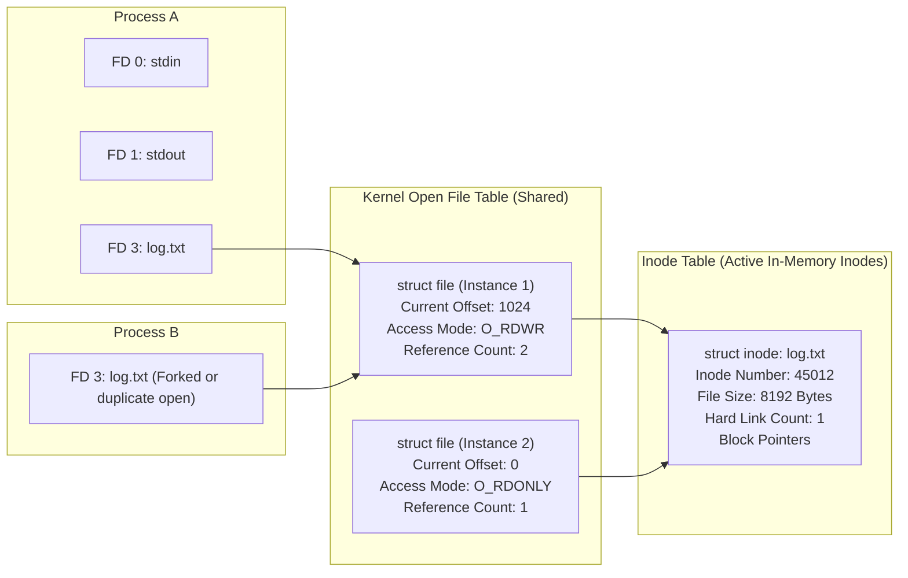
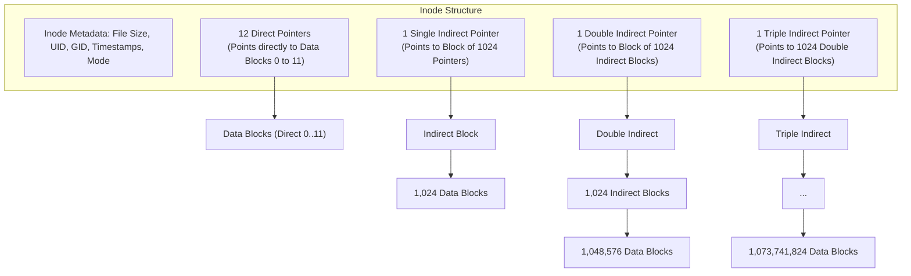
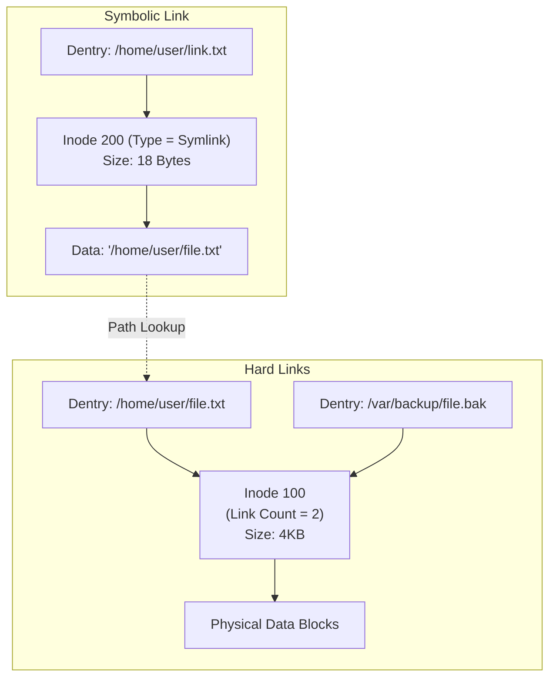
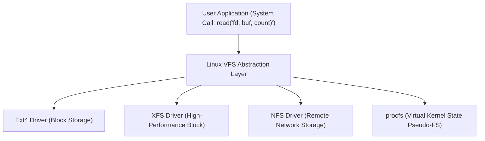
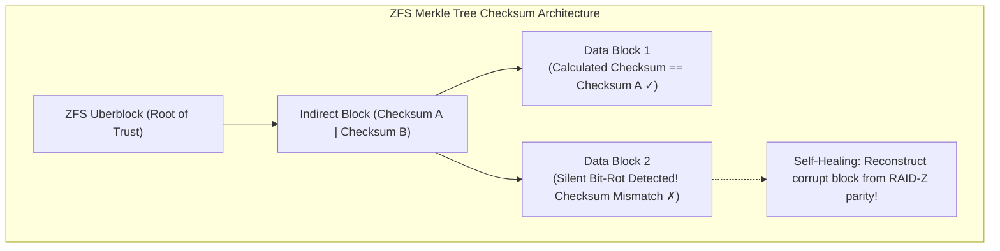

# Chapter 06: File System Internals — Inodes, Directories, VFS & Ext4-ZFS

> "A file system is an organization of data on persistent media that provides the illusion of human-readable hierarchical directories and named files, while managing the underlying raw blocks, metadata, and free space."  
> — *Remzi H. Arpaci-Dusseau & Andrea C. Arpaci-Dusseau, Operating Systems: Three Easy Pieces (OSTEP)*

---

## 📚 Recommended Book References
- **OSTEP (Arpaci-Dusseau)**: Chapter 39 (Files and Directories), Chapter 40 (File System Implementation), Chapter 41 (Locality and the Fast File System - FFS).
- **Modern Operating Systems (Tanenbaum & Bos, 4th/5th Ed)**: Chapter 4 (File Systems).
- **Operating System Concepts (Silberschatz, Galvin, Gagne, 10th Ed)**: Chapter 13 (File System Interface) and Chapter 14 (File System Implementation).
- **Linux Kernel Development (Robert Love, 3rd Ed)**: Chapter 13 (The Virtual Filesystem).
- **The Linux Programming Interface (Kerrisk)**: Chapter 14 (File Systems), Chapter 18 (Directories and Links), Chapter 49 (Memory Mappings).

---

## 1. The File Abstraction, Descriptors, and the Open File Table

In the Unix philosophy, "everything is a file". A file is an abstraction of a linear array of bytes with an associated set of metadata attributes (size, permissions, timestamps, owner).



### 1.1 The Three-Level File Indirection Hierarchy:
1. **Per-Process File Descriptor Table**: Contained in `current->files->fdt`. Maps integer file descriptors (`0, 1, 2, 3...`) to pointers to `struct file`.
2. **System-Wide Open File Table (`struct file`)**: Represents an *open instance* of a file. Tracks dynamic state: **Current File Offset** (where the next `read()` or `write()` will occur), access flags (`O_RDWR`, `O_APPEND`), and reference count.
3. **System-Wide Inode Table (`struct inode`)**: Represents the *physical file metadata object*. Identifies the file on disk, its owner, permissions, and list of physical data block pointers. Multiple open file entries can point to the same inode!

---

## 2. VSFS (Very Simple File System) On-Disk Architecture

Introduced in **OSTEP Chapter 40**, VSFS provides the foundational structural blueprint for Unix filesystems.

```
+-----------+------------+------------+--------------------+------------------------+
| Superblock|Inode Bitmap|Data Bitmap | Inode Table Blocks |   Data Storage Blocks  |
|  (1 Block)|  (1 Block) |  (1 Block) |     (5 Blocks)     |      (56 Blocks)       |
+-----------+------------+------------+--------------------+------------------------+
```

### 2.1 Disk Regions Explained:
- **Superblock**: Stored at offset 0 (or block 1). Contains master filesystem geometry metadata: magic number (identifies filesystem type), block size, total block count, total inode count, and pointers to block groups.
- **Inode Bitmap**: A bit-array where each bit represents whether the corresponding inode in the Inode Table is free ($0$) or allocated ($1$).
- **Data Bitmap**: A bit-array tracking free ($0$) and allocated ($1$) data blocks.
- **Inode Table**: An array of contiguous disk blocks containing serialized `struct inode` structures (typically 128 to 256 bytes each).
- **Data Blocks**: The physical blocks containing actual user file data payloads and directory entries.

---

## 3. Inodes & Direct vs. Indirect Block Addressing

An **Inode (Index Node)** stores all metadata about a file **except for its name and its actual file data bytes**.



### 3.1 Mathematical File Capacity Calculation (Classic Unix Inode)
Assume: Block Size = 4KB, Block Pointer = 4 Bytes (32-bit addresses):
- Pointers per indirect block = $\frac{4096}{4} = 1024$.
- **Direct Blocks (12)**: $12 \times 4\text{KB} = \mathbf{48\text{ KB}}$ (Extremely fast $O(1)$ access for small files).
- **Single Indirect (1)**: $1024 \times 4\text{KB} = \mathbf{4\text{ MB}}$.
- **Double Indirect (1)**: $1024 \times 1024 \times 4\text{KB} = \mathbf{4\text{ GB}}$.
- **Triple Indirect (1)**: $1024 \times 1024 \times 1024 \times 4\text{KB} = \mathbf{4\text{ TB}}$.
- **Maximum File Size**: $48\text{KB} + 4\text{MB} + 4\text{GB} + 4\text{TB} \approx \mathbf{4.004\text{ TB}}$.

---

## 4. Directories and Hard Links vs. Symbolic Links

A **directory** is simply a special file whose data blocks contain an array of mapping pairs: **(File Name, Inode Number)**.

### 4.1 Hard Links vs. Symbolic (Soft) Links



| Dimension | Hard Link | Symbolic Link (Symlink) |
| :--- | :--- | :--- |
| **Inode** | Shares the **exact same inode number** | Has its own independent inode number |
| **Link Count** | Increments `inode->i_nlink` | Does not alter target's link count |
| **Cross-Filesystem** | **Forbidden** (Inode numbers only unique within 1 filesystem) | **Allowed** (Stores target path string) |
| **Directory Target** | **Forbidden** (Prevents cycles in filesystem graph!) | **Allowed** |
| **Target Deletion** | Target data remains accessible until `i_nlink == 0` | Becomes a **Dangling Pointer** (Broken Symlink) |

---

## 5. The Virtual File System (VFS) Layer

The **Virtual File System (VFS)** is the kernel abstraction layer that allows client applications to use standard POSIX syscalls (`open`, `read`, `write`, `close`) transparently across heterogeneous filesystems (Ext4, XFS, Btrfs, NFS, procfs, sysfs).



### 5.1 The Four Primary VFS Objects
1. **Superblock Object (`struct super_block`)**: Represents a mounted filesystem instance. Contains operations table `super_operations` (`alloc_inode`, `destroy_inode`, `write_super`).
2. **Inode Object (`struct inode`)**: Represents a unique file on disk. Contains `inode_operations` (`create`, `lookup`, `link`, `mkdir`, `rename`).
3. **Dentry Object (`struct dentry`)**: Represents a directory entry / path component. Maintains the **Dentry Cache (dcache)** with lockless RCU path lookups to eliminate repeated disk reads during path resolution (e.g., resolving `/usr/bin/gcc`).
4. **File Object (`struct file`)**: Represents an open file instance created upon `open()`. Contains `file_operations` (`read`, `write`, `mmap`, `ioctl`, `fsync`).

---

## 6. Production File Systems: Ext4 vs. ZFS

### 6.1 Ext4: Extent-Based Allocation & Delayed Allocation
- **Extents**: Traditional block-pointer arrays require immense metadata for multi-gigabyte files. Ext4 replaces individual block pointers with **Extents**:
  $$\text{Extent} = (\text{Logical File Block}, \text{Length Contiguous Blocks}, \text{Starting Physical Block})$$
  A single Ext4 extent can map up to $128\text{MB}$ of contiguous storage in just 12 bytes!
- **Delayed Allocation (`delalloc`)**: Postpones block allocation until dirty pages are flushed to disk by writeback daemons. This allows the allocator to allocate large contiguous block extents all at once, dramatically reducing file fragmentation.

### 6.2 ZFS: The Copy-On-Write & Self-Healing Giant
Designed by Sun Microsystems, ZFS completely rethinks filesystem architecture:



#### Key ZFS Architectural Pillars:
1. **ZFS Storage Pools (zpools)**: Eliminates fixed disk partitions. Physical drives are combined into a dynamic shared storage pool from which virtual filesystems carve storage dynamically.
2. **Copy-On-Write (COW) Transactions**: ZFS **never overwrites live data in-place**. When a block is modified, it is written to a new physical location, and parent pointers in the tree are updated recursively up to the root **Uberblock**. This makes filesystem corruption on power loss physically impossible!
3. **End-to-End Merkle Tree Checksums**: Every block pointer stores a cryptographic checksum (SHA-256 or Blake3) of its child block. Detects **Silent Data Corruption (Bit Rot)** caused by firmware bugs or drive aging, automatically reconstructing corrupted blocks from RAID-Z parity mirrors.

---
