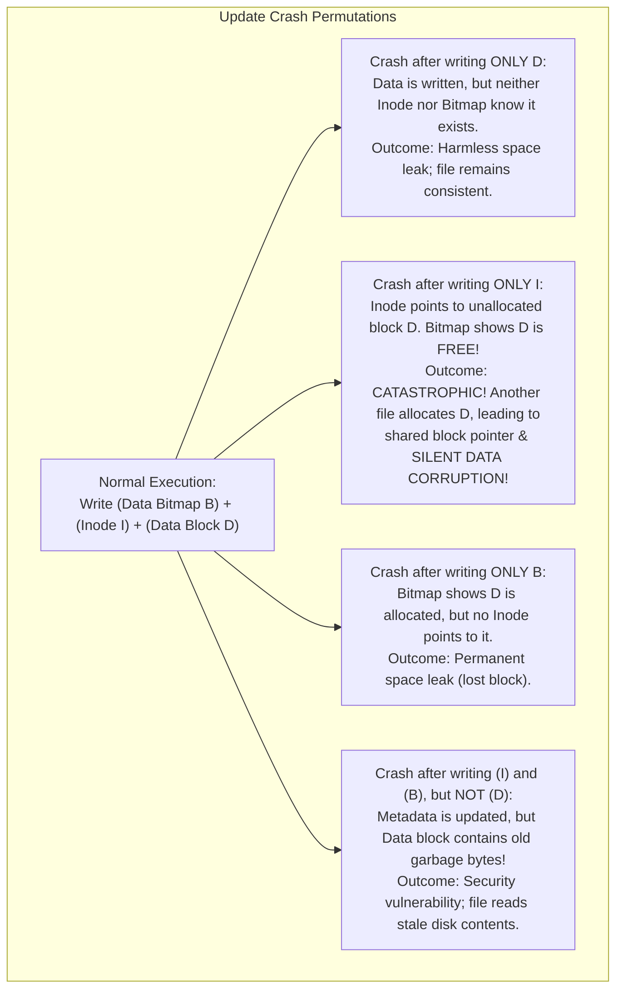
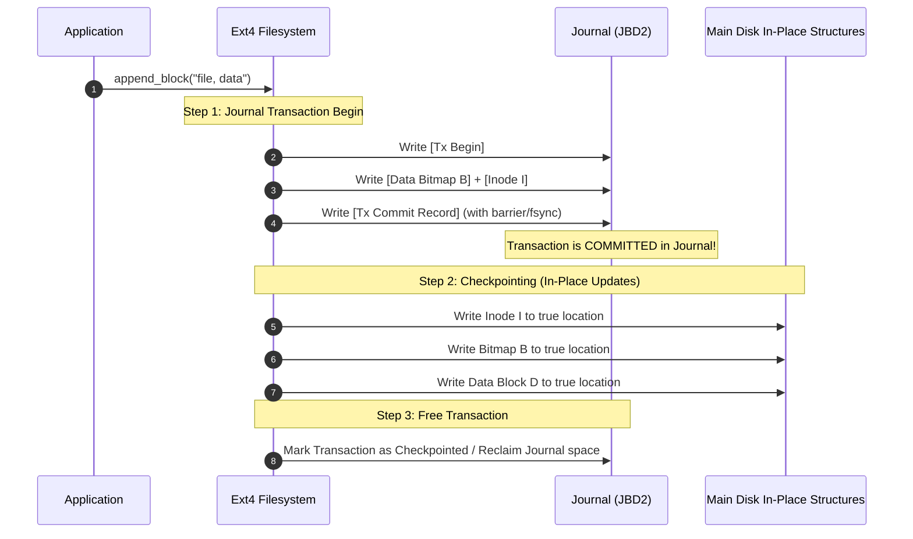
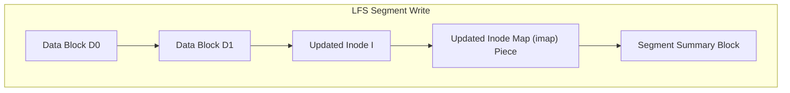

# Chapter 07: Crash Consistency, Journaling & Log-Structured File Systems (LFS)

> "The crash consistency problem is fundamentally about atomicity in the presence of failures: how do you update complex, multi-block on-disk data structures when power can be cut at any arbitrary microsecond?"  
> — *Remzi H. Arpaci-Dusseau & Andrea C. Arpaci-Dusseau, Operating Systems: Three Easy Pieces (OSTEP)*

---

## 📚 Recommended Book References
- **OSTEP (Arpaci-Dusseau)**: Chapter 42 (Crash Consistency: FSCK and Journaling), Chapter 43 (Log-Structured File Systems - LFS).
- **Modern Operating Systems (Tanenbaum & Bos, 4th/5th Ed)**: Chapter 4, Section 4.3 (File System Implementation: Journaling & Consistency).
- **Operating System Concepts (Silberschatz, Galvin, Gagne, 10th Ed)**: Chapter 14 (File System Implementation: Recovery & Log-Structured File Systems).
- **Linux Kernel Development (Robert Love, 3rd Ed)**: Chapter 13 (The Virtual Filesystem & Journaling Block Device - JBD2).
- **The Design and Implementation of a Log-Structured File System (Rosenblum & Ousterhout, ACM TOCS 1992)**: The seminal research paper on LFS.

---

## 1. The Crash Consistency Problem

Consider the standard operational workflow of appending a single 4KB data block to an existing file:
1. **Data Block ($D_2$)**: Write the user data payload to a newly allocated physical disk block.
2. **Data Bitmap ($B$)**: Set the bit corresponding to block $D_2$ to $1$ to mark it allocated.
3. **Inode ($I$)**: Update file size ($+4096$), modification timestamp, and add a block pointer pointing to $D_2$.

Because storage drives accept writes in individual disk sectors (512B / 4KB), the operating system **cannot write all three structures in a single atomic hardware operation**. If power fails midway through, the filesystem enters an inconsistent corrupted state!

---

## 2. Legacy Recovery: The File System Checker (FSCK)

Early Unix systems relied on **`fsck`** (File System Consistency Checker). Upon reboot following an unclean unmount:
1. **Superblock Check**: Verifies sanity of filesystem sizes and magic numbers against backup superblocks.
2. **Free Block Audit**: Scans **all inodes** across the entire drive, builds a list of used blocks, and verifies it against the Data Bitmap.
3. **Inode State & Link Count Verification**: Scans every directory entry in the hierarchy; recalculates true link counts (`i_nlink`). If an inode has `i_nlink > 0` but no directory references it, moves it to `/lost+found`.
4. **Duplicate Block Pointers**: Checks if multiple inodes point to the same physical block; clones block to resolve conflict.

### The Fatal Flaw of FSCK:
`fsck` requires a **full exhaustive scan of every inode and directory on the storage volume**. On modern 10TB – 20TB hard drives containing millions of files, running `fsck` takes **multiple hours (or days)** of downtime, making it unacceptable for production server environments.

---

## 3. Journaling (Write-Ahead Logging for Filesystems)

Modern filesystems (Ext3, Ext4, XFS, NTFS) solve crash consistency using **Journaling** (borrowed from database transaction logs).
- Allocate a small dedicated contiguous circular region on disk called the **Journal**.
- Before modifying the actual on-disk filesystem structures (**in-place locations**), append a transaction description to the Journal.
- If a crash occurs, recovery does **not** scan the entire disk; it simply replays or discards the few active transactions in the Journal (~seconds)!

### 3.1 The Three Linux Journaling Modes (Ext3 / Ext4)

| Mode | What is Written to Journal? | Ordering Constraint | Performance vs. Consistency Tradeoff |
| :--- | :--- | :--- | :--- |
| **Data Journaling** | Both **Metadata AND User Data Payload** | Journal commit $\to$ In-place checkpoint | **Highest Consistency, Worst Performance**: Every byte is written to storage twice! |
| **Ordered Journaling (Production Default)** | **Metadata Only** (Inode, Bitmaps, Superblock) | User data blocks must be written to disk **BEFORE** metadata transaction commits to journal! | **Optimal Balance**: Writes data once; completely prevents reading stale garbage data on crash! |
| **Writeback Journaling** | **Metadata Only** | No ordering between user data and journal commit | **Fastest, Weakest**: Crash can leave file pointing to uninitialized data blocks. |

---

## 4. Log-Structured File Systems (LFS)

Pioneered by Mendel Rosenblum and John Ousterhout at UC Berkeley (1991), the **Log-Structured File System (LFS)** redesigns filesystem storage around two technological shifts:
1. **Memory Sizes are Growing**: File reads are increasingly satisfied by large operating system Page Caches in RAM. Thus, disk traffic is dominated by **writes**.
2. **Random I/O is the Bottleneck**: Mechanical disks and flash media are orders of magnitude faster at sequential streaming writes than random in-place updates.

### 4.1 The Core LFS Principle
**Treat the entire disk as a single, append-only, circular log.**
- LFS **never** overwrites data in place.
- All updates—data blocks, directory entries, and inodes—are buffered in memory and flushed sequentially to disk in massive contiguous **Segments** (typically 1MB to 8MB).

### 4.2 The Floating Inode Problem & The Inode Map (`imap`)
In a traditional filesystem, Inode 5 has a fixed physical location on disk (e.g., sector 1000).
In LFS, every time Inode 5 is modified, it is written to a **new sequential address at the end of the log**!
- *Problem*: How does the operating system locate an inode if its disk address constantly changes?
- *Solution*: The **Inode Map (`imap`)**.
  - The `imap` is a lookup table taking `inode_number` and returning its current physical disk address:
    $$\text{imap}(\text{inode\_number}) \to \text{Physical Disk Address}$$
  - The pieces of `imap` are also written sequentially to the end of the log!
  - To bootstrap lookup, the filesystem maintains a **Checkpoint Region (CR)** at fixed, known disk offsets that points to all active pieces of the `imap`. The CR is updated atomically every ~30 seconds.

### 4.3 Segment Cleaning (Garbage Collection)
Because updates are appended out-of-place, old versions of inodes and data blocks become **dead (stale)**. Eventually, free space on disk is exhausted.
- The **Segment Cleaner** operates as a background garbage collector:
  1. Selects candidate segments with high stale data ratios.
  2. Reads the **Segment Summary Block** to identify which blocks are live (by checking if the current `imap` still points to them).
  3. Compares block addresses against the active `imap`.
  4. Compares live blocks, writes them contiguously to a **new active segment**, and frees the old segments completely!

---
