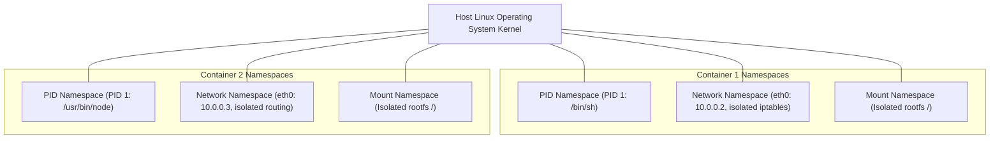
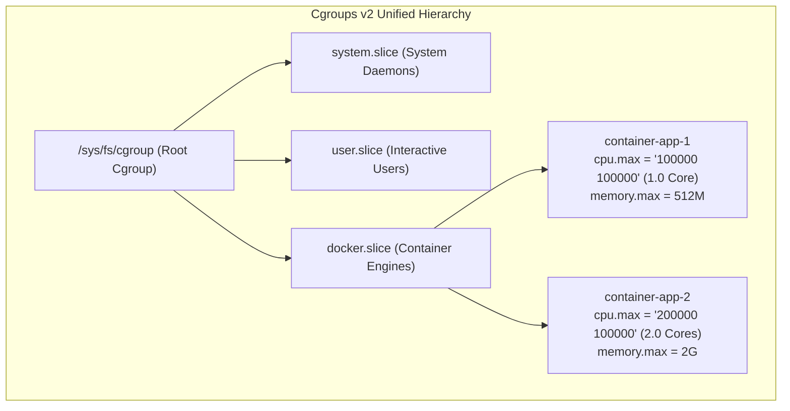
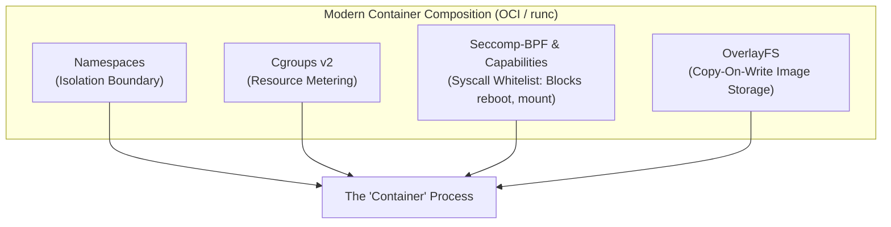
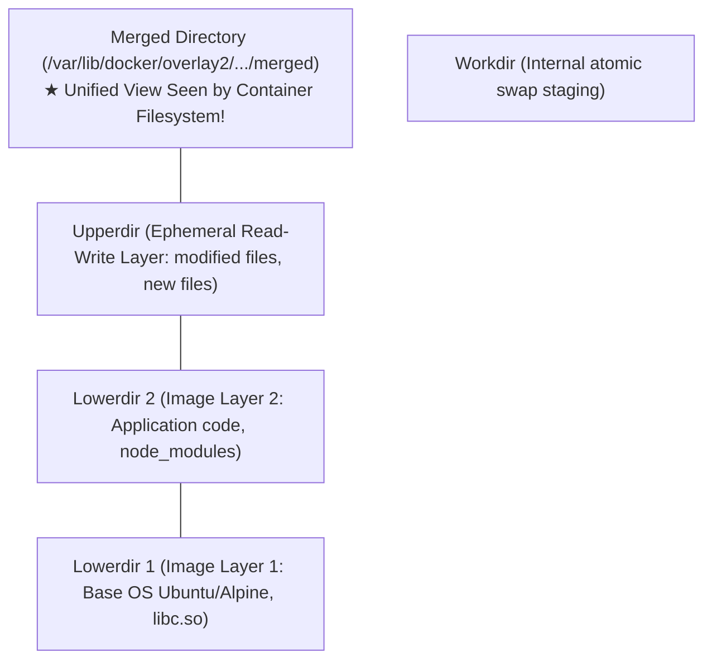
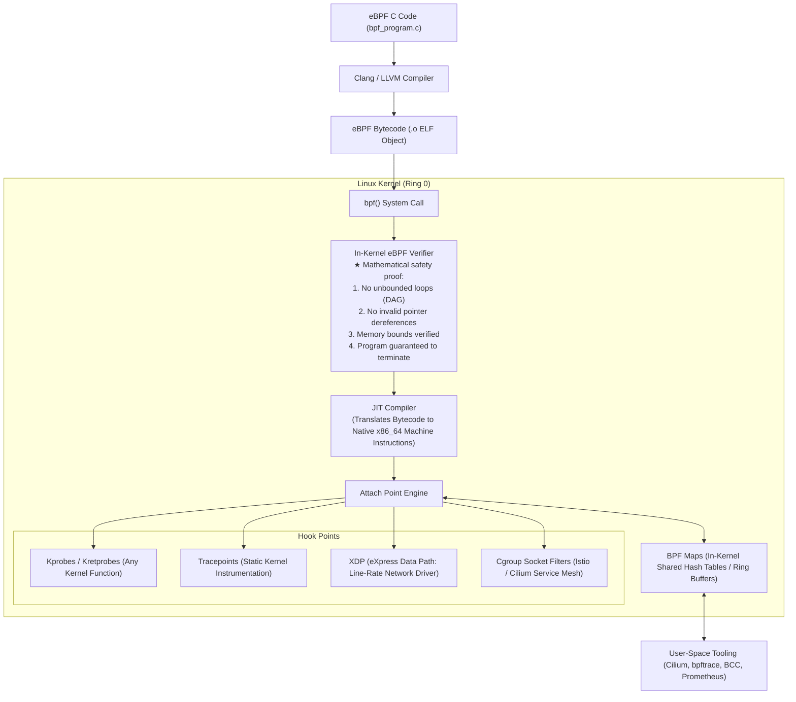

# Chapter 08: Linux Kernel Subsystems — eBPF, Cgroups, Namespaces & Containers

> "Containers do not exist as distinct entities inside the Linux kernel. What the industry calls a 'container' is simply an ordinary user-space process wrapped in kernel Namespaces for isolation, restricted by Control Groups for resource limits, and confined by Seccomp filters for security."  
> — *Michael Kerrisk, The Linux Programming Interface (TLPI)*

---

## 📚 Recommended Book References
- **The Linux Programming Interface (Michael Kerrisk)**: Chapter 19 (Signals), Chapter 38 (Process Capabilities), Chapter 49 (Memory Mappings).
- **Linux Kernel Development (Robert Love, 3rd Ed)**: Chapter 3 (Process Management) and Chapter 14 (The Block I/O Layer).
- **BPF Performance Tools (Brendan Gregg)**: Chapters 1–4 (eBPF Architecture, Technology, and Observability Tools).
- **Systems Performance: Enterprise and the Cloud (Brendan Gregg, 2nd Ed)**: Chapter 3 (Operating Systems: Cgroups, Namespaces, Containers).
- **Container Security (Liz Rice)**: Chapters 2–5 (Linux Namespaces, Control Groups, Capabilities, Seccomp).

---

## 1. Linux Namespaces: The Isolation Architecture

A **Namespace** wraps a global system resource in an abstraction that makes it appear to the processes within the namespace that they have their own isolated instance of that resource.



### 1.1 The 8 Linux Namespaces

| Namespace | Clone Flag | Isolated Global Resource | Practical Container Impact |
| :--- | :--- | :--- | :--- |
| **Mount (`mnt`)** | `CLONE_NEWNS` | Filesystem mount points & root (`/`) | Each container has its own private rootfs and mount table |
| **PID (`pid`)** | `CLONE_NEWPID` | Process IDs | The container's primary process becomes PID 1 inside the namespace |
| **Network (`net`)**| `CLONE_NEWNET` | Network devices, routing tables, firewall rules | Private IP address, `veth` pair, private port binding |
| **IPC (`ipc`)** | `CLONE_NEWIPC` | System V IPC, POSIX Message Queues | Prevents cross-container shared memory (`shmget`) snooping |
| **UTS (`uts`)** | `CLONE_NEWUTS` | Hostname and NIS domain name | Container can set its own hostname (`node-app-1`) |
| **User (`user`)** | `CLONE_NEWUSER` | User and Group IDs (UID/GID) | UID 0 (root) inside container maps to unprivileged UID 10001 on host! |
| **Cgroup (`cgroup`)**| `CLONE_NEWCGROUP`| Control group root directory | Hides host cgroup layout from container |
| **Time (`time`)** | `CLONE_NEWTIME` | System monotonic and boot clocks | Independent offsets for system time per container |

### 1.2 Namespace System Calls: `clone()`, `unshare()`, and `setns()`
```c
/* 1. Create a child in new PID and Network namespaces */
int pid = clone(child_fn, stack_top, CLONE_NEWPID | CLONE_NEWNET | SIGCHLD, NULL);

/* 2. Detach current process into new Mount namespace */
unshare(CLONE_NEWNS);

/* 3. Join an existing namespace (e.g., docker exec) */
int fd = open("/proc/1234/ns/net", O_RDONLY);
setns(fd, CLONE_NEWNET);
```

---

## 2. Control Groups (cgroups v2): Resource Metering & Throttling

While Namespaces dictate **what a process can see**, Control Groups dictate **how much resource a process can consume**.



### 2.1 Cgroups v1 vs. Cgroups v2
- **Cgroups v1**: Multi-hierarchy design. CPU, Memory, and BlkIO controllers operated on completely separate, independent tree structures, making cross-resource coordination (e.g., memory writeback attributed to block I/O) mathematically impossible!
- **Cgroups v2 (Single Unified Hierarchy)**: Replaces v1 with a single strict tree. Every process belongs to exactly one leaf cgroup node.

### 2.2 Key Resource Controllers:
- **`cpu.max`**: Controls CPU bandwidth via the Completely Fair Scheduler (CFS) quota:
  ```bash
  echo "50000 100000" > /sys/fs/cgroup/app/cpu.max
  # Format: $QUOTA $PERIOD
  # 50,000µs every 100,000µs = exactly 0.5 CPU cores!
  ```
- **`memory.max`**: Hard memory limit. If exceeded and memory cannot be reclaimed by page cache eviction, the kernel invokes the **OOM Killer** specifically within that cgroup!
- **`io.max`**: Throttles block storage read/write IOPS and bytes-per-second (`rbps`, `wbps`, `riops`, `wiops`).
- **`pids.max`**: Caps total active processes/threads to prevent fork-bomb denial-of-service attacks.

---

## 3. Container Anatomy: Namespaces + Cgroups + OverlayFS



### 3.1 OverlayFS: The Storage Engine Behind Container Images
Docker and Podman use **OverlayFS** to layer immutable image layers beneath an ephemeral writable container layer:


- **Read**: If a file exists in `upperdir`, read it; otherwise, read through to `lowerdir`.
- **Write (Copy-On-Write)**: If modifying a file from an immutable `lowerdir`, OverlayFS copies the file into `upperdir` before executing the write.

---

## 4. Extended Berkeley Packet Filter (eBPF): Programmable Kernel

**eBPF** is a revolutionary technology that allows developers to run sandboxed, custom bytecode programs directly inside the Linux kernel without modifying kernel source code or loading unstable kernel modules.



### 4.1 The In-Kernel eBPF Verifier
The kernel verifier guarantees that the eBPF program cannot crash the operating system:
1. **Termination Check**: Simulates every execution path to ensure the program terminates within a bounded instruction limit (1 million instructions max). Unbounded loops are strictly rejected!
2. **Type Safety & Bounds Checking**: Every register and pointer is tracked. Accessing uninitialized memory or dereferencing pointers outside allowable bounds triggers immediate verification failure.
3. **Privilege Checks**: Loading privileged tracing programs requires `CAP_BPF` or `CAP_SYS_ADMIN`.

### 4.2 Production Applications of eBPF:
- **High-Performance Networking (Cilium)**: Bypasses standard Linux `iptables` connection tracking by routing packets directly at the network card driver via **XDP (eXpress Data Path)**, processing tens of millions of packets per second.
- **Deep System Observability (bpftrace, BCC)**: Traces kernel function latency, disk block I/O distributions, and memory allocations in real-time with microsecond precision and near-zero overhead.
- **Security & Runtime Enforcement (Falco, Tetragon)**: Detects privilege escalation, unauthorized network connections, or namespace escapes at the system call boundary.

---
