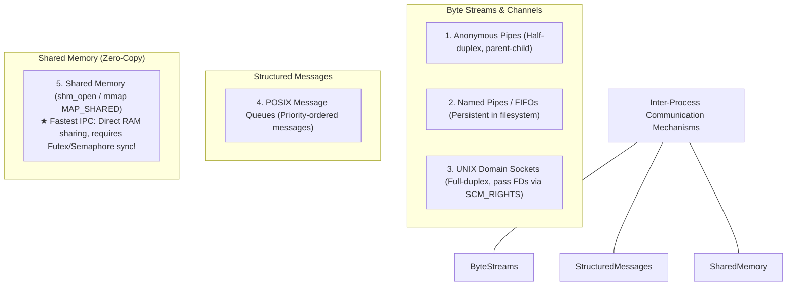
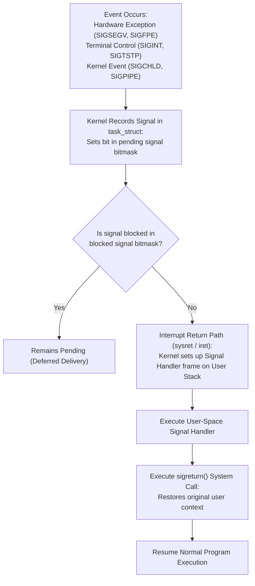
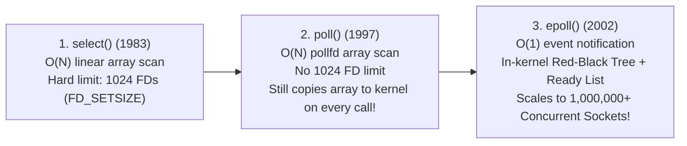
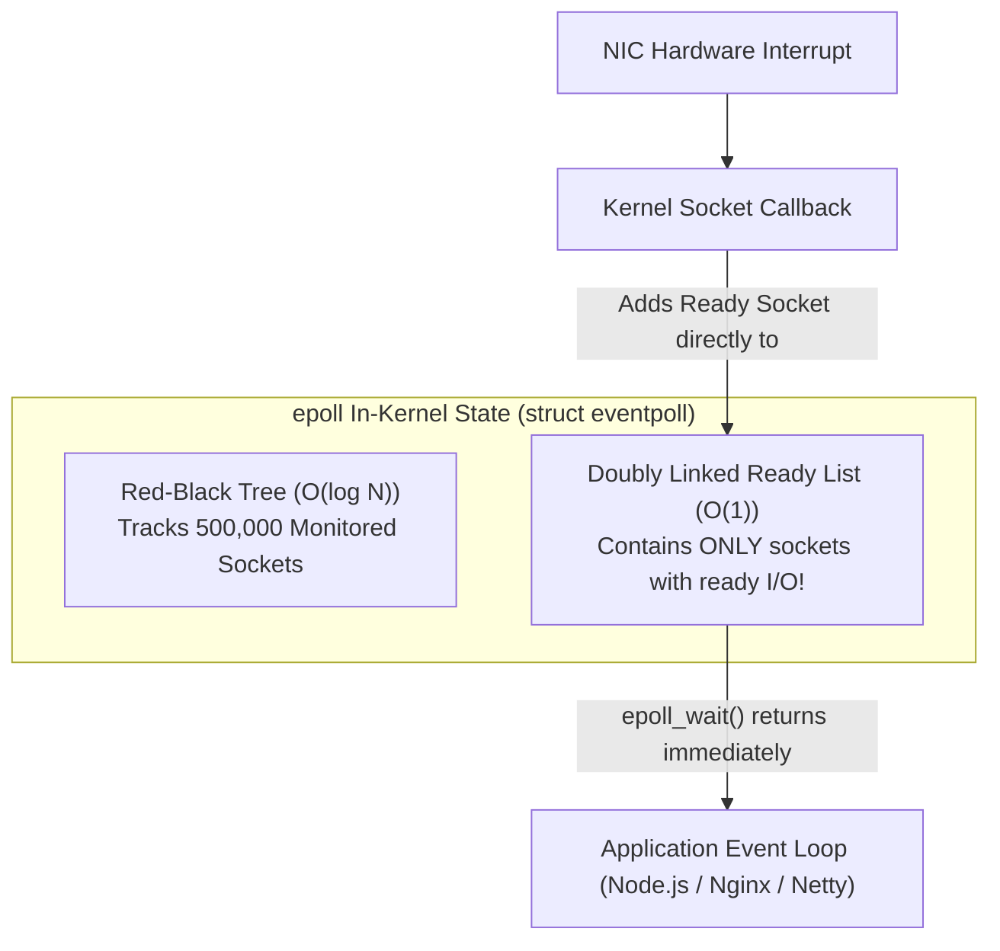
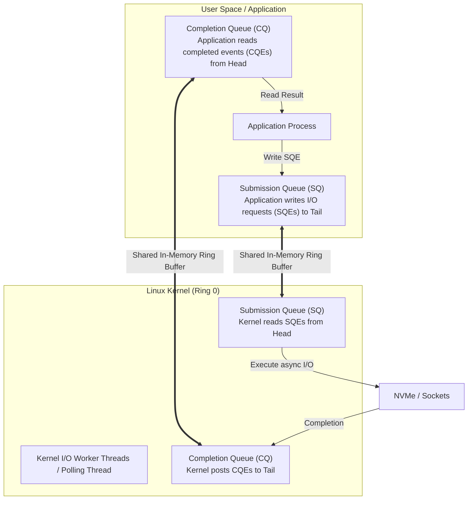

# Chapter 09: Inter-Process Communication (IPC), Signals & Async I/O (io_uring)

> "A single process is an isolated island. Operating systems provide Inter-Process Communication (IPC) and event multiplexing to build distributed, concurrent, and high-throughput systems from isolated components."  
> — *Michael Kerrisk, The Linux Programming Interface (TLPI)*

---

## 📚 Recommended Book References
- **The Linux Programming Interface (Michael Kerrisk)**: Chapters 20–22 (Signals), Chapters 43–44 (Pipes and FIFOs), Chapters 45–48 (System V & POSIX IPC), Chapters 56–61 (Sockets), Chapter 63 (Alternative I/O Models: select, poll, epoll).
- **Modern Operating Systems (Tanenbaum & Bos, 4th/5th Ed)**: Chapter 2, Section 2.3 (Interprocess Communication).
- **Operating System Concepts (Silberschatz, Galvin, Gagne, 10th Ed)**: Chapter 3, Section 3.5–3.8 (Interprocess Communication).
- **Linux Kernel Development (Robert Love, 3rd Ed)**: Chapter 5 (System Calls) and Chapter 14 (The Block I/O Layer).
- **Efficient IO with io_uring (Jens Axboe, Linux Kernel Maintainer, 2019)**: The authoritative architectural specification of `io_uring`.

---

## 1. Classical Inter-Process Communication (IPC) Paradigms

### 1.1 Architectural IPC Comparison

| Mechanism | Directionality | Data Structure | Boundary | Zero-Copy? | Performance Overhead |
| :--- | :--- | :--- | :--- | :--- | :--- |
| **Anonymous Pipe** | Half-Duplex (Unidirectional)| Circular kernel buffer (64KB) | Related processes only | No (2 copies) | Low (~1–2 µs) |
| **Named Pipe (FIFO)**| Half-Duplex | Circular kernel buffer (64KB) | Any process with path access | No (2 copies) | Low (~1–2 µs) |
| **UNIX Domain Socket**| **Full-Duplex** (Bidirectional) | Socket buffer pair | Any process with path access | No (2 copies) | Moderate (~2–5 µs) |
| **Shared Memory (SHM)**| **Full-Duplex** | Shared physical page frames | Any process with permissions | **YES (Zero-Copy!)** | **Blazing Fast (~5–10 ns)** |

---

## 2. Unix Signals & Asynchronous Notification

A **Signal** is an asynchronous hardware or software interrupt delivered to a process by the kernel.

### 2.1 Async-Signal-Safety & The Reentrancy Hazard
Because a signal handler can interrupt process execution at **any arbitrary machine instruction**:
- If the main program is executing `malloc()` (which holds an internal free-list lock), and a signal handler executes `malloc()` or `printf()`, the thread **deadlocks with itself**!
- Functions that can be safely invoked inside a signal handler are strictly designated as **Async-Signal-Safe** (e.g., `write()`, `_exit()`, `read()`). Functions like `malloc()`, `free()`, `printf()` are strictly forbidden.

---

## 3. The Evolution of I/O Multiplexing: `select` to `epoll`

### 3.1 `epoll` Internal Architecture (Linux)
The `epoll` subsystem solves the $O(N)$ scanning bottleneck using two complementary in-kernel data structures:
1. **Red-Black Tree**: Stores all monitored file descriptors. Adding (`EPOLL_CTL_ADD`), modifying (`EPOLL_CTL_MOD`), or removing (`EPOLL_CTL_DEL`) a monitored descriptor runs in $O(\log N)$ time.
2. **Ready Linked List**: When network packets arrive at a network card, the device driver's interrupt bottom-half executes a kernel callback that inserts the ready file descriptor directly into the **Ready List** in $O(1)$ time!
3. `epoll_wait()` does **not scan** sockets; it sleeps until the ready list is non-empty and copies only the ready events to user space!

---

## 4. Modern High-Performance Asynchronous I/O: Linux `io_uring`

Designed by Jens Axboe (Linux block layer maintainer) in 2019, **`io_uring`** completely redesigns Linux I/O to eliminate system call overhead.

### 4.1 The Bottleneck of `epoll` + Non-Blocking I/O
Even with `epoll`, handling an I/O event requires multiple system calls:
$$\text{epoll\_wait()} \longrightarrow \text{read()} \longrightarrow \text{compute} \longrightarrow \text{write()}$$
With hardware NVMe SSDs delivering millions of IOPS and 100GbE network interfaces, the CPU cycles spent crossing the kernel boundary (`syscall`/`sysretq`) dominate execution time!

### 4.2 `io_uring` Architecture: Dual Lockless Ring Buffers
`io_uring` establishes **two lockless circular ring buffers** mapped directly into both user-space memory and kernel memory via `mmap()`:

### 4.3 Kernel Polling Mode (`IORING_SETUP_SQPOLL`)
In ultra-high-performance workloads, `io_uring` can be configured with **`IORING_SETUP_SQPOLL`**:
- A dedicated kernel thread continuously polls the Submission Queue ring buffer.
- The user application writes new I/O requests to the ring buffer and updates memory pointers without issuing **a single system call**!
- The system achieves millions of IOPS with **ZERO system calls** and **ZERO context switch overhead**!

---
