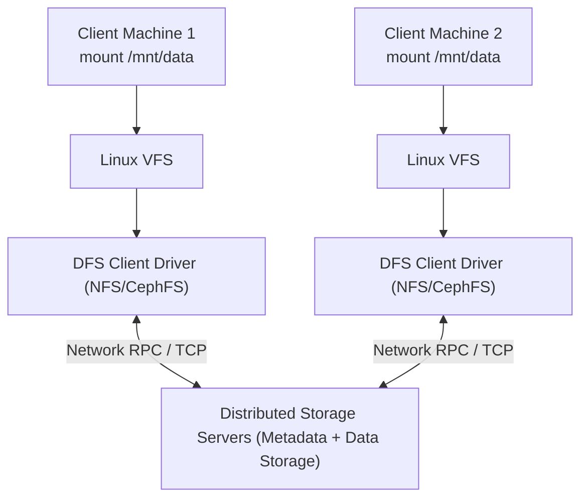
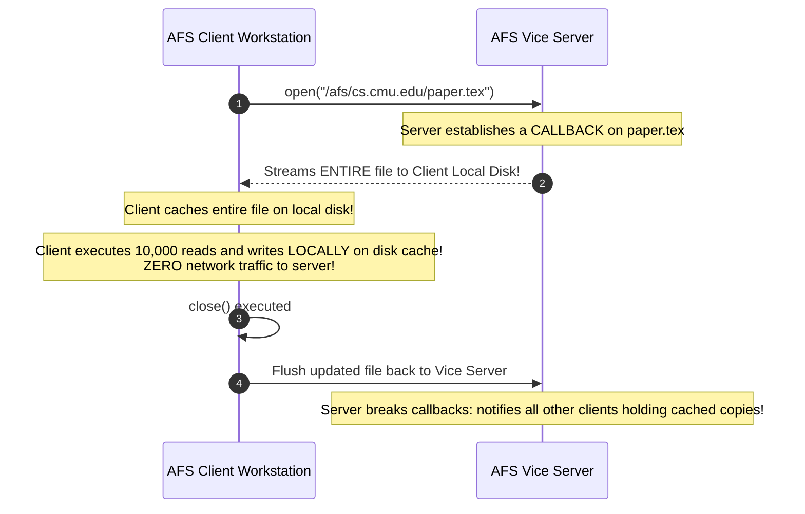
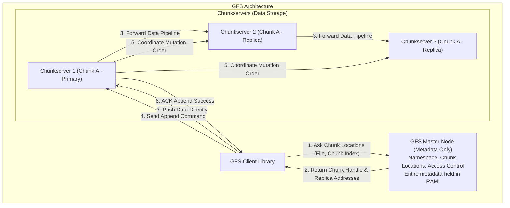
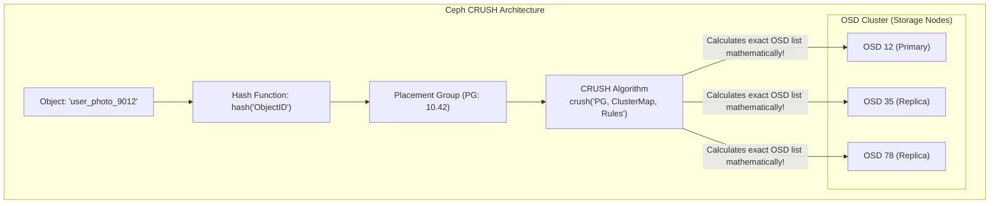

# Chapter 10: Distributed File Systems — NFS, AFS, GFS & Ceph

> "A distributed file system provides transparent access to files stored across multiple remote servers. The fundamental engineering challenge is balancing access transparency, network latency, cache consistency, and high availability under partial network partitions."  
> — *George Coulouris et al., Distributed Systems: Concepts and Design*

---

## 📚 Recommended Book References
- **OSTEP (Arpaci-Dusseau)**: Chapter 48 (Distributed Systems), Chapter 49 (Sun's Network File System - NFS), Chapter 50 (The Andrew File System - AFS).
- **Distributed Systems (Tanenbaum & Van Steen, 3rd/4th Ed)**: Chapter 11 (Distributed File Systems).
- **Distributed Systems: Concepts and Design (Coulouris, Dollimore, Kindberg, Blair, 5th Ed)**: Chapter 12 (Distributed File Systems).
- **The Google File System (Ghemawat, Gobioff, Leung, ACM SOSP 2003)**: The foundational paper on large-scale distributed analytics storage.
- **Ceph: A Scalable, High-Performance Distributed File System (Weil et al., USENIX OSDI 2006)**: The seminal paper introducing CRUSH and Ceph.

---

## 1. Architectural Foundations of Distributed File Systems

A **Distributed File System (DFS)** mounts a remote storage cluster over a network while presenting standard local POSIX filesystem semantics to client applications.

### 1.1 The Transparency Dimensions in DFS
- **Access Transparency**: Clients use standard POSIX syscalls (`open`, `read`, `write`) identically for local and remote files.
- **Location Transparency**: File paths do not reveal the physical server or IP address where blocks reside.
- **Migration & Replication Transparency**: Files can move between storage nodes or replicate without client reconfiguration.
- **Failure Transparency**: Client applications continue functioning across node crashes and network reconnections.

---

## 2. Sun Network File System (NFS v2, v3, and v4)

Introduced by Sun Microsystems in 1984, **NFS** is the most widely deployed distributed filesystem in enterprise infrastructure.

### 2.1 The Statelessness Paradigm of NFSv2 / NFSv3
Early NFS was architected around a radical principle: **The NFS Server must be completely stateless.**
- The server maintains **no open file tables**, **no client session state**, and **no locks in volatile memory**.
- Every RPC request must be **self-contained**: includes user credentials, file handle (`fhandle`), and exact byte offset.
- **Crash Recovery**: If the server crashes and reboots, clients simply retry their RPCs. The server requires zero recovery state machine!

#### The Idempotency Requirement
Because network packets can be lost, reordered, or duplicated, operations must be **Idempotent** (executing an operation multiple times produces the identical result as executing it once).
- Reading sector $X$ or writing bytes at offset $Y$ is naturally idempotent.
- *Problem*: Removing a file (`unlink`) or making a directory (`mkdir`) is **not** naturally idempotent! A duplicate request returns an error (`ENOENT` or `EEXIST`), requiring duplicate request caches on the server.

### 2.2 Client-Side Caching & Close-to-Open Consistency
NFS clients cache file data blocks and inode attributes in local RAM to avoid network round-trips:
- **Attribute Cache Time-To-Live (TTL)**: Cached attributes (file size, modification time) expire after 3 to 60 seconds.
- **Close-to-Open Consistency**:
  - When Client $A$ closes a file (`close()`), all dirty modifications are flushed synchronously to the server.
  - When Client $B$ opens the file (`open()`), the client invalidates its local data cache and queries the server for the latest file attributes.
  - *Guarantee*: A client opening a file is guaranteed to see all updates made by another client that closed the file previously. Concurrent open writers yield undefined consistency!

---

## 3. Andrew File System (AFS) & Scalability Breakthroughs

Developed at Carnegie Mellon University, **AFS** prioritized extreme horizontal scalability (scaling to tens of thousands of client workstations).

### Key AFS Innovations:
1. **Whole-File Caching**: The entire file is downloaded to the client's local disk upon `open()`. Subsequent operations execute locally at native disk speed.
2. **Callbacks**: Instead of clients repeatedly polling the server to verify cache validity (like NFS), the server promises to **notify the client (break callback)** if the file is modified by someone else!

---

## 4. Google File System (GFS)

Published in 2003 by Sanjay Ghemawat, Howard Gobioff, and Shun-Tak Leung, **GFS** discarded POSIX compliance to build the distributed storage engine underpinning Google Search indexing, Bigtable, and MapReduce.

### 4.1 Foundational GFS Design Principles:
1. **Component Failures are the Norm**: Thousands of commodity machines mean disks and nodes fail every hour. Fault tolerance must be continuous.
2. **Files are Huge**: Multi-gigabyte to multi-terabyte files are standard; millions of 4KB files are explicitly discouraged.
3. **Massive Chunks (64MB)**: Far larger than typical 4KB filesystem blocks. Reduces metadata volume, allowing the Master to store all filesystem metadata entirely in RAM!
4. **Appends Over In-Place Overwrites**: Workloads consist of batch streaming writes and append operations; random in-place updates are virtually non-existent.
5. **Atomic Record Append**: Multiple clients can append concurrently without distributed locking. GFS guarantees atomic **at-least-once** append delivery.

---

## 5. Ceph & The CRUSH Algorithm

Designed by Sage Weil at UC Santa Cruz, **Ceph** provides unified Object, Block, and File storage scaling to exabytes without any centralized metadata lookup bottleneck.

### 5.1 The CRUSH Algorithm (Controlled Replication Under Scalable Hashing)
In traditional distributed filesystems, locating an object requires querying a central metadata server (e.g., GFS Master or HDFS NameNode).
**Ceph completely eliminates metadata lookup tables using CRUSH**:
- Clients compute the exact physical storage nodes mathematically:
  $$\text{OSD List} = \text{CRUSH}(\text{Object ID}, \text{Cluster Map}, \text{Placement Rules})$$
- CRUSH takes the hierarchical cluster map (rack, row, power supply topology) and deterministically assigns object placement to ensure replicas reside in independent failure domains.

---

## 6. Comprehensive Distributed File Systems Comparison Matrix

| Feature / Metric | NFS v3 | AFS | Google File System (GFS) | Ceph (CephFS / RADOS) |
| :--- | :--- | :--- | :--- | :--- |
| **Primary Architecture** | Client-Server (Stateless) | Client-Server (Stateful) | Single Master + Chunkservers | Decentralized (CRUSH Algorithm) |
| **POSIX Compliant?** | Yes | Yes | **No** (Specialized API) | **Yes** (via CephFS) |
| **Caching Model** | Block-level (Timed TTL) | **Whole-File Caching** | Chunk-level Streaming | Object / Block Cache |
| **Consistency Model** | Close-to-open | Callback invalidation | Relaxed / At-least-once append | Strong Consistency (Primary OSD) |
| **Metadata Bottleneck**| Single Server | Central Vice Server | Central Master (RAM-bound) | **None** (CRUSH is pure computation!) |
| **Target Workload** | General Purpose / Home dirs | Large Campus Workstations | Huge Analytics / MapReduce | Exabyte Cloud Storage (Kube, OpenStack)|

---
