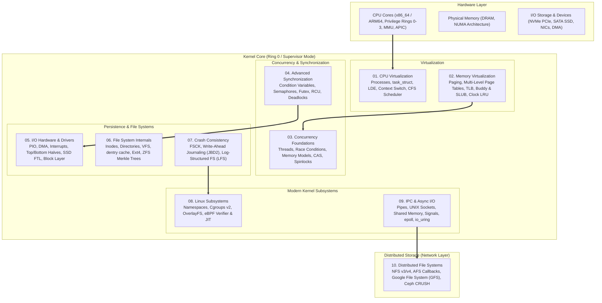
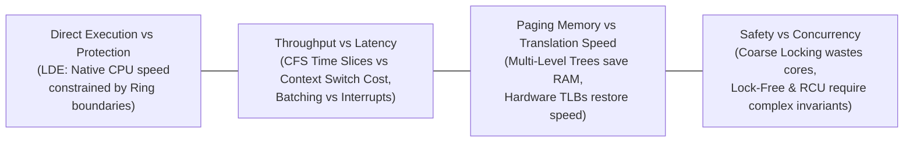

# Operating Systems Engineering — Complete Technical Reference

> **An exhaustive, production-grade deep dive into operating systems theory, Linux kernel internals, concurrency primitives, storage engines, and distributed file systems.**  
> Structured across the three classical pillars of operating systems design: **Virtualization**, **Concurrency**, and **Persistence**, alongside modern cloud-native kernel subsystems.

---

## 🏛️ Comprehensive Architecture & Concept Map

---

## 📚 Core Academic & Industry Textbooks Referenced

| Textbook | Authors | Primary Focus Areas |
| :--- | :--- | :--- |
| **Operating Systems: Three Easy Pieces (OSTEP)** | Remzi H. Arpaci-Dusseau & Andrea C. Arpaci-Dusseau | The foundational framework: Virtualization (CPU & Memory), Concurrency (Threads & Locks), and Persistence (I/O, File Systems, LFS). |
| **Modern Operating Systems (MOS, 4th/5th Ed)** | Andrew S. Tanenbaum & Herbert Bos | Comprehensive theoretical foundations, IPC, memory management, deadlock theory, and distributed architecture. |
| **Operating System Concepts (OSC / Dinosaur Book, 10th Ed)** | Abraham Silberschatz, Peter B. Galvin, Greg Gagne | Process synchronization, classical concurrency problems, Banker's algorithm, virtual memory, and mass storage structure. |
| **Linux Kernel Development (LKD, 3rd Ed)** | Robert Love | Practical Linux kernel internals: `task_struct`, Completely Fair Scheduler (CFS), VFS layer, Block I/O (`bio`), memory allocators (Buddy & SLUB), interrupts. |
| **The Linux Programming Interface (TLPI)** | Michael Kerrisk | The definitive Unix/Linux systems programming reference: system calls, processes, signals, POSIX threads, IPC, `epoll`. |
| **Understanding the Linux Kernel (ULK, 3rd Ed)** | Daniel P. Bovet & Marco Cesati | Hardware-level x86 execution, page table walks, interrupt descriptors (IDT), context switching assembly (`__switch_to_asm`). |
| **BPF Performance Tools** | Brendan Gregg | Extended Berkeley Packet Filter (eBPF) architecture, kernel tracing, kprobes, tracepoints, XDP, and Linux performance engineering. |

---

## 📑 Complete Chapter Index

### Part I: Virtualization (CPU & Memory)
The mechanics of providing the illusion of private, unlimited computation and memory.

| Chapter | Title | Key Theoretical & Architectural Concepts | Production Linux Internals |
| :--- | :--- | :--- | :--- |
| **01** | [**CPU Virtualization**](./01.%20CPU%20Virtualization%20-%20Processes,%20Context%20Switching%20%26%20Dual-Mode%20Execution.md) | Limited Direct Execution (LDE), Hardware Privilege Rings (0–3), Context Switch costs, Scheduling models (FIFO, SJF, STCF, RR, MLFQ) | `task_struct`, `__switch_to_asm` register swap, Copy-On-Write (COW) `fork()`, Completely Fair Scheduler (CFS) `vruntime` math |
| **02** | [**Memory Virtualization**](./02.%20Memory%20Virtualization%20-%20Paging,%20Segmentation,%20TLB%20%26%20Virtual%20Memory.md) | Address translation, Multi-level page tables, Space explosion math, TLB Effective Access Time (EAT), TLB Shootdowns, Swapping policies | x86_64 4-level paging (`%cr3` PGD $\to$ PUD $\to$ PMD $\to$ PTE), Page Fault handling, Buddy Allocator, SLUB object cache, Clock replacement |

---

### Part II: Concurrency & Synchronization
Managing non-deterministic interleavings across multi-core processors.

| Chapter | Title | Key Theoretical & Architectural Concepts | Production Linux Internals |
| :--- | :--- | :--- | :--- |
| **03** | [**Concurrency Foundations**](./03.%20Concurrency%20Foundations%20-%20Threads,%20Mutual%20Exclusion%20%26%20Atomic%20Primitives.md) | Threads vs Processes, Thread-Local Storage, Critical Sections, Peterson's Algorithm & memory reordering failures | Atomic instructions (CAS / `CMPXCHG`, TAS, LL/SC), Memory Barriers (Acquire/Release, TSO), TTAS Spinlocks, Ticket Locks, MCS locks |
| **04** | [**Advanced Synchronization**](./04.%20Advanced%20Synchronization%20-%20Condition%20Variables,%20Semaphores%20%26%20Deadlocks.md) | Condition variables (Mesa semantics, `while` rule), Counting semaphores, Classical synchronization, Coffman conditions, Banker's algorithm | Linux Futex (`sys_futex` fast path), Seqlocks, Read-Copy Update (RCU) grace periods & quiescent states, Priority Inheritance |

---

### Part III: Persistence & File Systems
Transforming volatile memory into durable, crash-consistent on-disk abstractions.

| Chapter | Title | Key Theoretical & Architectural Concepts | Production Linux Internals |
| :--- | :--- | :--- | :--- |
| **05** | [**I/O Hardware & Storage Devices**](./05.%20I-O%20Hardware,%20Storage%20Devices%20%26%20Device%20Drivers.md) | Bus topologies (PCIe, NVMe), Port-Mapped vs Memory-Mapped I/O, DMA scatter-gather, HDD physics, SSD NAND Flash Translation Layer (FTL) | Interrupt Top-Halves vs Bottom-Halves (Softirqs, Tasklets, Workqueues), NVMe multi-queue scaling, Linux Block Layer (`struct bio`), Page Cache writeback |
| **06** | [**File System Internals**](./06.%20File%20System%20Internals%20-%20Inodes,%20Directories,%20VFS%20%26%20Ext4-ZFS.md) | File descriptors, Inode multi-level indirect block math, Hard vs Soft links, Virtual File System (VFS) architecture | VFS objects (`super_block`, `inode`, `dentry`, `file`), dentry cache RCU lookup, Ext4 extents & delayed allocation, ZFS Merkle Tree COW & self-healing |
| **07** | [**Crash Consistency & Journaling**](./07.%20Crash%20Consistency,%20Journaling%20%26%20Log-Structured%20File%20Systems%20%28LFS%29.md) | Multi-block update crash permutations, Inconsistency anomalies, FSCK scalability limits, Write-Ahead Journaling transaction states | Linux JBD2 journaling modes (Data vs Ordered vs Writeback), Log-Structured File Systems (LFS), Inode Map (`imap`), Segment Cleaning GC |

---

### Part IV: Modern Kernel Subsystems & Distributed Storage
High-throughput asynchronous I/O, container virtualization, in-kernel programmability, and cloud storage clusters.

| Chapter | Title | Key Theoretical & Architectural Concepts | Production Linux Internals |
| :--- | :--- | :--- | :--- |
| **08** | [**Linux Kernel Subsystems**](./08.%20Linux%20Kernel%20Subsystems%20-%20eBPF,%20Cgroups,%20Namespaces%20%26%20Containers.md) | Container architecture (Namespaces + Cgroups + OverlayFS), PID 1 inside containers, Unified cgroups v2 resource metering | The 8 Linux Namespaces (`clone`/`unshare`/`setns`), CFS bandwidth quotas (`cpu.max`), in-kernel eBPF Verifier & JIT compiler, XDP packet filtering |
| **09** | [**IPC, Signals & Async I/O**](./09.%20Inter-Process%20Communication%20%28IPC%29,%20Signals%20%26%20Async%20I-O%20%28io_uring%29.md) | Classical IPC (Pipes, FIFOs, UNIX Sockets, Shared Memory), Signal delivery & Async-Signal-Safety, I/O multiplexing (`select` to `epoll`) | `epoll` Red-Black tree + ready list mechanics, Modern Linux `io_uring` dual lockless ring buffers (SQ/CQ), Zero-syscall Kernel Polling (`SQPOLL`) |
| **10** | [**Distributed File Systems**](./10.%20Distributed%20File%20Systems%20-%20NFS,%20AFS,%20GFS%20%26%20Ceph.md) | Transparency dimensions, Network latency vs Disk latency, Statelessness vs Statefulness, Cache consistency models | NFS v3/v4 Close-to-open consistency, AFS whole-file caching & callbacks, Google File System (GFS 64MB chunks & atomic append), Ceph CRUSH algorithm |

---

## 🎯 Core Operating Systems Engineering Tradeoffs

1. **Separation of Policy and Mechanism**: The operating system kernel provides low-level *mechanisms* (e.g., context switching, page table walks, timer interrupts) while keeping high-level *policies* (e.g., CPU scheduling algorithms, page replacement heuristics) modular and configurable.
2. **Hardware/Software Co-Design**: High-performance virtualization is impossible in pure software. True efficiency requires tight co-design between hardware primitives (MMU, TLBs, privilege rings, atomic instructions, PCIe buses) and kernel abstractions.
3. **Amortization & Asynchrony**: Crossing hardware and privilege boundaries (system calls, disk seeks, network packets) is inherently expensive. Scalable systems continuously leverage **batching**, **caching** (Page Cache, TLB, Dentry cache), and **lockless asynchronous queues** (`io_uring`, NVMe multi-queue).
